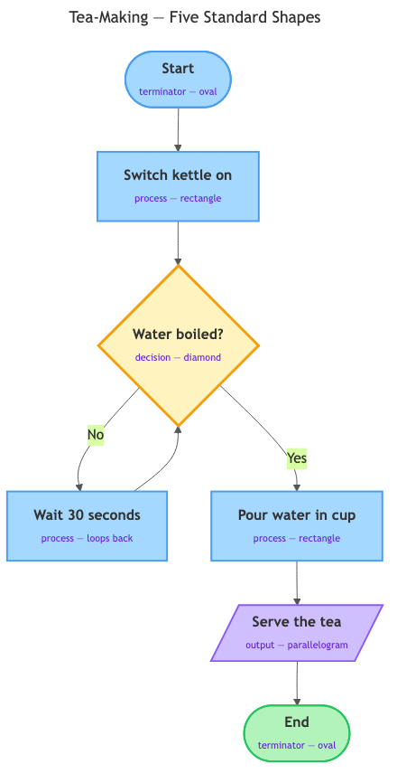

# Flowcharts — visualising logic with standard shapes and arrows

## Overview

In the last topic you wrote logic as pseudocode — plain-English steps, one per line. Text is precise, but it is bad at showing the *shape* of your logic at a glance: where the path splits, where it loops back. A **flowchart** — a diagram that draws each step of a process as a shape and the order as arrows — makes that structure visible instantly. This topic teaches you the five standard shapes, how to read a flowchart someone else drew, and how to draw your own.

## Key Concepts

### What a flowchart is

A **flowchart** — a diagram that represents a process as shapes connected by arrows, where each shape is one step or decision and the arrows show the order you move through them.

Think of it as a map of your logic. Pseudocode tells you the steps in words; a flowchart *shows* you the route. Put your finger on Start, follow the arrows, do what each shape says, and lift your finger at End. If two people trace the same chart honestly, they take the same route — no room for "I assumed you meant…".

Why does this matter? Handing a task to a computer or an AI system means leaving nothing to interpretation. Decomposition broke the task down; pseudocode wrote the steps; the flowchart makes the *structure* visible, so gaps and ambiguities jump out at you.

### Why standard shapes?

You could draw a process with any doodles you like, but nobody else would know your private code. Flowcharts solve this the way road signs do: a red octagon means "stop" everywhere, so drivers never guess. Likewise, **each flowchart shape has one fixed meaning** — it tells you something before you read a word inside it.

### The five core shapes

Five shapes cover almost everything you will need — here they all are in one tea-making chart:

*All five standard shapes — terminator, process, decision, input/output, and flowline — in one tea-making chart.*

| Shape | Name | Meaning | Example text inside |
|---|---|---|---|
| Oval (rounded ends) | **Terminator** | Where the process starts or ends | "Start", "End" |
| Rectangle | **Process** | One action — something gets *done* | "Switch kettle on" |
| Parallelogram (slanted rectangle) | **Input/Output** | Information comes in or goes out | "Serve the tea" |
| Diamond | **Decision** | A yes/no question — the path splits here | "Water boiled?" |
| Arrow | **Flowline** | The order — which shape comes next | "Yes" / "No" labels on branches |

A few rules the shapes carry with them:

- **Exactly one Start oval** — the reader always knows where to begin.
- **One action per rectangle.** "Boil water and pour it" is two steps wearing one box — split it, just like one-step-per-line in pseudocode.
- **The parallelogram is where the process talks to the outside world** — information coming in (asking a question) or going out (serving the tea).
- **The diamond is the only shape where the path splits** — one arrow leaves for "Yes", another for "No". It is the picture version of pseudocode's IF / OTHERWISE.
- **The arrowhead points the direction of travel.**

### Arrows carry real rules

- **Follow the arrowheads, always.** You never travel backwards along an arrow.
- **Charts flow top-to-bottom by convention.** Readers expect Start near the top.
- **Every shape needs a way in and a way out** — except Start (no way in) and End (no way out). A shape with no outgoing arrow is a **dead end** — a mistake in your logic that strands the reader. The chart makes it visible.

### Decisions create branches

Suppose your tea chart reaches the question "Is there milk in the fridge?"

- The diamond holds the question: *Milk in fridge?*
- **Yes** → rectangle: *Add milk*. **No** → rectangle: *Serve it black*.
- Both arrows meet again and continue to *End*.

This split is called a **branch** — the point where a process takes one route or another depending on an answer. A plain numbered list can only describe one fixed sequence; the moment your logic contains "it depends…", you need a branch.

Why must the question be yes/no? Two labelled exits are impossible to misread. If a question has three answers ("small, medium, or large?"), chain two simple diamonds: first *Small?*, then *Medium?*.

### Loops — arrows that go back

Look at the diagram again. The *Water boiled?* diamond has a "No" arrow leading to *Wait 30 seconds* — which loops **back up** to the question. The reader's finger goes in a circle — check, wait, check — until the answer flips to Yes. This is the picture version of pseudocode's REPEAT idea — and a loop is *visible as a circle on the page*, so you cannot miss it.

And **every loop needs a way out**: if nothing can ever flip the answer to "Yes", the reader circles forever. The chart puts that trap right on the page.

### Reading a flowchart you did not draw

Before drawing your own, practise reading other people's:

1. **Find the Start oval.** Put your finger on it.
2. **Follow the arrow out.** Do (or imagine doing) whatever the next shape says.
3. **At a diamond, answer the question honestly** for the scenario you are imagining, then take the matching labelled arrow.
4. **Keep going until your finger reaches End.**

This finger-walk is called **tracing** — following one specific scenario through the chart, exactly as drawn. Why so literal? Filling a gap from common sense means reading your own head, not the chart. A machine cannot fill gaps; honest tracing shows you what your logic looks like to a reader who can't either.

### Flowcharts vs pseudocode — two views of the same logic

Flowcharts do not replace pseudocode. They are two views of the same logic:

| | Pseudocode | Flowchart |
|---|---|---|
| Form | Plain-English text, one step per line | Shapes and arrows on a page |
| Best at | Lots of detailed steps; quick to edit | Showing branches and loops at a glance |
| Branching | IF / OTHERWISE lines you must read to find | A diamond you can spot across the room |
| Audience | People comfortable with structured text | Almost anyone, including non-technical readers |
| Weakness | Structure invisible until you read every line | Gets crowded with very many steps |

Rule of thumb: **sketch the flowchart to get the structure right, then write pseudocode when step-by-step detail matters.**

## Worked Example

How do you draw a flowchart from scratch? Here is the method, using the tea chart. (Paper works, and in this course's labs you will use Excalidraw, a free online drawing tool.)

1. **Name the process and its boundaries.** "Make a cup of tea, from kitchen to handing over the cup."
2. **Decompose first, on a scratch list** — plain-English steps, no drawing yet.
3. **Circle the questions.** Every "it depends" becomes a diamond: *Is the kettle empty? Does the guest want milk?*
4. **Draw one Start oval at the top.**
5. **Add shapes top to bottom.** Actions → rectangles; questions → diamonds with labelled Yes/No exits; asking or telling a person → parallelograms.
6. **Wire every branch to a destination** — another step, back up (a loop), or onward. No dead ends.
7. **Draw one End oval** and check every path can reach it.
8. **Test with a trace.**

Now trace the diagram above with a real scenario — the water boils on the second check. Your finger should pass through exactly: Start → *Switch kettle on* → *Water boiled?* No → *Wait 30 seconds* → back to *Water boiled?* Yes → *Pour water in cup* → *Serve the tea* → End. If you followed that without guessing once, the chart did its job.

## In Practice

Flowcharts are everywhere in working life, precisely because non-technical people can read them:

- **Troubleshooting guides** — "Is it plugged in? Yes → Is the light on?…" A stressed reader can follow arrows even when prose fails.
- **Business process documents** — how a refund gets approved; the diamonds show who decides what.
- **Medical and emergency checklists** — under pressure, a picture beats a paragraph.
- **Planning logic before building** — sketch the chart while the logic is still cheap to change, as you will in this course.

| Do | Don't |
|---|---|
| One Start, one End | Leave dead ends — a shape with no outgoing arrow |
| One action per rectangle | Cram two actions into one box |
| Label every branch arrow | Leave a diamond's exits unlabelled — a coin flip, not a decision |
| Keep decisions yes/no; chain diamonds | Invent confusing three-way exits |
| Trace at least two scenarios before sharing | Draw a loop with no way for the answer to flip |

If a chart grows into a wall of 40 boxes, use abstraction: collapse a sub-task into one rectangle ("Prepare the kettle"). And never pick a shape because it "looks nice" — each shape has one meaning; break that and the chart lies to its reader.

## Key Takeaways

- A flowchart is a map of your logic: shapes are steps and decisions, arrows are the order — two honest readers will follow it the same way.
- Five shapes cover nearly everything: oval (start/end), rectangle (action), parallelogram (input/output), diamond (yes/no decision), arrow (flow).
- Shapes are standardised like road signs — each has one fixed meaning, so the shape communicates before you read the text inside it.
- Diamonds are where paths branch; an arrow looping back is how repetition is drawn — and every loop needs a way out.
- Flowcharts and pseudocode express the same logic: the chart shows structure at a glance, the text carries fine detail.
