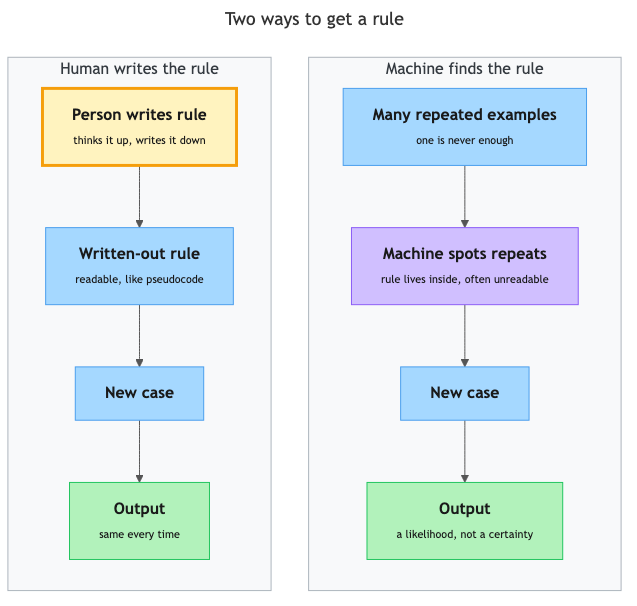

# Pattern recognition — how machines find rules in repeated data

## Overview

What comes next in this sequence: 2, 4, 6, 8, ...? You said 10 — and nobody told you the rule. You spotted what repeats and applied it to a new case. That move is the core idea behind how modern AI systems behave, and it shows what kind of "thinker" receives the specifications you learned to write in topics 2.1 to 2.3 — and why vague instructions go wrong.

## Key Concepts

### What is a pattern?

**Pattern** — something that repeats in a predictable way.

Patterns are everywhere once you look:

- The chai stall near your bus stop is crowded every weekday at 8 a.m. and empty at 3 p.m.
- In the sequence 5, 10, 15, 20, each number is 5 more than the last.
- Most emails that say "CONGRATULATIONS! You have WON!" are junk.

None of these is a single event. A pattern only exists across **repeated** observations: one crowded morning is just a busy day; twenty in a row is a pattern. That word "repeated" is doing real work in this topic's title — one example is never enough.

### Pattern recognition — something you already do

**Pattern recognition** — noticing what repeats across many examples, and turning that repetition into a rule you can use on new cases.

You do this constantly; here are the steps:

1. **See examples.** Twenty mornings at the chai stall.
2. **Form a rule.** "Weekday mornings are crowded."
3. **Apply the rule to a new case.** Next Tuesday at 8 a.m., before you arrive, you predict a crowd.

The third step is the most important new term in this topic:

**Generalisation** — taking a rule found in past examples and applying it to a new case you have never seen before.

Generalisation is the payoff — a rule that only describes the past is just a summary. When your keyboard suggests the next word of a sentence you have never typed before, that is generalisation.

### Two ways a machine can get a rule

In Week 1 you learned that an algorithm is a precise set of steps, written by a person. There is a second way for a machine to get a rule: show it many examples and let it find the rule that fits the repetition.

*The two paths to a machine's rule — hand-written and deterministic on one side, found-from-data and probabilistic on the other.*

| | Rule written by a person | Rule found from repeated data |
|---|---|---|
| **Can you read the rule?** | Yes — written out, like pseudocode | Often not — it lives in the machine's internal patterns |
| **On a new case?** | Only handles cases the author thought of | Generalises — makes a best guess either way |
| **Typical behaviour** | Deterministic — same input, same output | Often probabilistic — "92% likely spam" |
| **How it fails** | Misses cases the author never imagined | Confidently follows a pattern that does not hold |

The right column should ring a bell from topic 1.3. Pattern recognition is *why* those systems are probabilistic: a pattern is a strong tendency, not a guarantee, so its rule speaks in likelihoods too.

You'll meet machine learning properly in Week 3.

### How repeated data becomes a rule

The middle step — "form a rule" — is less magical than it looks. Suppose you collect 1,000 emails already sorted into "junk" and "not junk," then look for what repeats on each side:

- The word "winner" appears in 40% of junk emails but only 1% of normal ones.
- Junk emails use far more ALL-CAPITAL words.
- Normal emails usually come from addresses the person has replied to before.

Each repetition is a clue, and the clues combine into a rule: *the more an email resembles the junk pile, the more likely it is junk.* No one wrote that rule line by line — it emerged from counting what repeats.

Why does more data help? Because repetition is the evidence. Three junk emails could share the word "winner" by coincidence; ten thousand sharing it is a reliable signal.

### More than one rule can fit the same examples

Go back to 2, 4, 6, 8. You said "add 2," but "list the even numbers" and "add 2, but after 8 restart from 2" fit those four numbers just as well. The rules agree on the examples you saw and only part ways on cases you have not seen — so examples alone can never tell you which rule is true. Any pattern-finder, human or machine, is betting that the strongest rule will keep holding. More data shrinks the field of candidate rules, but never to exactly one. That leftover bet is where wrong-but-confident answers come from.

### When found rules go wrong

A pattern is only as good as the examples it came from. Found rules fail in three characteristic ways:

1. **The pattern was a coincidence.** Flip a coin three times, get three heads, and the "pattern" says heads forever.
2. **The examples were not representative.** A rule found in one person's inbox learns *that person's* junk; apply it to a doctor's inbox and it misfires. The rule is only as broad as the data it saw.
3. **The world changed.** Patterns describe the past. Junk-mail senders change tactics precisely to break the filters' found rules.

There is a name for stretching a rule past its evidence:

**Overgeneralisation** — applying a rule beyond the examples that justify it, so it confidently gives wrong answers on cases it never really learned about.

Notice the word "confidently." A system using found rules does not know when it has left familiar territory — its answer *looks* the same whether the pattern truly applies or not.

### Why this matters for specifying

You write a specification; a pattern-based system carries it out. Knowing how it "thinks" changes how you write:

- **The system fills every gap with a pattern.** A vague instruction does not make it stop and ask — it falls back on the most typical format, length, and tone it has seen. "Make it better" gets you the *average* idea of better.
- **A good specification overrides the default pattern.** Every testable, bounded, observable detail from topic 2.1 is one less gap for a pattern to fill.
- **Confident output is not verified output.** Because found rules fail silently, the failure conditions from topic 2.3 are how you catch a pattern that did not hold.

The one-sentence version: **you are not instructing a mind that understands your intent; you are steering a system that completes patterns — so your specification must say everything that matters.**

## Worked Example

Pattern recognition has a procedure, and you can run it by hand. **Input:** a set of repeated examples. **Output:** a rule for new cases.

1. **Collect examples.** (Sequence: 3, 6, 9, 12.)
2. **Look for what repeats.** Write down everything that holds across all of them. ("Each number is 3 more than the last." Also true: "every number is a multiple of 3.")
3. **State a candidate rule.** Pick the repetition that best explains the examples. ("Add 3 to get the next number.")
4. **Test the rule on a held-back case.** Take an example you deliberately did *not* use in steps 1–3 and check the rule predicts it. If the next number is 15, the rule passes; if it is 24, your rule was a coincidence — go back to step 2.
5. **Use the rule on new cases — with appropriate confidence.** More passes in step 4 means more trust; few examples means treat every answer as a guess.

Step 4 is the step beginners skip. A rule that merely fits the examples it came from proves nothing; a rule that predicts an unseen case has demonstrated generalisation. Keep this habit — it returns later this week when you check whether an AI did what your specification asked.

## In Practice

You met these systems in Week 1; each behaves as it does because of rules found in repeated data:

- **Keyboard autocomplete.** Type "good" and "morning" appears — that pairing repeats massively in typed text.
- **Spam filtering.** A new message is compared against millions of sorted messages and lands in inbox or junk with a likelihood attached.
- **Recommendations.** People who bought X often bought Y, so the rule generalises to you. Buy one baby gift and suddenly everything is nappies — overgeneralisation in the wild.
- **Fraud alerts.** A purchase that *breaks* your spending pattern triggers a call.

All four work well on typical cases and get strange on unusual ones — the unusual case is where repeated data runs out and the rule is guessing. Working alongside such systems:

- **Do** ask: "what examples would this system have seen?" Rare tasks get guesses dressed up as answers.
- **Do** treat fluent confidence as zero evidence of correctness — verify against your specification, not the system's tone.
- **Do** specify whatever you are not willing to leave to the average.
- **Don't** trust a rule tested only on the examples that produced it, and don't assume last month's rule still works — patterns go stale.

## Key Takeaways

- A pattern is something that repeats across many observations; pattern recognition turns repetition into a rule, and generalisation applies that rule to new, unseen cases.
- Machines get rules two ways: a person writes them explicitly, or the machine finds them by detecting what repeats in many examples.
- Found rules are evidence-based guesses — they speak in likelihoods, which is why pattern-based systems are probabilistic rather than deterministic.
- Found rules fail silently through coincidence, unrepresentative examples, or a changed world — and the system sounds exactly as confident when it is wrong.
- Because a pattern-based system fills every gap in your instructions with its most typical pattern, a precise specification — testable, bounded, observable — is how you keep control of the output.
