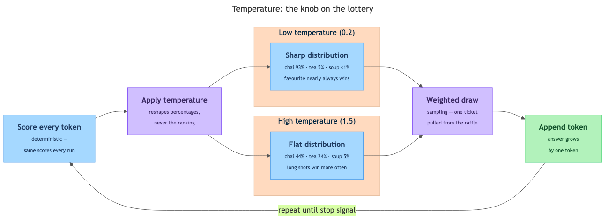

# Temperature and Sampling — Why the Same Question Gives Different Answers

## Overview

Ask a chatbot "Give me a name for a tea stall" and it says "ChaiPoint Corner." Ask the identical question again in a fresh chat and it says "The Steeping Story" — same question, same model, same billions of parameters, different answer. In week 1 we called this *probabilistic* behavior and promised the real explanation later. Later is now: this topic shows the exact machinery — a scored list, a weighted lottery called sampling, and a dial called temperature — that turns one question into many answers.

## Key Concepts

### Every answer starts as a scored list

Recall the core loop from topic 3.4. An LLM (Large Language Model) does not plan its whole reply in advance. It builds the reply one token at a time, and after each token it asks the same question again: *"Given everything so far, what comes next?"*

Here is the crucial detail: the model's parameters do not output one token. They output a score for **every token the model knows** — typically 50,000 to 200,000 of them. Those raw scores are then converted into percentages that add up to 100%.

**Probability distribution** — a menu of options where each option carries a percentage chance of being picked.

Suppose the text so far is:

> "For breakfast in Mumbai, many people enjoy a hot cup of ___"

The distribution for the next token might look like this (simplified to five entries — the real list has tens of thousands, most near zero):

| Candidate next token | Probability |
|---|---|
| `chai` | 62% |
| `tea` | 21% |
| `coffee` | 12% |
| `milk` | 4% |
| `soup` | 1% |

Two things are worth noticing:

- The model is *not* saying "the answer is chai." It is saying "chai fits best, tea fits decently, soup barely fits."
- This list is **completely deterministic**. Same text in, same model, same percentages — every time. The parameters from topic 3.5 do fixed, repeatable arithmetic.

So the variation in AI answers does *not* come from fuzzy knowledge — the scored list is rock solid. The variation comes from what happens next.

### Sharp lists and flat lists

Not all distributions look alike, and the shape matters.

- **Sharp distribution** — one token dominates. For "The capital of France is ___", the token `Paris` might hold 98%. The training data overwhelmingly agreed on what comes next.
- **Flat distribution** — many tokens sit close together. For "A good name for a tea stall would be ___", the top candidate might hold only 4%, the next 3%, and so on down a long tail.

| Distribution shape | Typical context | Effect of a chance-based pick |
|---|---|---|
| Sharp (one token dominates) | Facts, arithmetic, fixed phrases | Barely any — the favourite nearly always wins |
| Flat (many tokens close together) | Creative writing, naming, open questions | Large — different runs genuinely diverge |

One refinement: even in a factual answer, only the fact-holding token (`Paris`) sits in a sharp distribution — the connective words around it sit in flatter ones. That is why repeated factual answers usually agree on **content** while varying in **wording**.

### Option one: always take the top pick (greedy decoding)

**Greedy decoding** — the rule "take the highest-scoring token, every time." Greedy, because it grabs the best-looking option at each step and never gambles.

In the breakfast example, greedy decoding picks `chai`. Always. Run it a thousand times, get `chai` a thousand times — the system becomes deterministic, like a calculator. So why isn't this the standard?

- **It gets repetitive.** Always taking the safest token produces flat, formulaic text and can trap the model in loops: *"The market was busy. The market was busy."* Each repetition makes the phrase look even more expected, so the rule keeps choosing it.
- **It is short-sighted.** A slightly less likely token now can lead to a much better sentence later. Greedy never takes that path.
- **One question, one phrasing — forever.** For any creative task, that is a serious flaw.

The root problem: language has many right answers. The distribution honestly reports that several continuations are reasonable; greedy decoding pretends only one exists.

### Option two: hold a weighted lottery (sampling)

**Sampling** — picking the next token by chance, where each token's chance equals its probability in the list. The everyday picture is a raffle drum holding 100 tickets:

- 62 tickets say `chai`
- 21 tickets say `tea`
- 12 tickets say `coffee`
- 4 tickets say `milk`
- 1 ticket says `soup`

Shake the drum, draw one ticket, append that token. Likely tokens hold most of the tickets, so they usually win — but not always. Roughly one run in five, the model writes `tea` instead of `chai`.

Where does the "shake" come from? A **random number generator** — a small program that produces an unpredictable-looking stream of numbers — decides which ticket is drawn. Some developer tools let you fix the generator's starting point, called a **seed**: same seed, same draws, same answer. Even the randomness is engineered.

This is the direct answer to the headline question. **Why does the same question give different answers? Because at every token, the model holds a fresh weighted lottery, and lottery draws differ from run to run.**

One different draw snowballs:

1. **Run A** draws `chai`. The next distribution, built on "…a hot cup of chai", favours tokens like `with` ("chai with a samosa…").
2. **Run B** draws `coffee` at the same step. Its next distribution favours `from` ("coffee from a South Indian filter…").
3. From here every later draw works on different text, so the answers drift further and further apart.

A 200-token answer is 200 consecutive draws. In exchange for giving up repeatability, sampling buys **variety** (ten name requests, ten names), **natural-sounding text**, and an **escape from loops**.

### Temperature: the knob on the lottery

**Temperature** — a number, set when the model is called, that reshapes the probability distribution *before* the lottery draw. It does not touch the model's parameters and adds no knowledge; it only redistributes the raffle tickets. The name borrows from physics: heat particles and they jump around more; cool them and they settle down.

*The token loop with temperature in the middle: deterministic scores go in, low temperature sharpens the distribution while high temperature flattens it, and one ticket is drawn before the loop repeats.*

| Candidate | Low temp (0.2) | Neutral (1.0) | High temp (1.5) |
|---|---|---|---|
| `chai` | 93% | 62% | 44% |
| `tea` | 5% | 21% | 24% |
| `coffee` | 2% | 12% | 18% |
| `milk` | <1% | 4% | 9% |
| `soup` | <1% | 1% | 5% |

Read the table row by row: `chai` is the favourite in every column. Temperature never changes the *ranking*, only the *margins*. At 0.2 the lottery is nearly a formality; at 1.5 even `soup` wins one run in twenty.

Two ends of the dial deserve special mention:

- **Temperature 0** means "skip the lottery, take the top token" — it collapses sampling into greedy decoding. People say "temp 0 for reproducible output" for exactly this reason.
- **Very high temperatures** (most systems cap the dial around 2) let barely-fitting tokens win often. Output drifts from creative through weird into incoherent word salad — more temperature is just more noise.

For the middle of the dial there is no formula — practitioners start from rules of thumb (see In Practice), try, and adjust.

Temperature is not the only knob. A sibling control, **top-p sampling**, trims the raffle before the draw: it keeps only the smallest group of top tokens whose probabilities add up to *p* (say, 90%) and discards the long tail of barely-plausible ones. Temperature reshapes the odds; top-p shortens the guest list.

### What temperature is NOT

1. **Low temperature is not a truth guarantee.** If the distribution puts 70% on a *wrong* token, low temperature picks that wrong token *more* reliably. A model can be confidently, consistently mistaken — and the polished consistency can even *feel* like accuracy. (This failure mode, called hallucination, is topic 3.9.)
2. **High temperature is not human-style creativity.** The model does not "feel inspired" at 1.5. It is simply allowed to pick lower-ranked tokens more often — no creative intent, only a flatter raffle.
3. **Temperature 0 is not a perfect repeatability switch in practice.** Tiny engineering details in deployed systems — such as how hardware rounds numbers when many requests run together — can still produce occasional small variations. Treat temp 0 as "as repeatable as it gets."
4. **Sampling is not blind guessing.** The lottery is weighted by everything the model learned in training; a token the model considers absurd holds essentially no tickets. Randomness chooses *among the model's good options* — it does not invent new ones.

So why build it this way at all? Engineers *could* run every model at temperature 0 and get calculator-like behavior. They don't, because for most uses — drafting, brainstorming, explaining, conversing — there is no single correct output, only thousands of good ones. The week-1 variation is a deliberate trade: controlled randomness for variety and naturalness, with temperature as the dose control.

## Worked Example

This five-step loop runs for **every single token** of every answer you have ever received from a chatbot:

1. **Score.** The parameters process all text so far and assign a raw score to every token in the vocabulary. (Deterministic — same input, same scores.)
2. **Apply temperature.** Each raw score is divided by the temperature value. Dividing by a small number (low temp) stretches the gaps between scores; dividing by a large number (high temp) squashes them together.
3. **Convert to percentages.** The adjusted scores become a probability distribution summing to 100%. Stretched gaps become lopsided percentages; squashed gaps become even ones.
4. **Draw.** At temperature 0, take the top token. Otherwise, hold the weighted lottery.
5. **Append and repeat.** Add the drawn token to the text and return to step 1, until the model produces its stop signal.

Step 2 is all the mathematics involved. Say two tokens have raw scores 4 and 2:

- **At temperature 0.5:** both divided by 0.5 → 8 and 4. The gap grew, so the leader's percentage becomes overwhelming.
- **At temperature 2.0:** both divided by 2.0 → 2 and 1. The gap shrank, so the underdog wins far more often.

Now watch three steps of a real answer. Prompt: *"Suggest a name for a tea stall."* Temperature: 1.0.

1. The distribution over first tokens is flat (a naming task). Top candidates: `Chai` (5%), `The` (4%), `Cutting` (3%), and thousands more. The lottery draws `The`.
2. The text is now "The". The new distribution favours words that start stall names: `Steeping` (6%), `Morning` (5%)… The draw lands on `Steeping`.
3. The text is "The Steeping". Now the distribution is *sharp* — few tokens fit, and `Story` might hold 40%. The draw very likely returns `Story`.

Result: "The Steeping Story." Run the prompt again and step 1 alone will probably go elsewhere, unfolding a completely different name.

Does the model re-think its whole answer at a different temperature? No. The scoring in step 1 is identical at every temperature; temperature only intervenes between the scores and the draw. Everything here happens at **inference** time — nothing retrains the model or alters its parameters.

## In Practice

- **Consumer chatbots ship with a moderate default** — usually around 0.7–1.0. Warm enough for natural variety, cool enough to stay on track. That default is why your week-1 experiment produced different tea-stall names.
- **The "regenerate" button is just a re-draw.** Same question, new lottery, new answer. For creative work, regenerate several times and harvest the best draws.
- **Builders set the dial per request, not per model.** Typical working pattern:

| Task | Typical temperature | Why |
|---|---|---|
| Extracting data into a fixed format | 0 – 0.2 | Any variation is a bug |
| Customer-support answers | 0.2 – 0.5 | Consistent, on-policy phrasing |
| General chat and explanation | 0.6 – 1.0 | Natural, varied conversation |
| Brainstorming, naming, fiction | 1.0 – 1.5 | Diversity is the whole point |

- **Match the dial to the cost of variation.** Ask one question: *if two runs differ, is that a feature or a bug?* Feature → raise it. Bug → lower it.
- **Don't reach for temperature to fix wrong answers.** Lowering temperature makes answers more *repeatable*, not more *correct*. Wrongness is a knowledge problem; temperature is a variability problem.
- **Testing AI means accounting for sampling.** One run proves little — a good answer might be a lucky draw. Either pin temperature to 0 or run the same question many times and look at the spread.

## Key Takeaways

- At every step, an LLM produces a **probability distribution** — a scored list of every possible next token — and that list itself is fully deterministic.
- Different answers come from **sampling**: each token is drawn by weighted lottery, and one different draw re-routes everything after it.
- Distribution **shape** matters: sharp distributions (facts) barely vary under sampling; flat distributions (creative tasks) diverge run after run, even at identical settings.
- **Greedy decoding** (always take the top token) is repeatable but bland, repetitive, and short-sighted; sampling trades repeatability for variety and naturalness.
- **Temperature** reshapes the distribution before the draw — low values concentrate probability on the favourites (temp 0 ≈ greedy), high values flatten it toward incoherence. It never changes the ranking, the parameters, or the model's knowledge — so low temperature buys consistency, **not correctness**.
