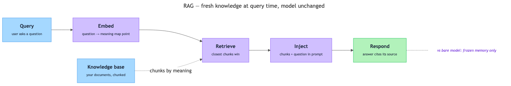

# Retrieval-Augmented Generation (RAG) — Giving AI Access to External Knowledge at Query Time

## Overview

Ask a chatbot, "How many vacation days do I get at my company?" and it may confidently invent an answer — the real number lives in an HR document the model has never seen. You met this failure in Week 3: it is a hallucination, and it happens because a model's knowledge is frozen at training time. **Retrieval-Augmented Generation (RAG)** is the most widely used fix: look the answer up first, then hand the relevant text to the model along with the question. This reading walks that idea step by step and shows when to choose it over fine-tuning.

## Key Concepts

### The knowledge problem

A foundation model has three knowledge gaps that no clever prompting can close:

- **Its knowledge is frozen in time.** Training happens once, then stops. A policy updated last week is not in the model.
- **Its knowledge is general, not yours.** Your company's handbook was never in the public training data — and you would not want it to be.
- **It cannot tell remembering from guessing.** The model produces the most likely next tokens either way; when the real answer is missing, a plausible fake often comes out.

Why not retrain whenever something changes? Even fine-tuning takes curated examples and hours-to-days of work — you cannot fine-tune every morning because the cafeteria menu changed. So: **how do you give a frozen model fresh, private knowledge at the moment it needs it — without retraining anything?**

### The key insight: the prompt is a door

One channel into the model is *not* frozen: **the prompt**. Everything in the context window, the model reads fresh, at inference time, every time. You have seen this when pasting a paragraph into a chatbot and asking, "Summarize this" — the model handles text it never trained on. RAG industrializes that trick: the system finds and pastes the right passages automatically.

Why not paste *everything* in? Two reasons:

- **The context window is finite.** A document library can run to millions of words; the prompt holds a small fraction.
- **Relevance beats volume.** Burying one useful paragraph under fifty useless ones makes the model's job harder. You want one folder from the librarian, not the whole archive.

That selection step is retrieval — and it names the technique.

**Retrieval-Augmented Generation** — a technique where an AI system first *retrieves* relevant text from an external knowledge source, then *augments* (adds to) the model's prompt with that text, so the model's *generation* (its answer) is grounded in the retrieved material.

Unpack the three words, right to left:

- **Generation** — the part you know: the LLM (Large Language Model) generating an answer token by token.
- **Augmented** — the prompt is enriched: your question *plus* supporting text.
- **Retrieval** — the new machinery: automatically fetching the right supporting text the moment you ask. "Retrieve" just means "fetch."

One phrase in the title deserves emphasis: **at query time**. A **query** is the question you send to the system. "At query time" means the knowledge arrives the instant you ask — not months earlier during training. That timing difference is the entire point.

### The knowledge base: where the answers live

**Knowledge base** — the organized collection of documents a RAG system is allowed to search: HR policies, product manuals, support articles, a wiki.

Two things matter about it:

- **You control it.** It is just files. Update a policy today, and the system uses the new version on the next question. Nothing is retrained.
- **It is prepared ahead of time.** Documents are split into passages so the system can fetch the relevant piece, not an 80-page manual. Each passage is a **chunk** — a bite-sized slice of a document, typically a few paragraphs long.

How big should a chunk be?

| Chunk size | Result |
|---|---|
| Too large (whole chapters) | The answer arrives buried in noise that crowds the context window |
| Too small (single sentences) | "Up to 5 days may be carried over" is useless if the sentence naming *which* policy landed in another chunk |
| Just right (a few paragraphs) | Understandable on its own; several chunks still fit in one prompt |

### Finding the right chunk: matching by meaning

A user asks, "How many days off do I get?" The relevant chunk says, "Employees accrue 1.5 days of paid leave per month of service." Question and answer share almost no words — word-matching search would miss it.

RAG systems therefore search by **meaning**, using embeddings (Week 3): numbers representing what a text *means*, like coordinates on a "map of meaning." "Days off," "vacation," and "paid leave" all land in the same neighborhood, though they share no letters. The search:

- Ahead of time, every chunk is converted into an embedding and stored.
- When a question arrives, it is converted into an embedding too.
- The system picks the stored chunks closest to the question on the meaning-map.

**Similarity matching** — comparing embeddings to find which stored chunks are closest in meaning to the question.

How embeddings are stored and searched across millions of chunks is its own subject — you will meet vector databases and the full retrieval pipeline in Week 14.

### The five-step RAG flow

Put the pieces together and you get the canonical flow, run on every question:

*The RAG pipeline: a question travels query → embed → retrieve → inject → respond, picking up evidence from the knowledge base along the way.*

**The model is unchanged.** No one touches the model's parameters; it stays exactly as frozen as before. All new knowledge flows in through the prompt. That is why RAG is described as an *open-book exam*: the book changed, not the student.

**Each step has its own failure mode.** When a RAG answer goes wrong, the flow tells you where to look:

| Step | What can go wrong | What the user sees |
|---|---|---|
| 1. Query | Vague question ("What about leave?") | Weakly related chunks come back |
| 2. Embed | Rare wording captured poorly | Question lands in the wrong map neighborhood |
| 3. Retrieve | Right chunk isn't among the closest matches | Confident answer from the wrong evidence |
| 4. Inject | Too many chunks crowd the prompt | The key sentence gets lost in noise |
| 5. Respond | Model misreads or blends chunks | A grounded-looking answer the source doesn't say |

This is the decomposition habit from Week 1: name the step that failed. Only the retrieved chunks ever enter the prompt — the model never sees the whole library — so quality hangs heavily on step 3.

### Grounding: why RAG answers are more trustworthy

**Grounding** — tying the model's answer to specific, checkable source material instead of internal memory.

Grounding attacks hallucination from two sides:

- **It closes the gap.** The top reason to hallucinate — "the answer is not in my training data" — disappears when the answer sits in the prompt.
- **It makes answers checkable.** An ungrounded "sale items can usually be refunded within 30 days" gives you nothing to check; a grounded "refundable within 14 days (Returns Policy, §3)" is one click from verified.

The grounded answer might still be wrong — but wrong in a way you can *catch*. Be careful, though: RAG *reduces* hallucination, it does not abolish it — the model can still misread a chunk, blend two chunks, or fall back on training memory when retrieval comes up empty. The honest one-liner: **RAG turns "trust my memory" into "here's my source" — a major upgrade, not a guarantee.**

### What RAG is not — three common confusions

- **Not the model learning.** Retrieved chunks live in the prompt for one exchange, then they are gone; the system retrieves afresh every time.
- **Not just a search engine.** Search hands you ten links; RAG does the search *and then* the reading and answering.
- **Not a truth machine.** Similarity is not correctness — an obsolete policy gets retrieved, injected, and confidently cited.

Keep these in your pocket: **no learning, not just search, not automatic truth.**

### RAG vs. fine-tuning

A clean way to hold the difference: **fine-tuning teaches the model new behavior; RAG hands the model new information.** Fine-tuning sends the student back to school; RAG lets the student bring the textbook into the exam.

| | Fine-tuning | RAG |
|---|---|---|
| What changes | The model's parameters (weights) | The prompt — retrieved text is injected |
| Best at | New *behavior*: style, tone, format | New *facts*: current, private, specialized |
| Knowledge freshness | Frozen at fine-tuning time | As fresh as the knowledge base |
| Cost to update | Re-run training: hours to days | Edit a document: minutes |
| Can it cite a source | No — knowledge blends invisibly into weights | Yes — answers point at retrieved chunks |

Two scenario checks: a support bot answering from a catalog that changes weekly needs **RAG** (changing facts); a model that answers accurately but in the wrong tone needs **fine-tuning** (behavior). The two are not rivals — real systems often combine both.

RAG is also the first form of a bigger pattern: a model reaching *outside itself* at the moment of answering. The next steps in that pattern are agents and tool use — those are Topics 4.4 and 4.5, so leave them there for now.

## Worked Example

The full life of one question, in two phases.

**Phase A — Setup (done once, ahead of time):**

1. **Collect** the 40 documents of a company's HR policy library.
2. **Chunk** them into passages — say 1,200 chunks.
3. **Embed** every chunk — compute its meaning-coordinates.
4. **Store** the embeddings, each linked back to its source text.

**Phase B — Query time (every question):**

1. **Query.** Priya, a new employee, types: *"Can I carry unused leave into next year?"*
2. **Embed.** Her question becomes a point on the meaning-map near *leave*, *carry-over*, *annual allowance*.
3. **Retrieve.** Similarity matching returns the top 3 chunks — Leave Policy §5 ("Up to 5 unused leave days may be carried into the following calendar year…"), §6 ("Carried-over days must be used by March 31…"), and an onboarding FAQ.
4. **Inject.** The system assembles the augmented prompt:
   > "Use only the context below to answer. If the context does not contain the answer, say so.
   > Context: [chunk 412] [chunk 415] [chunk 87]
   > Question: Can I carry unused leave into next year?"
5. **Respond.** The model generates: *"Yes — you can carry up to 5 unused leave days into the next calendar year, but you must use them by March 31 (Leave Policy, §5–6)."*

Without RAG, the same model — trained on hundreds of *other* leave policies — produces something like *"Typically, companies allow 10 days of carry-over."* Fluent, plausible, wrong. Same model, same question; the only difference is what was placed in front of it at query time.

One twist: the company changes the limit to 8 days. With RAG, someone edits the document and tomorrow's answer says "up to 8 days" — minutes of turnaround. With fine-tuning, the same change means new training data, a re-run, and a redeploy. Notice also the instruction in step 4 — "if the context does not contain the answer, say so" — which turns an empty retrieval into an honest "I don't know" instead of a hallucination.

## In Practice

Where you will run into RAG — arguably the most deployed LLM pattern in industry:

- **Customer-support assistants** answering from current policies — a policy change means replacing one document.
- **Internal knowledge assistants** ("Ask HR," "Ask IT") over private wikis that were never in any training set.
- **Search engines with AI answers** — a paragraph answer with source links is RAG at web scale.
- **Legal and medical assistants** answering only from a vetted corpus — the citation trail is the product.
- **"Chat with your files" tools** — your PDFs become the knowledge base.

Heuristics for judging any RAG setup:

- **The knowledge base is the ceiling.** Outdated file in, outdated answer out — with a confident citation. Curating the documents is the highest-leverage maintenance task.
- **Retrieval is the weakest link.** When answers go bad, check *what was retrieved* before blaming the model.
- **Instruct the model to stay inside the evidence**, and demand citations — a system that never shows sources deserves bare-model skepticism.
- **Match the tool to the gap.** Missing facts → RAG; wrong style → fine-tuning. Fine-tuning to inject facts is the classic anti-pattern: slow, stale on arrival, impossible to cite.
- **Verify anyway.** The evaluation habits from Week 3 still apply to every grounded answer.

## Key Takeaways

- A foundation model's knowledge is frozen at training time; it cannot see recent events or your private documents, and it papers over gaps with confident hallucinations.
- RAG fixes this at **query time**: retrieve relevant chunks from a knowledge base, inject them into the prompt, and let the model answer from supplied evidence instead of memory.
- The flow is five steps — **query → embed → retrieve → inject → respond** — and the model is never modified; all new knowledge enters through the prompt.
- Retrieval matches by *meaning*, not exact words: the question and every chunk become embeddings, and the closest chunks on the meaning-map win.
- RAG delivers fresh, private, **citable** answers and reduces hallucination — but the knowledge base sets the ceiling, and retrieval misses still produce wrong answers.
- Choose RAG for new *facts*, fine-tuning for new *behavior*; production systems frequently combine both.
