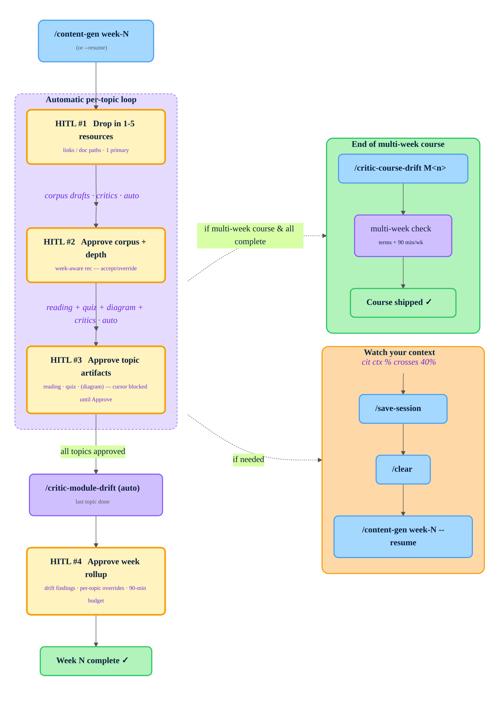

# Content Generation — Quickstart

The whole workflow, in one paragraph: open Claude Code in the repo, type `/content-gen week-N`, answer the prompts when they appear, watch your context bar, and you're done. The system handles the rest end-to-end and tells you when the week is complete.

> **Prerequisite: Python 3.8+ reachable on your PATH as `python`.** Every `.claude/` hook, the statusline, and the HITL gate-router are Python scripts launched as `python .claude/...`. If `python` is missing (some Linux/macOS setups only ship `python3`) or no Python is installed, Claude Code does **not** block the session — the hooks just fail silently. The visible effects (no caveman, blank statusline) are cosmetic, but the dangerous one is that **the HITL gate-router stops enforcing**: the pipeline runs with no gate blocks and gives no warning. Verify with `python --version` before your first run. If your machine only has `python3`, alias or symlink it to `python`.

---

## Before you start (one-time setup)

There's almost nothing to set up. You don't build any templates, and you don't "connect" Claude to a server — Claude runs **on your machine** and works on the repo files locally, then pushes for you. Three steps, once:

### 1. Get the files into your repo

You'll receive a **zip of this repo**. Unzip it, then push it up to your own Azure DevOps (ADO) or GitHub repository so your team shares one copy:

```bash
unzip content-gen-example.zip
cd content-gen-example
git init                                   # skip if it's already a git repo
git remote add origin <your-ADO-or-GitHub-repo-URL>
git add .
git commit -m "Initial content-gen repo"
git push -u origin main
```

After this, clone it onto any machine that will do content work (`git clone <your-repo-URL>`).

### 2. Install Claude Code — that's the only install

Pick one, no other tooling required:

- **VS Code + Terminal** — open the repo folder, run `claude` in the integrated terminal, or
- **Claude Desktop** — open the repo folder directly.

Claude takes actions on your computer (read files, edit, commit, branch, push) from there. Nothing else to configure.

### 3. Confirm you can push (so Claude can too)

Claude pushes using *your* git login. If you've ever pushed to this ADO/GitHub repo from this machine, you're already set. To be sure, run a quick test push:

```bash
git commit --allow-empty -m "access test"
git push
```

- **Push succeeds** → you're done, Claude has everything it needs.
- **Push asks you to log in** → follow the prompt (browser login for ADO/GitHub, or `gh auth login` for GitHub CLI), then push again. If you're ever not logged in mid-run, Claude will stop and walk you through the same login.

> **Do I need to create templates or a folder structure?** No. The repo already contains every module / week / topic, with all the information from the source Word and Excel docs baked into the `*.manifest.json` files and `topic_corpus.md`. (That JSON exists mainly so the content ports cleanly into the LMS later — you don't edit it by hand.) You just run `/content-gen week-N` and answer the prompts.



---

## What you actually do

### 1. Start the week

```
/content-gen week-7
```

(also accepts `week-07`, `W7`, `W07` — pick the week you're working)

The orchestrator checks out a `week-N` branch first (creating it off `main` if needed), so your week's work is isolated and two teammates on different weeks never collide. If your working tree is dirty it pauses and asks before switching. Caveman auto-activates on session start, so there's no other setup to remember.

### 2. Respond to HITL prompts as they appear

The system walks every topic in the week in order and pauses at **three human-in-the-loop gates per topic** plus **one rollup gate at the end of the week**. You just respond when prompted:

| Gate | When | What it asks | What you do |
|---|---|---|---|
| **HITL #1 — Resources** | per topic, before corpus | "Paste 1–5 grounding resources for topic X" | Drop URLs, doc paths, or short citations. Minimum one tagged as **primary**. |
| **HITL #2 — Corpus review** | per topic, after corpus critic passes | "Approve each section, confirm depth profile" | Walk top-to-bottom; pick **atomic / standard / deep**. |
| **HITL #3 — Topic artifacts** | per topic, after reading + quiz (+ diagram) critics all pass | "Approve this topic's artifacts before moving on?" | Review reading + quiz (+ diagram) paths and critic verdicts. Choose **Approve topic artifacts**, **Request changes** (multi-select reading/quiz/diagram), or **Defer**. **The cursor does not advance to the next topic without it.** |
| **HITL #4 — Week rollup** | once per week, after drift critic passes | "Drift passed. Ship the week as a unit?" | Per-artifact review already happened at #3 — this is a quick scan of drift findings + any per-topic overrides + the 90-min budget. Choose **Approve week**, **Request changes**, or **Defer**. |

Between the per-topic gates, the system builds the corpus, runs critics, generates the reading + quiz (+ diagram if the topic is visual), runs more critics. You don't trigger any of that — it just happens.

### 3. Watch your context bar

The statusline shows `[cit ctx X%]`. If it crosses **40%**, run three commands in order:

```
/save-session
/clear
/content-gen week-7 --resume
```

`/save-session` writes the checkpoint, `/clear` wipes the conversation context so you start fresh (no need to close the window), and `--resume` drops you back at the exact HITL prompt you left off at.

### 4. End of the week — automatic critic, then HITL #4

When the last topic in the week is done (every topic at `topic_artifacts_approved` — HITL #3 already approved each one), `/critic-module-drift` runs automatically across all modules in the week. On pass, the orchestrator pauses for **HITL #4 — week rollup** with the per-topic approval summary, drift findings, and any per-topic overrides accepted at HITL #3. Approve the week and you'll see:

```
Week 7 complete ✓
```

Right after that, you're asked whether to ship the `week-N` branch — **Push & open PR**, **Push only**, or **Not now**. Nothing is pushed without that choice. The week is finalized, checkpoints auto-clear, you're free.

If a drift critic flags something, the system tells you exactly which topic to revisit and how — **HITL #4 never opens** until drift is green. Per-topic carry-over critic failures (a builder ↔ critic loop that didn't converge in 2 cycles) are accepted or rejected at HITL #3, so by the time you reach HITL #4 the overrides are already logged. HITL #4 lists them for visibility, not re-litigation.

---

## End of a multi-week course

When every week in a course (M1 spans W01-W02, M2 spans W03-W05, etc.) shows complete, run one final command for that course:

```
/critic-course-drift M2
```

This is the only command outside the per-week flow — it checks the whole course holds together across weeks and that the 90-min weekly budget held. On pass, the course is officially shipped.

---

## TL;DR — the only commands you type

| Command | When |
|---|---|
| `/content-gen week-N` | Starting or resuming a week (`--resume` if resuming) |
| `/save-session` | When ctx hits 40% |
| `/critic-course-drift M<n>` | Once at the end of a multi-week course |

Everything else is automatic. If you ever want a status view across the curriculum, `/content-status` gives it.
