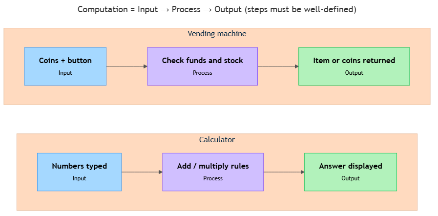

<!-- nav:top:start -->
Previous: —&emsp;·&emsp;[⬆ Table of Contents](../../../../../../../README.md#curriculum-topic-index)&emsp;·&emsp;[Next: 1.2 — Deterministic systems ➡](../../1-2-deterministic-systems-same-input-always-gives-the-same-outpu/artifacts/reading.md)
<!-- nav:top:end -->

---

# What is computation

## Overview

Computation is any process that takes information in, applies a defined set of steps to it, and produces a result. You encounter computation dozens of times a day — when a GPS picks a route, when a traffic light changes phase, when a vending machine checks your coins. Understanding what computation actually is gives you the foundation for everything else in this course: how computers make decisions, how AI systems work, and how to think through problems before writing a single line of code.

## Key Concepts

### 1. The three parts of every computation

Every computation — no matter how simple or complex — has the same three-part structure [1]:

1. **Input** — the raw information going in. Example: the numbers you type into a calculator.
2. **Process** — the defined steps applied to that information. Example: the addition or multiplication rules.
3. **Output** — the result that comes out. Example: the answer shown on the display.

This is called the **Input / Process / Output** model — or **I/P/O** for short. It applies to a pocket calculator, a weather forecast system, and every AI tool you have ever used.

*The input → process → output structure, shown in two everyday examples.*

Why does the I/P/O model matter? Because it breaks the assumption that computation only happens inside computers. Once you can identify the three parts, you can recognise computation anywhere — in a thermostat, in a cashier counting change, in a music box. It also gives you the first design questions for any solution: what is the input? What steps transform it? What output do I need? [1]

### 2. "Defined steps" — why precision matters

The word *defined* is doing important work. Computation requires that the steps are **specific and unambiguous** — precise instructions that leave no room for guessing [1].

Think about a recipe:

- **Vague:** "Add a pinch of salt." Two cooks add different amounts — this is not computable.
- **Defined:** "Add exactly 2 grams of salt." Every cook adds the same amount — this is computable.

When the steps are precise enough that anyone (or any machine) could follow them and get the same result, you have a computational process. Ambiguous steps break this: two runs on the same input produce different outputs, making the process unreliable and unverifiable [1].

### 3. What makes a task "computable"

**Computable** means: there exists a finite set of defined steps that always produces the correct result in a finite amount of time [1].

| Task | Computable? | Why |
|---|---|---|
| Add two numbers | Yes | Clear steps, always finishes [1] |
| Sort a list of names alphabetically | Yes | Clear steps, always finishes [1] |
| Find the shortest route between two cities | Yes | Steps exist; always finishes [1] |
| Decide whether a poem is "beautiful" | Not fully | No precise, agreed-upon steps exist |
| Predict exact weather in 10 years | Not fully | Steps exist but result is approximate |

The boundary shifts over time. Tasks once considered impossible for machines — recognising speech, identifying objects in photos — are now solved by modern AI (Artificial Intelligence) systems [2][3]. You will explore that shift in later topics.

### 4. Computers are not the only things that compute

Anything that takes an input, applies defined steps, and produces an output is computing — no silicon chip required [1].

**Traffic light on a timer**
- Input: time elapsed since the last phase change
- Process: if time ≥ green_duration, switch to amber; then red; then back to green
- Output: the light signal shown to drivers

**Vending machine**
- Input: coins inserted, button pressed
- Process: check whether inserted value ≥ item price AND item is in stock; if yes, dispense item and return change; if no, return coins
- Output: dispensed item + change, or all coins returned

**Human cashier**
- Input: purchase price and amount handed over
- Process: subtract price from payment; decompose the difference into fewest notes and coins available
- Output: the correct change handed back

The same I/P/O structure runs in every case. Recognising computation in the world around you — not just on screens — is the first step in **computational thinking**: approaching a problem by breaking it into steps, spotting patterns, and expressing a solution precisely [1].

### 5. AI is computation too

Modern AI systems — chat tools, recommendation engines, image recognisers — are also performing computation. They take inputs (your words, an image, your click history), apply sequences of defined steps, and produce outputs (a reply, a label, a recommendation) [2][3].

What makes AI distinctive is how the steps were determined — a process you will explore in a later module. The key point for now: AI is built on the same I/P/O foundation you have just learned. Whether a system is deterministic or probabilistic is covered in topics 1.2 and 1.3 — for now, the core structure is identical [1][2].

## Worked Example

Here is a single computation traced step by step: a bank card transaction check.

Every time you tap your card at a shop, a computation runs in the background — typically finishing in under 200 milliseconds [2][3].

**Step 1 — Input is gathered**

The system collects: merchant category, transaction amount, geographic location, time of day, and your recent transaction history.

**Step 2 — Process runs**

Each piece of input is checked against a set of rules:
- Is the amount more than 5× your 30-day average? → suspicion flag raised.
- Are there two transactions in different countries within 1 hour? → high-risk flag raised.
- Does the merchant category match your usual spending? → soft flag raised or cleared.

All flags are combined into a single **risk score**.

**Step 3 — Output is produced**

- Score below threshold → transaction approved.
- Score above threshold → transaction declined and an SMS alert sent to you.
- Score in the middle band → transaction routed to a human analyst for review.

Notice the structure: a defined input, a set of precise and unambiguous steps, a clear output. This is computation — and it runs billions of times a day across the global payments network [2][3].

## In Practice

Computation shows up in every industry. Three short examples:

- **Manufacturing:** a camera above a bottling line captures each bottle (input), checks fill level, cap position, and label alignment against tolerances (process), and sends a pass or fail signal to a sorting arm (output) [3].
- **Healthcare:** a radiology AI takes a scan and patient history (input), evaluates structural features against baseline profiles (process), and produces a ranked list of candidate conditions with probability scores for a clinician to review (output) [2][3].
- **Finance:** as shown in the Worked Example above — the fraud-detection system runs the same I/P/O structure for every card transaction globally [2][3].

**Habits that help when you start thinking computationally:**

- **Name the input first.** Be precise about what information you are starting with. Vague inputs lead to vague processes.
- **Make every step followable.** Ask: could someone else follow these steps exactly, without asking any questions? If not, the process needs more definition.
- **Check the output is answerable.** If the question has no single correct answer a defined process could reach, computation alone cannot solve it — you may need human judgment or a probability-based approach.
- **Do not confuse the computer with the computation.** Remove the laptop; computation stays. The concept is bigger than the machine [1].

## Key Takeaways

- **Computation is Input → Process → Output:** any system that takes information, applies defined steps, and produces a result is computing.
- **Defined means unambiguous:** vague instructions are not computation. Steps must be precise enough for anyone — or any machine — to follow without guessing.
- **Computers are not the only things that compute:** traffic lights, vending machines, and human cashiers all perform computation.
- **Computable means solvable by a finite set of defined steps:** not every problem is computable, but the boundary keeps moving as technology advances.
- **AI is computation:** the AI systems you already use are built on the same I/P/O structure introduced here — you will explore how they differ from simpler systems in topics 1.2 and 1.3.

## References

1. The Learn Notes, "Deterministic and Probabilistic Systems — What's the Deal?" <https://thelearnnotes.com/blog/deterministic-and-probabilistic-systems-what-s-the-deal->
2. Alphanome AI, "Probabilistic vs Deterministic Models in AI/ML: A Detailed Explanation." <https://www.alphanome.ai/post/probabilistic-vs-deterministic-models-in-ai-ml-a-detailed-explanation>
3. Gaine, "Probabilistic and Deterministic Results in AI Systems." <https://www.gaine.com/blog/probabilistic-and-deterministic-results-in-ai-systems>

---
<!-- nav:bottom:start -->
Previous: —&emsp;·&emsp;[⬆ Table of Contents](../../../../../../../README.md#curriculum-topic-index)&emsp;·&emsp;[Next: 1.2 — Deterministic systems ➡](../../1-2-deterministic-systems-same-input-always-gives-the-same-outpu/artifacts/reading.md)
<!-- nav:bottom:end -->
