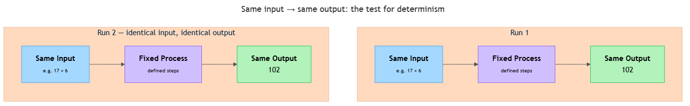

<!-- nav:top:start -->
[⬅ Previous: 1.1 — What is computation](../../1-1-what-is-computation/artifacts/reading.md)&emsp;·&emsp;[⬆ Table of Contents](../../../../../../../README.md#curriculum-topic-index)&emsp;·&emsp;[Next: 1.3 — Probabilistic systems ➡](../../1-3-probabilistic-systems-same-input-can-give-different-outputs/artifacts/reading.md)
<!-- nav:top:end -->

---

# Deterministic systems — same input always gives the same output

## Overview

In topic 1.1 you learned that computation means taking an input, running a defined process on it, and producing an output. This topic focuses on a specific and extremely common property of computing systems: when the same input always produces the same output, without variation. That property is called **determinism**, and it is the foundation for why calculators, databases, and payroll systems can be trusted to give correct, consistent results every time they run [1].

## Key Concepts

### What "deterministic" means

A **deterministic system** is one whose output is completely fixed by its input. Give the system the same input twice — or a thousand times — and you will always get the same output back, with no variation and no surprises [1].

Here is the test you can apply to any system:

> If you gave this system the exact same input twice, would it always return the exact same output?

If yes, the system is deterministic. If the output could vary even slightly, the system is not fully deterministic [1][2].

The table below shows four systems and confirms why each one passes the test:

| System | Input | Output | Same every time? |
|---|---|---|---|
| Calculator: 17 × 6 | The numbers 17 and 6, the × operation | 102 | Yes [1] |
| Sort a list: [3, 1, 2] ascending | The list [3, 1, 2] | [1, 2, 3] | Yes [1] |
| Traffic light on a fixed timer | Time elapsed in current phase | Next colour to display | Yes [1] |
| Currency converter (fixed rate) | 100 USD, the exchange rate | The euro amount | Yes [2] |

In every case, knowing the input completely tells you the output. There is no uncertainty, no possibility of a different answer on a different day [1].

### Predictability and reproducibility

A deterministic system has two related but distinct benefits worth knowing by name.

- **Predictability** — before you run the system at all, you can work out what the output will be, as long as you know the input. If the rule is "multiply the two numbers," you can predict the answer for any pair without touching the computer [2].
- **Reproducibility** — if you run the same process on the same input on two different machines, in different countries, or five years apart, you get the same output. The result does not change with time, place, or hardware [1].

These two properties make deterministic systems trustworthy in real work:

- A banking system that rounded currency conversions differently on Tuesday than on Wednesday would be unusable.
- A sorting step that ordered the same list differently on each run would produce unreliable results.
- A program that produced different output from the same source code on two consecutive runs would make software impossible to test.

In every case, the guarantee of sameness is not just convenient — it is essential for the system to be trusted [1][2].

### Why "same input" means every part of the input

There is an important precision in the definition. "Same input" means *every part* of the input is identical — not just the obvious part you typed in.

Consider a navigation app calculating a route from point A to point B:

- If the input is only the two place names, the system always returns the same route.
- But if the input also includes the current time of day (to adjust for traffic), then the same destination pair at 8 a.m. and 2 p.m. are *different inputs*. Getting a different route is correct — the system is still deterministic, because the same full input (place names + time) always produces the same route [1].

A common mistake is to call a system non-deterministic when an input changed in a way you did not notice. The rule of thumb: if you see different outputs and are not sure why, **check whether any part of the input changed before concluding the system behaves randomly** [1][3].

This leads to the idea of **hidden inputs** — values that the process uses but that the user never types in directly. Common examples include:

- The current date or time (used by payroll rules, eligibility checks)
- A stored configuration value such as an exchange rate read from a settings file
- A system counter or log file that increments between runs [1][2][3]

Understanding hidden inputs is what allows you to correctly classify a system. Many systems that seem to behave unpredictably turn out to be fully deterministic once every input is written down explicitly [1].

### The diagram below shows the core idea

*The same input run twice through a deterministic system always produces the same output.*

### The contrast: when output can vary

Non-deterministic is a bare name for the contrasting case — covered in topic 1.3. Knowing the contrast exists makes determinism clearer. Deterministic systems are the predictable, repeatable ones. They are not "better" or "worse" than other kinds — they are the right tool when the answer must be the same every single time, such as in arithmetic, sorting, or checking whether a password meets length rules [1][3].

## Worked Example

Apply the three-step determinism test to a vending machine — a system introduced in topic 1.1.

**Step 1 — Identify all the inputs, including hidden ones.**

- Coin value inserted
- Button pressed (e.g., B3)
- Price stored for B3
- Stock level of B3

**Step 2 — Run the process twice with exactly the same input (as a thought experiment).**

- Run 1: coin = £1.20, button = B3, price = £1.10, B3 in stock → item dispensed, £0.10 returned.
- Run 2: same values → same result: item dispensed, £0.10 returned.

**Step 3 — Ask: is there any way the output could differ?**

Only if an input changes. If B3 goes out of stock between runs, that is a change in the stock-level input — not random behaviour. With every input held constant, the output is always the same.

**Conclusion:** the vending machine is a deterministic system [1].

Notice that step 1 is the hardest part in practice. Getting a different output than expected is almost always a sign that step 1 was incomplete — a hidden input changed without you noticing.

## In Practice

Deterministic systems appear wherever the answer must be exactly right, every time. Here are the most common areas you will encounter them:

- **Financial calculations.** Every payroll run, purchase total, and tax deduction is deterministic. The same salary figure, tax rate, and deduction list must always produce the same net pay. Any variation is a legal error [1][2].
- **Database searches and sorting.** When you look up a record — a customer account, a medical file — a search runs. When results come back in alphabetical or date order, a sort runs. Both are deterministic: same query, same data, same result, every time. This reproducibility is what makes databases safe to use in hospitals and banks [1][3].
- **Build tools.** Software that translates source code into a runnable program must produce the same output every time it processes the same code. Without that guarantee, developers could never reliably reproduce a bug or verify a fix [1][2].

**Three habits for reasoning about determinism:**

1. **Check for hidden inputs first.** Before calling a system non-deterministic, list everything it reads — timestamps, config files, counters. A system that looks unpredictable often becomes predictable once every input is on the list [1].
2. **Separate "different outputs" from "non-deterministic."** A tax calculator produces different outputs for different income figures. That is correct and expected — it is still deterministic. The question is always whether the *same full input* yields the same output [2][3].
3. **Treat inconsistency as a bug signal.** If a system is supposed to be deterministic but gives inconsistent results, something is wrong: a hidden input is changing, or there is a design error. Inconsistency in a deterministic system is always a defect, not normal behaviour [1].

## Key Takeaways

- **A deterministic system always produces the same output for the same input.** This is a structural guarantee, not a guess or an approximation [1].
- **Predictability and reproducibility** are the two practical benefits: you can reason about the output before running, and re-run the process to verify a result [1][2].
- **"Same input" means every part of the input is identical**, including hidden inputs such as timestamps, stored settings, and system state. Different outputs do not automatically mean non-deterministic — always check whether the input also changed [1][3].
- **Hidden inputs are the most common source of confusion.** List everything the system reads before concluding it behaves randomly [1].
- **Non-deterministic systems exist and serve different purposes** — covered in topic 1.3. Knowing determinism clearly is the foundation for understanding that contrast.

## References

1. Wikipedia, "Deterministic system." <https://en.wikipedia.org/wiki/Deterministic_system>
2. Computer Science Wiki, "Determinism." <https://computersciencewiki.org/index.php/Determinism>
3. GeeksforGeeks, "Difference between Deterministic and Non-Deterministic Algorithms." <https://www.geeksforgeeks.org/dsa/difference-between-deterministic-and-non-deterministic-algorithms/>

---
<!-- nav:bottom:start -->
[⬅ Previous: 1.1 — What is computation](../../1-1-what-is-computation/artifacts/reading.md)&emsp;·&emsp;[⬆ Table of Contents](../../../../../../../README.md#curriculum-topic-index)&emsp;·&emsp;[Next: 1.3 — Probabilistic systems ➡](../../1-3-probabilistic-systems-same-input-can-give-different-outputs/artifacts/reading.md)
<!-- nav:bottom:end -->
