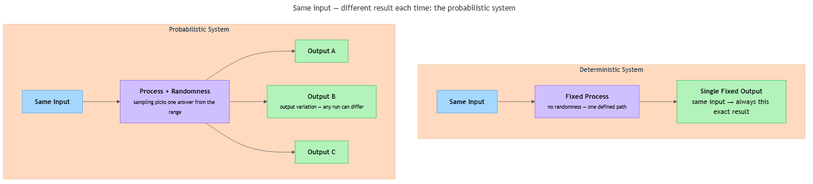

<!-- nav:top:start -->
[⬅ Previous: 1.2 — Deterministic systems](../../1-2-deterministic-systems-same-input-always-gives-the-same-outpu/artifacts/reading.md)&emsp;·&emsp;[⬆ Table of Contents](../../../../../../../README.md#curriculum-topic-index)&emsp;·&emsp;[Next: 1.4 — Why AI gives different answers to the same question ➡](../../1-4-why-ai-gives-different-answers-to-the-same-question/artifacts/reading.md)
<!-- nav:top:end -->

---

# Probabilistic systems — same input can give different outputs

## Overview

In topic 1.2 you learned that deterministic systems always produce the same output for the same input. Not every system works that way. Some systems are designed so that the same input can produce a different output each time — and that variation is not a mistake. It is the point. This topic introduces that category: **probabilistic systems**, and explains why they exist, how they work, and where you encounter them every day [1].

## Key Concepts

### What a probabilistic system is

A **probabilistic system** is one where the output is not fully fixed by the input. Even with exactly the same input, the system can produce different outputs on different runs [1].

The word "probabilistic" comes from **probability** — the study of how likely different outcomes are, measured on a scale from 0 (impossible) to 1 (certain). A probabilistic system does not pick its output at random with no logic. Instead, it works with a range of possible outputs, each with a different likelihood, and selects one. Which one is selected can vary each time [1][2].

Here is the key distinction stated plainly:

> In a **deterministic** system, the input fixes the output — there is one answer and only one.
> In a **probabilistic** system, the input shapes the *range of possible answers* — there is a spread of answers, each more or less likely, and which one is produced can differ.

The input still matters — it narrows down which outputs are plausible. But it does not lock the output to a single value.

The table below contrasts four systems so you can see the pattern:

| System | Input | Possible outputs | Same every time? |
|---|---|---|---|
| AI story generator | "Write a short story about the sea" | Thousands of different valid stories | No — varies each run [1] |
| Weather forecast model | Today's temperature and pressure | "60% chance of rain," "70%," etc. | No — depends on how the model samples [2] |
| Spam filter (borderline email) | A message near the boundary | "Spam" or "Not spam" — close calls vary | No — probability close to 50% [3] |
| Dice roll | Roll a fair six-sided die | 1, 2, 3, 4, 5, or 6 | No — uniformly random [1] |

In every row, the input has not disappeared — it still shapes what outputs are plausible. But it does not fix a single answer.

### Probability and uncertainty — the two ideas underneath

Two concepts power every probabilistic system.

**Probability** is a way of expressing how likely something is. A probability of 0.7 means the event happens roughly 70% of the time across many trials. Different possible outputs have different probabilities, so some outputs show up far more often than others [1].

**Uncertainty** is the reason probabilistic systems exist. Some problems do not have one correct answer waiting to be found. The world is genuinely ambiguous — the same symptoms can point to different illnesses, the same weather data can lead to different forecasts, the same writing prompt can inspire thousands of valid stories. A probabilistic system is designed to work honestly inside that uncertainty rather than pretending a single fixed answer exists [2][3].

Together: a probabilistic system accepts that uncertainty is real, uses probability to represent how likely different answers are, and produces outputs that reflect that range — rather than forcing a false certainty.

### Randomness as a tool, not chaos

In everyday speech, "random" suggests chaos or arbitrariness. In computing, **randomness** is a design tool — something deliberately introduced to make the system behave usefully [1][2].

Randomness means the system uses a source of unpredictability when choosing among possible outputs. The choice varies from run to run even when the input is the same — because an unpredictable element is built into the process on purpose.

Examples of deliberate randomness:

- **Shuffling a playlist.** A music app that shuffles songs uses randomness intentionally. The same playlist, shuffled twice, gives different orders — and that variability is the feature, not a flaw [1].
- **Generating a security token.** A system that creates a one-time code uses randomness so the code is unpredictable to an attacker [2].
- **Recommender systems.** When a video platform suggests videos, some randomness is injected so that users with similar viewing histories do not all see the same list [3].

In each case, randomness is not a flaw — it is an intentional part of the design.

### The diagram below shows how the two system types compare

*The same input run through a deterministic system always produces one fixed output; run through a probabilistic system it can produce any of several possible outputs, each with a different likelihood.*

### Sampling — how the system picks one answer

A key step inside every probabilistic system is called **sampling** — picking one answer from a range of possible answers.

Think of it this way: imagine a bag containing ten cards. Seven are labelled "Option A," two are labelled "Option B," and one is labelled "Option C." The input to this system is "draw a card." The process is to reach in without looking and pull one out.

- Run it once: you get "Option A."
- Run it again with the same input: you might get "Option A," "Option B," or "Option C."
- The input is identical both times. The output can vary.
- But "Option A" appears far more often than "Option C" — the range is shaped by what is in the bag.

In an AI language model, the "bag" holds a range of possible next words, each with a likelihood attached. The sampling step is the act of drawing one. The input determines which words are in the bag and how many of each kind there are — but it does not fix which word is drawn [1][2].

### Output variation — what changes and what stays stable

**Output variation** is the name for this core property: the same input can yield different specific results across runs, even though the shape and distribution of those results stays stable [1].

Consider asking an AI assistant to complete "The cat sat on the ___":

- "mat" — very likely (appears perhaps 60% of the time)
- "chair" — somewhat likely (about 25%)
- "roof" — less likely (about 10%)
- "quantum accelerator" — extremely unlikely (under 1%)

The input sentence strongly shapes which completions are probable. But "mat" is not guaranteed on any single run. This is why probabilistic systems are not simply random noise — they are constrained by the input; they just cannot be pinned to a single fixed answer.

What you *can* predict about a probabilistic system:

- Which outputs are possible — the input constrains the space.
- Which outputs are most likely — some answers are far more probable than others.
- Long-run behaviour — over many runs with the same input, you can observe roughly how often each category of answer appears.

What you *cannot* predict: the exact output of any single run. That is what makes the system probabilistic.

### Temperature — a designed control on randomness

AI systems like language models are probabilistic. One concept that belongs here is the **temperature** setting: a control that tells the system how much variation to allow when sampling [1][2].

- A **lower temperature** makes the system more predictable — it tends to choose the most likely output almost every time.
- A **higher temperature** makes the system more varied — it samples more freely across a wider range of possible outputs, producing more surprising or creative results.

Temperature is a concrete example of a design choice that directly controls the defining property of a probabilistic system: how much the output can vary from run to run. You do not need to know the internal mechanics — just think of it as a "dial" that turns the level of variation up or down.

### When probabilistic is the right tool

Deterministic systems are essential when you need the answer to be exactly the same every time. But some problems genuinely call for a probabilistic approach [1][2][3].

| Situation | Why probabilistic fits |
|---|---|
| Creative generation (writing, images, music) | You want varied, valid outputs — a deterministic system would produce the same story every time [1] |
| Incomplete information (e.g. medical diagnosis) | The same symptoms can indicate different conditions; a ranked list of likelihoods is more honest and useful than a false-certainty single answer [2] |
| Modelling real-world uncertainty (weather) | Probabilistic forecasting gives a percentage likelihood — more truthful than pretending the future is known [2][3] |
| Personalisation at scale (recommendations) | Controlled randomness prevents every similar user from seeing the same list and lets the system learn from less-obvious choices [3] |

Situations where deterministic is still required:

- The correct answer is uniquely defined — arithmetic, sorting, database lookup.
- The same input must give the same output for legal, audit, or safety reasons.
- Reproducibility is essential — for testing, debugging, or regulatory compliance.

Neither type is universally superior. The right choice depends on what the problem requires [1][2].

## Worked Example

No code is needed here. A thought experiment makes the concept concrete.

**Goal:** Apply the three-step determinism test from topic 1.2 to decide whether an AI writing assistant is probabilistic or deterministic.

**Step 1 — Identify all inputs, including hidden ones.**

- Your prompt: "Give me an idea for a short story."
- The model's internal settings (including temperature).
- A random seed used at sampling time.

**Step 2 — Run the process twice with the same prompt.**

- Run 1: the assistant returns a story about a lighthouse keeper.
- Run 2, same prompt: the assistant returns a story about a lost robot.

**Step 3 — Ask: is there any way the output could differ?**

Yes — and the reason is *not* a hidden input that changed without you noticing. The process itself includes a designed source of variation: the sampling step draws from a range of plausible outputs using randomness. The same prompt leads to the same *range* of plausible stories but does not fix which one is drawn.

**Conclusion:** the AI writing assistant is a probabilistic system. Variation here is not a bug — it is the feature [1][2].

Notice how this test distinguishes probabilistic from deterministic with a hidden input. In topic 1.2, if you saw different outputs you were told to check whether an input had quietly changed. Here, even with every input held the same, the output can differ — because the process itself includes deliberate randomness. That distinction is the signal.

## In Practice

Probabilistic systems appear in many tools you already use or will use soon.

- **AI content generation.** Every time you use a modern AI writing assistant, a probabilistic system is at work. The same prompt can produce different essays, summaries, or code snippets on different runs — because a single "correct" response does not exist for open-ended creative tasks [1][2].
- **Spam and fraud detection.** Email providers estimate a spam likelihood for every incoming message. Messages near the boundary between spam and legitimate may be handled differently depending on exactly where that score falls [3].
- **Medical diagnosis support.** Software that assists doctors returns a ranked list of likely conditions, not a single definitive answer. The same set of symptoms re-entered might yield a slightly different ranking, reflecting genuine medical ambiguity [2][3].
- **Weather forecasting.** Running the same model many times and combining results gives a range of possible futures — far more useful for planning than a single deterministic projection that pretends to know the future exactly [2].

**Three habits for working with probabilistic systems:**

1. **Do not assume variation means error.** If a system produces different outputs for the same input, check whether it is designed to be probabilistic before concluding something is broken [1].
2. **Match the tool to the problem.** Use deterministic systems when the correct answer is unique and must be reproducible. Use probabilistic systems when the problem involves genuine uncertainty, creativity, or ambiguity [1][2].
3. **Treat probabilistic outputs as inputs to judgement.** High-stakes decisions — medical, legal, financial — should treat probabilistic outputs as one source of information, not as final verdicts [2][3].

## Key Takeaways

- **A probabilistic system can produce different outputs from the same input.** This is a designed feature, not a malfunction — the system intentionally includes a source of randomness or uncertainty [1].
- **The input still shapes what outputs are possible and likely** — some outputs are far more probable than others. Probabilistic is not the same as arbitrary [1][2].
- **Sampling is the step where the system picks one answer from a range of plausible answers.** The same input leads to the same range but does not fix which item from that range is selected [1][2].
- **Randomness and uncertainty are design tools.** When a problem involves creativity, ambiguity, or incomplete information, a probabilistic system is often more honest and more useful than a deterministic one [2][3].
- **The contrast with deterministic systems is the key mental model.** Both types take input and produce output; the difference is whether the same input always locks in the same output (deterministic) or leaves room for output variation (probabilistic) [1].

## References

1. Milvus AI Quick Reference, "How does probabilistic reasoning differ from deterministic reasoning." <https://milvus.io/ai-quick-reference/how-does-probabilistic-reasoning-differ-from-deterministic-reasoning>
2. Alphanome AI, "Probabilistic vs Deterministic Models in AI/ML — A Detailed Explanation." <https://www.alphanome.ai/post/probabilistic-vs-deterministic-models-in-ai-ml-a-detailed-explanation>
3. Gaine, "Probabilistic and Deterministic Results in AI Systems." <https://www.gaine.com/blog/probabilistic-and-deterministic-results-in-ai-systems>

---
<!-- nav:bottom:start -->
[⬅ Previous: 1.2 — Deterministic systems](../../1-2-deterministic-systems-same-input-always-gives-the-same-outpu/artifacts/reading.md)&emsp;·&emsp;[⬆ Table of Contents](../../../../../../../README.md#curriculum-topic-index)&emsp;·&emsp;[Next: 1.4 — Why AI gives different answers to the same question ➡](../../1-4-why-ai-gives-different-answers-to-the-same-question/artifacts/reading.md)
<!-- nav:bottom:end -->
