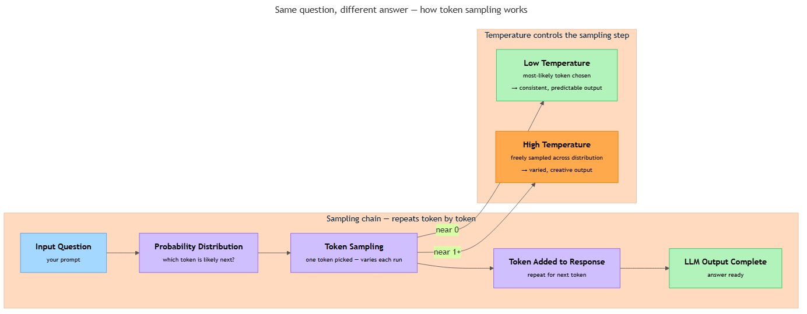

<!-- nav:top:start -->
[⬅ Previous: 1.3 — Probabilistic systems](../../1-3-probabilistic-systems-same-input-can-give-different-outputs/artifacts/reading.md)&emsp;·&emsp;[⬆ Table of Contents](../../../../../../../README.md#curriculum-topic-index)&emsp;·&emsp;[Next: 1.5 — Decomposition ➡](../../../2-problem-solving-foundations/1-5-decomposition-breaking-a-big-problem-into-smaller-solvable-p/artifacts/reading.md)
<!-- nav:top:end -->

---

# Why AI gives different answers to the same question

## Overview

You have probably noticed this already: you ask an AI assistant a question, get a confident and helpful answer, ask the exact same question an hour later, and get a completely different one. Both answers are reasonable — but they are not the same. A calculator or a spreadsheet would give you the identical result every single time. So what makes an AI different? The answer is that AI language tools are **probabilistic systems** — the same category you met in Topic 1.3. Understanding exactly how that works will help you use AI tools more effectively, ask better questions, and know when to trust a single answer and when to check further [1][3].

## Key Concepts

### How an AI builds its answer — one piece at a time

Think about typing a text message. After you write "I'll see you," your phone suggests "tomorrow," "there," or "soon." You pick one and the phone immediately suggests the next word. An AI language tool works in exactly the same way, but at a far larger scale [1].

The technology behind tools like ChatGPT and Gemini is called an **LLM (Large Language Model)**. When you type a question, an LLM does not look up a stored answer. It builds a response from scratch, one small piece at a time.

Each piece is called a **token** — a chunk of text roughly the size of one word. Short common words are usually one token each; longer or unusual words may be split into two or three. The LLM reads all the tokens in your question, then predicts: *which token should come next?* It picks one, adds it to the response, then predicts the next one. This repeats until the answer is complete [1][2].

The picking step has a name: **token sampling** — reaching into a set of possible next tokens and drawing one out. You saw "sampling" in Topic 1.3 as drawing from a bag of possible outcomes. Here, the bag is the set of possible next words, and every draw is a sampling step [1].

### The probability distribution — which tokens are more likely

When the LLM decides which token to pick next, it does not treat every word as equally likely. It assigns each possible next token a number expressing how likely it is — given everything you have typed so far.

These numbers together form a **probability distribution** — a complete map of which tokens are more likely and which are less likely at this exact moment in the response [1][2].

**Probability distribution** — a list of possible outcomes, each paired with a number showing how likely that outcome is. All the numbers add up to 100%. Higher means more likely; lower means less likely.

A concrete example: the LLM is completing the phrase "The cat sat on the ___." The distribution might look like this:

| Next token | Approximate likelihood |
|---|---|
| "mat" | 55% |
| "floor" | 20% |
| "chair" | 12% |
| "roof" | 8% |
| everything else | 5% |

On one run the model might pick "mat." On another it might pick "floor." On a third, "chair." The input shapes which tokens are likely — but it does not force a single answer. That is exactly the structure of a probabilistic system from Topic 1.3 [1][2].

### The token-by-token sampling chain

The diagram below shows the full process from your question to the completed AI response.

*The token sampling chain: input shapes the probability distribution, the model samples one token, that token is added to the response, and the cycle repeats — with a side panel contrasting how low and high temperature change which tokens get chosen.*

Here is the same chain as a numbered sequence [1][2][3]:

1. You type a question. That is the input.
2. The LLM builds a probability distribution over possible next tokens.
3. The model samples one token from that distribution — probabilistic, not fixed.
4. The token is added to the response.
5. The model builds a new distribution for the next token, given everything so far.
6. Steps 3–5 repeat until the response is complete.

Because every sampling step is probabilistic, the specific sequence of tokens can differ between runs — even with the same input. This is why you get a different answer. It is not a bug. It is not the AI forgetting. It is designed behaviour [1][3].

### Temperature — how freely the model samples

You met **temperature** in Topic 1.3 as a control on how much randomness a probabilistic system uses. Here is what it means specifically for an LLM [1][2].

Imagine the probability distribution from the example above. Temperature changes how the model uses that distribution when it samples:

| Temperature | Effect on sampling | Output character |
|---|---|---|
| Low (near 0) | Picks the most-likely token almost every time | Consistent, predictable, less varied |
| Medium | Balances likelihood with variety | Moderate variation |
| High (near 1 or above) | Samples freely across the distribution | Varied, creative, less predictable |

A mental image: at low temperature, nearly every card in the bag says "mat" — drawing anything else is rare. At high temperature, the bag has a much more even mix of "mat," "floor," "chair," and "roof," so the draw is genuinely unpredictable [1][2].

One important point: **temperature does not change what answers are possible — it changes how likely the less-probable answers are to be chosen** [2].

## Worked Example

Here is what the token sampling chain looks like in practice, with a real-style question.

**Your prompt:** "Give me one tip for studying more effectively."

This is an open-ended question. Many good answers exist, so the LLM's probability distribution is wide — many tokens compete for high probability at each step.

**Run 1 — the model samples this path:**
"Try breaking your study session into 25-minute blocks with short breaks in between."

**Run 2 — the same question, different samples drawn at each step:**
"Test yourself on the material instead of just re-reading your notes — active recall is more effective."

**Run 3 — another draw:**
"Review your notes within 24 hours of the lecture, while the material is still fresh."

All three answers are good. None are wrong. They differ because each sampling step in each run drew a different token from the distribution. The input ("studying more effectively") shaped which tokens were likely — but it did not lock in a single response [1][3].

Now watch what happens when you narrow the prompt: "Give me exactly one study tip. Use a single sentence starting with the word 'Schedule'."

The new constraint pushes almost all the probability mass onto tokens that follow from "Schedule." The distribution becomes much narrower, and the three runs now produce much more similar answers. The variation shrinks — not because the system became deterministic, but because you reduced the range of likely next tokens [1][2].

## In Practice

Knowing how AI variation works changes how you use AI tools day to day.

**Where variation is a feature:**

- Creative writing, brainstorming, and idea generation — you want different outputs on different runs. A deterministic AI that always produced the same story outline would be far less useful [1][3].
- Exploring a problem space — asking the AI to suggest approaches gives you a range of options to choose from.
- AI tutoring — moderate temperature means the system explains the same concept in slightly different ways for different learners, which can improve understanding [3].

**Where variation is a drawback:**

- Technical tasks with a single correct answer — you need consistency and auditability [1][2].
- Customer service — contradictory answers on two calls creates distrust; these systems are often run at low temperature [2][3].
- High-stakes decisions (medical, legal, financial) — a different answer on a different day can matter [2].

**Practical rules to use starting now:**

- **Run the same prompt 2–3 times when a decision matters.** One AI answer is one sample. Multiple runs show you whether the answer is stable or variable [1][3].
- **Make your prompt more specific to reduce variation.** A precise, constrained question narrows the probability distribution. If you need a consistent answer, add constraints to your prompt — not just lower temperature [1][2].
- **Match temperature to your task.** Low for fact-finding and precision; high for brainstorming and creativity. When your AI tool exposes a temperature slider, use it deliberately [1][2].
- **Do not treat one AI answer as the answer.** The output is a sample, not a guaranteed correct value. Verify it, especially for important decisions [2][3].
- **If you and a colleague get different answers to the same question, variation is the most likely explanation** — not an error. Compare prompts and run them multiple times before concluding anything is wrong [1][3].

## Key Takeaways

- **AI language tools are probabilistic systems.** The same question can produce different answers because the model samples from a probability distribution of possible next tokens — and that sampling varies [1][2].
- **Token sampling is the mechanism.** The AI builds its answer one token at a time, picking each next token from a distribution shaped by your input. Every pick is probabilistic, not fixed [1].
- **Temperature controls how freely the model samples.** Low temperature gives consistent, predictable output. High temperature gives varied, creative output. The right setting depends on the task [1][2].
- **Variation is not a malfunction — it is a design choice.** Knowing this lets you use AI tools more deliberately: run a prompt multiple times when it matters, write more specific prompts to reduce unwanted variation, and know when to verify a single AI response [1][2][3].
- **Probabilistic does not mean arbitrary.** Your input still shapes which tokens are likely. A more specific prompt produces a narrower, more consistent distribution [1][2].

## References

1. Kalliokosky, S. "Why Large Language Models Give Different Answers Even with the Same Input." *Medium*. <https://medium.com/@samikalliokoski/why-large-language-models-give-different-answers-even-with-the-same-input-2e44c7582626>
2. Ragyfied. "What is LLM Temperature?" <https://ragyfied.com/articles/what-is-llm-temperature>
3. Fesco, T. "Why Do AI Models Give Different Answers to the Same Question?" *Medium*. <https://medium.com/@taofesco/why-do-ai-models-give-different-answers-to-the-same-question-0e64f0ffa64b>

---
<!-- nav:bottom:start -->
[⬅ Previous: 1.3 — Probabilistic systems](../../1-3-probabilistic-systems-same-input-can-give-different-outputs/artifacts/reading.md)&emsp;·&emsp;[⬆ Table of Contents](../../../../../../../README.md#curriculum-topic-index)&emsp;·&emsp;[Next: 1.5 — Decomposition ➡](../../../2-problem-solving-foundations/1-5-decomposition-breaking-a-big-problem-into-smaller-solvable-p/artifacts/reading.md)
<!-- nav:bottom:end -->
