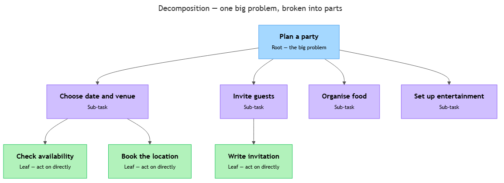

<!-- nav:top:start -->
[⬅ Previous: 1.4 — Why AI gives different answers to the same question](../../../1-understanding-computation/1-4-why-ai-gives-different-answers-to-the-same-question/artifacts/reading.md)&emsp;·&emsp;[⬆ Table of Contents](../../../../../../../README.md#curriculum-topic-index)&emsp;·&emsp;[Next: 1.6 — Abstraction ➡](../../1-6-abstraction-hiding-complexity-at-the-right-level/artifacts/reading.md)
<!-- nav:top:end -->

---

# Decomposition — breaking a big problem into smaller solvable parts

## Overview

When you are asked to "plan a party," those three words hide dozens of decisions and actions. Trying to think about all of them at once feels overwhelming — and a computer program faces an even bigger obstacle, because it cannot act on a vague instruction at all. Decomposition is the strategy of breaking a large, complex problem into smaller, focused, manageable parts so that each part can be solved on its own [1]. It is one of the four pillars of computational thinking, the problem-solving style you were introduced to in Topic 1.1 — and it is the bridge between a human idea and a set of defined steps a computer can follow.

## Key Concepts

### What decomposition means

**Decomposition** — breaking a large problem into smaller parts that are easier to understand, plan, and solve [1]. When every smaller part is completed, the original problem is solved. Each smaller part should be:

- **Focused** — it deals with one clear thing, not everything at once.
- **Manageable** — a person or program can work on it without holding the entire original problem in mind.
- **Completable** — when all parts are done, the big problem is fully solved.

### Why big problems are hard without decomposition

Think about trying to read every word on every page of a textbook at the same time — you cannot. You read one page, then the next. That is natural decomposition. Complex problems are hard for similar reasons [1][2]:

- Too many things to keep in mind at once.
- No clear starting point.
- One part becomes tangled with another.
- Errors spread, and tracing them back is difficult.

When you break a problem into parts, each part is small enough to focus on, you have a natural starting point, and if something goes wrong you know which part caused it [2][3].

### The task tree — showing decomposition visually

When you decompose a problem, the result is often drawn as a **task tree** — a diagram that looks like an upside-down tree [1]. The original problem sits at the top. Below it, the first level of smaller pieces branches out. Each piece can branch further until every item at the bottom is concrete and doable.

*Figure: A task tree for 'Plan a party'. Each level breaks the problem into smaller parts until every item at the bottom is concrete and doable.*

The terms used to describe a task tree are [1][2]:

| Term | Plain meaning |
|---|---|
| **Root** | The original, big problem at the top of the tree |
| **Sub-task** | A smaller part that the root or a higher-level task breaks into |
| **Leaf** | A task at the bottom with no further breakdown — something you can act on directly |
| **Level** | One row of the tree; tasks at the same level are roughly the same size |

### What makes a good decomposition

Not every breakdown of a problem is useful. A good decomposition [1][2][3]:

- **Covers everything.** No part of the original problem is left out. Completing every leaf task solves the whole problem.
- **Has no significant overlap.** Two sub-tasks should not both try to do the same thing.
- **Produces parts that are the right size.** Parts still too big need further breakdown; parts so tiny they are trivial probably do not need their own entry.
- **Makes dependencies visible.** Some parts must be done before others can start (you cannot write invitations before knowing the date).

A poor decomposition leaves gaps, uses vague sub-tasks that are barely clearer than the original problem, groups unrelated things together, or ignores the order in which parts depend on each other [2].

### Decomposition is iterative

**Iterative** means you do something, review the result, adjust, and repeat. You will rarely get a decomposition right on the first try — that is normal and expected [1][2]. Each pass, you ask whether each sub-task is clear enough to act on. If not, you break it down further. Even experienced engineers revise their decomposition as they learn more about a problem [1][3].

### Why computers need decomposition

You saw in Topic 1.1 that computation requires defined steps. A program cannot act on "plan a party" — it needs every step to be precise and unambiguous. Decomposition is the thinking work that produces those steps before any code is written [1][2]. This is why decomposition is taught before programming: if you cannot describe a problem in small, clear pieces, you cannot write a program to solve it.

## Worked Example

**Problem: "Build a simple website for a local library."** [2]

Follow these six steps:

1. **Write the problem in one sentence.**
   > Build a simple website for a local library.

2. **List the two to five major parts.**
   - Decide what the website needs to do
   - Design the layout and look
   - Write the content (text and images)
   - Build the site technically
   - Test and publish the site

3. **Check each part — is it small enough to act on directly?**
   "Decide what the website needs to do" is still large. Break it further:
   - Talk to library staff about what they need
   - List the features the site must have
   - Decide what the site will NOT include

4. **Check for completeness.** Does completing all parts result in a published, working library website? Yes [1].

5. **Check for overlap.** "Write the content" and "Design the layout" might overlap on images. Clarify: design handles placement; content writing handles what text and which images to use [2].

6. **Order the tasks.** "Decide what the website needs to do" must happen first. "Test and publish" must happen last. The others can proceed in parallel [1].

You now have a decomposed plan you could hand to a team — or use as the structure for a program [1][2].

## In Practice

Decomposition appears across many fields, not just software [3]:

- **Software development.** Projects are broken into features, features into user stories, user stories into tasks — the entire practice of software project management is applied decomposition [1][2].
- **Recipes.** "Make a chocolate cake" becomes: make the batter, bake it, make the frosting, assemble. Each step at the bottom is a concrete, doable action [3].
- **Medical procedures.** A complex operation is staged: anaesthesia, incision, repair, closure, recovery plan — each with its own specialist and checklist [2][3].
- **AI system design.** Engineers decompose an AI build into: data collection, cleaning, training, evaluation, deployment, monitoring. The final system is the result of completing every part [1][3].

**Best practices to remember:**

- Start with the problem statement, not the solution — a vague problem gives a vague decomposition [1].
- Stop decomposing when a task is concrete and doable; over-decomposing adds noise without clarity [2][3].
- Name tasks with verbs: "Choose a venue," not "Venue" — verb-first naming makes it clear what must be done [2].
- Make dependencies explicit so you can avoid bottlenecks [1][3].
- Revisit and revise as you learn more about a problem; decomposition is a working document, not a contract [1].

## Key Takeaways

- **Decomposition is the strategy of breaking a large problem into smaller parts.** Each part is focused, manageable, and solvable on its own — completing all the parts solves the original problem [1][2].
- **Task trees make decomposition visible.** The original problem sits at the root; sub-tasks branch below it; leaf tasks at the bottom are concrete enough to act on directly [1][3].
- **A good decomposition covers everything, avoids overlap, and makes dependencies clear.** A poor decomposition leaves gaps, uses vague sub-tasks, or ignores order [2].
- **Decomposition is iterative.** Refining it as you learn more is normal and expected [1][2].
- **Computers require defined steps.** Decomposition is the thinking work that produces those steps before any program is written [1].

## References

1. OpenStax. *Introduction to Computer Science*, Section 2.1 — Computational Thinking. https://openstax.org/books/introduction-computer-science/pages/2-1-computational-thinking
2. GeeksforGeeks. *What is Decomposition in Computational Thinking?* https://www.geeksforgeeks.org/computer-science-fundamentals/what-is-decomposition-computational-thinking/
3. Learning.com. *Decomposition in Computational Thinking.* https://www.learning.com/blog/decomposition-in-computational-thinking/

---
<!-- nav:bottom:start -->
[⬅ Previous: 1.4 — Why AI gives different answers to the same question](../../../1-understanding-computation/1-4-why-ai-gives-different-answers-to-the-same-question/artifacts/reading.md)&emsp;·&emsp;[⬆ Table of Contents](../../../../../../../README.md#curriculum-topic-index)&emsp;·&emsp;[Next: 1.6 — Abstraction ➡](../../1-6-abstraction-hiding-complexity-at-the-right-level/artifacts/reading.md)
<!-- nav:bottom:end -->
