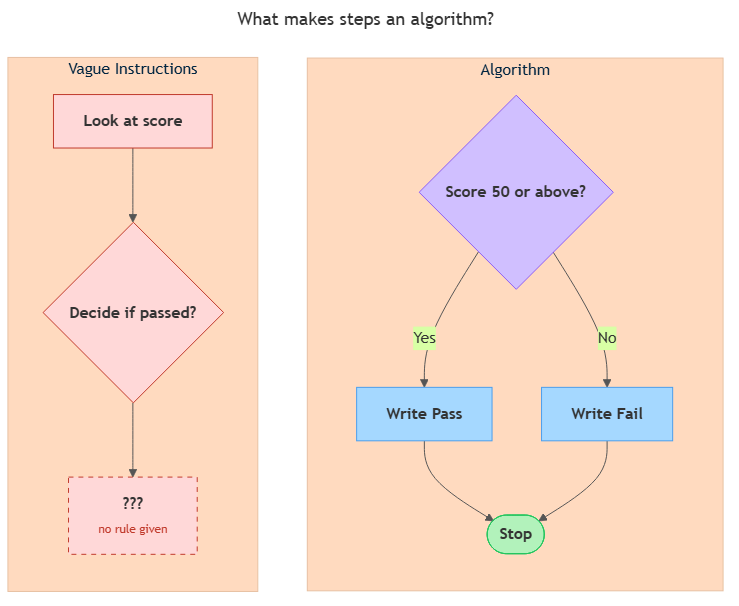

<!-- nav:top:start -->
[⬅ Previous: 1.8 — Flowcharts](../../../3-expressing-logic/1-8-flowcharts-visualising-logic-with-standard-shapes-and-arrows/artifacts/reading.md)&emsp;·&emsp;[⬆ Table of Contents](../../../../../../../README.md#curriculum-topic-index)&emsp;·&emsp;[Next: 1.10 — Algorithms in everyday life ➡](../../1-10-algorithms-in-everyday-life-recipes-gps-routes-sorting-queue/artifacts/reading.md)
<!-- nav:top:end -->

---

# Algorithmic thinking — what makes a set of steps an algorithm

## Overview

You have already seen how to break a problem apart (decomposition), sketch a solution in plain English (pseudocode), and draw it as a flowchart. But not every list of steps is actually an algorithm. A recipe a human can muddle through — filling gaps with common sense — is not the same as a set of instructions a machine can follow without any guessing. Computers cannot fill in gaps. This reading explains what turns an ordinary list of steps into a true algorithm, and how the habit of thinking in algorithms makes you a sharper problem-solver long before you write a single line of code.

## Key Concepts

### What is an algorithm?

An **algorithm** is a finite, unambiguous sequence of steps that takes defined inputs, processes them, and always produces a result [1]. Every word in that definition matters:

- **Finite** — the steps end. They do not run forever.
- **Unambiguous** — each step has exactly one meaning. No step can be interpreted two different ways.
- **Defined inputs** — you know exactly what you are starting with.
- **Result** — you get a clear output you can inspect.

A cooking timer fits the definition: set it to 20 minutes, press start, the timer counts down, it beeps. Every run of those steps produces the same outcome. A note saying "cook until it smells right" does not — "smells right" means something different to every person who reads it.

### Instructions vs. algorithm — three ways a list of steps can fail

Most informal instructions fail as algorithms for one of three reasons [1]:

| Failure mode | What goes wrong | Example |
|---|---|---|
| **Missing steps** | A step the human fills in automatically is never written down | "Make tea" — steeping time is never mentioned |
| **Vague steps** | A step uses a word that has no single fixed meaning | "Add sugar to taste" — how much exactly? |
| **Wrong order** | Steps are listed out of sequence | "Boil the water after adding the tea bag" — the bag goes in cold water |

Any one of these three failures breaks a machine. Humans patch missing or vague steps with experience; machines cannot.

### Why vagueness breaks computation

Consider an instruction that says only "Do the right thing." A machine following this encounters the phrase and has no path forward. It might:

- halt and report an error,
- pick an arbitrary action and continue, or
- loop forever looking for more information.

None of those is the outcome you wanted. This is why **determinism** — the property you met in topic 1.2 — matters so much to algorithms. A deterministic process given the same input always produces the same output. Vague steps destroy determinism: two machines (or two runs of the same machine) hit "do the right thing" and produce different results. Edge cases — unusual but valid inputs — expose vagueness fastest, because they fall outside the normal scenario a human writer had in mind [2].

### The three properties every algorithm must have

An algorithm that works must be:

1. **Unambiguous** — every step has one and only one interpretation.
2. **Finite** — there is a stopping point; the process terminates.
3. **Result-producing** — the process delivers an observable output.

### What does "algorithmic thinking" mean?

**Algorithmic thinking** is the habit of writing steps precisely enough that even a machine — which has no common sense — could follow them. It is not a programming skill and it is not mathematics [1]. It is a mindset with four qualities:

- **Precise** — each step says exactly what to do, not roughly what to do.
- **Complete** — no step is missing; nothing is left for the reader to fill in.
- **Ordered** — steps are listed in the sequence they must happen.
- **Decisive** — when there is a choice to make, the rule for making it is written down.

### Version A vs. Version B — the diagram

The diagram below shows why these qualities matter in practice. On the left, a student exam pass/fail check written as a vague two-step instruction (Version A). On the right, the same check rewritten as a four-step algorithm with an explicit decision rule (Version B).

*Left: vague Version A instructions a human can interpret but a machine cannot follow. Right: Version B algorithm with an explicit score ≥ 50 decision rule that leaves no room for guessing.*

Notice that Version A says "check the result" without defining what counts as a pass. Version B states the rule — score ≥ 50 — so there is nothing left to interpret.

## Worked Example

The six-step mental checklist for turning a vague procedure into an algorithm:

1. Write down every step you can think of.
2. Check for missing steps — would a machine know what to do at every point?
3. Replace every vague word with a precise rule.
4. Put the steps in the order they must happen.
5. Add a decision rule for every fork — "if X, then Y; otherwise Z."
6. Confirm the process has a clear end and produces a result.

Here is that checklist applied to a library late-fee calculation — a domain the coffee and oven examples have not already covered.

| | Version A (informal) | Version B (algorithm) |
|---|---|---|
| **Step 1** | Look up the book | Receive the book's return date and today's date as inputs |
| **Step 2** | See if it's late | Calculate days overdue: today's date minus return date |
| **Step 3** | Charge a fee if needed | If days overdue > 0, multiply days overdue by the daily rate (£0.10) |
| **Step 4** | — *(missing)* | If days overdue ≤ 0, set fee to £0.00 |
| **Step 5** | — *(missing)* | Output the fee amount |
| **End** | Done | Stop |

Version A fails checklist items 2 (missing steps 4 and 5), 3 ("if needed" is vague — what counts as needed?), and 5 (no decision rule with a number). Version B passes all six checks: every step is written down, "overdue" is defined as a specific number of days, the fee rule uses a fixed rate, and there is a clear output and stop point [1].

## In Practice

Algorithmic thinking is not something that only matters when you sit down to code. It shows up any time a process must run the same way every time, regardless of who or what is running it.

**Medical protocols** — A hospital checklist for administering medication lists exact drug name, exact dose, exact time, and the patient's weight threshold. Nothing is left to "clinical judgment" mid-step; the judgment is built into the rule beforehand. Ambiguity in a medical protocol is a patient-safety risk. The same logic that makes an algorithm safe for a machine makes a protocol safe in a high-stakes human setting [2].

**GPS navigation** — When a GPS calculates a route, it runs an algorithm that checks every possible path, assigns a cost to each (distance, traffic, road type), and selects the lowest-cost path. The decision rule — compare costs, pick minimum — is explicit and repeatable. Every time you enter the same start and end address under the same traffic conditions, you get the same route. That reproducibility is only possible because the algorithm has no vague steps [3].

Both examples share the same pattern: a precise decision rule written in advance, applied consistently, producing a verifiable result.

## Key Takeaways

- An **algorithm** is a finite, unambiguous sequence of steps with defined inputs that always produces a result — not every list of instructions meets this bar.
- The three failure modes that prevent instructions from being algorithms are missing steps, vague steps, and wrong order.
- **Algorithmic thinking** is the habit of writing steps precisely, completely, in order, and with explicit decision rules — it is a mindset, not a programming skill.
- Vagueness destroys determinism: a step that can be interpreted two ways will produce two different outcomes, making the process unreliable.
- The six-step mental checklist — write, check for gaps, remove vague words, order correctly, add decision rules, confirm termination — turns any informal procedure into a true algorithm.

## References

[1] Bouras, A. S. (n.d.). *Properties of an Algorithm*. Retrieved from https://www.bouraspage.com/repository/algorithmic-thinking/properties-of-an-algorithm

[2] Wikipedia contributors. (n.d.). *Algorithm characterizations*. Wikipedia. https://en.wikipedia.org/wiki/Algorithm_characterizations

[3] Purdue CS182 course notes. (n.d.). *Algorithms and Growth of Functions*. https://www.cs.purdue.edu/homes/spa/courses/cs182/algorithms-rego.pdf

---
<!-- nav:bottom:start -->
[⬅ Previous: 1.8 — Flowcharts](../../../3-expressing-logic/1-8-flowcharts-visualising-logic-with-standard-shapes-and-arrows/artifacts/reading.md)&emsp;·&emsp;[⬆ Table of Contents](../../../../../../../README.md#curriculum-topic-index)&emsp;·&emsp;[Next: 1.10 — Algorithms in everyday life ➡](../../1-10-algorithms-in-everyday-life-recipes-gps-routes-sorting-queue/artifacts/reading.md)
<!-- nav:bottom:end -->
