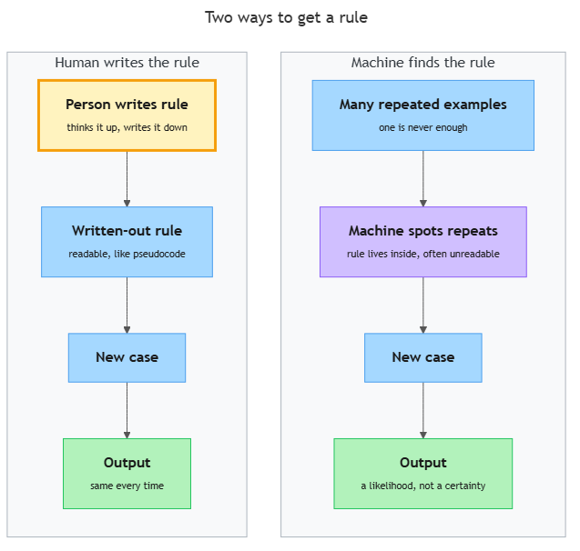

<!-- nav:top:start -->
[⬅ Previous: 2.3 — How to identify the inputs, expected outputs, and failure conditions of a task](../../../1-what-makes-a-good-specification/2-3-how-to-identify-the-inputs-expected-outputs-and-failure-cond/artifacts/reading.md)&emsp;·&emsp;[⬆ Table of Contents](../../../../../../../README.md#curriculum-topic-index)&emsp;·&emsp;[Next: 2.5 — The 70/30 rule ➡](../../../3-the-professional-rules-of-ai-use/2-5-the-70-30-rule-ai-implements-you-specify-and-verify/artifacts/reading.md)
<!-- nav:top:end -->

---

# Pattern recognition — how machines find rules in repeated data

## Overview

You already know that pattern recognition means finding regularities — noticing that something keeps happening the same way. In Week 1 the example was a human looking at many images of cats and noticing what makes a cat a cat. Now ask a harder question: how does a *machine* do the same thing, without a human hand-coding every rule? The answer is that it studies thousands of repeated examples and extracts the rules itself — a process called training. Understanding how that works matters right now, because an AI system that learns from examples gives you a different kind of output than a calculator does, and writing a good specification for it requires you to understand exactly what kind of output to expect [1].

## Key Concepts

### 1. Two ways to get a rule: rule-based vs pattern-recognition systems

Before AI, programmers handled decisions by writing rules by hand. A **rule-based system** — also called an expert system — is a program where a human expert writes every decision as an explicit IF/THEN instruction [3].

Here is a hand-written rule for a spam filter:

> IF the email contains the word "lottery" AND the sender is unknown → mark as spam.

This works well until spammers start spelling it "l0ttery". Nobody updated the rule, so it fails immediately. Writing complete rules for a complex real-world problem turns out to be extremely hard [1].

A **pattern-recognition system** takes a completely different approach. Instead of hand-writing rules, you show the system thousands of examples. The machine studies those examples and figures out the rules itself. The rules are not written by a human — they are *discovered* from data [1][3].

The diagram below shows this contrast side by side.

*On the left, a human writes the rule and the output is always the same. On the right, the machine finds the rule from many repeated examples and the output is a likelihood, not a certainty.*

Here is a summary of the key differences:

| | Rule-based system | Pattern-recognition system |
|---|---|---|
| Who writes the rules? | A human programmer | The machine, from examples |
| What if the world changes? | A human must update the rules | The system can be retrained on new data |
| Can it handle messy real-world inputs? | Only what the rules cover | Yes — it generalises from what it has seen |
| Type of output | Deterministic (same input → same answer, always) | Probabilistic (same input → a confidence score) |

**Deterministic** means the system always produces exactly the same output for the same input — no uncertainty. A calculator is deterministic: 6 × 7 is always 42 [3].

**Probabilistic** means the system produces a confidence score rather than a guaranteed answer. The machine might say internally: "I am 87% confident this email is spam." That is a fundamentally different kind of output, and it changes the way you must write specifications [3].

### 2. How machines learn: training on labeled data

The process by which a machine learns rules from examples is called **training** [2].

Training needs two things:

1. **Examples** — a large collection of inputs, usually called the **training data** or **dataset**. For a spam filter, this is a large collection of emails.
2. **Labels** — the correct answer for each example, provided by a human in advance.

A **label** is the tag that tells the machine what an example actually is [2]. Every email in the training dataset is labeled either "spam" or "not spam". Every image of a handwritten digit is labeled "0", "1", "2", up to "9".

The machine studies the labeled examples over and over. This repetition is the "repeated data" in the topic title. Each time it looks at an example, it adjusts its internal understanding to fit what the label says. After enough examples, the machine has built up a set of internal rules that generally match the labels it was shown [2].

Here is the key insight: the machine was never *told* "spam emails tend to mention money". It discovered a version of that rule itself, by observing thousands of examples where money-related words and the label "spam" appeared together.

### 3. Features: what the machine actually looks at

A machine cannot look at a raw email or image the way you do. It needs the information broken into measurable pieces. A **feature** is one measurable property of an input that the machine can examine [1][2].

Examples of features for different kinds of inputs:

- **For an email:** the number of times the word "free" appears; the sender's domain; whether the email contains a link.
- **For a photo:** the brightness of each pixel; whether a horizontal edge appears at a certain location.
- **For a bank transaction:** the amount in dollars; the hour of day; the country the transaction was made in.

The machine looks at many features at once and learns which features tend to predict which label [1]. Features that consistently appear with a particular label get weighted more heavily. Features that appear randomly get weighted less. The system of weights the machine builds up is what we informally call the rules it has learned.

Choosing which features to measure is an important design decision made *before* training begins. This step is called **feature extraction** [2]. Measuring things that do not matter — or leaving out things that do — makes the learned rules unreliable.

### 4. Classification: assigning a new input to a category

Once the machine has trained on labeled examples, it can look at a *new* example it has never seen before and decide which label fits best. This decision is called **classification** [1][2].

**Classification** — deciding which category a new input belongs to, based on the rules the machine learned during training.

For example: after training on 50,000 labeled emails, the machine sees a brand-new email. It measures the features, applies the learned rules, and outputs a classification: "spam" or "not spam".

Not every classification task is binary (two categories). A digit-recognition system classifies into 10 categories (0–9). A product-recommendation system might classify customer interests into hundreds of categories [1][3].

The key point is that classification is always a comparison against patterns the machine has seen before. It cannot handle situations that are completely unlike anything in its training data. This is one reason why the quality and coverage of training data matters so much [2].

### 5. Why outputs are probabilistic — and why this changes how you write specifications

This is the most important concept in this topic.

Because the machine is generalising from examples it has seen to inputs it has *not* seen before, there will always be cases where the learned rules are ambiguous. A new email might have features that sit somewhere between "spam" and "not spam". The machine cannot be 100% certain — so it reports a confidence score instead.

When a spam filter says "spam", what it means internally is: "I am 87% confident this is spam." If the threshold is set at 80%, it marks the email as spam. Another email might score 52% — it could go either way [3].

This is not a flaw. It is an honest reflection of how learning from data works: the machine is matching inputs to patterns, not solving equations. Uncertainty is inherent [1][2].

Now consider what this means when you write a specification. A specification that works fine for a calculator breaks badly when applied to a pattern-recognition system:

| Type of specification | Works for a calculator? | Works for a pattern-recognition system? |
|---|---|---|
| "Output must always be exactly 42 when input is 6 × 7" | Yes | No — probabilistic outputs cannot be guaranteed |
| "System must always classify this email correctly" | N/A | No — "correctly" against what ground truth? |
| "System must classify spam with precision of at least 90% on a labeled validation set of 1,000 emails" | N/A | Yes — testable, bounded, accounts for uncertainty |

A **validation set** is a separate batch of examples (in this case emails) not used during training — it is set aside specifically to test how well the trained model performs on data it has never seen. Naming the validation set in a specification is what makes the performance claim testable [2].

The second row in the table above fails the testable-and-bounded test from topic 2.1. The third row passes it. The only difference is acknowledging that AI outputs are probabilistic and specifying the exact conditions under which the performance claim holds.

### 6. The training–deployment gap

One practical consequence of probabilistic outputs is that a machine trained on past data may perform differently on future data. If the pattern of spam emails changes after training — spammers adopt new tactics, new keywords — the machine's learned rules become less accurate over time. This is called **model drift** and is covered in a later module [2][3].

For now, the key point is: a specification for an AI system should always state *when* and *on what test data* a performance claim applies. "Achieves 95% accuracy" means very little without specifying the test set and the date it was measured.

## Worked Example

Here is how the pattern-recognition pipeline works end to end, using a spam filter as the running example. The five steps below are the same steps every pattern-recognition system follows.

**Step 1 — Collect examples.**
A team gathers 100,000 emails from real inboxes. The larger the collection and the more it represents the real world, the better the eventual rules will be [2].

**Step 2 — Label the examples.**
Human reviewers read each email and tag it: "spam" or "not spam". This is slow and expensive work. It is also the most common source of errors — if a reviewer mislabels an email, the machine learns from the mistake [2].

**Step 3 — Extract features.**
The team decides which measurable properties to give the machine. For each email they extract: the count of money-related words; the sender domain; whether the email has an unsubscribe link; the time it was sent; the presence of misspellings. Each email is now represented as a row of numbers, not as raw text [1][2].

**Step 4 — Train the model.**
The machine is shown the labeled, feature-extracted rows thousands of times. After each pass, it adjusts its internal weights to fit the labels better. After enough passes, it can classify the training emails with high accuracy [2].

**Step 5 — Classify new inputs.**
The trained model is put into production. A new email arrives. The system extracts its features, applies the learned weights, and outputs a classification — "spam (confidence: 91%)" or "not spam (confidence: 73%)" — along with a confidence score [1][2][3].

When you write a specification for an AI task, you are almost always specifying the behaviour of Step 5. But Steps 1–4 affect whether Step 5 is reliable. A good specification acknowledges this by stating the conditions under which the performance claim holds.

**Putting it together — from worked example to specification.**

Here is how the spam-filter example translates into a well-formed specification that covers the probabilistic output:

> "The spam-detection model must classify emails as 'spam' or 'not spam' with a precision of at least 85%, measured on a held-out validation set of 1,000 labeled emails not used during training. If precision falls below 75% on a re-evaluation run, flagged emails must be routed to human review rather than automatic deletion."

Notice what this specification does:

- It names the output type (classification: spam or not spam).
- It sets a measurable threshold (85% precision), not a guarantee.
- It identifies the test conditions (1,000 held-out labeled emails).
- It provides a failure condition (below 75% → human review).

Every one of those four moves comes directly from understanding that the output is probabilistic, not deterministic.

## In Practice

Pattern recognition sits at the core of almost every AI product you already use [1][3]:

- **Email spam filters.** Train on labeled spam and non-spam, extract features (words, sender behaviour), classify new emails [3].
- **Face unlock on your phone.** Train on labeled images of your face, extract features (distances between facial landmarks), classify at unlock time: "this face matches" or "it does not" [1][2].
- **Fraud detection.** Banks train on labeled past transactions (fraud / not fraud) and watch for patterns in new transactions that resemble the fraud examples [3].
- **Voice assistants.** When you say "Hey Siri" or "OK Google", the device classifies your audio against a pattern it learned from thousands of recorded examples [1].
- **Medical diagnosis support.** A model trained on labeled medical images flags patterns that may indicate disease — with a confidence score for the doctor to review, not as a definitive answer [3].

In every case the structure is identical: labeled training data → features → learned rules → probabilistic classification on new inputs.

**When writing specifications for AI pattern-recognition systems, do this:**

- State the expected output as a rate or threshold, not a guarantee. Example: "The system must achieve spam-detection precision of at least 85%."
- Name the test dataset. Example: "…measured on a held-out validation set of 500 labeled emails not seen during training."
- Include a failure condition. Example: "If precision falls below 75%, the system must route flagged emails to human review rather than automatic deletion."
- State success criteria in observable, measurable terms. Example: "A batch of 100 manually labeled test emails is run; at least 85 of the 100 spam emails are correctly classified."

**Avoid these common mistakes:**

- "The system must always correctly identify spam." — Not testable for a probabilistic system.
- "The AI must be accurate." — "Accurate" is undefined. Accurate to what level? On what data?
- "The system must never make a mistake." — Impossible to guarantee for any pattern-recognition system.

**Short-answer practice.** After reading this topic, try answering these questions in your own words (two to three sentences each):

1. What is the difference between a rule-based system and a pattern-recognition system? Where do the rules come from in each case?
2. A classmate writes this specification: "The face-recognition system must always correctly identify the user." Identify one specific problem with this specification and rewrite it as a testable, bounded alternative.
3. Explain why labeling errors in Step 2 of the pipeline are a bigger concern than errors in Step 4.

## Key Takeaways

- A pattern-recognition system discovers rules from labeled examples; a rule-based system has rules written in by a human. The key difference is where the rules come from.
- Training means showing a machine thousands of labeled examples repeatedly so it can build its own internal rules. Features are the measurable properties the machine uses to learn.
- Classification is the machine's output: assigning a new input to the category whose learned pattern it most closely matches.
- Pattern-recognition systems give probabilistic outputs — a confidence score, not a guarantee. This is not a bug; it is how learning from data works.
- Because outputs are probabilistic, specifications for AI systems must state performance thresholds, test conditions, and fallback behaviours — not absolute guarantees.

## References

1. SAM Solutions, "Pattern Recognition in AI: A Comprehensive Guide." <https://sam-solutions.com/blog/pattern-recognition-in-ai/>
2. Viso.ai, "Mastering AI: Pattern Recognition Techniques." <https://viso.ai/deep-learning/pattern-recognition/>
3. Saiwa.ai, "AI for Pattern Recognition — Revolutionizing Data Analysis." <https://saiwa.ai/blog/ai-for-pattern-recognition/>

---
<!-- nav:bottom:start -->
[⬅ Previous: 2.3 — How to identify the inputs, expected outputs, and failure conditions of a task](../../../1-what-makes-a-good-specification/2-3-how-to-identify-the-inputs-expected-outputs-and-failure-cond/artifacts/reading.md)&emsp;·&emsp;[⬆ Table of Contents](../../../../../../../README.md#curriculum-topic-index)&emsp;·&emsp;[Next: 2.5 — The 70/30 rule ➡](../../../3-the-professional-rules-of-ai-use/2-5-the-70-30-rule-ai-implements-you-specify-and-verify/artifacts/reading.md)
<!-- nav:bottom:end -->
