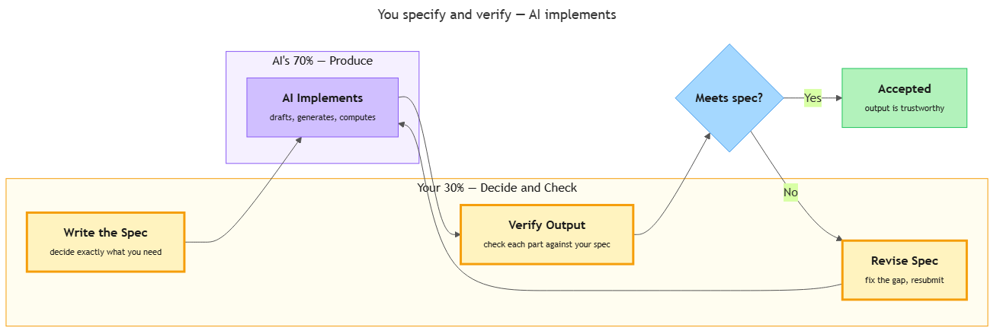

<!-- nav:top:start -->
[⬅ Previous: 2.4 — Pattern recognition](../../../2-how-machines-recognise-patterns/2-4-pattern-recognition-how-machines-find-rules-in-repeated-data/artifacts/reading.md)&emsp;·&emsp;[⬆ Table of Contents](../../../../../../../README.md#curriculum-topic-index)&emsp;·&emsp;[Next: 2.6 — When NOT to use AI ➡](../../2-6-when-not-to-use-ai-privacy-precision-legal-accountability/artifacts/reading.md)
<!-- nav:top:end -->

---

# The 70/30 rule — AI implements, you specify and verify

## Overview

When you work with an AI tool, the work does not split evenly. Roughly 70 percent of an AI-assisted task is implementation — producing the draft, running the calculation, generating the summary. AI does that part. The remaining 30 percent is specification and verification — deciding exactly what you need and then checking that you got it. That part belongs to you [1]. This split matters because speed is not the same as correctness: an AI can produce a polished-looking output in seconds that still fails to meet your actual requirements. Understanding this division of responsibility is what separates a reliable AI workflow from a lucky one [2].

## Key Concepts

### What the 70/30 rule says

The **70/30 rule** is a professional guideline for working with AI tools [1]. It divides every AI-assisted task into two parts:

- **The 70 percent — implementation.** This is where output is actually produced: text is drafted, data is sorted, information is retrieved. AI handles this part. It is fast, consistent, and tireless at generating content at scale.
- **The 30 percent — specification and verification.** This is where a human decides what the task is, sets the quality bar, sends the instruction, and then checks the result. You handle this part.

The name "70/30" is a label, not an exact measurement. Some tasks split 80/20; others 60/40. The exact numbers are not the point. The principle is: **AI does the bulk of the producing; the human does all of the deciding and checking** [2].

This pattern holds whether you are using AI to draft an email, summarise a document, generate a quiz question, or analyse a dataset. In every case: you specify, AI implements, you verify.

---

### Your role 1 — Specify

**Specification** — deciding exactly what you need before you prompt the AI — is the first human role in the rule [1].

You already know from Topics 2.1 and 2.3 what a good specification contains: it is testable, bounded, observable, and actionable, and it names inputs, expected outputs, and failure conditions. In the context of the 70/30 rule, the key insight is this: **the quality of the AI's output is almost entirely determined by the quality of your specification**. A vague instruction produces a vague result. A precise instruction gives the AI a clear target [2].

Specifying well means four things, in order:

1. **Decide what you actually need.** Not "have AI help me with the report" — but "summarise the key financial findings from pages 4–9 in five bullet points, each under 30 words, for a non-specialist reader."
2. **Set the constraints.** What format? What length? What should be excluded?
3. **Define the success condition.** What does a correct output look like? This is testability from Topic 2.1 applied directly to AI work.
4. **Write it down.** A specification in your head is not a specification. It cannot be checked, shared, or improved.

When you complete these four steps before opening the AI tool, you have done the first half of your 30 percent [3].

---

### Your role 2 — Verify

**Verification** — checking whether the AI's output actually meets your specification — is the second human role [1].

This step is not optional. Here is why: AI systems are probabilistic (from Topic 1.3). They produce outputs that are statistically likely to match the patterns they were trained on — not outputs guaranteed to match your specific requirements. An output can look polished and confident while still being wrong for your purpose [2].

**Verification is not the same as reading the output.** Reading is passive — your eye moves over the text. Verification is active — you check each part of the output against each part of your specification.

Here is what verification looks like in practice:

1. **Check against your success condition.** Did the output meet the testable criterion you set? Count the bullet points. Measure the word count. Confirm the format.
2. **Check scope.** Is everything that should be included, present? Is everything that should be excluded, absent?
3. **Check factual accuracy.** AI can state incorrect facts with total confidence. If your task involves names, dates, figures, or references — check them against a reliable source.
4. **Check for failure conditions.** In Topic 2.3 you learned to define failure conditions in advance. Now is when you look for them in the actual output.
5. **Decide: accept, revise the output, or revise the specification.** If the output is wrong because the AI made an error, ask for a correction. If the output is wrong because your specification had a gap, fix the specification and resubmit. Either way, this is still your 30 percent [3].

---

### Why the split matters

Why does it matter who does which part? The answer comes down to what AI is good at — and what it is not good at.

**What AI is good at:**

- Producing large amounts of text quickly.
- Following an explicit format.
- Retrieving and recombining information from patterns it was trained on.
- Being consistent across many repetitions of the same task.

**What AI is not good at:**

- Knowing what you actually need (it cannot read your mind).
- Knowing your audience, your standards, or your context (those are not in the training data).
- Guaranteeing factual accuracy (it generates statistically likely text, not verified facts).
- Detecting its own errors (it has no self-awareness of mistakes).

The 70/30 rule puts each capability where it belongs. AI handles the volume of production it is fast and consistent at. You handle the judgment, context, and accountability that only you can provide [1][2].

| Responsibility | Who does it | Why |
|---|---|---|
| Decide what the task is | Human | AI does not know your context or goals |
| Write the specification | Human | AI cannot set its own quality bar |
| Produce the output | AI | Fast, consistent, tireless at generation |
| Check the output against the spec | Human | AI cannot reliably audit its own output |
| Accept, reject, or revise | Human | Accountability rests with the person, not the tool |

---

### The verification loop

*The full 70/30 workflow: your 30% (write spec → verify → revise) wraps around the AI's 70% (implement), looping back until the output meets the specification.*

In practice, the 70/30 rule is not a straight line — it is a loop [3].

1. You write a specification.
2. AI produces an output.
3. You verify the output against your specification.
4. If the output does not meet the specification, you either:
   - **Revise the output** — ask the AI to correct a specific part.
   - **Revise the specification** — the gap was in your original instruction, so you fix that part and resubmit.
5. You verify again.
6. When the output meets every criterion in the specification, the loop ends.

Each pass through the loop is still your 30 percent doing its job. A well-written specification typically takes one to three iterations. A vague one takes many more — which is exactly why investing time in specification up front saves time overall [1].

## Worked Example

Here is the full process applied to a real task: summarising customer feedback.

**The task:** You have a list of customer feedback from one week and you need a summary for your manager.

**Step 1 — Define the task.**
Write one sentence naming what you need: "I need a summary of customer feedback received this week."

**Step 2 — Write the full specification.**
Apply the four properties from Topic 2.1:

- **Testable:** "Each piece of feedback must be categorised as positive, neutral, or negative."
- **Bounded:** "Cover only feedback received Monday through Friday this week. Do not include previous weeks."
- **Observable:** "Produce a table with three columns: date, feedback quote (under 20 words), category."
- **Actionable:** Paste the actual feedback text into the prompt, or specify clearly where the AI should find it.

**Step 3 — Send the specification and receive the output.**
This is the AI's 70 percent. Do not edit the output yet — receive it as-is first.

**Step 4 — Verify the output against your specification.**
Go through every criterion:

- Is every row categorised? (testable)
- Are all dates within Monday–Friday this week? (bounded)
- Are all feedback quotes under 20 words? (observable)
- Does the table have exactly three columns? (observable)

**Step 5 — Accept, revise the output, or revise the specification.**

Suppose you find two feedback quotes that are 25 words, not 20. You have two options:

- Ask the AI to shorten those two quotes (revise output).
- Decide that "under 25 words" is actually fine and update your specification accordingly (revise specification).

Either way, you verify once more before accepting [2][3].

**What changed:** the first output had two quotes over length. After one revision loop, all quotes met the criterion. That is the loop in action — and the specification is what made the error detectable.

## In Practice

**Do:**

- Write your specification before you open the AI tool — not while you are typing in the prompt box.
- Treat every piece of AI output as a draft that requires verification, not a finished product.
- When the AI output is wrong, ask first: "Is this a specification gap or an AI error?" The answer determines your next step.
- Keep a record of your specification alongside your final output — you may need to explain your process later [1].

**Do not:**

- Skip verification because the output "looks right." Looking right is not the same as being right.
- Run the same prompt a second time and expect it to catch the errors from the first run — it may produce different errors instead.
- Outsource the specification to AI. Asking the AI "tell me what to ask you" transfers your 30 percent to the system that cannot perform it reliably [2][3].

| Do | Do not |
|---|---|
| Write the spec before prompting | Wing it and fix later |
| Verify output against each criterion | Skim for plausibility |
| Revise the spec when you find a gap | Blame the AI and give up |
| Own the final output as yours | Treat AI output as automatically authoritative |

**Where you will see this pattern outside AI tools:**

- **Software testing.** Engineers use automated tools to run thousands of test cases (the AI-equivalent 70 percent). But a human writes the test cases, defines pass and fail, and decides whether the results are acceptable [1].
- **Data journalism.** A journalist uses a tool to process a large dataset and generate charts. The tool does the number-crunching. The journalist specifies which data to include, verifies the charts are accurate, and decides whether the findings tell the expected story [2].
- **Healthcare support tools.** An AI diagnostic assistant flags potential conditions based on patient data. A qualified clinician specifies the parameters, reviews the flags, and makes the final medical judgment. The AI handles scale; the clinician handles accountability [3].

In every case, the pattern is identical: a human sets the standard, a system does the production, and the human checks the result. The technology changes; the division of responsibility does not.

## Key Takeaways

- The **70/30 rule** says AI handles roughly 70 percent of an AI-assisted task (implementation — generating output), while the human handles roughly 30 percent (specification and verification — deciding what is needed and checking the result).
- Your two roles are **specifying** (writing a clear, bounded, testable instruction before you prompt the AI) and **verifying** (checking each part of the output against that specification after you receive it).
- Verification is not optional. AI output looks confident even when it is wrong. Only a human checking against a specification can reliably catch the gap [1].
- The 70/30 split is not about reducing your effort — it is about placing human judgment and accountability exactly where AI cannot substitute for it [2].
- The process is a **loop**: specify → AI implements → verify → revise specification or output → verify again. A strong specification shortens the loop; a vague one lengthens it [3].

## References

1. Generative Inc., "What is the 30 Rule in AI." <https://www.generative.inc/what-is-the-30-rule-in-ai>
2. Alta HQ, "Mastering the 30 Rule for AI: A Comprehensive Guide to Human-AI Collaboration in 2026." <https://www.altahq.com/post/mastering-the-30-rule-for-ai-a-comprehensive-guide-to-human-ai-collaboration-in-2026>
3. Intersog, "What is the 30 Rule in AI." <https://intersog.co.il/blog/what-is-the-30-rule-in-ai/>

---
<!-- nav:bottom:start -->
[⬅ Previous: 2.4 — Pattern recognition](../../../2-how-machines-recognise-patterns/2-4-pattern-recognition-how-machines-find-rules-in-repeated-data/artifacts/reading.md)&emsp;·&emsp;[⬆ Table of Contents](../../../../../../../README.md#curriculum-topic-index)&emsp;·&emsp;[Next: 2.6 — When NOT to use AI ➡](../../2-6-when-not-to-use-ai-privacy-precision-legal-accountability/artifacts/reading.md)
<!-- nav:bottom:end -->
