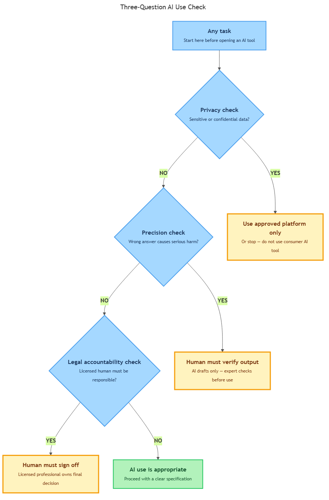

<!-- nav:top:start -->
[⬅ Previous: 2.5 — The 70/30 rule](../../2-5-the-70-30-rule-ai-implements-you-specify-and-verify/artifacts/reading.md)&emsp;·&emsp;[⬆ Table of Contents](../../../../../../../README.md#curriculum-topic-index)&emsp;·&emsp;[Next: 2.7 — Writing specifications across five domains ➡](../../../4-writing-and-testing-specifications/2-7-writing-specifications-across-five-domains-health-transport/artifacts/reading.md)
<!-- nav:top:end -->

---

# When NOT to use AI — privacy, precision, legal accountability

## Overview

AI is genuinely useful — it can draft text, summarise long documents, and suggest ideas quickly. But there are tasks where using AI is the wrong choice, not because AI is broken, but because the situation has constraints that AI cannot satisfy. Knowing when *not* to use a tool is just as important as knowing how to use it well. This topic gives you three specific reasons to say "no" to AI — privacy, precision, and legal accountability — and a quick three-question check you can apply to any professional task.

## Key Concepts

### Reason 1: Privacy — when data is sensitive or confidential

**Sensitive data** is any information that could harm a person, an organisation, or a relationship if it became known to others. Examples include:

- A patient's medical history
- A client's legal case details
- A student's academic records
- A company's financial plans not yet made public

When you type information into an AI tool — a chat interface, a writing assistant, a summarisation tool — that information typically leaves your device. It travels to a server run by the company that built the tool. Depending on the tool's settings, that information may be [1][2]:

- stored temporarily or permanently on that server,
- used to improve the AI model for future users, or
- accessible to the tool provider's staff under certain conditions.

This is the core privacy risk: **you do not control what happens to the data once it leaves your hands** [2]. The moment you press "send", you have transferred something to a third party — and you cannot take it back.

**Consumer tools vs. professional tools.** Consumer AI tools (the free or low-cost tools anyone can sign up for) are not designed to protect confidential professional data [1]. They carry the same privacy risks as typing a client's name and case details into a public discussion forum [1]. Professional-grade AI tools — sometimes called enterprise or business-tier tools — may offer stronger data-handling contracts. But even a professional tool does not automatically make sensitive data safe; the organisation's own data-handling policy must be checked first [2].

**The rule of thumb.** Before using any AI tool, ask: "Would I be comfortable if this data were visible to a stranger?" If no, do not paste it into the tool [2].

Two laws that define what "sensitive" means in specific industries:

- **HIPAA** (Health Insurance Portability and Accountability Act, pronounced "HIP-ah") — a United States law governing how health information may be stored, shared, and handled.
- **GDPR** (General Data Protection Regulation) — the European equivalent. You will study these regulations in later topics.

---

### Reason 2: Precision — when a plausible-but-wrong answer causes serious harm

You learned in topic 2.4 that AI produces **probabilistic output** — an answer that represents the most likely response based on patterns, not a guaranteed correct answer. The same question asked twice can produce slightly different answers.

For many tasks, a "usually right" answer is fine. If an AI helps you brainstorm project name ideas and three out of five are good, the stakes are low. But some tasks require **exact precision** — an answer that is either completely correct or must not be acted upon.

**What counts as high-precision-required?**

| Task type | Why exactness matters |
|---|---|
| Drug dosage calculation | A wrong dose — too high or too low — directly harms the patient. |
| Financial audit figures | A rounding error carries legal and financial consequences. |
| Navigation coordinates for aviation | A small error means a dangerous course deviation. |
| Legal contract clause interpretation | Misreading a clause can create binding obligations the client never agreed to. |
| Medical diagnosis | An incorrect diagnosis leads to the wrong treatment, causing harm. |
| Structural load calculations | An error in engineering figures can make a building or bridge unsafe. |

What makes AI specifically dangerous in these situations is that it produces its wrong answers **confidently** [3]. An AI does not say "I am not sure" — it says "The dosage is 500 mg" in the same tone whether it is correct or not. This is called **hallucination** — a term you will encounter more in later topics — where an AI produces a plausible-sounding but factually incorrect output without signalling any uncertainty.

This connects directly to the verification loop from topic 2.5: when precision is required, the human verification step is not optional — it is what prevents a confident-but-wrong AI answer from causing harm.

**The rule of thumb.** Ask: "If the AI's answer is 5% wrong, would that cause serious harm?" If yes, do not use AI as the source of the final answer. A human expert must verify it against a reliable, auditable source.

---

### Reason 3: Legal accountability — when a human must be legally responsible

**Legal accountability** means that a specific person or organisation is formally responsible — in the eyes of the law — for a decision and its consequences. If the decision causes harm, that responsible person can face legal action: a fine, a lawsuit, or professional sanction such as losing their licence to practise.

AI tools cannot be held legally accountable. An AI system is software [1]. It does not hold a professional licence. It cannot appear before a court. It cannot be fined, imprisoned, or struck off a professional register (removed from the official list of people licensed to practise their profession). Because it cannot be held responsible, it cannot fulfil the role that law and professional regulation have created for licensed humans [1].

Some professions exist inside a framework of legal responsibility:

- A licensed doctor is accountable for clinical decisions.
- A licensed solicitor (lawyer) is accountable for the legal advice they give a client.
- A certified financial adviser is accountable for investment recommendations.

When someone uses AI to produce an output and presents that output as their own professional advice, the legal responsibility still falls on the human [1]. There is no way for a professional to transfer their accountability to a piece of software. But here is the deeper problem: **if the AI's output is wrong and a human relied on it without verifying it, the harm has already occurred** — and the human professional faces the consequences [1][3]. The AI cannot be sanctioned. Only the human can.

**The rule of thumb.** Ask: "Could I — or my organisation — face legal consequences if this AI output is wrong?" If yes, a qualified human must review and own the final decision. The AI can assist with drafting or research, but the human must be the accountable last step.

---

### Putting the three reasons together: the three-question check

Before using AI on any professional task, run this quick check:

1. **Privacy check** — Does this task involve sensitive or confidential data? If yes, use only an approved, data-compliant platform — one that meets your profession's data-privacy rules — or stop. Do not use a consumer AI tool [1][2].

2. **Precision check** — Does this task require an exact, verified answer where a plausible-but-wrong answer would cause serious harm? If yes, do not rely on AI as the final source of truth. A human expert must verify the output against an authoritative, auditable source [3].

3. **Legal accountability check** — Does this task require a person to be legally responsible for the output? If yes, a qualified human must own and sign off on the final decision. AI can assist in drafting and research only [1].

If the answer to any question is "yes", either (a) do not use AI, or (b) use AI only as a drafting aid with a mandatory human verification step [1][2][3].

The diagram below shows how the three checks form a decision path for any task:

*The three-question check as a decision tree: each gate checks one dimension (privacy, precision, legal accountability); a YES at any gate triggers a specific constraint; only three NOs together mean AI use is appropriate.*

Notice that the three checks can overlap. A clinical diagnosis involves all three: the data is sensitive (patient health information), the output requires precision (the wrong diagnosis causes harm), and a licensed physician must be legally accountable for the diagnosis. When two or more checks apply simultaneously, the constraint on AI use is even stronger.

## Worked Example

**Scenario: the fabricated case citation**

A junior lawyer is preparing a legal brief. She asks an AI tool to research relevant court precedents — past rulings that could support her client's argument. The AI returns a list of cases with confident summaries. She incorporates three of them into the brief without individually checking whether the cases exist.

When the opposing counsel and the judge review the brief, they discover that one of the cited cases does not exist. The AI had hallucinated it — constructed a plausible-sounding case name, court, date, and ruling from patterns in its training data.

Here is what the three-question check would have caught before she started:

| Check | Answer | What it means |
|---|---|---|
| Privacy check — sensitive data? | **Yes** — client's legal strategy and confidential details are in the research query | Consumer AI tool is not appropriate; use a data-compliant platform or research manually |
| Precision check — serious harm if wrong? | **Yes** — a fabricated citation in a filed brief exposes the client and the lawyer | AI output must be verified against official legal databases before use |
| Legal accountability check — licensed human responsible? | **Yes** — the lawyer, not the AI, is accountable for every document filed | The lawyer must actively review every cited case and formally sign off |

The AI produced the error. The lawyer — not the AI — faces the consequences: potential reprimand by the bar association (the professional body that regulates lawyers), a costs order (a court ruling requiring one party to pay the other's legal costs), or in serious cases, suspension [1].

The output quality of the AI's other citations does not change this. Even if nine out of ten citations were accurate, the failure to run the check — and to verify each result — is what turns AI from a useful drafting aid into a professional liability.

## In Practice

The three checks apply consistently across professional domains:

**Healthcare**

- All three checks typically apply simultaneously in clinical settings [3].
- Hospitals using AI for appointment scheduling or note summarisation must use HIPAA-compliant platforms.
- Any AI-generated clinical content requires physician review before it becomes part of a patient's record [3].
- AI-generated clinical recommendations can appear plausible while containing factual errors a trained clinician would catch [3].

**Legal practice**

- The ABA (American Bar Association) has issued formal guidance warning lawyers that using consumer AI tools with client information creates real privacy and confidentiality risks [1][2].
- A lawyer's professional duty of confidentiality extends to third-party tools: pasting client data into a consumer AI tool may itself constitute a breach of that duty [2].
- The lawyer remains responsible for the accuracy of every document filed; AI assistance does not reduce that responsibility [1][2].

**Financial services**

- Regulatory frameworks in most jurisdictions require that any investment recommendation given to a retail client be reviewed and approved by a licensed human adviser [1].
- An AI-generated portfolio recommendation cannot be handed directly to a client as professional advice.
- Financial data — account balances, transaction histories, personal financial circumstances — is also sensitive data under privacy regulations, so the privacy check applies alongside the accountability check.

**Safety-critical engineering and software**

- A software team using AI to auto-generate code for a safety-critical system (such as medical device firmware) must have a qualified engineer review every line — a precision error in safety-critical code can be catastrophic.
- An AI-generated error in a load-bearing structural calculation, if acted on without expert verification, creates physical risks that no disclaimer in an AI tool's terms of service would mitigate.

**Quick reference: when AI is and is not appropriate**

| Situation | Appropriate AI use? |
|---|---|
| Drafting an internal memo with no client names | Yes — low privacy risk, low stakes |
| Summarising a client's confidential contract | No — privacy risk [1][2] |
| Generating a rough estimate for a non-critical budget | Yes, if treated as a draft for review |
| Calculating a medication dosage for a patient | No — precision and accountability risk [3] |
| Brainstorming ideas for a marketing campaign | Yes — no sensitive data, low stakes |
| Writing a legal opinion for a client | No — accountability; needs licensed human review [1] |

## Key Takeaways

- AI is inappropriate when the task involves **sensitive or confidential data** — sharing that data with a consumer tool removes your control over it [1][2].
- AI is inappropriate when the task demands **exact precision** and a plausible-but-wrong answer would cause serious harm — AI's probabilistic output does not guarantee correctness [3].
- AI is inappropriate as the final decision-maker when the task requires **legal accountability** — only a licensed human professional can own that responsibility [1].
- The **three-question check** (privacy, precision, legal accountability) gives you a quick, repeatable way to decide whether AI is appropriate for any given task.
- Saying "no" to AI for certain tasks is not a failure — it is the professional judgment that your specification and verification skills are designed to support.

## References

1. Thomson Reuters. "The Consumer vs. Professional AI Privacy Standards for Legal Work." <https://legal.thomsonreuters.com/blog/the-consumer-vs-professional-ai-privacy-standards-for-legal-work/>
2. American Bar Association. "Privacy Risks of AI: Your Data, Their Knowledge." *GPSolo Magazine*, Mar–Apr 2025. <https://www.americanbar.org/groups/gpsolo/resources/magazine/2025-mar-apr/privacy-risks-ai-your-data-their-knowledge/>
3. National Institutes of Health / PubMed Central. "HIPAA Liability in the Age of Generative AI." PMC12859502. <https://www.ncbi.nlm.nih.gov/pmc/articles/PMC12859502/>

---
<!-- nav:bottom:start -->
[⬅ Previous: 2.5 — The 70/30 rule](../../2-5-the-70-30-rule-ai-implements-you-specify-and-verify/artifacts/reading.md)&emsp;·&emsp;[⬆ Table of Contents](../../../../../../../README.md#curriculum-topic-index)&emsp;·&emsp;[Next: 2.7 — Writing specifications across five domains ➡](../../../4-writing-and-testing-specifications/2-7-writing-specifications-across-five-domains-health-transport/artifacts/reading.md)
<!-- nav:bottom:end -->
