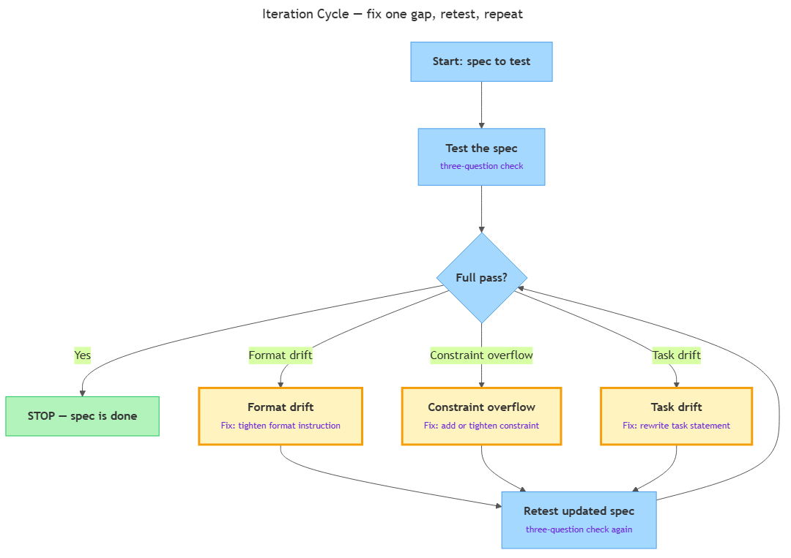

<!-- nav:top:start -->
[⬅ Previous: 2.8 — Testing a specification](../../2-8-testing-a-specification-how-to-verify-the-ai-did-exactly-wha/artifacts/reading.md)&emsp;·&emsp;[⬆ Table of Contents](../../../../../../../README.md#curriculum-topic-index)&emsp;·&emsp;[Next: 3.1 — History of AI ➡](../../../../../m2-introduction-to-ai-systems/week-3/1-a-brief-history-of-ai/3-1-history-of-ai-symbolic-ai-to-machine-learning-to-deep-learni/artifacts/reading.md)
<!-- nav:top:end -->

---

# Iterating a specification based on output gaps

## Overview

You have written a specification and run the three-question verification check from topic 2.8. The result came back as a partial pass or a full fail. The most common mistake at this point is to throw the whole specification away and write a new one from scratch. That wastes time and usually produces the same gap in a different place — because the root cause was never identified [1]. A smarter move is to look at exactly what went wrong and fix only that part. This topic gives you a four-step repeatable loop — test, name the gap, patch the right part, retest — that turns a failing specification into a passing one in two or three focused cycles, without discarding the work that is already correct.

## Key Concepts

### What "iterating" means

**Iteration** — making one focused change to a specific part of a specification, based on a specific gap found in a test result, then retesting to see whether the change worked [1].

The word "iterating" simply means "going through something again." You go through the test-and-fix cycle again — but not from scratch. You go through it with new information: the exact gap your last test revealed.

Think of it like adjusting a recipe. If your soup is too salty, you do not tear up the entire recipe and start over. You find the one step that added too much salt and change only that step. The rest of the recipe stays exactly as it was. The same logic applies to a specification: the parts that produced a correct result are already doing their job — leave them alone.

Two things make an iteration valid:

1. **Targeted** — you change the part of the spec that caused the failure. You leave the parts that passed completely alone.
2. **Grounded** — the change is driven by evidence from the test output, not by a hunch or a guess [2].

An iteration that changes three things at once is not a valid iteration. If the second test passes, you cannot tell which of the three changes actually fixed the problem. If it fails, you have made the problem harder to trace. Change one thing. Retest. Repeat.

### The three gap types and their fixes

A failing test result usually falls into one of three patterns. Each pattern — called a **gap type** — has a name and a targeted fix [1][2][3].

| Gap type | What it means | Which spec part caused it | The fix |
|---|---|---|---|
| **Format drift** | Right content, wrong shape or length | Format instruction (missing or too loose) | Add or tighten the format instruction |
| **Constraint overflow** | Output included content you did not ask for or explicitly forbid | A constraint was missing or too vague | Add a new constraint, or make an existing one more specific |
| **Task drift** | Output solved a different task than you intended | The task statement was too vague or ambiguous | Rewrite the task statement to remove the ambiguity |

Each fix targets a different part of the spec. Naming the gap type first points you straight to which part needs changing — so you do not accidentally rewrite the wrong section and introduce a new problem.

Here is what each gap type looks like in practice:

- **Format drift — format fix.** The AI gave you the right information but presented it in the wrong shape. For example: you asked for a numbered list and got one long paragraph. The fix is not to re-explain the task — it is to add or tighten a format instruction: "Present the output as a numbered list with exactly three items." [2]
- **Constraint overflow — constraint fix.** The AI included something you did not want. For example: you asked for a three-sentence summary and got five sentences with extra commentary you did not request. The fix is to add or tighten a constraint: "Do not include commentary or explanation. Stop after exactly three sentences." [1][3]
- **Task drift — task statement fix.** The AI solved a different problem than you intended. For example: you asked it to "describe the process" and it described a different process because "the process" was ambiguous — it could mean more than one thing. The fix is to rewrite the task statement to remove the ambiguity: "Describe only the four-step order-fulfilment process defined above." [1][2]

### The minimum viable patch principle

**Minimum viable patch** — the smallest change to the specification that directly addresses the gap you found, without touching any part that is already working [1][2].

This principle has three rules:

1. **Change one part only.** If the gap is in the format instruction, change the format instruction — do not also rewrite the task statement "just in case."
2. **Make the change as small as possible.** If adding four words to a constraint fixes the problem, do not rewrite the whole constraint.
3. **Leave passing parts untouched.** If two out of three test questions passed, the spec parts behind those passes are already doing their job. Do not disturb them.

Why does this matter? A specification is a connected set of parts. Changing one part can affect another. If you rewrite more than you need to, you risk breaking something that was already working [2][3]. You also make it harder to trace: if three things changed and the next test still fails, you cannot tell which of the three changes caused the new failure.

A common reaction to a bad test result is to rewrite the entire spec. It feels productive — you are "starting fresh." But almost always it makes things harder: you lose the parts that were correct, you cannot trace what changed, and you may introduce new gaps that were not there before.

### The iteration cycle

The iteration cycle is a four-step loop [1][2][3]:

1. **Test.** Run your current spec through the three-question verification check (from topic 2.8). Record the result for each question: full pass, partial pass, or full fail. If the overall result is a full pass — stop. You are done.
2. **Name the gap.** Look at the question that failed or partially passed. Decide which gap type it is — format drift, constraint overflow, or task drift. Write the gap type down as a phrase before you touch the spec. Do not start editing yet.
3. **Patch the right part.** Apply the minimum viable patch to the spec part that caused the gap. Leave everything else exactly as it was.
4. **Retest.** Run the three-question check again on the updated spec. Record the new result. If full pass — stop. If not, return to step 2 with the new test result.

Each time through the loop, the spec improves by exactly one patch. After two or three cycles, most specifications reach a full pass.

*The iteration cycle: start with a spec, test it, branch to the matching gap fix (format drift, constraint overflow, or task drift) when it does not pass, patch only that part, retest, and repeat until full pass.*

### When to stop iterating

You stop iterating when one of two conditions is met [1][2]:

**Condition 1 — Full pass.** The spec passes all three verification questions with no partial results. This is the target. Stop here and document the final spec as your finished version.

**Condition 2 — Diminishing returns.** You have run two or three iteration cycles and the spec is still not reaching a full pass. Each new cycle is producing smaller improvements, or the remaining gap is in something you cannot control within a specification — for example, a very specific domain detail the AI consistently misses. In this case:

- Document the remaining limitation in one sentence: state what the spec does not fully control and why.
- Accept the spec as-is with the known limitation recorded.
- Do not keep iterating in hope of a perfect result that may not be achievable [3].

A spec with a clearly documented limitation is more useful than a spec that is never finished because it never reached 100%. The signal to stop is not the cycle count — it is whether each new cycle still produces meaningful improvement. If the remaining gap is a small format detail that does not affect the core task, accept it. If the remaining gap means the spec still does the wrong job entirely, keep iterating or reconsider the task statement from the beginning.

## Worked Example

The following three-cycle example shows the full iteration loop applied to a real task: asking an AI to produce study tips for an exam.

---

**Version 1 — first draft:**

> "Give me tips for studying for an exam."

**Cycle 1 test result:**

| Question | Result | What the output showed |
|---|---|---|
| Q1 — Did the output match what was expected? | Partial pass | Tips about studying — but there are seven of them, with no count specified |
| Q2 — Did the AI respect all constraints? | Fail | One tip mentioned "pulling an all-nighter" — no constraint was set to forbid this |
| Q3 — Is the output in the right format? | Fail | Output is a paragraph; no format was specified |

**Named gap:** The root cause is the task statement — it specified almost nothing. Three gaps are visible: task drift (no count or audience specified), constraint overflow (forbidden content appeared), and format drift (no list format). When multiple gap types appear at once, fix the task statement first because it is the root cause — the missing count, audience, and format all trace back to it.

**Minimum viable patch — cycle 1:** Rewrite the task statement to add a count, audience, format, and the key exclusion constraint.

---

**Version 2 — after cycle 1 patch:**

> "Give me exactly 3 tips for studying for an exam, written for a teenager, as a numbered list. Do not include any tips about staying up late or pulling an all-nighter."

**Cycle 2 test result:**

| Question | Result | What the output showed |
|---|---|---|
| Q1 — Did the output match what was expected? | Pass | Three tips, appropriate for a teenager |
| Q2 — Did the AI respect all constraints? | Pass | No all-nighter tip appeared |
| Q3 — Is the output in the right format? | Partial pass | Numbered list — but each item is 3–4 sentences long, not a short one-sentence tip |

**Named gap:** Format drift — the items are too long. The fix is to tighten the format instruction only. Q1 and Q2 both passed, so the task statement and the constraint are not touched.

**Minimum viable patch — cycle 2:** Add one sentence to the format instruction: "Each tip must be one sentence only."

---

**Version 3 — after cycle 2 patch:**

> "Give me exactly 3 tips for studying for an exam, written for a teenager, as a numbered list. Each tip must be one sentence only. Do not include any tips about staying up late or pulling an all-nighter."

**Cycle 3 test result:**

| Question | Result | What the output showed |
|---|---|---|
| Q1 — Did the output match what was expected? | Pass | Three tips, correct audience |
| Q2 — Did the AI respect all constraints? | Pass | No forbidden content |
| Q3 — Is the output in the right format? | Pass | Numbered list, one sentence per item |

**Result: Full pass. Iteration complete.**

**Iteration log:**

- Cycle 1: task drift + constraint overflow + format drift — rewrote task statement (root cause).
- Cycle 2: format drift (items too long) — added "Each tip must be one sentence only."
- Cycle 3: full pass. Final spec is version 3.

Notice what never changed: once the task statement was fixed in cycle 1, it was not touched in cycle 2. Only the format instruction was updated in cycle 2, because that was the only remaining gap. This is the minimum viable patch principle in action — change only what failed, leave everything that passed exactly as it was [1][2][3].

## In Practice

The test-name-patch-retest cycle is exactly how professionals refine AI instructions in real work. IBM's guide on iterative prompting describes it as an "assess → identify gap → modify" loop [1]. The vocabulary differs — they say "prompt" where we say "specification" — but the structure is identical.

What separates an experienced AI user from a beginner is not that the experienced person writes a perfect specification on the first try. It is that they diagnose gaps faster and make more precise, targeted patches [2].

One structured approach used in educational settings is the REFINE framework [3]: Review the output, Evaluate where it diverged from your intent, Focus on the specific part that caused the divergence, Iterate by patching only that part, and Note the change before evaluating again. The underlying logic is the same four-step loop from this topic.

**Do this:**

| Action | Why it matters |
|---|---|
| Name the gap type before touching the spec | Diagnosis first — fixing without diagnosis is guessing |
| Change one part per cycle | You cannot learn which fix worked if you change three things at once |
| Write the old version and the new version side by side | Creates a traceable change log and shows deliberate iteration |
| Record every test result in a pass/fail table | Turns iteration into visible evidence you can point to |
| Stop at full pass | Iterating beyond a full pass introduces new, unnecessary risk |

**Avoid this:**

| Mistake | What goes wrong |
|---|---|
| Rewriting the whole spec because one part failed | You break the parts that were working and cannot trace what changed |
| Fixing a format-drift gap by rewriting the task statement | Wrong part — the format gap will likely remain and you may add new ones |
| Accepting a known limitation on a task-drift failure | The spec still does the wrong job — that is not a small limitation, it is a fundamental one |
| Running more than three cycles without re-reading the full spec | After three failures, the root cause may be in the task statement even if earlier gaps looked like format issues |

## Key Takeaways

- **Iteration means one targeted change.** When a spec fails, identify the exact part that caused the failure and fix only that — do not rewrite the whole spec from scratch.
- **Three gap types, three matching fixes.** Format drift (wrong shape) — fix the format instruction. Constraint overflow (unwanted content) — add or tighten a constraint. Task drift (wrong task) — rewrite the task statement.
- **Minimum viable patch.** Change only what caused the failure. Leave every passing part untouched. If adding four words fixes the problem, do not rewrite the paragraph.
- **The four-step loop.** Test → name the gap → patch the right part → retest. Each cycle produces one improvement. Repeat until full pass.
- **Know when to stop.** Full pass is the target. If further cycles produce no meaningful improvement, document the remaining limitation and accept the spec — a spec with a documented limitation is more useful than one that is never finished.

## References

1. IBM, "Iterative Prompting." <https://www.ibm.com/think/topics/iterative-prompting>
2. Whitebeard Strategies, "AI Prompt Debugging: Fixing Issues Through Iteration." <https://whitebeardstrategies.com/blog/ai-prompt-debugging-fixing-issues-through-iteration/>
3. Catlin Tucker, "REFINE: A Framework for AI Prompting." <https://catlintucker.com/2025/08/refine-ai-prompting/>

---
<!-- nav:bottom:start -->
[⬅ Previous: 2.8 — Testing a specification](../../2-8-testing-a-specification-how-to-verify-the-ai-did-exactly-wha/artifacts/reading.md)&emsp;·&emsp;[⬆ Table of Contents](../../../../../../../README.md#curriculum-topic-index)&emsp;·&emsp;[Next: 3.1 — History of AI ➡](../../../../../m2-introduction-to-ai-systems/week-3/1-a-brief-history-of-ai/3-1-history-of-ai-symbolic-ai-to-machine-learning-to-deep-learni/artifacts/reading.md)
<!-- nav:bottom:end -->
