<!-- nav:top:start -->
[⬅ Previous: 2.9 — Iterating a specification based on output gaps](../../../../../m1-computational-thinking/week-2/4-writing-and-testing-specifications/2-9-iterating-a-specification-based-on-output-gaps/artifacts/reading.md)&emsp;·&emsp;[⬆ Table of Contents](../../../../../../../README.md#curriculum-topic-index)&emsp;·&emsp;[Next: 3.2 — The rise of large language models (LLMs) ➡](../../3-2-the-rise-of-large-language-models-llms/artifacts/reading.md)
<!-- nav:top:end -->

---

# History of AI — Symbolic AI to Machine Learning to Deep Learning

## Overview

This reading traces how artificial intelligence (AI) went from hand-written rules in the 1950s to systems that learn directly from massive amounts of raw data today. You will meet three distinct eras — symbolic AI, machine learning, and deep learning — each of which grew out of the limits of the one before it. Understanding this progression is the foundation for everything else in this course about how modern AI systems work [1][2].

## Key Concepts

### The three eras at a glance

Each era answered the same question differently: *how do you get a machine to behave intelligently?*

| | Symbolic AI | Machine Learning | Deep Learning |
|---|---|---|---|
| **How rules are created** | Written by hand | Learned from labelled examples | Learned from raw data, no hand-picking |
| **Best suited for** | Logic puzzles, narrow rule-based tasks | Structured data (emails, numbers, records) | Images, audio, language, complex patterns |
| **Main weakness** | Breaks on exceptions; knowledge bottleneck | Humans must still choose features | Needs enormous data and compute |

---

### Era 1 — Symbolic AI (roughly 1950s to 1980s)

**Symbolic AI** is an approach to AI where programmers write the rules directly, using human-readable symbols — words, numbers, and logical statements — and the computer follows those rules exactly [3].

Think of it as a very elaborate checklist: a programmer sits down, thinks hard about every possible situation, and codes it in.

The flagship product of this era was the **expert system** — a program that stores human expert knowledge as IF/THEN rules. A medical expert system might contain thousands of entries like these:

- IF the patient has a fever AND a cough THEN consider flu.
- IF the patient has a fever AND a rash AND recent tropical travel THEN consider malaria.

Expert systems genuinely impressed people and could answer narrow questions as reliably as a specialist — sometimes better, because computers never forget a rule [3].

**Why symbolic AI hit a wall.** Two problems ended the era [1][3]:

1. **The knowledge bottleneck.** Writing rules by hand is slow and expensive. Understanding plain English, for instance, requires millions of rules — more than any team can write.
2. **Brittleness.** A rule-based system breaks the moment it meets something the rule-writer did not anticipate. It has no way to gracefully handle exceptions.

By the late 1980s, funding agencies had cut AI research budgets sharply. Historians call this period the **AI Winter** — a time when interest in AI collapsed because the early promises had not been met [2].

---

### Era 2 — Machine Learning (roughly 1980s to 2010s)

**Machine learning (ML)** is a fundamentally different idea: instead of writing rules, let the computer figure out the rules itself by studying many examples [1].

The key term here is **training data** — the collection of labelled examples the algorithm learns from. Without training data, there is nothing for the system to learn.

Here is how learning actually works. The algorithm starts with a set of internal numbers called **parameters**. It looks at each labelled example, makes a guess, checks how wrong it was, and nudges the parameters to do better next time. After thousands of these adjustments, the parameters settle into values that produce good answers.

A well-trained system can then **generalise** — apply what it learned to new examples it has never seen before. A system that only memorises its training examples without generalising is called **over-fitted**: it aces the practice problems but fails on anything new.

One important human task remained in this era: **feature engineering** — deciding which properties of the data (called **features**) to hand to the algorithm. For a spam email detector, a human might choose: number of exclamation marks, presence of the word "winner," sender address. Choosing good features required a lot of expertise [3].

By the 1990s and 2000s, ML algorithms were producing real results: credit card fraud detection, spam filters, and voice recognition on early smartphones [2].

---

### Era 3 — Deep Learning (roughly 2010s to today)

**Deep learning** is a specific type of machine learning that uses structures loosely inspired by the human brain. These structures are called **artificial neural networks (ANNs)** [1][3].

Do not let the word "brain" mislead you. A neural network is a mathematical construction — a large collection of numbers arranged in **layers** and connected by arithmetic. A **layer** is one stage of processing. The word "deep" refers to having many layers — modern networks can have hundreds.

Each layer learns to detect progressively more abstract patterns. For face recognition:

1. The first layer detects edges (light/dark boundaries).
2. The next combines edges into shapes (circles, lines).
3. A deeper layer combines shapes into features (eyes, nose).
4. The deepest layer combines features into a face.

No human wrote the rule "eyes + nose + mouth = face" — the network discovered that hierarchy by studying millions of labelled photos [3].

**The diagram below shows the full arc from Era 1 to Era 3, including the two transition moments.**

```mermaid
---
title: "Three Eras of AI — How Each Era Solved the Last"
theme: base
themeVariables:
  primaryColor: "#a5d8ff"
  primaryBorderColor: "#4a9eed"
  lineColor: "#555"
flowchart:
  htmlLabels: true
  curve: basis
---
flowchart LR
    era1["<b>Symbolic AI</b><br/><span style='font-size:12px;color:#6d28d9'>~1950s – 1980s<br/>Hand-written IF/THEN rules<br/>Expert systems<br/>Bottleneck: knowledge bottleneck</span>"]:::start

    bridge1["<b>AI Winter</b><br/><span style='font-size:12px;color:#6d28d9'>Late 1980s<br/>Funding cut; rules could not<br/>scale to the real world</span>"]:::hitl

    era2["<b>Machine Learning</b><br/><span style='font-size:12px;color:#6d28d9'>~1980s – 2010s<br/>Learn patterns from examples<br/>Training data + parameters<br/>Bottleneck: feature engineering</span>"]:::auto

    bridge2["<b>AlexNet 2012</b><br/><span style='font-size:12px;color:#6d28d9'>Deep network halved<br/>ImageNet error rate;<br/>proved raw data + GPUs work</span>"]:::hitl

    era3["<b>Deep Learning</b><br/><span style='font-size:12px;color:#6d28d9'>~2010s – today<br/>Artificial neural networks<br/>Learn from raw data at scale<br/>Needs: vast data + compute</span>"]:::done

    era1 -->|knowledge bottleneck| bridge1
    bridge1 -->|ML: learn from examples| era2
    era2 -->|feature engineering bottleneck| bridge2
    bridge2 -->|deep learning: skip manual features| era3

    classDef start fill:#a5d8ff,stroke:#4a9eed,color:#111
    classDef hitl fill:#fff3bf,stroke:#f59e0b,stroke-width:3px,color:#111
    classDef auto fill:#d0bfff,stroke:#8b5cf6,color:#111
    classDef done fill:#b2f2bb,stroke:#22c55e,color:#111
```

*Render this Mermaid block to see the timeline.*

**The milestone that changed everything: AlexNet (2012).**

In 2012, a deep neural network called AlexNet entered the ImageNet competition — an annual challenge to classify photographs from a large labelled dataset. AlexNet cut the error rate nearly in half compared to the previous best system, a margin so large that most researchers had not thought possible [1][2].

Three things came together to make it work:

1. **More data.** The internet had produced vast collections of labelled images.
2. **More compute.** Graphics processing units (GPUs) — chips originally designed for video games — turned out to be extremely efficient at the arithmetic neural networks require.
3. **Better algorithms.** Researchers had refined training techniques over the previous decade [1][2][3].

This "ImageNet moment" persuaded the research community to shift towards deep learning en masse. Later milestones followed: AlphaGo beating the world Go champion in 2016, and conversational AI going mainstream with ChatGPT in 2022. Large language models are introduced in topic 3.2.

**Why deep learning could not have happened in 1990.** The core ideas existed in the 1980s. What was missing was data (the internet did not yet exist at scale), compute (GPUs had not been repurposed for neural networks), and refined training techniques [1][2].

## Worked Example

**A spam filter across all three eras.**

The same task — deciding whether an email is spam — illustrates how each era approached the problem differently.

**Symbolic AI approach:**

1. A programmer interviews email administrators and lists known spam patterns.
2. Rules are written: IF "winner" is in the subject AND sender is unknown THEN mark spam.
3. Rules are tested on sample emails and corrected manually.
4. Each new spam trick (changing "winner" to "w1nner") forces another rule to be added by hand.
5. Eventually the rulebook grows unwieldy and spammers keep finding gaps.

**Machine learning approach:**

1. Thousands of emails already labelled "spam" or "not spam" are collected as training data.
2. A human expert chooses features: word frequencies, number of exclamation marks, sender reputation score.
3. The algorithm adjusts its parameters until it correctly classifies most of the labelled examples.
4. Tested on new emails it has never seen — if it generalises well, it is deployed.
5. When spammers shift tactics, the model is retrained on new examples rather than re-coded by hand.

**Deep learning approach:**

1. Millions of raw emails are collected — no feature list is hand-crafted.
2. A neural network with many layers is defined.
3. Raw text is fed directly into the network; each layer learns progressively more abstract patterns (individual words → phrases → writing style → intent).
4. Parameters are adjusted over many passes through the data.
5. The trained network can catch subtle patterns — such as mimicking a trusted sender's writing style — that neither rule lists nor hand-picked features would capture.

Each step removed one more piece of human hand-work: first the rule-writing, then the feature selection. What grew in its place was the need for more data and more computing power.

## In Practice

**Where symbolic AI still lives.**

Symbolic AI did not disappear. Rule-based systems still power many everyday tools [3]:

- Spreadsheet formulas and tax-calculation software.
- Traffic-light controllers.
- Legal contract analysis tools.

When the rules can be fully and reliably specified, a rule-based system is predictable, auditable, and cheap to run.

**Where machine learning is standard.**

Most recommendation systems — what to watch next on a streaming platform, which search results to show — are ML systems trained on user behaviour data. Fraud detection at banks, credit scoring, and disease prediction from medical records are also core ML applications [1][2].

**Where deep learning dominates.**

Deep learning is now the standard approach for any task involving images, audio, or natural language [1]:

- Face unlock on a smartphone.
- Voice assistants that transcribe speech to text.
- Medical imaging tools that detect tumours in X-rays.
- Translation between languages.
- AI models screening for diabetic retinopathy in rural clinics where specialists are scarce [2].

**One important caution: AI is uneven.**

Current AI can outperform humans at image recognition while failing on simple common-sense questions. This "jagged frontier" is a direct result of how deep learning works: it learns patterns from data, not general understanding. This theme returns throughout the course.

## Key Takeaways

- **Three eras, three philosophies.** Symbolic AI relied on hand-written rules. Machine learning replaced those rules with patterns learned from labelled examples. Deep learning removed even the need to hand-pick features, learning directly from raw data at scale.
- **Each era solved its predecessor's bottleneck.** Symbolic AI stalled at the knowledge bottleneck. Machine learning still required humans to choose features. Deep learning needed vast data and compute — which only became widely available in the 2010s.
- **AlexNet (2012) is the turning point most researchers cite.** It demonstrated that deep learning could outperform decades of hand-crafted methods on image recognition, triggering a rapid shift across the whole field [1][2].
- **Modern AI is a product of infrastructure, not just ideas.** The deep learning revolution was enabled by the internet (data), GPUs (compute), and accumulated algorithmic research. The ideas existed earlier; the infrastructure did not.
- **AI capability is uneven.** Today's AI systems can be superhuman on specific tasks and surprisingly fragile on others — a consequence of learning from data patterns rather than from general understanding.

## References

[1] IEEE Xplore — Academic paper covering the full arc from classical ML to modern AI systems. https://ieeexplore.ieee.org/document/11202920

[2] Toloka AI — Comprehensive chronological timeline of AI history, 1950–2026. https://toloka.ai/blog/history-of-llms/

[3] Machine Mindscape — Educational explainer covering symbolic AI to deep learning. https://machinemindscape.com/artificial-intelligence-to-deep-learning-history-concepts/

---
<!-- nav:bottom:start -->
[⬅ Previous: 2.9 — Iterating a specification based on output gaps](../../../../../m1-computational-thinking/week-2/4-writing-and-testing-specifications/2-9-iterating-a-specification-based-on-output-gaps/artifacts/reading.md)&emsp;·&emsp;[⬆ Table of Contents](../../../../../../../README.md#curriculum-topic-index)&emsp;·&emsp;[Next: 3.2 — The rise of large language models (LLMs) ➡](../../3-2-the-rise-of-large-language-models-llms/artifacts/reading.md)
<!-- nav:bottom:end -->
