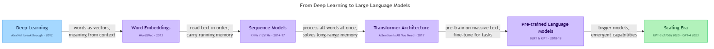

<!-- nav:top:start -->
[⬅ Previous: 3.1 — History of AI](../../3-1-history-of-ai-symbolic-ai-to-machine-learning-to-deep-learni/artifacts/reading.md)&emsp;·&emsp;[⬆ Table of Contents](../../../../../../../README.md#curriculum-topic-index)&emsp;·&emsp;[Next: 3.3 — The move to AI agents ➡](../../3-3-the-move-to-ai-agents/artifacts/reading.md)
<!-- nav:top:end -->

---

# The Rise of Large Language Models (LLMs)

## Overview

For most of computing history, machines could not produce fluent, relevant text in natural language — the everyday language people speak and write. That changed around 2018, when a new kind of AI model began answering questions, writing paragraphs, and translating between languages in ways that felt surprisingly human. These models are called **Large Language Models**, or **LLMs**, and they are the technology behind tools like ChatGPT, Google Gemini, and Claude. [1]

This topic tells the story of how LLMs came to exist — from early research on teaching machines to understand words, through a chain of breakthroughs, to the general-purpose language tools that are now used across industries worldwide. It does not go deep into how LLMs work internally; that comes in later topics.

## Key Concepts

### What is a Large Language Model?

A **Large Language Model (LLM)** is a type of deep-learning model — the kind introduced in Topic 3.1 — trained on enormous quantities of text. After training, it can generate, summarise, translate, and answer questions in natural language. [1]

The name has three parts:

| Part | What it means |
|---|---|
| **Large** | The model has billions of learned parameters — numbers adjusted during training so the model captures language patterns. |
| **Language** | Its input and output are text: sentences, questions, code, translations, or answers. |
| **Model** | It is a mathematical pattern-matcher built from an artificial neural network, not a lookup table or hand-written rules. |

The word "large" matters most. Earlier language models existed but were small enough that their vocabulary and reasoning were limited. The jump to billions of parameters — made possible by more data and far more powerful hardware — is what makes LLMs qualitatively different from what came before. [1] [2]

### The Road to LLMs: A Milestone Timeline

LLMs did not appear from nowhere. They sit at the end of a chain of research steps, each solving a problem the previous approach could not handle.

*The six milestones from deep learning to the LLM scaling era: each step solved a problem the previous one left open.*

**Step 1 — Early neural-network language work (1980s–2000s)**

Researchers noticed early on that artificial neural networks could learn patterns in sequences of words. The challenge: language is sequential. The word "bank" means something different in "river bank" and "bank account." A model has to track context across many words to understand meaning.

Early neural-network language models could handle short phrases but struggled with long sentences, and the hardware of the era made them slow to train. [2]

**Step 2 — Word embeddings: giving words a location in space (2013)**

A major breakthrough came with **word embeddings** — a technique for turning each word into a list of numbers so that words with similar meanings end up numerically close together. (The mathematical details of how a list of numbers represents meaning are formally covered in topic 6.3.)

- Think of it as giving each word a coordinate on a map: words with similar meanings land near each other.
- The landmark tool was **Word2Vec** (2013, Google). After training, Word2Vec learned that "king" and "queen" are close in its numerical space, and that the relationship "king minus man plus woman" points toward "queen" — it captured something about meaning without being told what meaning was. [2]

Word embeddings became a building block that every later, larger model would reuse and extend.

**Step 3 — Sequence models: reading text in order (2014–2017)**

Even with good word embeddings, a model still needs to read words in sequence and remember what it read earlier.

- **Recurrent Neural Network (RNN)** — a type of neural network that processes inputs one step at a time and passes a summary of earlier steps forward, so later steps know something about what came before.
- A refinement called **LSTMs (Long Short-Term Memory networks)** improved this memory mechanism further. [2]

RNNs and LSTMs powered the first serious neural machine-translation systems, including early versions of Google Translate. But they had a key weakness: the further back in a sentence a word appeared, the harder it was to remember. A 100-word sentence caused the model to effectively "forget" the opening clause by the time it reached the end. [2]

**Step 4 — The Transformer: the architecture that changed everything (2017)**

In 2017, a team at Google published a research paper titled "Attention Is All You Need." It introduced the **Transformer architecture** — the design that every major LLM today is built on. [1] [2]

**Transformer** — an artificial neural network architecture that can process all words in a text simultaneously and connect any two words to each other regardless of their distance in the sentence.

The key innovation inside the Transformer is a mechanism called **attention** (covered in detail in topic 3.4). The result: **the Transformer solved the long-range memory problem** that held back RNNs and LSTMs, and it made it practical to train far larger models on far more data. [1] [2]

**Step 5 — BERT and GPT: the first large Transformer models (2018–2019)**

With the Transformer in place, two landmark models arrived:

**BERT (Bidirectional Encoder Representations from Transformers)**, released by Google in 2018, reads text in both directions at once. This made it excellent at *understanding* a passage — useful for search engines and question answering. [2]

**GPT (Generative Pre-trained Transformer)**, released by OpenAI in 2018, was trained to predict the next word in a sequence. This made it excellent at *generating* text — completing sentences, answering prompts, writing paragraphs. [1] [2]

| Model | Organisation | Year | Primary strength |
|---|---|---|---|
| BERT | Google | 2018 | Understanding text (search, question answering) |
| GPT-1 | OpenAI | 2018 | Generating text (completions, answers) |
| GPT-2 | OpenAI | 2019 | Larger; fluent multi-paragraph text |
| GPT-3 | OpenAI | 2020 | 175 billion parameters; few-shot task performance |
| GPT-4 | OpenAI | 2023 | Multimodal — text and image input (multimodal AI is covered in topic 4.6); near-human on many benchmarks |

**Few-shot** — the ability to perform a new task after seeing only a handful of examples, without any retraining. GPT-3 demonstrated this at scale for the first time. [1]

**Step 6 — Scale and the "pre-train then fine-tune" pattern**

What makes a language model "large" is the combination of three things:

1. A massive training dataset — hundreds of billions of words from the web, books, and code repositories.
2. A very large number of parameters — GPT-3 has 175 billion; some 2024–2025 models exceed a trillion.
3. Enormous compute — thousands of specialised GPUs running for weeks or months.

The **pre-train then fine-tune** pattern emerged as the standard approach: [1] [3]

- **Pre-training** — the initial phase where an LLM learns general language patterns from a very large text corpus. This is expensive and slow.
- **Fine-tuning** — a follow-on phase where the pre-trained model is adapted to a specific task or domain using a smaller, focused dataset. This is relatively cheap compared to pre-training.

This pattern is why the same base model can be adapted into a coding assistant, a medical-information chatbot, or a translation tool without starting from scratch each time. [3]

### What LLMs Can and Cannot Do

LLMs are genuinely impressive at some tasks and unreliable at others. Knowing the difference is a core skill for responsible AI use.

**What LLMs are good at:**

- **Fluent text generation** — writing emails, summaries, explanations, and code drafts that read naturally. [1]
- **Multilingual tasks** — translating between languages, including languages with limited prior tool support. [3]
- **Summarisation** — condensing a long document into a short paragraph while keeping the main points.
- **Question answering** — drawing on knowledge learned during training to answer factual questions.
- **Few-shot adaptation** — doing new tasks from just a few examples in the prompt, without retraining.

**What LLMs struggle with:**

| Weakness | What it looks like |
|---|---|
| **Hallucination** | The model produces a fluent, confident-sounding answer that is factually wrong or entirely invented. |
| **Arithmetic and precise reasoning** | LLMs were not built as calculators; they often make errors in multi-step maths. |
| **Up-to-date knowledge** | Training data has a cut-off date. The model does not know about events after that date unless the information is provided in the prompt. |
| **Consistency** | Asking the same question twice may produce different answers. |
| **Verification** | The model cannot check whether its answer is true; it generates what looks plausible, not what is factually verified. |

**Hallucination** — when an LLM generates text that sounds correct and fluent but is factually wrong, invented, or misleading. [1] [3]

The unevenness of LLM performance across task types — why it excels at some and fails at others — is examined in depth in topic 3.8.

### How LLMs Differ from Earlier AI Approaches

Topic 3.1 covered two earlier paradigms. Here is how LLMs compare:

| Approach | How knowledge is encoded | Who does the work |
|---|---|---|
| **Symbolic AI / Expert systems** (1950s–1980s) | Explicit rules written by humans | Human experts encode all knowledge as rules |
| **Classic machine learning** (1980s–2010s) | Statistical patterns; humans engineer features | Humans choose features; algorithm learns weights |
| **Deep learning** (2012–2017) | Patterns from raw data via many-layer networks | Architecture chosen by humans; patterns learned from data |
| **LLMs** (2018–present) | Language patterns from internet-scale text; fine-tuned for tasks | Pre-trained by large organisations; adapted by practitioners |

The critical shift with LLMs is **scale and generality**. Earlier systems were built for one task: a chess engine plays chess; a spam filter detects spam. LLMs are general-purpose language reasoners — the same pre-trained model can write an essay, translate a sentence, explain a recipe, and sketch a business plan. [1] [2]

## Worked Example

Here is the practical workflow of using a pre-trained LLM, from first training to a practitioner getting a response. Think of it as three roles passing a baton.

1. **A large organisation pre-trains a base LLM** on internet-scale text — billions of documents, websites, and books. This phase costs millions of dollars and takes months. The result is a model with general language knowledge. [1]
2. **The base model is fine-tuned** on a smaller, task-specific dataset (for example, customer-support conversations, or medical notes). The model adapts its general knowledge to a specific purpose without being retrained from scratch. [1]
3. **The fine-tuned model is deployed behind an API** — a service interface that applications can send text to and receive text back from. [1]
4. **A practitioner writes a prompt** — the text input — and sends it to the API. They receive the model's response.

**Prompt** — the text you send to an LLM to get a response. It can be a question, an instruction, a partial sentence, or a detailed description of what you want.

A concrete example:

> **Prompt:** "Summarise this paragraph in two sentences for a non-technical audience: [paragraph text]"
>
> **Response:** The LLM returns a short, plain-language summary drawn from the pattern knowledge it learned during training.

The key insight: from a practitioner's perspective, using an LLM means writing a clear text input (a prompt) and reading text output (a response). The billions of parameters and the terabytes of training data are managed by the provider, invisible behind the API. [1]

## In Practice

**Where LLMs are used today:**

- **Global translation and transcription** — LLMs now power translation services that work across hundreds of languages, including languages that older automated tools handled poorly due to limited training data. [3]
- **Regional language tools in India** — India has 22 scheduled languages. LLMs fine-tuned on Indian-language corpora have opened practical translation, transcription, and content generation for Kannada, Tamil, Telugu, Hindi, Marathi, and others at scale — a task that earlier rule-based systems required enormous manual effort per language pair to handle. [3]
- **Healthcare documentation** — hospitals use LLM-based tools to convert clinician notes into structured medical records, reducing paperwork time. [1] [3]
- **Software development** — developers use LLM-based code-completion tools (for example, GitHub Copilot) to accelerate writing and debugging code. [1]
- **Search engines** — major search engines now use LLMs to provide direct answers to natural-language queries, not just a list of links. [1]

**Do:**
- Verify important factual claims independently — LLMs hallucinate; trust but check.
- Treat LLM output as a first draft, not a final product.
- Be specific in prompts — a vague instruction produces a vague answer.
- Note the training data cut-off date when asking about recent events.

**Avoid:**
- Using LLM output uncritically for high-stakes decisions (medical diagnoses, legal advice, financial plans) without expert review.
- Confusing fluency with correctness — a confident, well-written sentence can still be factually wrong.
- Assuming the model understood your intent; it is predicting plausible text, not reasoning about your goals. [3]

## Key Takeaways

- A **Large Language Model (LLM)** is a deep-learning model trained on vast quantities of text; it can generate, summarise, translate, and answer questions in natural language. [1]
- LLMs emerged from a chain of milestones: word embeddings (2013) → sequence models / RNNs (2014–2017) → the **Transformer architecture** (2017) → BERT and GPT (2018–2019) → massive scaling (2020–present). [2]
- The **Transformer** was the enabling breakthrough: it processes all words at once and connects words regardless of distance, solving the long-range memory problem that limited earlier sequence models. [1] [2]
- LLMs are **general-purpose**: the same pre-trained model can be fine-tuned for many different tasks — a major shift from the single-task AI systems of earlier eras. [1]
- LLMs have real limitations: they **hallucinate**, carry a training data cut-off date, and their performance is uneven — excellent at some tasks, surprisingly poor at others. [1] [3]

## References

[1] IBM Think. "Large Language Models." IBM. https://www.ibm.com/think/topics/large-language-models

[2] Minaee, S. et al. "Large Language Models: A Survey." arXiv:2402.06853v3. https://arxiv.org/html/2402.06853v3

[3] Snorkel AI. "Large Language Models." Snorkel.ai. https://snorkel.ai/large-language-models/

---
<!-- nav:bottom:start -->
[⬅ Previous: 3.1 — History of AI](../../3-1-history-of-ai-symbolic-ai-to-machine-learning-to-deep-learni/artifacts/reading.md)&emsp;·&emsp;[⬆ Table of Contents](../../../../../../../README.md#curriculum-topic-index)&emsp;·&emsp;[Next: 3.3 — The move to AI agents ➡](../../3-3-the-move-to-ai-agents/artifacts/reading.md)
<!-- nav:bottom:end -->
