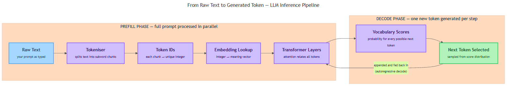

<!-- nav:top:start -->
[⬅ Previous: 3.3 — The move to AI agents](../../../1-a-brief-history-of-ai/3-3-the-move-to-ai-agents/artifacts/reading.md)&emsp;·&emsp;[⬆ Table of Contents](../../../../../../../README.md#curriculum-topic-index)&emsp;·&emsp;[Next: 3.5 — What parameters are and why they matter ➡](../../3-5-what-parameters-are-and-why-they-matter/artifacts/reading.md)
<!-- nav:top:end -->

---

# How LLMs Work — Tokens, Training, and Inference

## Overview

You type a message into an LLM (Large Language Model) and a response appears — but what actually happens between your keystroke and that first word on screen? This topic opens the hood on three interconnected mechanics: how your text is broken into pieces the model can process, how the model was taught to understand language, and how it generates a reply one step at a time. Understanding these mechanics will help you use LLMs more deliberately and explain behaviours that otherwise seem mysterious.


*From Raw Text to Generated Token — LLM Inference Pipeline*

## Key Concepts

### 1. Tokens — The Smallest Unit an LLM Sees

An LLM never reads your raw text. Before any processing can happen, your text is broken into **tokens** — the smallest chunks that an LLM processes. A token is not the same as a word: it can be a whole word, part of a word, a punctuation mark, or even a space [1].

Examples:
- "the" → one token
- "unhappiness" → might split into `un`, `happiness` (two tokens)
- "Hello, world!" → roughly four tokens: `Hello`, `,`, ` world`, `!`

**Why not individual letters?** Sequences would become extremely long, making it hard for the model to learn patterns.  
**Why not whole words?** Whole-word systems break on new words, names, and other languages — the vocabulary would be unmanageably large.

The solution is **subword tokenisation** — splitting words into smaller, frequently occurring pieces. This approach handles known and unknown words gracefully, because even an unfamiliar word can be represented as a combination of familiar subword tokens [1].

The most widely used algorithm is **Byte-Pair Encoding (BPE)** — a method that repeatedly merges the most frequent pairs of characters or subwords in training text until the desired vocabulary size is reached.

**From text to numbers.** Each token is assigned a unique integer ID. "Hello, world!" might become `[15496, 11, 995, 0]`. Each ID is then looked up in an **embedding table** — a large lookup chart that converts the integer ID into a list of numbers that encodes the token's meaning. These numbers are what the model actually computes with [1].


*The full pipeline from raw text through tokenisation, embedding, Transformer layers, and autoregressive decode — showing the prefill and decode phases.*

**Practical note on cost.** LLM APIs typically charge per token, not per word. A 1,000-word document uses roughly 1,300–1,500 tokens. Knowing this helps you estimate costs and avoid running into context limits [1].

---

### 2. Training — How the Model Learns

Training is the process of teaching the model by having it make predictions over enormous amounts of text. The task sounds simple: **next-token prediction** — given all the tokens seen so far, predict the most likely next token [2].

Here is how it works step by step:

1. The model sees a partial sentence, e.g. "The cat sat on the ___."
2. It predicts a next token — at the start, essentially at random.
3. The correct token ("mat") is revealed.
4. A process called **backpropagation** calculates how wrong the prediction was and nudges the model's internal numbers slightly toward a better answer.
5. This repeats across billions of sentences and trillions of tokens.

After enough repetitions the model becomes very good at predicting the next token in almost any context [2].

**What are parameters?** A model's **parameters** (also called weights) are the millions or billions of numbers stored inside the neural network. They are the product of training — the compressed record of everything the model learned about language, facts, and reasoning patterns. When a model is described as "70 billion parameters," that means 70 billion individual numbers were adjusted during training [2].

**The attention mechanism.** Modern LLMs are built on the Transformer architecture (introduced in topic 3.2). At its core is the **attention mechanism** — a mathematical operation that lets every token in the input "look at" every other token and decide how much weight to give it [2].

For example, in "The bank by the river was flooded":
- Without attention, "bank" is processed in relative isolation.
- With attention, the model links "bank" to "river" and "flooded" and concludes this is a riverbank, not a financial institution.

Attention is the key reason Transformers outperform earlier architectures at most language tasks.

**What the model learns.** Because predicting the next token well requires understanding grammar, facts, and reasoning, the model implicitly learns a great deal about the world — not because anyone labelled it, but because it helps prediction [2]. This is why a trained LLM can answer questions and summarise documents even though it was only ever given one task.

Training at this scale requires thousands of specialised processors running for weeks or months, which is why only a small number of organisations train frontier models from scratch [2].

---

### 3. Inference — How the Model Generates Text

**Inference** is the term for running a trained model to produce an output. When you send a prompt to an LLM and press Enter, inference begins [3].

Inference runs in two distinct phases:

**Phase 1 — Prefill.** The model processes your entire prompt at once. Every token in your input is converted to a number ID, looked up in the embedding table, and passed through all Transformer layers simultaneously. At the end, the model holds an internal representation of your full prompt and is ready to generate. The prefill phase is relatively fast because all input tokens are processed in parallel [3].

**Phase 2 — Decode (autoregressive decoding).** The model generates one token at a time:

1. Look at all input tokens plus all output tokens generated so far.
2. Predict the single most likely next token.
3. Append that token to the sequence.
4. Repeat from step 1 — until the model produces a special "end" token or reaches a length limit.

This loop is called **autoregressive decoding** — "auto" because each new token feeds back in as input for the next step, and "regressive" because it always looks backward at prior tokens. When you watch an LLM type out its answer word by word in a chat interface, you are watching autoregressive decoding in real time [3].

**Why outputs vary.** At each decode step the model produces a probability score for every token in its vocabulary — a distribution of possible next tokens — and samples from it. This is why the same prompt can produce slightly different outputs on different runs. The degree of randomness is controlled by a setting called temperature, which is covered in topic 3.6.

---

### 4. Context Window

The **context window** is the maximum number of tokens the model can "see" at one time — your prompt plus any output generated so far, combined [3]. Think of it as the model's working memory for a single conversation.

| Context window size | Roughly equivalent to |
|---|---|
| 4,000 tokens | A few pages of text |
| 32,000 tokens | A short novel chapter |
| 128,000 tokens | About 100,000 words — a full novel |

If a conversation grows longer than the context window, the oldest tokens fall off the edge and the model can no longer refer to them. This is why LLMs can "forget" something said earlier in a very long conversation — they literally cannot see that part of the exchange anymore [3].

Larger context windows are useful for summarising long documents, but they also increase the computational cost of each inference step [3].

## Worked Example

**Watching tokenisation in action.** The `tiktoken` library (for GPT-family models) lets you inspect exactly how text is tokenised:

```python
import tiktoken

enc = tiktoken.encoding_for_model("gpt-4")
tokens = enc.encode("Hello, world! Tokenisation is fun.")
print(tokens)        # a list of integer IDs
print(len(tokens))   # the token count
```

Try this with:
1. A sentence in English.
2. The same sentence translated into Hindi, Tamil, or Arabic.

You will likely see the non-English version produce three to five times as many tokens as the English version [1]. This happens because most LLM tokenisers are optimised for English vocabulary — a consequence of training data composition. The non-English sentence uses more of the context window and costs more per API call.

This single experiment builds strong intuition about two things at once: the subword nature of tokens, and why tokenisation choices have real consequences for multilingual applications.

## In Practice

**Do test tokenisation when results are unexpected.** If a model misreads a name, a code snippet, or an uncommon technical term, check how that string is tokenised. An awkward split at a word boundary can confuse the model's predictions [1].

**Do not assume one word equals one token.** Technical terms, code, URLs, and non-English text are significantly more token-expensive than plain English. Build in a buffer — roughly 1.3 tokens per word — when estimating costs or context window usage [1].

**Keep prompts purposeful.** Every token in your prompt counts against the context window limit and affects what the model attends to. Unnecessary padding dilutes attention on the parts that matter [3].

**Design explicit handling for context window overflow.** Applications that silently truncate input when the limit is exceeded can produce responses that miss critical information — with no warning to the user [3].

**Match model size to task.** A smaller model may be fast and cheap enough for simple summarisation; a larger one may be needed for complex reasoning. The inference mechanics are identical — the difference is the depth of what was learned during training [2].

**Multilingual applications need extra token budget.** Teams building for non-English languages should account for the higher token-per-sentence ratio and consider language-specific models where cost or latency is critical [1].

## Key Takeaways

- A **token** is the smallest unit an LLM processes — a subword chunk, not a full word. Text is converted to integer IDs, then to embedding vectors, before any computation begins [1].
- An LLM is trained by repeatedly predicting the next token across billions of examples; every wrong prediction nudges the model's **parameters** toward a better answer via backpropagation [2].
- The **attention mechanism** inside the Transformer lets each token relate to every other token in the context — enabling the model to resolve meaning that depends on relationships between words [2].
- **Inference** runs in two phases: **prefill** (the full prompt is processed in parallel) followed by **decode** (one token is generated at a time, autoregressively). The sequential decode step is why generation is not instantaneous [3].
- The **context window** is the hard limit on how many tokens the model can see at once; text beyond it is invisible during that call, which explains certain "forgetting" behaviours in long conversations [3].

## References

1. "What Is an LLM Token? A Beginner-Friendly Guide for Developers." *The New Stack*. https://thenewstack.io/what-is-an-llm-token-beginner-friendly-guide-for-developers/
2. Deudney. "How an LLM Actually Learns: A Hilariously Simple Guide to Training, Tokens, and Transformers." *Medium*. https://medium.com/@deudney/how-an-llm-actually-learns-a-hilariously-simple-guide-to-training-tokens-and-transformers-29e062427109
3. "How Does LLM Inference Work?" *BentoML*. https://bentoml.com/llm/llm-inference-basics/how-does-llm-inference-work

---
<!-- nav:bottom:start -->
[⬅ Previous: 3.3 — The move to AI agents](../../../1-a-brief-history-of-ai/3-3-the-move-to-ai-agents/artifacts/reading.md)&emsp;·&emsp;[⬆ Table of Contents](../../../../../../../README.md#curriculum-topic-index)&emsp;·&emsp;[Next: 3.5 — What parameters are and why they matter ➡](../../3-5-what-parameters-are-and-why-they-matter/artifacts/reading.md)
<!-- nav:bottom:end -->
