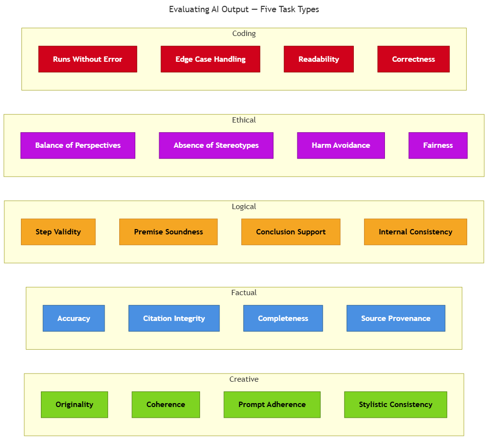

<!-- nav:top:start -->
[⬅ Previous: 3.9 — Hallucination](../../../3-ai-in-context/3-9-hallucination-what-it-is-and-why-it-happens/artifacts/reading.md)&emsp;·&emsp;[⬆ Table of Contents](../../../../../../../README.md#curriculum-topic-index)&emsp;·&emsp;[Next: 4.1 — Foundation models ➡](../../../../week-4/1-foundation-models-and-adaptation/4-1-foundation-models-trained-once-at-scale-usable-for-many-task/artifacts/reading.md)
<!-- nav:top:end -->

---

# How to Evaluate AI Output Across Five Task Types

## Overview

Ask an AI to write a poem, explain a historical event, and fix a bug — and you get three very different kinds of output. Judging all three by the same standard leads to bad decisions: a factual report is not improved by being poetic, and a poem is not broken by lacking citations. This topic gives you a structured way to evaluate AI output by matching the right criteria to the right kind of task.

## Key Concepts

### What "evaluation" means here

**Evaluation** means a human examining an AI output and making a structured judgment about its quality, correctness, and fit for the task given. This is not an automated process — you are the evaluator [3].

The key tool is an **evaluation rubric**: a checklist of specific criteria you score one at a time before reaching an overall judgment. Without a rubric, most people fall back on "does this sound convincing?" — an unreliable standard. As you saw in topic 3.9, an AI can hallucinate with full confidence, producing fluent text that is entirely wrong [1]. A rubric replaces gut feel with explicit, repeatable criteria [2].

Each criterion is rated separately — for example, Pass / Partial / Fail. This matters because AI output is often uneven: one dimension can pass while another fails, and a single overall score hides that pattern.

### Why task types need different rubrics

A **task type** is a category of what the AI was asked to produce — creative writing, factual explanation, logical reasoning, ethical commentary, or code. Quality means something different in each category [1]:

- A creative output does not need to be factually true.
- A factual output is not improved by being surprising or original.
- A logical argument can sound polished while containing a hidden gap.
- An ethical response that reflects only one cultural perspective fails even if it is well-written.
- Code that crashes on real input fails even if it looks plausible.

Applying the wrong rubric produces two errors: false confidence ("this factual report sounds engaging — it must be accurate!") and false failure ("this poem has no citations — terrible!"). Both lead to poor decisions about when to trust AI output [1][2].

### The five rubrics

**Task type 1 — Creative output**

Creative tasks ask for something original in expression: a poem, a story, a slogan, a brainstorm. Factual accuracy is not a criterion here — fiction and poetry are not expected to be true [1].

| Criterion | What to check |
|---|---|
| **Originality** | Does it bring a fresh angle or voice, or is it generic and formulaic? |
| **Coherence** | Do the ideas, images, or characters connect in a way that holds together? |
| **Prompt adherence** | Did the AI follow the creative brief — tone, length, format? |
| **Stylistic consistency** | Does the writing maintain a consistent voice and register throughout? |

**Task type 2 — Factual output**

Factual tasks ask the AI to retrieve, summarise, or explain real-world information. This is the task type most exposed to hallucination — an AI can generate a fluent, confident summary that contains errors, invented references, or distorted evidence [1].

| Criterion | What to check |
|---|---|
| **Accuracy** | Can each key claim be verified against a reliable source? |
| **Citation integrity** | If references are given, do they actually exist and say what the AI claims? |
| **Completeness** | Are important facts missing that would change the overall picture? |
| **Source provenance** | Can you trace where the information came from? "Studies show…" without naming any study is a provenance failure (topic 3.9). |

**Task type 3 — Logical output**

Logical tasks ask the AI to reason toward a conclusion — evaluating an argument, checking consistency, or inferring what follows from a set of conditions. Each step in the chain should follow validly from the step before it [1].

| Criterion | What to check |
|---|---|
| **Step validity** | Does each reasoning step follow from what came just before it? |
| **No unwarranted leaps** | Does the argument skip from an early premise to a distant conclusion without the intermediate steps? |
| **Correct conclusion from premises** | Does the final conclusion follow from the starting premises, not just from how confident the text sounds? |
| **Acknowledgment of uncertainty** | Where reasoning depends on assumptions, does the output say so? Overconfidence here is a calibration failure (topic 3.8). |

**Task type 4 — Ethical output**

Ethical tasks ask the AI to comment on questions of right and wrong, fairness, or social impact. These are sensitive because genuinely competing values may exist, and there is often no single correct answer [1]. AI trained on large text datasets may embed cultural biases or present one viewpoint as universal [3].

| Criterion | What to check |
|---|---|
| **Balance of perspectives** | Does the output represent more than one legitimate viewpoint on a contested question? |
| **Absence of harmful stereotypes** | Does the output avoid generalisations about groups that could reinforce stereotypes? |
| **Appropriate caveats** | Does the output acknowledge the limits of its own perspective, especially across cultural contexts? |
| **AI values not presented as universal** | Does the output acknowledge that other ethical frameworks exist, rather than treating one as the obvious answer? |

**Task type 5 — Coding output**

Coding tasks ask the AI to write, fix, or explain code. Unlike the other four types, code has a direct, testable relationship with correctness — you run it and see what happens. But running without crashing is only the floor, not the ceiling [1].

| Criterion | What to check |
|---|---|
| **Runs without error** | Does it execute without syntax or runtime errors? |
| **Meets stated requirements** | Does it actually do what was asked — not just something related? |
| **Handles edge cases** | What happens with empty input, null values, or boundary conditions? AI code frequently handles the happy path and breaks on edge cases. |
| **Readability** | Are variable names, structure, and comments clear enough for a reader to understand what the code does? |

### Quick-reference summary

| Task type | Primary question | Do NOT use as the primary bar |
|---|---|---|
| Creative | Is it original, coherent, and faithful to the brief? | Factual accuracy |
| Factual | Is it accurate, and do the sources actually exist? | Originality or novelty |
| Logical | Does each step follow validly from the last? | Fluency or confident tone |
| Ethical | Are all affected perspectives represented fairly? | Whether you personally agree |
| Coding | Does it run, meet requirements, and handle edge cases? | Whether it sounds plausible |

*Comparison matrix showing the five task types and their primary evaluation criteria — use this as a quick reference when selecting your rubric.*

## Worked Example

A student asks an AI to write a paragraph about the causes of climate change for their portfolio. The output is three sentences long, fluently written, and mentions rising CO2 levels, deforestation, and "a 2021 study by Carter et al. in the Journal of Climate Science."

This is a **factual task**, so the student applies the factual rubric:

1. **Accuracy** — The student checks the two main claims (CO2 and deforestation as causes). Both check out against reliable sources. *Pass.*

2. **Citation integrity** — The student searches Google Scholar and the Journal of Climate Science's archive for "Carter et al. 2021." The paper does not appear anywhere. The citation sounds real — plausible authors, a real journal name, a recent year — but it does not exist. This is attributional hallucination (topic 3.9): the AI invented a reference. *Fail.*

3. **Completeness** — The paragraph omits industrial agriculture and methane emissions, which are significant contributors. A reader would come away with an incomplete picture. *Partial.*

4. **Source provenance** — Apart from the invented citation, the other claims have no attributed source at all. The paragraph asserts facts without grounding them. *Fail.*

**Decision:** The student cannot accept this output as-is. Two criteria failed outright. The invented citation is the most serious problem — using it in a portfolio would be citing a source that does not exist. The student rejects the output, regenerates without the citation, and manually adds a real reference they verified. They document what went wrong and why they regenerated [1][2].

## In Practice

Use this five-step workflow on any AI output [2][3]:

1. **Identify the task type** before you read the output carefully. If the task crosses types (a factual argument with ethical implications), note both and apply both rubrics to the relevant sections.
2. **Select the rubric before reading the output.** Committing to criteria in advance protects your judgment from the output's surface quality — if you read first, the fluency anchors your expectations.
3. **Apply each criterion independently.** Assign a rating (Pass / Partial / Fail) and write one sentence of evidence per criterion. Do not let a strong score on one dimension hide a failure on another.
4. **Identify the most serious failure.** A hallucinated citation in a factual report is more serious than a minor stylistic inconsistency in a brainstorm. Prioritise what to address first [3].
5. **Document your decision.** Record ratings, your overall decision (accept / accept with edits / reject), and what prompted it. Undocumented acceptance of flawed output is a quality risk; documented acceptance with clear reasoning is an informed professional decision [2].

**Key do/don't:**

- **Do** commit to your rubric before reading the output — reading first anchors your judgment to surface fluency [2].
- **Do** verify factual claims and citations against a source you trust that was not produced by the same AI [3].
- **Don't** treat "sounds convincing" as a passing criterion for any task type — overconfidence bias (topic 3.9) means AI systems can be wrong with full confidence [1].
- **Don't** collapse all criteria into a single overall impression — AI output is commonly uneven across dimensions [1][2].

## Key Takeaways

- **Fluency is not quality.** An AI can produce polished, confident-sounding text that is factually wrong, logically broken, or ethically lopsided. "Sounds right" is not a verification method [1].
- **Match the rubric to the task type.** There are five types — creative, factual, logical, ethical, coding — and each requires genuinely different criteria. Applying the wrong rubric produces meaningless results [1][2].
- **Rate criteria independently.** AI output is often uneven: a creative output can be coherent but unoriginal; a factual output can be accurate but miss a key fact; code can run correctly on expected input and fail on edge cases [2][3].
- **The five-step workflow is repeatable.** Identify task type → select rubric first → apply criteria independently → name the worst failure → document and decide. This process scales from a quick mental check to a written rubric with documented ratings [2][3].
- **Invented citations are invisible without verification.** Attributional hallucination (topic 3.9) produces references that look real. The only way to catch them is to check — paste the citation into a search engine or database and confirm it exists [1].

## References

1. Walturn. "Evaluating AI-Generated Content." https://www.walturn.com/insights/evaluating-ai-generated-content
2. Encord. "Rubric Evaluation: Generative AI Assessment." https://encord.com/rubric-evaluation-generative-ai-assessment/
3. Mind the Product. "How to Implement Effective AI Evaluations." https://www.mindtheproduct.com/how-to-implement-effective-ai-evaluations/

---
<!-- nav:bottom:start -->
[⬅ Previous: 3.9 — Hallucination](../../../3-ai-in-context/3-9-hallucination-what-it-is-and-why-it-happens/artifacts/reading.md)&emsp;·&emsp;[⬆ Table of Contents](../../../../../../../README.md#curriculum-topic-index)&emsp;·&emsp;[Next: 4.1 — Foundation models ➡](../../../../week-4/1-foundation-models-and-adaptation/4-1-foundation-models-trained-once-at-scale-usable-for-many-task/artifacts/reading.md)
<!-- nav:bottom:end -->
