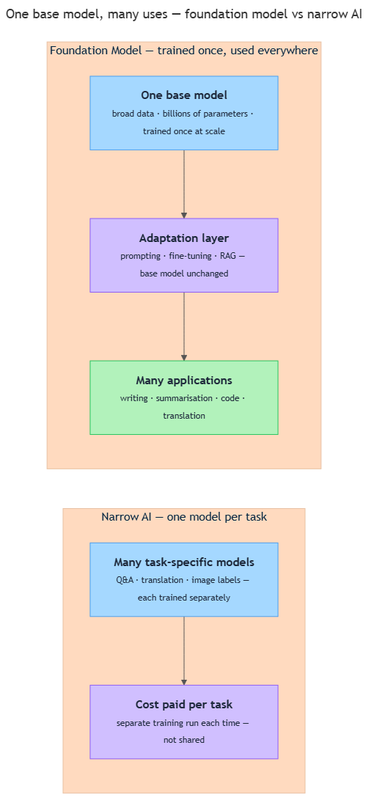

<!-- nav:top:start -->
[⬅ Previous: 3.10 — How to evaluate AI output across five task types](../../../../week-3/4-evaluating-ai-output/3-10-how-to-evaluate-ai-output-across-five-task-types-creative-fa/artifacts/reading.md)&emsp;·&emsp;[⬆ Table of Contents](../../../../../../../README.md#curriculum-topic-index)&emsp;·&emsp;[Next: 4.2 — Fine-tuning ➡](../../4-2-fine-tuning-adapting-a-foundation-model-on-domain-specific-d/artifacts/reading.md)
<!-- nav:top:end -->

---

# Foundation models — trained once at scale, usable for many tasks

## Overview

Before foundation models existed, AI worked like a set of single-use tools: one tool to translate, one to detect spam, one to recognise faces. A foundation model breaks that pattern. It is one large AI model trained on massive amounts of data, which can then be applied to many different tasks without being retrained from scratch. [1] Understanding what a foundation model is — and why "trained once at scale" leads to general-purpose capability — is the starting point for everything in this module.

## Key Concepts

### What is a foundation model?

**Foundation model** — a large AI model trained on broad, diverse data at massive scale, which can then be applied to a wide range of tasks. [1]

The word "foundation" is deliberate. Think of a building's foundation: it is not the finished structure, but it is the base that every finished structure stands on. A foundation model is the base layer. Developers and organisations build specific applications on top of it. [2]

Three things separate a foundation model from earlier AI:

- **Breadth of training data.** Earlier models trained on narrow, task-specific datasets — thousands of labelled cat-and-dog images to build one image classifier, for example. Foundation models train on enormous, general datasets: billions of web pages, books, scientific papers, code repositories, and images. [1]
- **Size.** Foundation models contain billions — sometimes hundreds of billions — of parameters (the learned numerical settings introduced in topic 3.5). That size lets them encode a vast range of knowledge. [1]
- **General capability.** Because the training data is so broad, the resulting model develops a general-purpose understanding of language, concepts, and even images. It is not locked into one task. [2]

One clarification worth making early: **LLM (Large Language Model)** and **foundation model** are related but not the same. An LLM is a foundation model trained primarily on text. But foundation models can also be trained on images, audio, video, or combinations. Every LLM is a foundation model — but not every foundation model is an LLM. [3]

**Multimodal model** — a foundation model that can process and generate more than one type of data, such as both text and images. [2]

*One foundation model replaces many narrow models — each earlier system handled only one task, while a foundation model handles many.*

### Trained once at scale — what this means

The phrase has two parts, and both matter.

**"At scale"** refers to the size and cost of training. Building a foundation model requires:

1. Enormous datasets — trillions of words and millions of images.
2. Massive computing power — hundreds or thousands of specialised processors running for weeks or months.
3. Significant financial investment — training a leading model can cost tens of millions of dollars. [1]

This is why only a small number of organisations — large technology companies and well-funded research labs — train foundation models from scratch. Most teams use models that others have already trained. [2]

**"Trained once"** means the large-scale training happens one time (with occasional periodic updates). The resulting model — with all its billions of parameters — is saved and distributed. Every time someone uses it, they are using that single trained result. The model is not retrained from scratch for each new use. [1]

Why does this matter economically? The enormous upfront cost is shared across all the uses that follow. One model trained once can serve millions of users and thousands of different tasks. [2]

### Usable for many tasks — why one model generalises

The most surprising thing about foundation models, when they first appeared, was this: a model trained to predict the next word turned out to be useful for dozens of completely different tasks.

Why? Because the patterns learned from enormous, diverse data are not narrow rules. They are deep representations of meaning, structure, and relationships. [1] A model that has processed billions of sentences across every topic imaginable develops an understanding of how arguments are built, how technical language differs from casual conversation, and how concepts relate across domains. [3]

That general capability means the same model can handle all of the following without any retraining:

- Answer a factual question ("What is the capital of France?")
- Write a formal email
- Summarise a long document into three bullet points
- Translate a sentence from English to Hindi
- Generate a short piece of code
- Describe what is happening in an image (for multimodal models)

None of these are separate trained skills. They are all expressions of the same underlying learned representations. [1]

The contrast with earlier AI is worth making explicit:

| Earlier narrow AI | Foundation model |
|---|---|
| One model per task | One model, many tasks |
| Trained on task-specific labelled data | Trained on broad, diverse data |
| Fixed capability — only does what it was trained for | Flexible — can be prompted or adapted for new tasks |
| Low training cost (small dataset, small model) | High training cost (massive dataset, massive model) |
| Full training cost paid for one use case | Large training cost spread across many use cases |

[1][2]

### Adaptation — a brief introduction

A foundation model is capable straight away, but it is often not perfectly suited to a specific application without some adjustment. That adjustment is called **adaptation**.

You do not need to understand the mechanics yet — each method has its own dedicated topic coming up. But it is worth knowing three adaptation approaches exist:

- **Prompting** — giving the model written instructions that guide its behaviour for a specific task, without changing the model itself. You have done this whenever you have typed a question into an AI chat interface.
- Fine-tuning — specialising the model further on a smaller, domain-specific dataset (covered in topic 4.2).
- RAG (Retrieval-Augmented Generation) — giving the model access to external documents at the moment it answers a question (covered in topic 4.3).

The key point for this topic: adaptation sits on top of the foundation model. The expensive trained base stays the same; only the layer above it changes. [1]

## Worked Example

Imagine three different organisations, each with a completely different need:

- A **hospital** wants a tool that summarises patient notes.
- A **law firm** wants a tool that reviews contracts for unusual clauses.
- A **travel company** wants a chatbot that answers booking questions in Hindi and English.

Before foundation models, each organisation would have needed to commission and train a separate AI system from scratch — different data, different engineers, different costs.

With a foundation model, the process is different:

1. One large model is trained once (by a research lab or technology company).
2. Each organisation takes that same base model.
3. Each organisation adds a thin adaptation layer suited to their use case — for example, a set of instructions (prompting) or additional training on their own documents (fine-tuning).
4. The result is three specialised tools, all built on the same foundation.

The expensive step (step 1) is paid for once and shared. The affordable steps (steps 2–4) are what each organisation does for themselves. That is the economic logic of "trained once at scale, usable for many tasks." [1][2]

## In Practice

Foundation models are now a core layer in AI products encountered every day. Here are real examples from 2023–2026:

**Text-based foundation models (LLMs)**

- **GPT-4 / GPT-4o (OpenAI)** — powers ChatGPT; used for conversation, writing, and coding help. [2]
- **Gemini (Google DeepMind)** — integrated into Google Search, Docs, and Gmail. [1]
- **Claude (Anthropic)** — designed with a focus on safety and helpfulness. [3]
- **Llama (Meta AI)** — an **open-weights** model (meaning the model's learned parameters are publicly released so anyone can download and run it) that organisations can deploy on their own infrastructure. [3]

**Multimodal foundation models**

- **DALL-E, Stable Diffusion, Midjourney** — trained on text-image pairs; generate images from text descriptions. [3]
- **Whisper (OpenAI)** — trained on audio; transcribes speech to text across dozens of languages. [3]

**In India**

- **Krutrim (Ola)** — India's first publicly announced foundation model, designed for Indian languages including Hindi, Tamil, Telugu, and Bengali. [3]

The pattern across all examples is identical: one large model trained once, then deployed or adapted for many specific applications. [1][2]

**Practical principles when working with foundation models:**

- **Understand what the model was trained on.** A model trained mainly on English text will perform better in English than in other languages.
- **Bigger is not always better for your task.** A smaller, well-adapted model can outperform a larger general one on a specific, narrow task.
- **Recognise the knowledge cutoff.** A foundation model's knowledge is frozen at the end of its training run. It does not know about events after that date unless given specific tools to look things up. This is a direct result of the "trained once" property.
- **Treat the base model as a starting point.** Deploying a raw foundation model directly to users without adaptation or safety constraints is rarely appropriate in real products. [1]

## Key Takeaways

- A **foundation model** is a large AI model trained once on massive, diverse data, which can then be applied to many different tasks — it is a base layer, not a finished application. [1]
- "Trained at scale" means a large, one-time training process using vast datasets and enormous computing power — a cost shared across all subsequent uses. [1][2]
- Foundation models generalise across many tasks because broad training produces deep, general-purpose internal representations — not narrow rules for a single job. [1][3]
- **LLMs** are the most common type of foundation model (trained primarily on text), but **multimodal models** extend this to images, audio, video, or combinations. [2][3]
- Foundation models are almost always adapted for specific applications through prompting, fine-tuning, or RAG — the mechanics of each are covered in the topics that follow.

## References

[1] Google Cloud. "What Are Foundation Models?" https://cloud.google.com/discover/what-are-foundation-models

[2] Humanloop. "Foundation Models." https://humanloop.com/blog/foundation-models

[3] Wikipedia. "Foundation model." https://en.wikipedia.org/wiki/Foundation_model

---
<!-- nav:bottom:start -->
[⬅ Previous: 3.10 — How to evaluate AI output across five task types](../../../../week-3/4-evaluating-ai-output/3-10-how-to-evaluate-ai-output-across-five-task-types-creative-fa/artifacts/reading.md)&emsp;·&emsp;[⬆ Table of Contents](../../../../../../../README.md#curriculum-topic-index)&emsp;·&emsp;[Next: 4.2 — Fine-tuning ➡](../../4-2-fine-tuning-adapting-a-foundation-model-on-domain-specific-d/artifacts/reading.md)
<!-- nav:bottom:end -->
