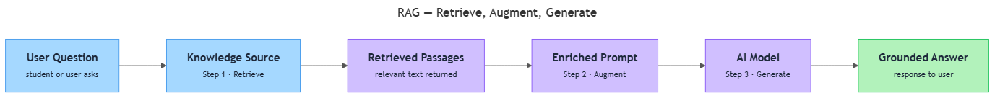

<!-- nav:top:start -->
[⬅ Previous: 4.2 — Fine-tuning](../../../1-foundation-models-and-adaptation/4-2-fine-tuning-adapting-a-foundation-model-on-domain-specific-d/artifacts/reading.md)&emsp;·&emsp;[⬆ Table of Contents](../../../../../../../README.md#curriculum-topic-index)&emsp;·&emsp;[Next: 4.4 — Agents ➡](../../4-4-agents-llm-plus-memory-tools-and-a-planning-loop-conceptual/artifacts/reading.md)
<!-- nav:top:end -->

---

# Retrieval-Augmented Generation (RAG) — giving AI access to external knowledge at query time

## Overview

Foundation models are powerful, but their knowledge is frozen at the end of training. Ask one about an event from last week or a document your organisation published yesterday and it either admits it does not know — or, more dangerously, invents a confident-sounding answer. **Retrieval-Augmented Generation (RAG)** solves this by giving a foundation model access to external knowledge at the exact moment it answers a question, without retraining the model at all [1]. Understanding RAG matters because it is the dominant pattern organisations use in 2025–2026 to deploy AI on private, current, or rapidly changing knowledge [1][3].

## Key Concepts

### The problem: frozen knowledge

A foundation model's knowledge comes entirely from its training data. Once training ends, that knowledge is fixed at a **knowledge cutoff** — a point in time after which the model has no information [1]. This creates two practical problems:

- **Outdated information.** Laws change, products launch, prices shift. A model trained in 2024 may give dangerously out-of-date answers when asked in 2026 [1][3].
- **Private or proprietary knowledge.** No foundation model was trained on your organisation's internal HR policies, product manuals, or customer records — those documents were never in any public training dataset [2][3].

Fine-tuning (covered in topic 4.2) partially addresses these problems, but every update requires a new training run — expensive and slow. It also cannot keep up with information that changes daily [1][2]. RAG takes a different approach: instead of baking new knowledge permanently into the model's internal numeric settings (its parameters), it supplies fresh information to the model at the moment the question is asked. The model's parameters do not change at all; only the input changes [1].

### The RAG pipeline — three steps

The name spells out the mechanism: **Retrieve**, **Augment**, **Generate**. [1][2]

*The RAG pipeline: user question flows through Retrieve → Augment → Generate to produce a grounded answer.*

**Step 1 — Retrieve**

When a user sends a question (called a **query**), the RAG system does not immediately pass it to the foundation model. First, it searches a **knowledge source** — a pre-organised collection of documents the system is allowed to search, such as a company's policy files, a product catalogue, or a legal library — and returns the passages most relevant to the question [1][2].

How relevance is measured uses advanced techniques called *embeddings*, *vector databases*, and *similarity search*. These are named here so you know they exist; you will study them fully in Week 14. They are not required at this stage [2][3].

**Step 2 — Augment**

The retrieved passages are combined with the user's original question to form an **enriched prompt** — the actual input sent to the foundation model [1]. Think of it as a message that says: "Here is some relevant context I found — [retrieved passages] — and here is the question: [question]. Please answer using this context." The model never sees a bare question; it always receives the question together with supporting material [2].

**Step 3 — Generate**

With the enriched prompt in hand, the foundation model generates its response by drawing on both its trained general knowledge and the specific retrieved passages [1]. Because the model has accurate, current source material to work from, it produces a more precise, grounded answer — and is far less likely to fabricate facts [1][2][3].

### Why RAG reduces hallucination

**Hallucination** (introduced in topic 4.2) is when a model produces output that sounds confident but is factually wrong or invented. It happens most often when the model is asked about information it does not have — recent events, private documents, or specialist knowledge that was sparse in its training data.

RAG reduces hallucination because the model is no longer generating from memory alone. Consider this analogy: ask a colleague to explain your company's refund policy from memory, then ask them to read the policy document first and explain it. The second approach produces more accurate answers — not because the colleague became smarter, but because they had access to the actual source [1]. RAG applies the same principle to foundation models.

RAG does not eliminate hallucination entirely — the model can still misread retrieved material — but the probability of fabricated facts drops significantly when accurate source material grounds the response [3].

### RAG vs. fine-tuning

Both are adaptation methods that make a foundation model more useful for a specific purpose. They work differently and suit different situations [1][2].

| Dimension | Fine-tuning | RAG |
|---|---|---|
| What changes | The model's parameters are updated | Parameters stay unchanged; only the input prompt changes |
| When learning happens | Before deployment — during a training step | At query time — information retrieved fresh for every question |
| How to update knowledge | Requires a new training run | Update the document library; no retraining needed |
| Best for | Stable domains needing specialist language and tone | Frequently updated or private information |
| Hallucination reduction | Teaches correct outputs during training | Provides source material at answer time |

[1][2][3]

Fine-tuning and RAG are not competitors — they are often deployed together. A model might be fine-tuned to adopt the right tone for a domain, and also given a RAG pipeline so it always answers from current documents [1][3].

**Prefer RAG when:**
- Information changes frequently (news, prices, regulations, inventory).
- Information is private and was never in public training data.
- You need answers to cite their source documents so they can be verified.
- You need to add knowledge quickly, without time and cost of retraining [1][2].

**Prefer fine-tuning when:**
- The task requires consistent specialist language and tone across all outputs.
- The domain is stable and unlikely to change often.
- The improvement needed is in how the model reasons, not just what facts it can access [2].

## Worked Example

Consider a customer-support chatbot for an e-commerce company. The company updates its product catalogue weekly — new items, price changes, discontinued products.

Here is how RAG handles a customer question:

1. **Customer asks:** "Is the Sona Masoori rice 5 kg bag still available, and what does it cost?"
2. **Retrieve:** The RAG system searches the company's current product catalogue documents. It finds the relevant entry: "Sona Masoori rice, 5 kg, in stock, ₹320."
3. **Augment:** The system combines the retrieved entry with the customer's question to form an enriched prompt: *"Context: Sona Masoori rice 5 kg is in stock at ₹320. Question: Is the 5 kg bag still available and what does it cost?"*
4. **Generate:** The foundation model reads the enriched prompt and responds: "Yes, the Sona Masoori rice 5 kg bag is in stock and costs ₹320."

Without RAG, the foundation model would have no access to the company's catalogue. It would either refuse to answer or, worse, invent a price from its training data — which could be months out of date. The RAG pipeline makes the answer accurate and current, without ever retraining the model [1][2].

When the product price changes next week, the company updates one document in the knowledge source. The chatbot immediately reflects the change for every customer — no new model deployment needed [1].

## In Practice

RAG is one of the most widely deployed AI patterns in enterprise settings as of 2025–2026 [1][3]. Common deployments include:

- **Enterprise document Q&A.** Employees ask questions about internal HR policies, compliance guidelines, or product manuals in natural language and get answers grounded in those specific documents, with references to source passages [1][2].
- **Customer support chatbots.** Chatbots query the current product catalogue and FAQs at query time; updating a price or policy in the knowledge source takes effect immediately, for all users [1][3].
- **Legal and compliance.** Law firms and compliance teams query large libraries of legislation and case law. The model retrieves current legal text rather than relying on training-data recall that may be outdated [3].
- **Healthcare reference.** Clinicians query up-to-date clinical guidelines and drug interaction databases; the knowledge source is updated as guidelines change, without retraining [2][3].
- **India-specific context.** Government agencies and large enterprises are deploying RAG-based systems to give staff and citizens access to current policy documents and scheme guidelines across multiple languages — updating the knowledge source as policy changes, without retraining the underlying model [2].

**Key do/don't for RAG:**

| Do | Don't |
|---|---|
| Keep the document library actively maintained | Let source documents become stale — outdated documents produce outdated answers |
| Build attribution into the interface — show which passages grounded the answer | Treat RAG as a set-and-forget system; curation is ongoing |
| Write specific, precise queries — vague questions produce vague retrieval | Use RAG as a substitute for fine-tuning when the problem is tone or reasoning style, not factual currency |

## Key Takeaways

- **RAG (Retrieval-Augmented Generation)** gives a foundation model access to external knowledge at query time. It does not change the model's parameters — it changes what the model is given to read before it answers [1].
- The three-step pipeline is: **retrieve** relevant passages from a knowledge source, **augment** the user's question with those passages to form an enriched prompt, then **generate** a grounded answer from that enriched input [1][2].
- RAG reduces hallucination because the model generates its answer from actual retrieved source material, rather than relying entirely on patterns memorised during training [1][3].
- RAG and fine-tuning solve different problems and are often used together: fine-tuning changes how the model behaves by updating its parameters; RAG changes what the model knows at the moment it answers, without touching the model [2][3].
- Advanced RAG components — *embeddings*, *vector databases*, *similarity search*, *chunking* — power the retrieval step. You will study them fully in Week 14 [2][3].

## References

[1] IBM. "What is Retrieval-Augmented Generation?" *IBM Think*. https://www.ibm.com/think/topics/retrieval-augmented-generation

[2] Weaviate. "Introduction to RAG." *Weaviate Blog*. https://weaviate.io/blog/introduction-to-rag

[3] Stack Overflow Blog. "Retrieval-Augmented Generation: Keeping LLMs Relevant and Current." *Stack Overflow Blog*, 18 Oct 2023. https://stackoverflow.blog/2023/10/18/retrieval-augmented-generation-keeping-llms-relevant-and-current/

---
<!-- nav:bottom:start -->
[⬅ Previous: 4.2 — Fine-tuning](../../../1-foundation-models-and-adaptation/4-2-fine-tuning-adapting-a-foundation-model-on-domain-specific-d/artifacts/reading.md)&emsp;·&emsp;[⬆ Table of Contents](../../../../../../../README.md#curriculum-topic-index)&emsp;·&emsp;[Next: 4.4 — Agents ➡](../../4-4-agents-llm-plus-memory-tools-and-a-planning-loop-conceptual/artifacts/reading.md)
<!-- nav:bottom:end -->
