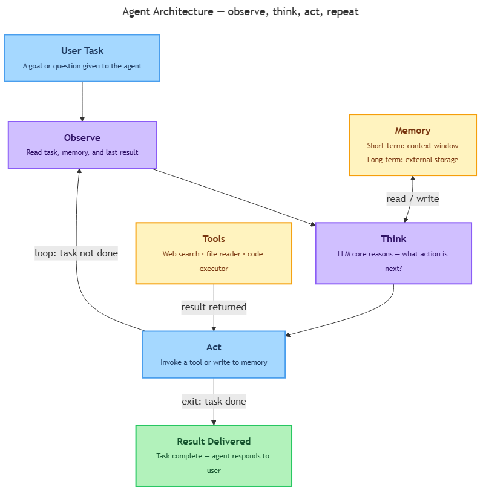

<!-- nav:top:start -->
[⬅ Previous: 4.3 — Retrieval-Augmented Generation (RAG)](../../4-3-retrieval-augmented-generation-rag-giving-ai-access-to-exter/artifacts/reading.md)&emsp;·&emsp;[⬆ Table of Contents](../../../../../../../README.md#curriculum-topic-index)&emsp;·&emsp;[Next: 4.5 — Tool use ➡](../../4-5-tool-use-ai-calling-search-calculator-and-code-runner/artifacts/reading.md)
<!-- nav:top:end -->

---

# Agents — LLM plus memory, tools, and a planning loop

## Overview

Until now, the AI systems in this course have worked like a one-turn conversation: you ask a question, the model produces a response, and the exchange is done. An **AI agent** is something fundamentally different — it is a system that puts a foundation model at the centre of an active, multi-step process, giving it memory, tools, and a planning loop so it can pursue a goal that no single prompt could accomplish. [1] Understanding agents gives you the mental model to make sense of the most ambitious AI applications being deployed in 2026 — from coding assistants to autonomous research tools. It also gives you the vocabulary to evaluate agent design decisions: what memory approach is appropriate, when a human checkpoint is required, and what a tool actually enables versus what the LLM core provides on its own.

## Key Concepts

### What makes something an agent?

The everyday word "agent" means something that acts on behalf of someone else — a travel agent books your flights, a real estate agent finds your home. In AI, the meaning is similar: a system that acts on behalf of a user, in the world, to get a task done. [1][2]

Three properties separate an AI agent from a plain LLM (Large Language Model):

1. **It takes actions, not just produces text.** A standalone LLM generates a response and stops. An agent can do things: search the web, send an email, read a file, write to a database — actions with real-world effects beyond the conversation window. [1]
2. **It runs multiple steps in a loop.** A standalone LLM responds once per prompt. An agent keeps working — deciding what to do next, doing it, checking the result, deciding again — until the task is complete. [2]
3. **It has memory.** A standalone LLM knows only what is in its current context window (the block of text visible to the model at any moment). An agent maintains memory across steps and, in more sophisticated designs, across separate sessions. [1][2]

Together, these three additions transform a passive text generator into an active task-completion system. A human professional tackling a complex brief reads sources, takes notes, revisits earlier decisions, and adjusts the approach as new information arrives — an AI agent follows the same pattern, orchestrating the loop at machine speed. This is why agents, rather than standalone models, are the architecture of choice for ambitious applications in 2026. [1]

### The four components of an agent

Every AI agent, regardless of its specific design, is built from four fundamental components: the **LLM core**, **memory**, **tools**, and the **planning loop**. [1][2][3]

> **Framing note:** Topic 3.3 introduced a five-component view — goal, planning, tool use, memory, and feedback loop — describing what an agent *does* step by step. This topic uses a four-component architectural view describing what an agent *is built from*. The two are compatible: goal is the input to the planning loop; feedback loop is the rhythm the planning loop runs. Both framings describe the same system.

A useful shorthand: think of the LLM core as the brain, memory as the notepad, tools as the hands, and the planning loop as the rhythm that keeps everything moving.

*The four-component agent architecture: the LLM core reasons at every step, memory persists information, tools enable real-world action, and the planning loop drives the cycle from task arrival to result delivered.*

**The LLM core — the reasoning engine**

The **LLM core** is a foundation model (as introduced in topic 4.1). At each step, it receives a description of the current situation — the task, the memory of what has happened so far, what the last action returned — and decides what should happen next. [1][3] The LLM core does not perform actions itself. It reasons about actions and generates instructions for the rest of the system to carry out. The tools and loop provide capability; the LLM core provides intelligence.

**Memory — what the agent remembers**

**Memory** lets an agent retain information across steps. Without it, each pass through the loop would start from scratch, as if nothing had happened before. [2]

There are two kinds of memory:

| Memory type | Where it lives | How long it lasts | Example |
|---|---|---|---|
| **Short-term memory** (working memory) | The model's context window | Current session only | The task, steps taken so far, last tool result |
| **Long-term memory** (external memory) | An external database or file | Persists across sessions | A preference stated three weeks ago; a decision from a previous project |

Long-term memory does not change the model's internal weights — it is external storage the agent reads from and writes to. RAG (introduced in topic 4.3) is one specific way of pulling long-term memory into the context window at the moment it is needed. An agent may use a RAG pipeline as part of its memory system. [1][3]

**Tools — what the agent can do**

A **tool** is any external capability the agent can invoke. Tools are what turn reasoning into doing. [1][2]

Common examples:

- **Web search** — issues a query and receives current results, extending the agent beyond its training knowledge.
- **Code executor** — runs a computation and returns the result for the agent to reason about.
- **Calendar or booking system** — checks availability and makes reservations on behalf of the user.
- **File reader / writer** — reads a document, extracts information, or writes a new document.
- **API (Application Programming Interface) call** — communicates with an external software service: checking a weather forecast, sending an email, querying a database, posting to a system. [1][2][3]

The LLM core does not directly call these external services. It generates instructions that the surrounding system uses to invoke the right tool; the result comes back to the LLM core for its next reasoning step.

**The planning loop — how everything connects**

The **planning loop**, also called the **observe-think-act cycle**, is the repeating sequence that drives the agent from the start of a task to its completion. [1][2]

The three phases:

1. **Observe.** The agent reads the current state of the world and the task — at the start, this is the user's request; at later stages it also includes tool results and retrieved documents. The LLM core assembles this from short-term memory. [1]
2. **Think.** The LLM core reasons about what has been observed and decides what to do next: which tool (if any) to invoke, whether the task is complete, or whether human input is needed. [1][2]
3. **Act.** The agent executes the decision — invoking a tool, writing to memory, responding to the user, or pausing to ask a clarifying question. The result feeds back into the next observe phase. [1]

The cycle repeats — observe, think, act; observe, think, act — until one of three things happens: the task is complete, the agent determines it cannot proceed and returns an explanation, or it encounters a decision requiring human judgement and pauses to ask. [2][3]

Each individual loop is simple. Complex tasks are handled by running the loop many times, with different tool calls and different observations at each step. This is the design's core insight: a task that would overwhelm any single prompt becomes tractable when broken across many short cycles. Each pass only needs to make one decision — what to do right now — and the accumulated result of many such decisions handles problems of genuine complexity without any single step needing to be elaborate.

### What is an agentic workflow?

An **agentic workflow** is any real-world process structured around an agent's planning loop rather than a single prompt-response exchange. [1][2]

The user specifies a goal ("research this topic and produce a summary report"), not individual steps. The agent sequences its own actions to reach that goal — tools are called dynamically, memory accumulates across steps, and the sequence is determined at runtime, not pre-programmed.

Agentic workflows are the dominant design pattern for ambitious AI applications in 2026: coding assistants, research tools, customer service platforms, and scheduling systems. Multi-agent systems — where several agents work in concert — are an extension of this pattern you will explore in Week 14. [1]

## Worked Example

**Task:** "Find the opening hours of the National Museum in Delhi, check whether Saturday 28 June is available, and draft a confirmation email."

Here is how an agent works through this using the observe-think-act cycle:

**Cycle 1 — find the opening hours**
- *Observe:* Task received: find opening hours of the National Museum, Delhi.
- *Think:* I need current information I don't have. I'll use web search.
- *Act:* Invoke web search tool → result: "National Museum, Delhi: Tuesday–Sunday 10:00–18:00, closed Monday."

**Cycle 2 — check the date**
- *Observe:* Hours retrieved. Next sub-task: check whether 28 June is a Saturday and not a holiday.
- *Think:* I can reason about dates directly. 28 June 2025 is a Saturday. No public holiday flagged. The museum is open.
- *Act:* Write result to short-term memory: "Museum open Saturday 28 June, 10:00–18:00."

**Cycle 3 — draft the email**
- *Observe:* Opening hours confirmed and stored. Final sub-task: draft a confirmation email.
- *Think:* I have everything I need. I'll draft the email now.
- *Act:* Generate draft email → return to user.

**Task complete.** Three cycles, two tool calls (web search, memory write), one reasoning step using in-context knowledge. The user stated the goal once; the agent planned and sequenced every step.

## In Practice

**Where agentic workflows appear**

- **Coding assistants** — given a bug report, the agent reads source files, reasons about the change, writes a fix, runs tests, reads the test output, and iterates until tests pass. [1][3]
- **Research assistants** — accept a question, search the web, retrieve and read documents, synthesise findings, and produce a structured report without step-by-step direction. [1][2]
- **Customer service automation** — look up an account, check order status, apply a refund policy (via RAG), and initiate a transaction — a multi-step workflow completed end to end. [2][3]
- **Scheduling** — check multiple calendars, find a meeting slot, send invitations, and reschedule on conflict. [1]

**Design principles to keep in mind**

- **Give agents goals, not scripts.** An agent is most useful when given a goal to pursue. Pre-specifying every step removes the reasoning advantage that makes agents valuable. [1] Consider the difference between telling the agent "find everything published this month about AI safety regulations and produce a two-page summary" versus scripting every URL to visit and field to extract — the goal-level instruction adapts when a source changes structure; the rigid script breaks.
- **Build in human checkpoints for irreversible actions.** Before the agent sends an email, processes a payment, or deletes a file, it should pause and ask for confirmation. Fully autonomous action is appropriate only for easily reversible, low-stakes steps. [2][3]
- **Match memory to the task timescale.** Short-term memory is right for within-session information. Long-term memory is right for information that must persist across sessions. Storing everything externally creates noise; storing nothing forces the user to re-state context every time. [1][2]
- **Design for transparency.** Logging which tools the agent called, what results it received, and what decisions it made at each step is as important as the final outcome. [2]

## Key Takeaways

- An **AI agent** puts a foundation model (the LLM core) at the centre of an active, multi-step process, giving it memory, tools, and a planning loop so it can pursue goals that no single prompt could accomplish. [1]
- The **observe-think-act cycle** is the repeating engine of every agent: observe the current state, think about what to do next, act by invoking a tool or producing output — then repeat until the task is complete. [1][2]
- **Memory** comes in two forms: short-term memory (what the agent holds in its context window during a session) and long-term memory (external storage that persists across sessions). RAG is one specific way of pulling long-term memory into the context window when needed. [1][3]
- **Tools** are the agent's hands — they give the LLM core the ability to act in the world: searching the web, reading and writing files, making API (Application Programming Interface) calls, and executing computations. Without tools, the agent can only reason; tools let it do. [2]
- An **agentic workflow** is a real-world process structured around an agent's planning loop rather than a single exchange — the dominant pattern for ambitious AI applications in 2026. [1][3]

## References

[1] LangCopilot. "LLM Agents Explained: A Visual Guide to AI Agents." 2025. https://langcopilot.com/posts/2025-09-17-llm-agents-explained-visual-guide-ai

[2] Farooq, O. "The Anatomy of an AI Agent: Memory, Tools, Planning, and Execution Explained." *dev.to*. https://dev.to/ozfarooq/the-anatomy-of-an-ai-agent-memory-tools-planning-and-execution-explained-3il3

[3] arXiv. "From Standalone LLMs to Compound AI Systems." arXiv preprint arXiv:2506.04565. 2026. https://arxiv.org/abs/2506.04565

---
<!-- nav:bottom:start -->
[⬅ Previous: 4.3 — Retrieval-Augmented Generation (RAG)](../../4-3-retrieval-augmented-generation-rag-giving-ai-access-to-exter/artifacts/reading.md)&emsp;·&emsp;[⬆ Table of Contents](../../../../../../../README.md#curriculum-topic-index)&emsp;·&emsp;[Next: 4.5 — Tool use ➡](../../4-5-tool-use-ai-calling-search-calculator-and-code-runner/artifacts/reading.md)
<!-- nav:bottom:end -->
