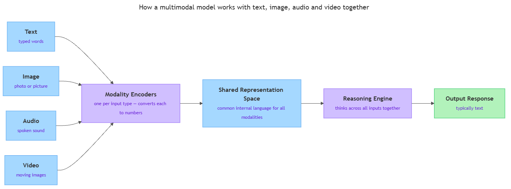

<!-- nav:top:start -->
[⬅ Previous: 4.5 — Tool use](../../../2-retrieval-agents-and-tools/4-5-tool-use-ai-calling-search-calculator-and-code-runner/artifacts/reading.md)&emsp;·&emsp;[⬆ Table of Contents](../../../../../../../README.md#curriculum-topic-index)&emsp;·&emsp;[Next: 4.7 — How to compare two AI tools ➡](../../../4-comparing-and-evaluating-ai-tools/4-7-how-to-compare-two-ai-tools-designing-a-measurable-evaluatio/artifacts/reading.md)
<!-- nav:top:end -->

---

# Multimodal AI — working with text, image, audio, and video in one system

## Overview

Most early AI systems were limited to one type of information. A system could read text, or describe a photograph, but not both at once. **Multimodal AI** changes that: it is one model that can receive, understand, and produce content across more than one type of input — for example, text, images, audio, and video — all inside the same system [1]. This matters because some problems genuinely cannot be solved with one type of information alone. A doctor asking "does the patient's spoken description match what I see in the scan?" needs both audio and image at the same time — no single-input system can answer that [1].

## Key Concepts

### What is a modality?

**Modality** — a type or channel of information. Different modalities are simply different forms that information can take.

In everyday life you use many modalities at once. When you watch a news broadcast, you receive spoken words (audio), moving images (video), on-screen captions (text), and maps or graphs (image). Each of these is a distinct modality.

In AI, four modalities matter most today [1][3]:

| Modality | What it is | Everyday example |
|---|---|---|
| **Text** | Written or typed language | A customer email, a typed question |
| **Image** | A still picture — photo, chart, diagram | A medical scan, a road sign |
| **Audio** | Sound waves — speech, music, noise | A voice message, a podcast |
| **Video** | A sequence of images over time, usually with audio | A classroom recording, a surveillance clip |

A **unimodal model** handles exactly one row of that table. A multimodal model handles two or more of them together [1].

### The shared representation — how different inputs become comparable

This is the key mechanism behind multimodal AI.

Computers store everything as numbers. Text, images, audio, and video are all converted into lists of numbers before any model processes them. The challenge is that the numbers for a sentence and the numbers for a photograph are arranged in completely different ways — like two sets of building blocks that are different shapes and sizes.

A multimodal model solves this by learning to convert each modality into a **shared representation space** — a common internal language that text, images, audio, and video are all translated into before reasoning begins [2][3].

Think of it as a translator booth at an international conference. One delegate speaks French, another Arabic, another English. The translation system converts all three into a common signal — earphones — that every delegate can receive. The shared representation space is that common signal.

*The fan-in pipeline: each modality is encoded separately, translated into a shared representation space, and then passed to a single reasoning engine that produces the output.*

Once all inputs are in the shared space, the model can:
- Compare a sentence to an image (for example, "does this caption match this photo?")
- Answer a question about a sound clip (for example, "what emotion is in this voice?")
- Describe what happens across video frames (for example, "summarise this one-minute clip")

The component that handles the first conversion step is called an **encoder** — the part of a multimodal model that converts one type of input into numbers the reasoning engine can work with. Each modality has its own encoder. After encoding, all outputs flow into the shared space, and a single reasoning engine works over the combined result [2].

### How the four modalities each contribute

**Text** was the first modality that large AI models mastered. Foundation models — which you met in Topic 4.1 — were trained almost entirely on text from books, websites, and conversations [1]. Text stays central in multimodal systems for two reasons:

1. Queries are usually written — even when a user uploads a photo, they typically type a question about it.
2. Answers are usually written — even when a model processes audio or video, the output is often a text summary or explanation.

**Image** input gives the AI the ability to process still pictures. The model learns to understand shapes, colours, and spatial relationships — what is above, below, left, or right — and context: a white coat in a hospital means something different from a white coat in a kitchen [1][3]. The image modality also covers diagrams, charts, and infographics — visual content that carries meaning a text-only model would completely miss.

**Audio** covers anything that arrives as a sound wave: speech, music, background noise, or a mix [3]. For AI, audio input usually means one of two things:

- **Speech recognition** — converting spoken words into text so the rest of the model can process them as language. This is also called transcription.
- **Audio understanding** — recognising non-speech sounds, emotions in a voice, or environmental context (busy street vs quiet office).

One important distinction: speech recognition by itself — converting speech to text — is not the same as a full multimodal model. True audio understanding means the model reasons about the audio content, not just its transcript.

**Video** is the most data-rich modality. A video clip contains a rapid sequence of still images plus a soundtrack — an enormous amount of information to process [2][3]. Video understanding requires a model to track changes over time: what was happening early in the clip versus later, who is speaking when, and how a scene evolves. This is significantly harder than processing a single image because the model must hold a sequence of frames in context, not just one [2]. Because video files are large and computationally demanding, video understanding is often the last modality an organisation adds to a multimodal system.

### Unimodal versus multimodal — a direct comparison

| | **Unimodal model** | **Multimodal model** |
|---|---|---|
| Input types handled | One (e.g. text only) | Two or more (e.g. text + image + audio) |
| Example task | "Summarise this paragraph" | "Describe what is wrong in this X-ray and explain it in plain English" |
| What it misses | Any information in other modalities | Nothing (within its supported modalities) |
| Typical use case | Chatbots, document search, translation | Medical diagnosis, accessibility tools, creative assistants |

The key benefit of multimodal AI is not just convenience — it is that some tasks genuinely cannot be completed with only one modality. A model needs both text and image at the same time to check whether a written report matches a scan [1].

### Limitations to keep in mind

Multimodal AI is powerful, but it is not perfect [3].

- **Hallucination across modalities.** You met hallucination in Topic 4.2 — models can produce plausible-sounding but incorrect output. In multimodal systems this risk extends further: a model might describe an image incorrectly, transcribe audio with errors, or misread what is happening in a video.
- **Modality gaps.** A model trained mostly on text-image pairs may perform poorly on audio or video because it has seen far fewer examples of those modalities. Not all multimodal models handle all four modalities equally well.
- **Compute cost.** Processing video requires significant memory and computing power. This affects which organisations can build and run multimodal systems at scale.
- **Privacy and consent.** Multimodal inputs often contain sensitive personal information — faces, voices, medical images. Processing this data raises legal and ethical questions that pure text systems face less acutely. The legal frameworks governing these concerns are covered in a later module.

## Worked Example

Here is a step-by-step walkthrough of what happens when you type a question and upload a photo to a multimodal system — for example, you photograph a restaurant menu written in a foreign language and ask "what are the vegetarian options?"

**Step 1 — Receive input.**
The system receives your typed question (text) and the uploaded menu photo (image) at the same time.

**Step 2 — Encode each modality.**
Each input is converted into numbers using a modality-specific encoder. The text encoder handles your typed question; the image encoder handles the pixels of the photo.

**Step 3 — Translate to shared space.**
Both sets of numbers are mapped into the shared representation space, where they can be compared and combined. The model now has a unified view of "typed question + photo" in one common language.

**Step 4 — Reason across modalities.**
The reasoning engine works over the combined representation: "The question asks about vegetarian options; the image shows a menu in Thai with certain dishes marked with a leaf symbol; my answer is..."

**Step 5 — Generate output.**
The model produces a response, typically as text: "The vegetarian options on this menu are Spring Rolls, Tofu Pad Thai, and Mango Sticky Rice."

This five-step flow is the architecture underlying tools like GPT-4o and Google Gemini when they process mixed inputs [1][3].

## In Practice

Multimodal AI has moved from research into products used by millions of people. Three patterns show up repeatedly in real deployments [1][3].

**Pattern 1 — The conversational assistant with vision.**
Tools like GPT-4o and Google Gemini accept a photo and a typed question in the same message. A user photographs a broken product; the model reads the photo and the typed description together and suggests a repair or replacement. This is the most widespread consumer deployment of multimodal AI today.

**Pattern 2 — The document intelligence system.**
Organisations process invoices, contracts, and reports that combine printed text, tables, charts, and logos — all on the same page. A unimodal text model would extract only the typed words and miss everything encoded in charts and tables. A multimodal model reads the whole page as one unified document [1].

**Pattern 3 — The accessibility layer.**
Audio description services for visually impaired users, real-time captioning for deaf or hard-of-hearing users, and image-to-speech tools all combine two or more modalities. Multimodal AI makes these tools faster, more accurate, and able to operate in real time [3].

**Things to check before deploying a multimodal system:**
- Confirm which modalities the model actually supports. Many tools marketed as "multimodal" handle only text and image — not audio or video.
- Test each modality with samples from your real use case. A model that performs well on general photos may perform poorly on specialised images such as medical scans.
- Review the model's knowledge cutoff (introduced in Topic 4.3) — it applies to all modalities, not just text.
- Consider data privacy obligations before uploading images, audio, or video containing identifiable people.

**Things to avoid:**
- Assuming accuracy is the same across all modalities. A model may transcribe speech well but misidentify objects in images.
- Ignoring hallucination risk. Multimodal hallucinations can be harder to catch because you are comparing a description against an image, not just comparing text to text.
- Reaching for a multimodal model when you only need one modality. A specialised unimodal system may outperform a generalist multimodal one on a narrow task.

## Key Takeaways

- **Multimodal AI** means one model that can receive, understand, and generate content across more than one type of input — text, image, audio, and/or video — rather than being limited to a single type [1].
- The four main modalities are **text**, **image**, **audio**, and **video**. Each carries information the others cannot. Some problems can only be solved when two or more modalities are processed together.
- Multimodal models work by converting each input into a **shared representation space** — a common internal language — so a single reasoning engine can compare and combine all inputs at once [2][3].
- Real-world deployments already span consumer assistants (text + image chat), document intelligence (text + charts on the same page), and accessibility tools (image + audio + text combined).
- Key limitations — hallucination across modalities, uneven performance across input types, high compute cost for video, and significant privacy concerns — mean multimodal AI requires careful evaluation before deployment [3].

## References

[1] McKinsey & Company. "What is multimodal AI?" *McKinsey Explainers*. https://www.mckinsey.com/featured-insights/mckinsey-explainers/what-is-multimodal-ai

[2] Preprint survey. *arXiv*. https://arxiv.org/pdf/2506.04788

[3] AI Journ. "Multimodal models: when text, image, audio, and video come together." *AI Journ*. https://aijourn.com/multimodal-models-when-text-image-audio-and-video-come-together/

---
<!-- nav:bottom:start -->
[⬅ Previous: 4.5 — Tool use](../../../2-retrieval-agents-and-tools/4-5-tool-use-ai-calling-search-calculator-and-code-runner/artifacts/reading.md)&emsp;·&emsp;[⬆ Table of Contents](../../../../../../../README.md#curriculum-topic-index)&emsp;·&emsp;[Next: 4.7 — How to compare two AI tools ➡](../../../4-comparing-and-evaluating-ai-tools/4-7-how-to-compare-two-ai-tools-designing-a-measurable-evaluatio/artifacts/reading.md)
<!-- nav:bottom:end -->
