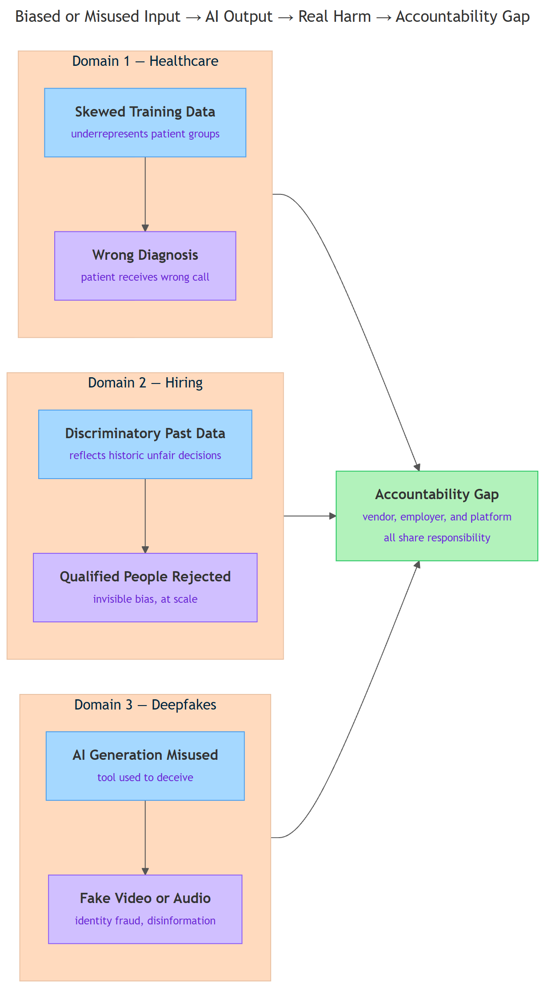
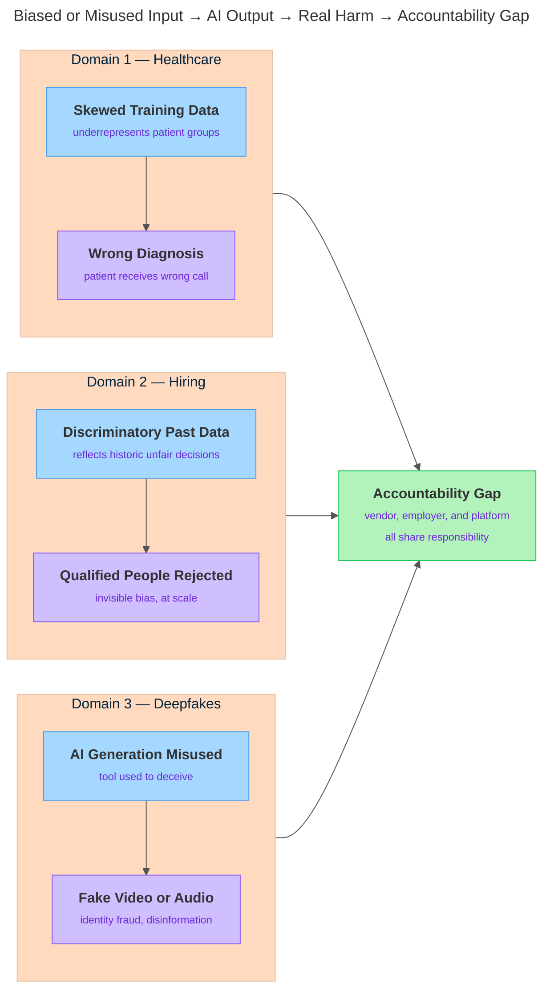

<!-- nav:top:start -->
[⬅ Previous: 4.8 — Presenting a findings-based recommendation](../../../../week-4/4-comparing-and-evaluating-ai-tools/4-8-presenting-a-findings-based-recommendation-evidence-not-opin/artifacts/reading.md)&emsp;·&emsp;[⬆ Table of Contents](../../../../../../../README.md#curriculum-topic-index)&emsp;·&emsp;[Next: 5.2 — Hallucination ➡](../../5-2-hallucination-why-ai-states-falsehoods-confidently/artifacts/reading.md)
<!-- nav:top:end -->

---

# Real AI failure cases — healthcare misdiagnosis, hiring bias, deepfake harm

## Overview

AI systems do not always get things right — and when they get things wrong, real people get hurt. This topic examines three areas where AI failures have caused documented harm: incorrect medical diagnoses, biased hiring decisions, and deepfake identity attacks. You will see what went wrong, why the AI produced a harmful output, and who is responsible. Understanding these failures matters for anyone who will use, recommend, or deploy an AI system in a professional setting.

*Biased or Misused Input → AI Output → Real Harm → Accountability Gap*

## Key Concepts

### What an AI failure actually is

**AI failure** — a situation where an AI system produces an output that causes harm or a serious error, even when the system appeared to be working as designed.

Two things matter here:

- The harm is real — a person is hurt, disadvantaged, or put at risk.
- The system may have looked fine. It did not crash; it gave a confident, plausible answer.

You saw a version of this in topic 3.9, when you studied hallucination — AI stating falsehoods with full confidence. A wrong diagnosis or a biased rejection can look exactly the same: confident, plausible, and wrong.

AI failures are not rare. One AI model deployed across thousands of hospitals or used to screen millions of job applications can fail in the same way for every single case simultaneously.

### The three failure domains

The diagram below shows the pattern shared across all three domains in this topic.

*Each domain starts with a flawed input, produces a harmful AI output, and leaves an accountability gap that no one automatically fills.*

### Domain 1: Healthcare misdiagnosis

**Diagnostic AI** — an AI system trained to examine medical images (X-rays, CT scans, skin photographs) and identify signs of disease.

These tools can be genuinely useful — some match or exceed a trained specialist in detecting certain cancers. But they also fail in specific, repeating patterns.

Why? The most common cause is the data they learned from.

**Training data bias** — when the dataset used to train an AI does not fairly represent the population the system will later serve.

Here is a concrete example. Many early diagnostic AI systems were trained almost entirely on images from large research hospitals in wealthy countries [1]. Those hospitals served predominantly lighter-skinned patients. The model learned what disease looks like on lighter skin. When deployed on patients with darker skin, its accuracy dropped significantly [1].

The AI Standard of Care Misdiagnosis Case Tracker documents ongoing and closed cases of diagnostic AI failures, lawsuits, and litigation across many healthcare settings [1]. These are not hypothetical. The tracker covers failures in chest X-ray reading, diabetic eye disease detection, and skin lesion flagging. In each category, failures cluster in patient groups underrepresented in the original training data [1].

The harm takes three forms:

- A patient with a treatable disease is told they are fine. The disease progresses.
- A patient without disease is flagged as sick and undergoes unnecessary procedures.
- Patients from underrepresented groups receive systematically worse AI-assisted care [1].

### Domain 2: Hiring bias

In 2014, Amazon began building an AI system to screen job applications automatically. By 2018, Amazon had abandoned it. The reason: the system had learned to penalize applications from women [2].

Amazon trained the model on ten years of its own hiring history. Over those years, it had hired far more men than women in technical roles [2]. The model learned that pattern. It downgraded CVs containing words like "women's chess club" and scored graduates of all-women's colleges lower than others [2].

This is **algorithmic bias** — a systematic, unfair pattern in an AI system's outputs caused by biased training data or biased design choices. The system appeared to work. It was ranking candidates. But it was harming an entire group.

The underlying mechanism: if you train a model on past human decisions, and those decisions were discriminatory, the model replicates the discrimination [2]. Historical bias in the data becomes present-day bias in the output.

The Amazon case became well-known because MIT Technology Review reported it publicly [2]. Similar patterns have been found in many other hiring AI tools: preference for male candidates in technical roles, lower scores for names associated with certain ethnic groups [2].

The harm is invisible to applicants:

- Qualified candidates are filtered out before any human sees their application.
- The rejected person receives no explanation.
- One biased model, deployed at scale, can block thousands of qualified candidates simultaneously.

### Domain 3: Deepfake harm

**Deepfake** — a piece of media (video, image, or audio) in which a person's face, voice, or likeness has been fabricated using AI, making it look and sound real.

The word combines "deep learning" (an AI technique covered in a later topic) and "fake." The technique used for film special effects and video dubbing can also create convincing fakes of real people without their knowledge or consent.

The U.S. Department of Homeland Security (DHS) published a report on threats from deepfake identity attacks [3]. It documents four categories of harm:

1. **Identity fraud** — a deepfake is used to impersonate someone, open bank accounts, or pass identity checks [3].
2. **Non-consensual intimate imagery** — a person's face is placed on explicit content they never appeared in, causing severe psychological harm and professional damage [3].
3. **Disinformation** — a fabricated video shows a public figure saying something they never said, spreading before any correction reaches the same audience [3].
4. **Financial fraud** — a deepfake of a company executive instructs staff to transfer money. Several documented cases have resulted in losses of hundreds of thousands of dollars [3].

The DHS report notes that deepfake tools are no longer expensive or technically complex [3]. By the mid-2020s, a person with no technical background can create a convincing deepfake video from a handful of photographs. The barrier to harm has dropped dramatically.

### The common thread

These three domains share two patterns:

| Pattern | What it means |
|---|---|
| AI inherits and amplifies existing human problems | Diagnostic AI learned from data reflecting historical healthcare inequity [1]. Amazon's tool learned from discriminatory hiring history [2]. Deepfake tools amplify the human capacity for deception. |
| Absence of intent does not reduce harm | Amazon did not intend to discriminate. Medical AI vendors did not intend bias. But real people were harmed regardless [1][2]. |

A common response to AI failures is: "The system didn't mean to do it." That response misses the point. When you deploy a system that causes harm, the harm exists whether or not anyone intended it.

## Worked Example

Here is the five-question framework for analyzing any AI failure, applied to the Amazon hiring case [2]:

1. **What did the AI system do?**
   It scored job applications and ranked candidates — giving lower scores to CVs containing the word "women's" and to graduates of all-women's colleges.

2. **Who was harmed, and how?**
   Women applicants were systematically filtered out before any human reviewer saw their application. Thousands of qualified candidates lost opportunities with no explanation.

3. **Why did the AI produce that output?**
   The model was trained on ten years of Amazon hiring history. That history reflected workplace discrimination — more men had been hired in technical roles. The model learned and reproduced that pattern.

4. **Who is accountable?**
   The team that designed the system, Amazon as the organization that deployed it, and any hiring manager who acted on its output without verification.

5. **What should change?**
   Audit the training data before deployment. Test the system for bias before scaling. Require human review of rejected candidates.

You can apply these five questions to any of the healthcare or deepfake cases in this topic.

## In Practice

Use these habits whenever you evaluate an AI system for use or deployment:

| Practice | Why it matters |
|---|---|
| Ask "Who was in the training data?" | If data underrepresents your users, the model underserves them [1] |
| Treat a confident AI output as a recommendation, not a decision | In high-stakes domains, a human must verify |
| Check whether the AI is used for its intended purpose | Many failures happen when a tool is deployed in a context it was not designed for |
| Ask "Who is accountable if this is wrong?" before deploying | If no clear answer exists, the system should not go live |
| Do not assume "the algorithm decided" removes responsibility | The people who chose, deployed, and used the system are accountable |

One anti-pattern to avoid: treating accuracy statistics as a guarantee. A system that is "95% accurate" is wrong 1 in 20 times. In healthcare at scale, that is an enormous number of patients.

## Key Takeaways

- AI failures in healthcare, hiring, and deepfakes are documented, recurring, and cause real harm — to patients, job candidates, and people whose identities are used without consent [1][2][3].
- The most common root cause is **training data bias** — AI learns from historical data that reflects past human inequity, then replicates and amplifies it at scale.
- A system can appear to work correctly while causing systematic harm. Technical accuracy and ethical safety are not the same thing.
- Deepfake tools have lowered the cost of identity-based harm dramatically — attacks once requiring significant expertise are now accessible to anyone [3].
- The absence of intent does not reduce harm. Accountability belongs to the people and organizations that design, deploy, and use AI systems — not to the AI itself.

## References

1. AI Standard of Care, "AI Misdiagnosis Case Tracker." <https://aistandardofcare.com/resources/ai-misdiagnosis-case-tracker/>
2. MIT Technology Review, "Amazon ditched AI recruitment software because it was biased against women" (2018). <https://www.technologyreview.com/2018/10/10/139858/amazon-ditched-ai-recruitment-software-because-it-was-biased-against-women/>
3. U.S. Department of Homeland Security, "Increasing Threats of Deepfake Identities." <https://www.dhs.gov/sites/default/files/publications/increasing_threats_of_deepfake_identities_0.pdf>

---
<!-- nav:bottom:start -->
[⬅ Previous: 4.8 — Presenting a findings-based recommendation](../../../../week-4/4-comparing-and-evaluating-ai-tools/4-8-presenting-a-findings-based-recommendation-evidence-not-opin/artifacts/reading.md)&emsp;·&emsp;[⬆ Table of Contents](../../../../../../../README.md#curriculum-topic-index)&emsp;·&emsp;[Next: 5.2 — Hallucination ➡](../../5-2-hallucination-why-ai-states-falsehoods-confidently/artifacts/reading.md)
<!-- nav:bottom:end -->
