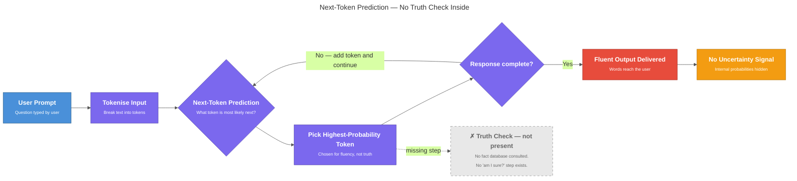

<!-- nav:top:start -->
[⬅ Previous: 5.1 — Real AI failure cases](../../5-1-real-ai-failure-cases-healthcare-misdiagnosis-hiring-bias-de/artifacts/reading.md)&emsp;·&emsp;[⬆ Table of Contents](../../../../../../../README.md#curriculum-topic-index)&emsp;·&emsp;[Next: 5.3 — Data bias ➡](../../5-3-data-bias-how-biased-training-data-produces-biased-model-out/artifacts/reading.md)
<!-- nav:top:end -->

---

# Hallucination — why AI states falsehoods confidently

## Overview

Large Language Models (LLMs) sometimes produce false information written in fluent, authoritative prose — and show no sign that anything is wrong. This specific failure is called **hallucination**. You already know from topic 3.9 that it exists, and from topic 5.1 that it causes real harm. This topic goes one level deeper: it explains the exact mechanism that makes an LLM state falsehoods confidently, and why the model cannot simply say "I don't know."

*Next-Token Prediction — No Truth Check Inside*

## Key Concepts

### Next-token prediction — the engine behind every word

Every word an LLM writes comes from one repeated action: **next-token prediction** — looking at all the text so far and picking the most statistically likely next token [1].

Here is how that works, step by step:

1. You type: "Who wrote the play Hamlet?"
2. The model looks at those tokens and asks: *What token is most likely to come next?*
3. It picks "William."
4. Now the context is your question plus "William." It asks again.
5. It picks "Shakespeare."
6. This continues — one token at a time — until the response is complete.

There is no separate step where the model checks a database of facts. There is no step where it asks itself "am I sure this is true?" It is always, only, asking: **what text is most likely to come next?** [1]

This means correct answers and hallucinated answers come from exactly the same mechanism. The only difference is whether the patterns the model learned happened to match something true in the world.

*Figure: The next-token prediction loop — no truth-check step inside.*

### No built-in uncertainty signal

When a human is unsure of something, they feel it. They say "I think" or "I'm not certain." An LLM has no equivalent internal state [1].

The model does produce internal probability scores — a mathematical ranking of how likely each next word is. But those numbers are hidden from you. What you receive is only the words the model chose: fluent, coherent-sounding prose [2].

**Calibration** — whether a model's internal confidence scores actually reflect how often it is correct — is a key concept here. A well-calibrated model would assign high confidence to answers it usually gets right, and low confidence to answers it often gets wrong. Current LLMs are frequently **miscalibrated**: they can assign high probability to tokens that produce false statements [2].

The result: the model's internal maths can be very confident about a wrong answer, and that shows up on your screen as authoritative-sounding text.

### Two types of hallucination

Researchers distinguish two types [2][3]:

| Type | What happened | Quick signal |
|---|---|---|
| **Intrinsic** | Model contradicts source material it was given | Check the source you provided |
| **Extrinsic** | Model invents content with no supporting source | Content cannot be verified anywhere |

- **Intrinsic hallucination** — the AI produces output that directly contradicts information provided in the prompt or training data. *Example: you paste in a report and ask for a summary. The summary says the report recommends Option A. The document actually recommends Option B.*
- **Extrinsic hallucination** — the AI produces output that cannot be verified against any source. The fabricated legal citations in the next section are a classic example [3].

Both types appear as confident, fluent text. On the surface, they are indistinguishable from correct output.

> **Taxonomy note:** Topic 3.9 introduced a three-type system — factual, attributional, and faithful-but-wrong. Both frameworks describe the same failures: intrinsic hallucinations map to attributional errors (the model contradicts a provided source); extrinsic hallucinations cover factual invention and faithful-but-wrong cases (the model produces plausible but unsupported content). Which taxonomy you encounter depends on the source — both are in active use.

### Why the model cannot just say "I don't know"

This surprises most beginners. The short answer: the model was not built to track what it knows versus what it does not. It was built to produce fluent text that continues a prompt.

"I don't know" is just another possible sequence of tokens. Whether the model outputs those tokens depends on whether its training included examples of saying "I don't know" in contexts that match your prompt — not on whether the model has a genuine assessment of its own knowledge [1].

There is a deeper issue. The model learned from human-written text. Humans mostly write text that asserts things — explains facts, tells stories, states conclusions. The web contains far more confident assertions than admissions of uncertainty. So the model learned a style that matches that distribution: confident, assertive, helpful-sounding prose [2].

This is why the phenomenon is called hallucination rather than simply "errors." The model does not know it is wrong. It is doing exactly what it was trained to do — and that process generates false statements with the same fluency it uses for true ones.

## Worked Example

In a published evaluation of an LLM-based clinical information tool, researchers asked the system for current treatment guidelines on a common autoimmune condition. The model returned a response citing a specific clinical study — journal name, publication year, author list, and a paraphrased conclusion, all formatted exactly like a valid medical reference. The study did not exist. A search of the journal's actual archive found no such publication [2].

Walk through why this happened using next-token prediction:

1. The clinician asked for evidence-based treatment guidance.
2. The model had seen large amounts of medical literature during training — clinical citations appear in a consistent, learnable pattern.
3. At each step, the model asked: *what token is most likely next given the context of a medical citation?*
4. It generated a journal name, author names, a publication year, and a conclusion that were statistically plausible — they matched the surface patterns of real citations.
5. At no step did the model check whether that specific study actually exists in any database.
6. The output was extrinsic hallucination: content invented with no supporting source.

The model showed no hesitation and no warning. It presented the fabricated citation with the same confident tone it uses for information drawn directly from its training data — indistinguishable from a correct reference to a clinician who did not independently verify it [2].

## In Practice

Hallucination happens across all types of LLM use — but the harm depends on the domain.

**Where hallucination is most dangerous** — the high-stakes domains from topic 5.1:

- **Healthcare** — hallucinated drug dosages, contraindications, or patient history details can cause direct patient harm [1][2].
- **Legal** — fabricated case citations, wrong statutes, incorrect case law.
- **Finance** — invented contract terms, hallucinated figures, wrong regulatory rules.
- **News and information** — false statements spread at scale before anyone checks [2].

**Why confidence makes it worse.** Consider two possible AI outputs:

- *Output A:* "I think the author may have been born around 1820, but you should verify this."
- *Output B:* "The author was born on 14 March 1820 in Edinburgh."

Output B looks more authoritative. Most users trust it more. If both are hallucinations, Output B causes more harm — because a user is far more likely to act on it without checking. LLMs tend to produce Output B [2].

**Pattern to watch for.** Hallucinated content frequently has suspicious precision — exact dates, exact case numbers, exact statistics. These are common in human text, so the model generates them fluently from pattern alone, even when it has no real basis for the specific value [1].

**Name-and-defer.** Researchers have developed approaches to reduce hallucination — including RAG, grounding, and RLHF. These are named here only so you know that solutions exist; they are covered in later topics.

## Key Takeaways

- LLMs produce every word by **next-token prediction** — picking the most statistically likely next token. This process has no built-in truth-checking step. Correct outputs and hallucinated outputs are generated by exactly the same mechanism.
- The model has no internal uncertainty signal it can share with you. The fluent, confident prose it produces is an artifact of training on confident human text — not evidence of accuracy.
- **Intrinsic hallucination** contradicts information the model was given. **Extrinsic hallucination** invents content with no source. Both appear as confident, fluent text — indistinguishable from correct output on the surface.
- The harm from hallucination scales with the stakes of the domain. A hallucinated blog title is harmless. A hallucinated drug dosage or legal citation can cause serious real-world harm.
- The most dangerous aspect of hallucination is not the error itself — it is the confidence that wraps it. Users trust confident outputs, and that trust, when misplaced, is what allows hallucination to cause harm at scale [1].

## References

[1] Atlan. "LLM Hallucinations — What They Are and How They Happen." https://atlan.com/know/llm-hallucinations/

[2] SuperAnnotate. "AI Hallucinations — Causes, Types, and Examples." https://www.superannotate.com/blog/ai-hallucinations

[3] Ji, Z. et al. (2023). "Survey of Hallucination in Natural Language Generation." *arXiv*. https://arxiv.org/pdf/2401.06796

---
<!-- nav:bottom:start -->
[⬅ Previous: 5.1 — Real AI failure cases](../../5-1-real-ai-failure-cases-healthcare-misdiagnosis-hiring-bias-de/artifacts/reading.md)&emsp;·&emsp;[⬆ Table of Contents](../../../../../../../README.md#curriculum-topic-index)&emsp;·&emsp;[Next: 5.3 — Data bias ➡](../../5-3-data-bias-how-biased-training-data-produces-biased-model-out/artifacts/reading.md)
<!-- nav:bottom:end -->
