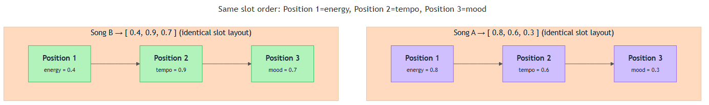

<!-- nav:top:start -->
[⬅ Previous: 6.2 — Scalars](../../6-2-scalars-a-single-number-representing-one-property/artifacts/reading.md)&emsp;·&emsp;[⬆ Table of Contents](../../../../../../../README.md#curriculum-topic-index)&emsp;·&emsp;[Next: 6.4 — Matrices ➡](../../6-4-matrices-grids-of-numbers-and-how-ai-uses-them/artifacts/reading.md)
<!-- nav:top:end -->

---

# Vectors — a list of numbers representing multiple properties at once

## Overview

A scalar (from topic 6.2) captures one property at a time — a single brightness value, a single loss score. But most real things have many properties at once: a song has energy, tempo, and mood; a patient has age, blood pressure, and glucose level. A **vector** solves this by bundling several scalars into one ordered list, so that an AI system can treat a complex thing as a single mathematical object [1]. Vectors are how almost everything an AI "sees" arrives — a product, a sentence, an image patch, a user profile — all packaged as numbers in a fixed order.

## Key Concepts

### What a vector is

A **vector** is an ordered list of scalars, where each position in the list represents one specific property of the thing being described [1].

The word *ordered* is critical. The list `[0.8, 0.6, 0.3]` is not the same as `[0.3, 0.8, 0.6]`, even though the numbers are identical, because **position carries meaning**. If position 1 means "energy," position 2 means "tempo," and position 3 means "mood," then that assignment must hold for every vector in the dataset [1].


*Each numbered slot in a vector maps to one named property; the order must stay consistent across every item.*

A song vector written out clearly:

```
song_vector = [energy, tempo, mood]
            = [0.8,    0.6,   0.3]
```

You can read it aloud: "This song is high-energy, moderately fast, and calm."

### Scalars inside a vector

Each number inside a vector is a scalar occupying a named slot. The table below shows how three scalars combine into one vector [1][2]:

| Slot (position) | Property | Example value | Meaning |
|---|---|---|---|
| 1 | energy | 0.8 | High energy |
| 2 | tempo | 0.6 | Medium-fast |
| 3 | mood | 0.3 | Calm / serious |

Alone, each scalar is an incomplete description. Together, the three form a richer picture of one song [2].

### Dimension — how many properties the vector holds

The **dimension** of a vector is the count of numbers it contains [1].

- `[0.8, 0.6, 0.3]` is a **3-dimensional** vector.
- `[height, weight, age, income]` is a **4-dimensional** vector.

Dimension matters because every vector you compare must have the **same number of dimensions**. A 3-dimensional vector and a 4-dimensional vector cannot be compared — their slot structures do not match [1].

### The rule of consistent positions

**Position N must always represent the same property across every vector in a dataset** [2]. If position 1 is "energy" for song A, it must be "energy" for every other song. Accidentally swapping the order for one item makes that item's numbers incompatible with the rest, and any calculation performed later would compare the wrong properties against each other — which is meaningless.

### Feature vectors — the standard name in AI

In AI and machine learning, a vector used to describe a real-world thing is called a **feature vector** [3].

- **Feature** — a single measurable property of the thing being described. Energy, tempo, and mood are all features of a song.
- **Feature vector** — the complete set of chosen features for one item, packed into an ordered list [3].

Feature vectors appear everywhere in AI:

- **Spam detection:** each email — count of capital letters, exclamation marks, sender reputation score.
- **House price prediction:** each house — square footage, bedrooms, distance from a school, year built.
- **Recommendation systems:** each user — age group, genres watched, average session length [2][3].

The pattern is always the same: pick properties, measure them consistently, line them up in a fixed order.

### Why grouping properties into a vector is powerful

Three reasons the bundle matters more than separate scalars [1][2]:

1. **A vector is one object.** You pass one thing to an algorithm instead of synchronising many separate values.
2. **Arithmetic compares whole descriptions at once.** When AI finds songs similar to one you liked, it compares full vectors — all properties simultaneously. (How that similarity calculation works is covered in topic 6.6.)
3. **Patterns emerge across many properties together.** Energy = 0.8 alone could mean anything. Energy = 0.8, tempo = 0.9, mood = 0.2 is a specific signature — probably an aggressive, fast, dark track. No single scalar could reveal that [3].

## Worked Example

Here is the step-by-step process for building a feature vector for coffee drinks [2]:

1. **Choose the thing to describe.** A coffee drink.
2. **Decide which properties matter.** For a taste-based recommendation: bitterness, sweetness, strength.
3. **Define a consistent scale.** 0.0 (none) to 1.0 (maximum) for every property.
4. **Measure and record each property for your first item.**
   - Espresso: bitterness = 0.9, sweetness = 0.1, strength = 1.0
5. **Write the vector in fixed, named order.**
   ```
   espresso_vector = [bitterness, sweetness, strength]
                   = [0.9,        0.1,       1.0]
   ```
6. **Repeat for every other item using the same order and scale.**
   ```
   latte_vector      = [0.4, 0.5, 0.6]
   cappuccino_vector = [0.5, 0.4, 0.7]
   ```
7. **Verify consistency.** Position 1 is bitterness, position 2 is sweetness, position 3 is strength — for every row without exception.

The result is a collection of feature vectors an algorithm could use to group similar coffees or recommend one based on a customer's preferences [2][3].

## In Practice

Feature vectors are the standard input format for virtually every machine learning algorithm in use today [3]. Here is where you will encounter them:

- **Images:** A photograph is converted into a feature vector by measuring properties of pixel patches — colour intensities, edge sharpness, texture patterns — resulting in vectors with hundreds or thousands of dimensions [1].
- **Text and language:** A word or sentence is converted into a high-dimensional vector before being processed. High-dimensional vectors applied to words (sometimes called embeddings) are introduced in a later module.
- **Medical records:** Each patient — age, blood pressure, cholesterol, glucose, body mass index — becomes one feature vector. An AI trained on thousands of these can learn to predict disease risk [2].
- **User profiles:** Streaming platforms represent each user as a vector encoding viewing history, genre preferences, and device type. Films whose vectors are close to films a user enjoyed get recommended [2][3].

**Do:**
- Decide what each position means *before* collecting any data and write it down.
- Use the same measurement scale for all items.
- Treat the vector as a single object — keep all numbers together and in order.

**Do not:**
- Mix up the property order between items — this is the most common beginner mistake and corrupts all downstream arithmetic.
- Assume more features are always better; irrelevant properties add noise without adding useful signal.
- Try to compare vectors of different dimensions.

## Key Takeaways

- A **vector** is an ordered list of scalars; each scalar occupies a fixed position that always represents the same property across every item in the dataset [1].
- Grouping multiple properties into one vector lets AI treat a complex thing — a song, a patient, a user — as a single mathematical object ready for algorithms.
- The **dimension** of a vector is the number of scalars it contains; all vectors being compared must share the same dimension [1].
- **Feature vectors** are the standard way AI systems represent real-world items numerically — from images to user profiles to medical records [3].
- **Consistent position-to-property mapping** is the foundational discipline: if position 1 means energy for one song, it must mean energy for every song in the dataset [2].

## References

1. Machine Learning Plus — Vectors in Linear Algebra. https://machinelearningplus.com/linear-algebra/vectors/
2. ApXML — Vectors as Data Representations. https://apxml.com/courses/linear-algebra-essentials-ml/chapter-1-vectors-in-machine-learning/vectors-data-representations
3. Towards Data Science — Vector Representations for Machine Learning. https://towardsdatascience.com/vector-representations-for-machine-learning-5047c50aaeff/

---
<!-- nav:bottom:start -->
[⬅ Previous: 6.2 — Scalars](../../6-2-scalars-a-single-number-representing-one-property/artifacts/reading.md)&emsp;·&emsp;[⬆ Table of Contents](../../../../../../../README.md#curriculum-topic-index)&emsp;·&emsp;[Next: 6.4 — Matrices ➡](../../6-4-matrices-grids-of-numbers-and-how-ai-uses-them/artifacts/reading.md)
<!-- nav:bottom:end -->
