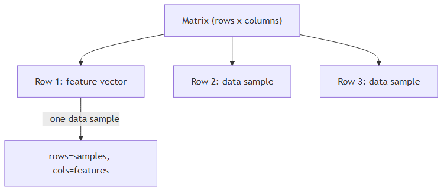

<!-- nav:top:start -->
[⬅ Previous: 6.3 — Vectors](../../6-3-vectors-a-list-of-numbers-representing-multiple-properties-a/artifacts/reading.md)&emsp;·&emsp;[⬆ Table of Contents](../../../../../../../README.md#curriculum-topic-index)&emsp;·&emsp;[Next: 6.5 — A vector as a point in space ➡](../../6-5-a-vector-as-a-point-in-space-music-taste-described-as-three/artifacts/reading.md)
<!-- nav:top:end -->

---

# Matrices — grids of numbers and how AI uses them

## Overview

A **matrix** is a rectangular grid of numbers — rows going across, columns going down, and a single scalar in every cell. You already know scalars (topic 6.2) and vectors (topic 6.3); a matrix is simply many vectors stacked on top of each other. Almost every piece of data an AI system touches — an image, a training dataset, the learned knowledge inside a neural network — is stored and processed as a matrix [1].

## Key Concepts

### What a matrix is

Think of a school register: students down the left, subjects across the top, and one score in each cell. That table is a matrix. More precisely:

- **Row** — one horizontal line of numbers (row 1 is the top row, row 2 is directly below it, and so on).
- **Column** — one vertical line of numbers (column 1 is the leftmost, column 2 is the next to the right).
- **Cell** — the single position where one row and one column meet; each cell holds exactly one scalar [2].

### Rows × columns notation

The size of a matrix is always written as **rows × columns** — rows first, columns second, every time [1].

| Matrix size | What it means | Total cells |
|---|---|---|
| 3 × 4 | 3 rows, 4 columns | 12 |
| 100 × 5 | 100 rows, 5 columns | 500 |
| 28 × 28 | 28 rows, 28 columns | 784 |

Any individual cell is identified by its row number and column number. The cell at row 2, column 3 is written as position (2, 3).

### Each row is a feature vector


*A matrix shown as stacked feature vectors — each row is one data sample, each column is one feature.*

From topic 6.3 you know that a feature vector encodes one data sample as an ordered list of scalars. When you have many samples, you stack those vectors: the first sample's vector goes on row 1, the second on row 2, and so on. The result is a matrix where:

- **each row = one data sample** (one feature vector)
- **each column = one feature** (one measurable property)

A dataset of 1,000 houses, each described by 4 features, becomes a **1000 × 4 matrix** — 1,000 rows and 4 columns [2].

### Images as pixel grids

From topic 6.1 you know that a pixel is a number representing brightness or colour. A digital image is a grid of pixels arranged in rows and columns — which is exactly a matrix. A grayscale image that is 28 pixels wide and 28 pixels tall is a **28 × 28 matrix**. Each cell holds one scalar: the brightness of that pixel, from 0 (black) to 255 (white) [1][2].

### Weight matrices — one sentence

When a neural network learns from data, the numbers it learns are stored in a **weight matrix** — a grid of scalars that shapes the network's output [1][3]. How weight matrices are used (an operation called matrix multiplication) is covered in a later topic.

### Advanced operations — names only

Four matrix operations come up often in AI but are outside the scope of this topic. Recognise the names; do not worry about the mechanics yet:

- **Matrix multiplication** — combining two matrices to produce a third.
- **Transpose** — swapping the rows and columns of a matrix.
- **Determinant** — a single scalar computed from a square matrix.
- **Eigenvalues** — special scalars that reveal how a matrix stretches or compresses data.

Each is covered in a later topic.

## Worked Example

**Building and reading a data matrix — five students, three subjects**

Suppose you record three exam scores for each of five students.

**Step 1 — Identify your samples.** You have 5 students — so you will have 5 rows.

**Step 2 — Identify your features.** You record 3 scores (Maths, English, Science) — so you will have 3 columns.

**Step 3 — Build the grid.**

```
             Maths  English  Science
Student 1: [  72,    85,      90   ]
Student 2: [  60,    78,      55   ]
Student 3: [  88,    91,      76   ]
Student 4: [  45,    62,      70   ]
Student 5: [  95,    88,      82   ]
```

**Step 4 — State the size.** 5 rows × 3 columns → this is a **5 × 3 matrix**.

**Step 5 — Read a cell.** "What is Student 3's English score?" Row 3, column 2 → **91**.

Every AI training dataset is laid out this way internally: rows are samples, columns are features, cells are scalars [2].

## In Practice

Real AI systems rely on matrices at every layer:

- **Handwritten digit recognition (MNIST).** The MNIST dataset contains 70,000 images of handwritten digits (0–9). Each image is 28 × 28 pixels, so each image is a 28 × 28 matrix. Training means reading through all 70,000 of these grids [1][3].
- **Recommendation systems.** A streaming service can represent its data as a matrix — rows are users, columns are films, each cell holds a rating. Spotting patterns in that matrix drives suggestions [2].
- **Neural network layers.** Every layer in a neural network connects to the next through a weight matrix. A network reading a 28 × 28 image (784 pixels) and feeding into 128 neurons holds a **784 × 128 weight matrix** — 100,352 individual weight scalars [1][3].

**Common mistakes to avoid:**

- Swapping the order — always rows × columns, never columns × rows.
- Confusing matrix size with total cell count — a 4 × 5 matrix has size "4 × 5", not "20".
- Jumping to matrix operations before the structure is solid — get rows, columns, and notation right first.

## Key Takeaways

- A **matrix** is a rectangular grid of scalars with rows going across and columns going down — nothing more [1].
- Size is always **rows × columns** (rows first): a 3 × 4 matrix has 3 rows and 4 columns [1].
- Each **row in a data matrix is one feature vector** — one complete data sample [2].
- AI uses matrices for **images** (each pixel's brightness is one cell) and for **weight matrices** (each learned weight is one cell) [1][3].
- Matrix multiplication, transpose, determinant, and eigenvalues are real and important — but covered in later topics; for now, just recognise the names.

## References

1. Brown, J. (n.d.). *Introduction to matrices for machine learning*. Machine Learning Mastery. https://machinelearningmastery.com/introduction-matrices-machine-learning/
2. GeeksforGeeks. (n.d.). *Matrices and matrix arithmetic for machine learning*. https://www.geeksforgeeks.org/data-science/matrices-and-matrix-arithmetic-for-machine-learning/
3. Labelbox. (n.d.). *Inside the matrix: A look into the math behind AI*. https://labelbox.com/blog/inside-the-matrix-a-look-into-the-math-behind-ai/

---
<!-- nav:bottom:start -->
[⬅ Previous: 6.3 — Vectors](../../6-3-vectors-a-list-of-numbers-representing-multiple-properties-a/artifacts/reading.md)&emsp;·&emsp;[⬆ Table of Contents](../../../../../../../README.md#curriculum-topic-index)&emsp;·&emsp;[Next: 6.5 — A vector as a point in space ➡](../../6-5-a-vector-as-a-point-in-space-music-taste-described-as-three/artifacts/reading.md)
<!-- nav:bottom:end -->
