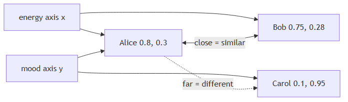

<!-- nav:top:start -->
[⬅ Previous: 6.4 — Matrices](../../6-4-matrices-grids-of-numbers-and-how-ai-uses-them/artifacts/reading.md)&emsp;·&emsp;[⬆ Table of Contents](../../../../../../../README.md#curriculum-topic-index)&emsp;·&emsp;[Next: 6.6 — Dot product as similarity ➡](../../../3-similarity-and-meaning/6-6-dot-product-as-similarity-vectors-pointing-the-same-directio/artifacts/reading.md)
<!-- nav:top:end -->

---

# A vector as a point in space — music taste described as three numbers

## Overview

You already know that a vector is an ordered list of numbers, each one representing a feature. This topic adds a new way to read that same list: every vector is also a **location** — a specific address in space. Once you think of vectors as positions, comparing them becomes as natural as comparing spots on a map. That geometric idea is the engine behind recommendation systems, image search, and much of modern AI [1].

## Key Concepts

### What is a coordinate?

A **coordinate** is a single number that tells you how far to travel along one specific, named direction from a fixed starting point. You need one coordinate per direction to pin down a location exactly [1].

Think of a city grid: "three blocks east, two blocks north" uses two coordinates to describe one spot. Drop either number and you can no longer find the place.

Key terms:

- **Axis** — a named direction in a space. The horizontal direction is one axis; the vertical direction is another. In AI, axes are named after features: "energy," "tempo," "mood."
- **Origin** — the fixed starting point every coordinate is measured from. Its coordinates are all zero — (0, 0) in 2D, (0, 0, 0) in 3D.
- **Coordinate plane** — the flat 2D grid formed by two perpendicular axes. Any 2D vector can be plotted as a point on this plane [3].

The rule from topic 6.3 (position_order) applies directly: the first number in a vector belongs to the first axis, the second number to the second axis, and so on. Swap the order and you land in the wrong place.

### Reading a 2D vector as a point

A 2D vector with values [0.8, 0.6] plotted on a grid with "Energy" as the x-axis and "Tempo" as the y-axis:

- Move 0.8 units right along the Energy axis.
- Move 0.6 units up along the Tempo axis.
- Mark the spot. That is the **point in space** — a specific location identified by a set of coordinates.

The vector [0.8, 0.6] and the point at coordinates (0.8, 0.6) are the same thing expressed two different ways.

### Extending to 3D: the music-taste example

Add a third feature — **mood** (how happy or melancholy a song feels) — and the flat plane becomes a 3D space, like a room.

Alice's music-taste vector: **[energy=0.8, tempo=0.6, mood=0.3]**, written as coordinates **(0.8, 0.6, 0.3)**.

*Three-axis taste space showing Alice, Bob, and Carol as points; closer points mean more similar music taste.*

Picture the room:

| Axis | Direction | Alice's value |
|---|---|---|
| Energy | left-right | 0.8 (quite energetic) |
| Tempo | front-back | 0.6 (moderately fast) |
| Mood | up-down | 0.3 (leans melancholy) |

Starting from the corner of the room (the origin), walk 0.8 units east, 0.6 units north, and rise 0.3 units off the floor. That precise spot is where Alice's taste vector places her [3].

### Distance between points equals similarity

Once every vector is a point, comparing two vectors becomes comparing two locations. **Points close together represent similar things; points far apart represent different things** [2].

Three listeners in the same taste-space:

| Listener | Vector | Relation to Alice |
|---|---|---|
| Alice | [0.8, 0.6, 0.3] | — |
| Bob | [0.75, 0.65, 0.28] | Very close — similar taste |
| Carol | [0.1, 0.9, 0.95] | Far away — very different taste |

No formula needed. Plot the three points and you can see the answer: Alice and Bob cluster together; Carol is in a completely different region of the space.

This idea — **distance as similarity** — means the geometric distance between two points in a feature space reflects how similar the things those points represent are to each other. Exact methods for measuring that distance, including tools like cosine similarity and distance metrics, are introduced in later topics.

### N-dimensional space and taste-space

Real AI systems work with vectors of 100, 512, or even thousands of features. Our visual intuition stops at three dimensions, but the mathematics works identically at any size [1].

Key vocabulary:

- **N-dimensional space** — a coordinate space with N axes, where N can be any positive integer. Two dimensions is a flat plane; three is a room; beyond three you cannot draw it, but the rules are unchanged.
- **Taste-space** — any coordinate space whose axes represent features of preference (energy, tempo, mood). Listeners are points; the space holds all possible combinations of their preferences.
- **Neighbourhood** — the set of all points within some small distance of a given point. Alice's neighbourhood in taste-space contains listeners whose energy, tempo, and mood values are all near hers. Finding a point's neighbourhood is the first step in recommendation, clustering, and search [2].

## Worked Example

**Placing and comparing three listeners by hand**

Suppose you have two features: energy (x-axis) and mood (y-axis), both ranging from 0 to 1.

1. Draw a horizontal axis labelled "Energy" and a vertical axis labelled "Mood." Mark the origin (0, 0) where they cross.
2. Plot Alice's taste: energy=0.8, mood=0.3. Move 0.8 right and 0.3 up. Label the point "Alice."
3. Plot Bob's taste: energy=0.75, mood=0.28. Move 0.75 right and 0.28 up. Label the point "Bob."
4. Plot Carol's taste: energy=0.1, mood=0.95. Move 0.1 right and 0.95 up. Label the point "Carol."
5. Look at the finished plot — no measuring needed. Alice and Bob sit almost on top of each other. Carol is far away in the upper-left corner of the grid.

**Conclusion:** Bob is Alice's nearest neighbour in this 2D taste-space, so Bob probably shares Alice's music preferences. Carol does not. You have just replicated the core logic of a recommendation engine — without writing a single line of code [1].

## In Practice

- **Recommendation engines** find users or songs whose points sit closest to a target point in high-dimensional taste-space. Streaming platforms use this exact principle — not just for music, but for video, podcasts, and products [2].
- **Image search** converts photos into feature vectors and retrieves the images whose points are nearest to a query image's point [3].
- **Classification** in many machine learning models works by finding where a new data point lands relative to already-labelled points — a new song close to many "jazz" points is likely also jazz.
- **Always label your axes.** A vector like [0.8, 0.6, 0.3] is meaningless if you forget which position maps to which feature.
- **Keep dimensions consistent.** You can only compare vectors that live in the same space — the same number of axes, in the same order.
- **Do not confuse magnitude with location.** Two vectors can have the same distance from the origin and still point to completely different places.

## Key Takeaways

- A vector can be read as a **point in space**: its numbers are coordinates — one per axis — that together specify a unique location in a coordinate space.
- Two dimensions give a flat coordinate plane; three dimensions give a 3D space; the same logic extends to any number of dimensions, even those you cannot visualise.
- The music-taste example makes this concrete: the vector [0.8, 0.6, 0.3] for (energy, tempo, mood) is a specific location in a 3D taste-space.
- **Closeness in space equals similarity.** Points near each other represent similar things; points far apart represent different things. This is the idea behind recommendation systems and search.
- The vocabulary — **coordinate**, **axis**, **origin**, **coordinate plane**, **point in space**, **taste-space**, **distance as similarity**, **n-dimensional space** — names the geometry that AI systems navigate every time they make a recommendation or run a search.

## References

[1] Machine Learning Mastery — A Gentle Introduction to Vectors for Machine Learning. https://machinelearningmastery.com/gentle-introduction-vectors-machine-learning/

[2] Algolia — What are vectors and how do they apply to machine learning? https://www.algolia.com/blog/ai/what-are-vectors-and-how-do-they-apply-to-machine-learning

[3] Data Science Base — Geometric Interpretation of Vector Spaces. https://www.datasciencebase.com/fundamentals/linear-algebra/geometric-interpretation-of-vector-spaces/

---
<!-- nav:bottom:start -->
[⬅ Previous: 6.4 — Matrices](../../6-4-matrices-grids-of-numbers-and-how-ai-uses-them/artifacts/reading.md)&emsp;·&emsp;[⬆ Table of Contents](../../../../../../../README.md#curriculum-topic-index)&emsp;·&emsp;[Next: 6.6 — Dot product as similarity ➡](../../../3-similarity-and-meaning/6-6-dot-product-as-similarity-vectors-pointing-the-same-directio/artifacts/reading.md)
<!-- nav:bottom:end -->
