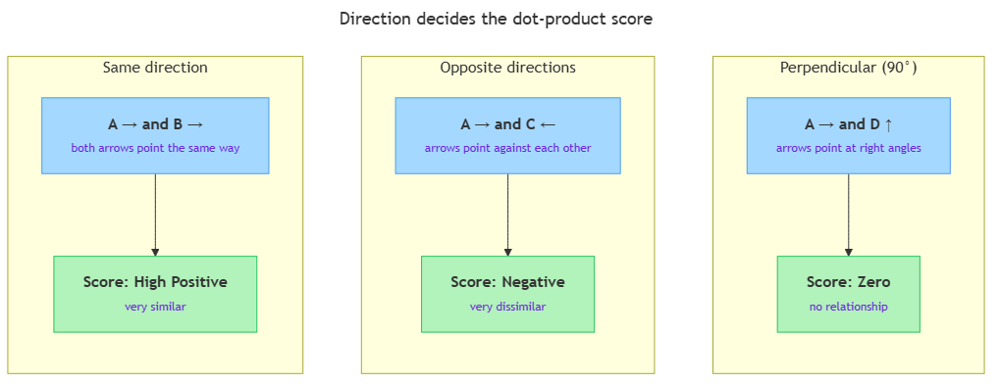

<!-- nav:top:start -->
[⬅ Previous: 6.5 — A vector as a point in space](../../../2-scalars-vectors-and-matrices/6-5-a-vector-as-a-point-in-space-music-taste-described-as-three/artifacts/reading.md)&emsp;·&emsp;[⬆ Table of Contents](../../../../../../../README.md#curriculum-topic-index)&emsp;·&emsp;[Next: 6.7 — Embeddings ➡](../../6-7-embeddings-turning-words-into-vectors-that-capture-meaning/artifacts/reading.md)
<!-- nav:top:end -->

---

# Dot product as similarity — vectors pointing the same direction score high

## Overview

You have seen that a vector is a list of numbers where each position records one feature — energy, tempo, mood. The **dot product** is a calculation that takes two vectors and produces a single number (a scalar) that answers one question: do these two vectors point in the same direction? A high score means the items are similar; a low or negative score means they are not. This one operation sits at the heart of recommendation feeds, search engines, and language models [1].

## Key Concepts

### 1. What the dot product is

The **dot product** — also written A · B — is a way to compare two vectors of the same length. It produces a **similarity score**: a single scalar that summarises how alike two vectors are [1][2].

The rule has two steps:
1. Multiply each pair of matching positions: position 1 with position 1, position 2 with position 2, and so on.
2. Add all those products together.

That sum is the dot product. It is always a scalar — never another vector.

**Position order matters.** Position 1 might mean energy, position 2 tempo, position 3 mood. Multiplying position 1 of A with position 1 of B compares energy against energy. Scrambling the positions makes the result meaningless [2].

### 2. Direction decides the score

*Three possible relationships between two vectors, and the dot-product score each one produces.*

Think of each multiplication as a **vote** [1][3]:
- When both values at the same position are large and positive, the vote is a large positive number.
- When one is positive and the other is negative, the vote is negative.
- When either value is near zero, the vote barely counts.

The sum of all votes gives the verdict:

| Relationship | Score | Meaning |
|---|---|---|
| Same direction | High positive | Very similar |
| Opposite directions | Large negative | Very dissimilar |
| Perpendicular (90°) | Zero | No relationship |

### 3. Magnitude sensitivity — a known limit

Vectors with larger numbers naturally produce higher dot products, even when two shorter vectors point in exactly the same direction [1][2]. This means the score reflects both direction *and* size. You will see in topic 6.9 how **cosine similarity** corrects for this by normalising the magnitudes — name and defer for now.

## Worked Example

Suppose a music app stores each song as a three-number feature vector: `[energy, tempo, mood]`.

- **Song A** = [0.8, 0.6, 0.3]
- **Song B** = [0.7, 0.5, 0.2] (similar to A)
- **Song C** = [−0.7, −0.5, −0.2] (opposite to A)

**A · B — similar songs:**

| Step | Calculation | Result |
|---|---|---|
| Multiply position 1 | 0.8 × 0.7 | 0.56 |
| Multiply position 2 | 0.6 × 0.5 | 0.30 |
| Multiply position 3 | 0.3 × 0.2 | 0.06 |
| **Sum** | 0.56 + 0.30 + 0.06 | **0.92** |

Score of **0.92** — high positive. The app treats A and B as very similar [1][2].

**A · C — opposite songs:**

Each product flips sign: −0.56 + (−0.30) + (−0.06) = **−0.92**.

Score of **−0.92** — strongly negative. Song C is the musical opposite of Song A.

## In Practice

AI systems use the dot product at massive scale [1][3]:

- **Recommendation feeds** — Spotify, Netflix, and YouTube compute millions of dot products per second. Your taste is encoded as a feature vector; each candidate song or video is another. The highest-scoring candidates surface in your feed.
- **Search engines and LLMs** — a search query and every document in the index are each encoded as a vector (called an embedding — you will explore that in topic 6.7). The document with the highest dot product against the query is returned as the most relevant result.
- **Image similarity** — the feature vectors of two visually similar images point in the same direction and therefore score high against each other.

**The key do/don't:**
- Do check that both vectors have the same number of dimensions before calculating — the formula breaks otherwise.
- Do not compare raw dot-product scores from vectors of very different sizes without normalising — see topic 6.9.

## Key Takeaways

- The **dot product** multiplies matching positions of two vectors and sums the results, producing a single scalar [2].
- Same direction → high positive score (very similar); opposite directions → large negative (very dissimilar); perpendicular → zero (unrelated) [1][3].
- Each position multiplication is a **vote** — strong matching values vote loudly; opposite signs vote against similarity [1].
- AI uses dot products at massive scale for recommendations, search, and language models [3].
- The dot product is sensitive to vector size; **cosine similarity** (topic 6.9) corrects this.

## References

[1] apxml.com — Similarity with Dot Products (Linear Algebra Fundamentals for ML): https://apxml.com/courses/linear-algebra-fundamentals-machine-learning/chapter-6-linear-algebra-in-ml/similarity-with-dot-products

[2] learndatasci.com — Dot Product (Glossary): https://www.learndatasci.com/glossary/dot-product/

[3] jamesmccaffreyblog.com — Using Dot Product as a Measure of Similarity: https://jamesmccaffreyblog.com/2022/03/28/using-dot-product-as-a-measure-of-similarity/

---
<!-- nav:bottom:start -->
[⬅ Previous: 6.5 — A vector as a point in space](../../../2-scalars-vectors-and-matrices/6-5-a-vector-as-a-point-in-space-music-taste-described-as-three/artifacts/reading.md)&emsp;·&emsp;[⬆ Table of Contents](../../../../../../../README.md#curriculum-topic-index)&emsp;·&emsp;[Next: 6.7 — Embeddings ➡](../../6-7-embeddings-turning-words-into-vectors-that-capture-meaning/artifacts/reading.md)
<!-- nav:bottom:end -->
