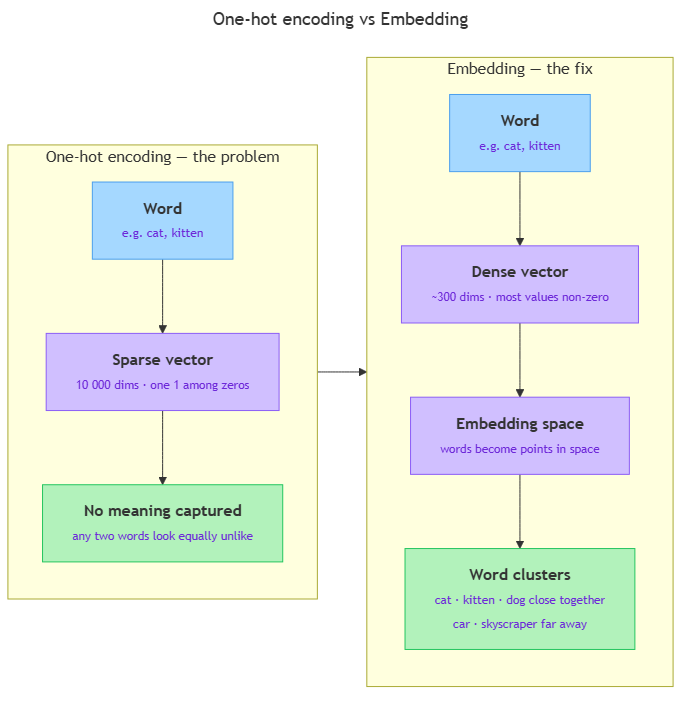

<!-- nav:top:start -->
[⬅ Previous: 6.6 — Dot product as similarity](../../6-6-dot-product-as-similarity-vectors-pointing-the-same-directio/artifacts/reading.md)&emsp;·&emsp;[⬆ Table of Contents](../../../../../../../README.md#curriculum-topic-index)&emsp;·&emsp;[Next: 6.8 — Why 'king − man + woman ≈ queen' works ➡](../../6-8-why-king-man-woman-queen-works/artifacts/reading.md)
<!-- nav:top:end -->

---

# Embeddings — turning words into vectors that capture meaning

## Overview

Computers understand numbers, not words. To feed language into an AI system, every word must be converted into a list of numbers — a vector. A naive conversion gives each word a unique code number, but that approach tells the AI nothing about meaning. **Word embeddings** solve this by representing each word as a carefully learned vector where the geometry of the space reflects the meaning of the words: words used in similar contexts end up close together, and words with unrelated meanings end up far apart [1].

## Key Concepts

### The problem with the naive approach: one-hot encoding

The simplest approach, called **one-hot encoding**, assigns each word a slot in a long vector of zeros with a single 1 in that word's position.

For a vocabulary of 10,000 words, "cat" becomes 9,999 zeros with a single 1, and "kitten" another such vector in a different slot. The dot product of any two different one-hot vectors is always zero — every word looks equally dissimilar from every other word, so meaning is invisible and the vectors are enormous [1][2].

### What an embedding is

An **embedding** is a dense, low-dimensional vector that encodes meaning through the positions of numbers — not through which slot is switched on.

Key properties:
- **Dense** — most of the values are non-zero; each number carries information.
- **Low-dimensional** — typical embeddings use 50, 100, or 300 numbers per word, not 10,000 or 100,000.
- **Meaning through geometry** — words with similar meanings end up at nearby points in the **embedding space**; unrelated words end up far apart [1].

*One-hot vectors are huge and empty; embedding vectors are compact and carry meaning through their position in the embedding space.*

### How embeddings are learned

Embeddings are not hand-coded; they are learned from text. The guiding principle is the **distributional hypothesis**: words that appear in similar surrounding contexts tend to have similar meanings [1].

Word2Vec (Google, 2013) learns embeddings by asking a model to predict which words appear near a target word, starting from random vectors and nudging them closer each time words share contexts. After billions of examples, words that appeared in similar surroundings end up with similar vectors. Pre-trained sets such as GloVe and FastText follow the same distributional logic [1].

### One-hot vs embedding at a glance

| Property | One-hot | Embedding |
|---|---|---|
| Vector size | One dimension per vocabulary word (very large) | Fixed, small (e.g. 300) |
| Most values | Zero | Non-zero |
| Captures meaning | No | Yes |
| Needs training | No | Yes |

## Worked Example

Imagine a tiny vocabulary of five words: **cat, kitten, dog, skyscraper, tower**.

**One-hot encoding** gives each word a 5-element vector:

| Word | Vector |
|---|---|
| cat | [1, 0, 0, 0, 0] |
| kitten | [0, 1, 0, 0, 0] |
| dog | [0, 0, 1, 0, 0] |
| skyscraper | [0, 0, 0, 1, 0] |
| tower | [0, 0, 0, 0, 1] |

Dot product of cat and kitten: (1×0) + (0×1) + … = **0**. They look identical in similarity to cat and skyscraper — also 0. No information.

**After embedding training**, cat and kitten might have 3-dimensional vectors like:

| Word | Vector |
|---|---|
| cat | [0.9, 0.8, 0.1] |
| kitten | [0.85, 0.82, 0.09] |
| dog | [0.88, 0.75, 0.15] |
| skyscraper | [0.1, 0.05, 0.95] |
| tower | [0.12, 0.07, 0.93] |

Now cat and kitten are **close** (similar coordinate values); skyscraper and tower are close to each other but **far from the animals**. The dot product of cat and kitten is high; the dot product of cat and skyscraper is low. Meaning has become geometry [1][3].

## In Practice

Word embeddings underpin most modern AI language systems:

- **Google Search** — the query and every document are represented as vectors. Semantic matching finds relevant results even when the exact words differ [2].
- **Recommendation systems** — Spotify and Netflix represent both users and items (songs, films) as vectors. Closeness in embedding space encodes taste: a user vector near certain item vectors gets those items recommended [2][3].
- **Spam filters and sentiment analysis** — paraphrased spam looks different word-for-word but lands near known-spam vectors in embedding space, so it is still caught [2][3].

## Key Takeaways

- **One-hot encoding** gives every word a unique slot in a giant zero-filled vector; it captures no meaning because every pair of different words is equally dissimilar.
- An **embedding** is a dense, low-dimensional learned vector; words in similar contexts get similar vectors, so meaning becomes distance in the **embedding space**.
- Embeddings are learned from large text corpora using the **distributional hypothesis** — words that appear in similar contexts have similar meanings [1].
- Typical embedding vectors use 50–300 dimensions instead of one dimension per vocabulary word, saving enormous amounts of memory and computation.
- Word embeddings power Google Search, recommendation engines (Spotify, Netflix), spam filters, and virtually every modern NLP application [2][3].

## References

1. Voita, L. *Word Embeddings — NLP Course.* https://lena-voita.github.io/nlp_course/word_embeddings.html
2. Coursera. *Word Embedding in NLP: Definition, Examples, and Explanation.* https://www.coursera.org/articles/word-embedding-nlp
3. Brownlee, J. *A Gentle Introduction to Word Embedding and Text Vectorization.* https://machinelearningmastery.com/a-gentle-introduction-to-word-embedding-and-text-vectorization/

---
<!-- nav:bottom:start -->
[⬅ Previous: 6.6 — Dot product as similarity](../../6-6-dot-product-as-similarity-vectors-pointing-the-same-directio/artifacts/reading.md)&emsp;·&emsp;[⬆ Table of Contents](../../../../../../../README.md#curriculum-topic-index)&emsp;·&emsp;[Next: 6.8 — Why 'king − man + woman ≈ queen' works ➡](../../6-8-why-king-man-woman-queen-works/artifacts/reading.md)
<!-- nav:bottom:end -->
