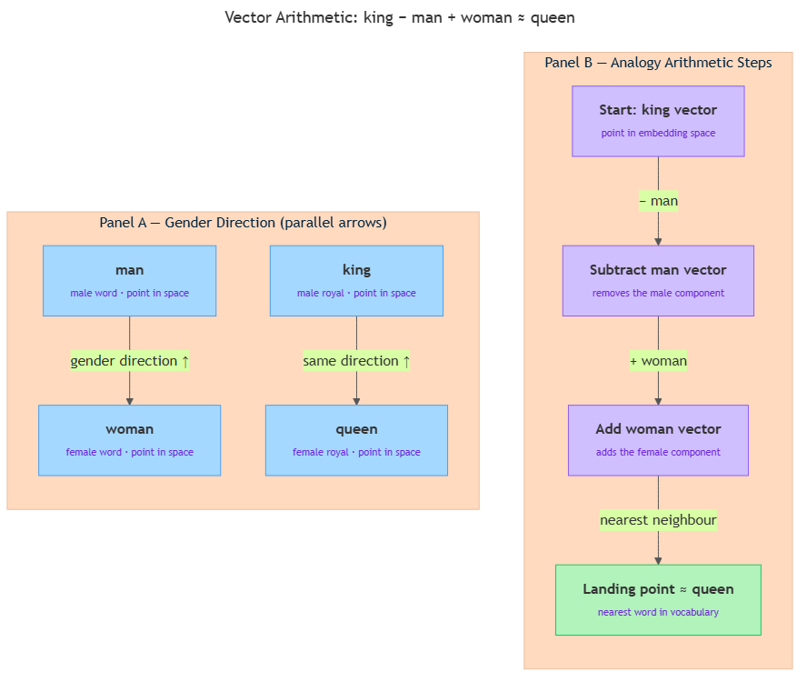

<!-- nav:top:start -->
[⬅ Previous: 6.7 — Embeddings](../../6-7-embeddings-turning-words-into-vectors-that-capture-meaning/artifacts/reading.md)&emsp;·&emsp;[⬆ Table of Contents](../../../../../../../README.md#curriculum-topic-index)&emsp;·&emsp;[Next: 6.9 — Cosine similarity ➡](../../6-9-cosine-similarity-measuring-the-angle-between-two-meaning-ve/artifacts/reading.md)
<!-- nav:top:end -->

---

# Why 'king − man + woman ≈ queen' works

## Overview

Here is a fact that surprises almost everyone the first time they hear it: subtract the vector for "man" from the vector for "king," add the vector for "woman," and the result lands very close to the vector for "queen" [1]. No one programmed the computer to know about royalty or gender. The model discovered this pattern entirely from reading vast amounts of text. This topic explains the geometry behind that discovery — specifically, how directions in an embedding space can encode real-world relationships, and why combining them with simple addition and subtraction produces meaningful results. Understanding this is the foundation for analogy-based search, cross-lingual translation, and responsible-AI bias auditing.

## Key Concepts

### Meaning is geometry

In topic 6.7 you learned that word embeddings place every word at a point in a high-dimensional coordinate space. Words that appear in similar contexts land close together. "King," "queen," "prince," and "princess" cluster in one region of the space. "Paris," "London," and "Berlin" cluster in another. The model does not know these are categories — it discovers the clusters purely from patterns in text [1].

Once words are points in space, you can do geometry with them. You can measure distance. You can use the dot product from 6.6 to measure the angle between two vectors. And — crucially for this topic — you can talk about **direction**.

### Direction in embedding space

**Direction** (in embedding space) means the path you travel when you move from one word's point to another word's point. Picture drawing an arrow from word A to word B on a map. That arrow has a specific direction.

Now consider two pairs of words: "man" → "woman" and "king" → "queen." Draw an arrow for each pair. The remarkable finding — confirmed repeatedly across many embedding models — is that those two arrows point in almost exactly the same direction [1][2]. Both arrows encode the same underlying relationship: one word is the female counterpart of the other, and everything else about the two words is roughly similar.

Researchers call this the **gender direction**: a consistent orientation through the embedding space that separates male-associated words from female-associated words. The same pattern appears in other relationships:

- "actor" → "actress" points in nearly the same direction as "man" → "woman."
- "France" → "Paris" points in nearly the same direction as "Germany" → "Berlin" — this is the "country → capital city" direction [1][3].

The embedding space has encoded real-world relationships as geometric directions, purely by learning which words appear near which other words.

### The analogy as vector arithmetic

**Vector arithmetic** means applying ordinary addition and subtraction to vectors — the same operations you use with single numbers, but carried out on every dimension of the vector at once.

Here is how the analogy king − man + woman ≈ queen breaks down as a sequence of steps:

1. **Start at "king."** Take the vector for the word "king" — a point in the embedding space.
2. **Subtract the "man" vector.** Subtracting a vector reverses the direction of moving toward it. This step removes the "male" component from "king," leaving a point that represents something like "royalty without any gender signal" [1][2].
3. **Add the "woman" vector.** Adding a vector moves you in its direction. This step injects the "female" component, steering you toward the female version of royalty [1][2].
4. **Arrive near "queen."** The landing point is not exactly the "queen" vector, but it is closer to "queen" than to any other word in the vocabulary.

You can write this compactly as: king − man + woman ≈ queen.

Or read it as a direction: "apply the gender direction starting from king, and you land near queen" [1].

The same logic produces other analogies [3]:

- actor − man + woman ≈ actress
- Paris − France + Germany ≈ Berlin
- uncle − man + woman ≈ aunt

*The gender direction (man→woman) is parallel to king→queen; applying it from king lands near queen.*

### Why the result is approximate — the "≈" symbol

**Approximate equality** (written ≈) means "very close to, but not exactly." The result of king − man + woman is not a perfect copy of the "queen" vector. There are three reasons why [2][3]:

- **Noise in the learned space.** A typical Word2Vec embedding has 300 dimensions. The gender direction is not a perfectly clean axis through all 300 of them — it was learned from statistics, not designed by hand.
- **"King" carries more than gender.** Its vector also reflects contexts like "chess piece" and "chess match," which do not apply to "queen." That extra meaning adds noise to the arithmetic [2].
- **No explicit rule was programmed.** The model inferred the direction implicitly from patterns. Implicit learning is powerful but never perfect [1].

So what does ≈ mean in practice? After computing king − man + woman, you get a landing point in the space. You then find the word whose vector is **nearest** to that landing point. The word that turns out to be nearest is "queen" — closer than "princess," closer than "duchess," closer than any other word. Finding that nearest word is called identifying the **nearest-neighbour answer** [2].

**Nearest-neighbour answer** means: after the arithmetic, scan the entire vocabulary and report whichever real word sits closest to your result point. That word is your answer.

### Why it works at all: the distributional hypothesis at scale

The arithmetic works because of the **distributional hypothesis** from 6.7: words that appear in similar contexts get similar vectors. Think about "king" and "queen." Both appear near "throne," "crown," "reign," and "royal court." They differ in exactly one consistent way: "king" appears near male-specific words ("he," "his," "prince") while "queen" appears near female-specific words ("she," "her," "princess") [1][3].

The model sees thousands of such pairs — man/woman, actor/actress, uncle/aunt, king/queen. Across all of them, there is a set of contexts that co-vary with gender. The model's vectors encode that consistent co-variation as a consistent geometric direction [1].

The more word pairs that follow the same pattern, the cleaner that direction becomes. This is why analogy arithmetic works better for common, well-documented relationships than for rare or irregular ones [3]. No one built the gender direction deliberately. The model discovered it by learning from billions of sentences.

## Worked Example

This exercise uses a simplified 2D grid — a compressed stand-in for a real 300-dimensional space — so you can see the arithmetic by hand.

**The four word positions:**

| Word | Axis 1 (horizontal) | Axis 2 (vertical) |
|------|---------------------|-------------------|
| man  | 1.0 | 0.5 |
| woman | 1.0 | 2.5 |
| king | 3.0 | 0.5 |
| queen | 3.0 | 2.5 |

**Step 1 — Find the gender direction.**

Draw an arrow from man (1.0, 0.5) to woman (1.0, 2.5).

Compute the difference:
- Axis 1: 1.0 − 1.0 = 0.0
- Axis 2: 2.5 − 0.5 = +2.0

The **embedding offset** — the difference vector between two words — is (0.0, +2.0). This is the gender direction: no horizontal movement, two steps upward.

**Embedding offset** means the vector you get by subtracting one word's coordinates from another's. It captures the direction and distance between them.

**Step 2 — Apply the offset to "king."**

Compute king − man + woman dimension by dimension:

- Axis 1: 3.0 − 1.0 + 1.0 = **3.0**
- Axis 2: 0.5 − 0.5 + 2.5 = **2.5**

The result is **(3.0, 2.5)**.

**Step 3 — Find the nearest neighbour.**

Look at the vocabulary. Which word sits at or near (3.0, 2.5)? That is exactly the position of "queen." The nearest-neighbour answer is **queen**.

**Step 4 — Check the parallel arrows.**

Draw the arrow from man (1.0, 0.5) to woman (1.0, 2.5): straight up, length 2. Draw the arrow from king (3.0, 0.5) to queen (3.0, 2.5): also straight up, length 2. The two arrows are perfectly parallel — same direction, same length. That parallel relationship is the visual definition of the gender direction being consistent across both word pairs.

**Reflection:** In a real 300-dimensional embedding the result would land near "queen" but not exactly on it. The real embedding was learned from messy text statistics, not laid out on a clean grid. The clean 2D example shows the idea; the real-world version adds noise around the landing point.

## In Practice

- **Analogy-based search [1][3].** Systems can answer questions like "What is the capital of Spain?" without storing that fact explicitly. They compute: Spain + (France → Paris direction) ≈ Madrid. The answer comes from geometry, not a lookup table.

- **Bias auditing [1][2].** Because directions encode relationships, they also expose stereotypes. Compute doctor − man + woman. If the nearest-neighbour answer is "nurse" rather than "doctor," the embedding has absorbed a gender stereotype from its training text. Researchers use exactly this technique to measure and document bias in pre-trained embeddings — a key practice in responsible AI work. Analogy arithmetic should be checked, not trusted blindly.

- **Cross-lingual alignment [3].** Some multilingual embedding systems place words from multiple languages in the same space. The direction from an English word to its French equivalent is consistent across many pairs. Applying that direction to a new English word finds an approximate French translation — without a dictionary. The same arithmetic extends across a language boundary rather than a gender boundary.

## Key Takeaways

- A **direction** in embedding space is the arrow from one word's point to another. When many word pairs share the same direction — man→woman, king→queen, actor→actress — that direction encodes a real-world relationship such as gender [1].
- **Vector arithmetic** applies ordinary addition and subtraction to every dimension of a vector at once. king − man + woman first removes the "male" signal, then adds the "female" signal, landing near "queen" [1][2].
- The result is always **approximate** (≈). The arithmetic produces a landing point; the answer is whichever real word is nearest to that point — the nearest-neighbour answer. No one programmed this; the geometry emerges from training [2][3].
- The arithmetic works because of the **distributional hypothesis**: "king" and "queen" appear near the same contexts except for systematic gender differences. The model picks up that pattern as a consistent geometric direction across thousands of word pairs [1][3].
- Analogy arithmetic has direct practical uses: analogy-based search, cross-lingual alignment, and **bias auditing** — inspecting the direction structure to reveal unintended associations a model absorbed from its training data [2][3].

## References

1. University of Edinburgh — "King − man + woman = queen: the hidden algebraic structure of language." Edinburgh Informatics News. https://informatics.ed.ac.uk/news-events/news/news-archive/king-man-woman-queen-the-hidden-algebraic-struct
2. Medium / Plotly — "Understanding Word Embedding Arithmetic: Why There's No Single Answer to king − man + woman." https://medium.com/plotly/understanding-word-embedding-arithmetic-why-theres-no-single-answer-to-king-man-woman-cd2760e2cb7f
3. Medium / data-from-the-trenches — "Arithmetic Properties of Word Embeddings." https://medium.com/data-from-the-trenches/arithmetic-properties-of-word-embeddings-e918e3fda2ac

---
<!-- nav:bottom:start -->
[⬅ Previous: 6.7 — Embeddings](../../6-7-embeddings-turning-words-into-vectors-that-capture-meaning/artifacts/reading.md)&emsp;·&emsp;[⬆ Table of Contents](../../../../../../../README.md#curriculum-topic-index)&emsp;·&emsp;[Next: 6.9 — Cosine similarity ➡](../../6-9-cosine-similarity-measuring-the-angle-between-two-meaning-ve/artifacts/reading.md)
<!-- nav:bottom:end -->
