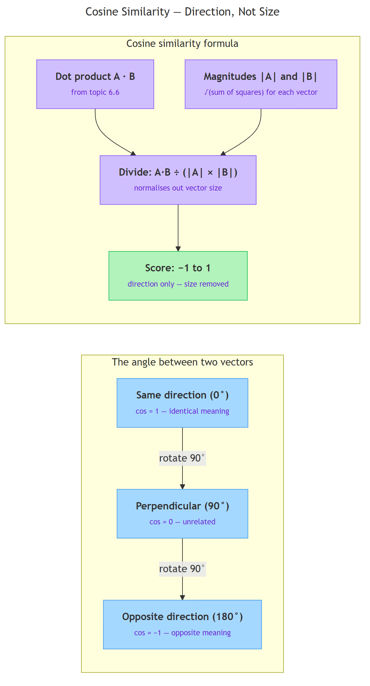
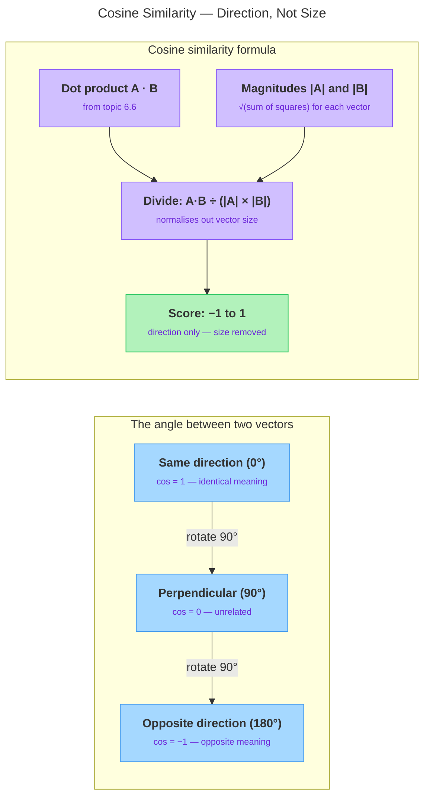

<!-- nav:top:start -->
[⬅ Previous: 6.8 — Why 'king − man + woman ≈ queen' works](../../6-8-why-king-man-woman-queen-works/artifacts/reading.md)&emsp;·&emsp;[⬆ Table of Contents](../../../../../../../README.md#curriculum-topic-index)&emsp;·&emsp;[Next: 6.10 — Using the TensorFlow Embedding Projector to explore word clusters ➡](../../../4-hands-on-exploration/6-10-using-the-tensorflow-embedding-projector-to-explore-word-clu/artifacts/reading.md)
<!-- nav:top:end -->

---

# Cosine similarity — measuring the angle between two meaning-vectors

## Overview

In topic 6.8 you saw that word embeddings store meaning as directions in a high-dimensional space. Once you have two meaning-vectors, you need a reliable way to measure whether they agree on direction. The **dot product** from topic 6.6 is a start, but it is sensitive to vector size — a longer document produces a bigger dot product than a short tweet with identical meaning, just because its numbers are larger [1]. **Cosine similarity** fixes this with one extra step: divide the dot product by the lengths of both vectors. That single division cancels out size and keeps only direction. The result is always between −1 and 1, so every score is directly comparable no matter how the original vectors were scaled [1][3]. This makes cosine similarity the standard tool for any system that compares meaning stored as vectors.

*Cosine Similarity — Direction, Not Size*

## Key Concepts

### Why the raw dot product is not enough

Recall from topic 6.6 that the dot product multiplies matching coordinates and sums the results. The problem is **magnitude sensitivity** — if you double every number in a vector, its dot product with any other vector also doubles, even though the direction is completely unchanged. Two documents with identical meaning but different lengths would score differently. That is not a fair comparison when the goal is to measure meaning, not size [1][2].

### Angle as a meaning measure

Every embedding is an arrow pointing from the origin in high-dimensional space. Two arrows form an angle θ (**theta** — the Greek letter conventionally used for angles). The **cosine** of that angle is a mathematical function that converts the angle into a number between −1 and 1. You do not need to understand trigonometry — the formula below does the conversion automatically [2][5].

| Angle θ | Cosine score | What it means |
|---------|-------------|---------------|
| 0° | 1.0 | Identical direction — same meaning |
| 45° | ≈ 0.71 | Similar direction — related meaning |
| 90° | 0.0 | Perpendicular — unrelated |
| 180° | −1.0 | Opposite direction — opposite meaning |

**Why use angle instead of distance?** Distance (from topic 6.5) still depends on how far apart the arrow tips are. Two vectors pointing the same way but at different scales are far apart by distance — yet they represent the same meaning. Cosine ignores length entirely and focuses only on direction, which is exactly what you need when comparing meaning-vectors [5].

### The formula

**Cosine similarity** is calculated as:

> cos(θ) = (A · B) / (|A| × |B|)

Each part has a specific job:

- **A · B** — the dot product of the two vectors (from topic 6.6): multiply matching coordinates, then sum all the products.
- **|A|** — the **magnitude** (length) of vector A: square each coordinate, sum them, then take the square root.
- **|B|** — the magnitude of vector B, computed the same way.
- **Division by |A| × |B|** — this is **normalisation**: it cancels out the size of both vectors and scales the result to the −1 to 1 range [1][2][3].

The diagram below shows how the angle scores and the formula steps connect.

*Left panel: how the angle between two vectors maps to a cosine score. Right panel: the three steps of the formula that produce that score.*

### Normalisation and its practical payoff

**Normalisation** means dividing a vector by its own magnitude to produce a length-1 vector that carries only direction information. When you normalise all stored embeddings once upfront, computing cosine similarity later reduces to a plain dot product — because the magnitude denominators are already baked in as 1 [3][5]. This matters at scale: a vocabulary of 100,000 words requires 100,000 comparisons for every single query, so every shortcut counts. Libraries such as scikit-learn (a popular Python data-science library) [3], Keras (a Python deep-learning library) [4], and Pinecone (a vector database) [5] all expose cosine similarity directly and apply this optimisation automatically.

## Worked Example

Use two small vectors to see each formula step clearly.

**Given:** A = [3, 1] and B = [2, 2]

**Step 1 — Dot product:**
(3 × 2) + (1 × 2) = 6 + 2 = **8**

**Step 2 — Magnitude of A:**
√(3² + 1²) = √(9 + 1) = √10 ≈ **3.162**

**Step 3 — Magnitude of B:**
√(2² + 2²) = √(4 + 4) = √8 ≈ **2.828**

**Step 4 — Divide:**
8 ÷ (3.162 × 2.828) = 8 ÷ 8.944 ≈ **0.894**

A score of 0.894 is close to 1, so A and B point in nearly the same direction.

**Now see why normalisation matters.** Suppose you have three word vectors: cat = [4, 3], kitten = [3, 4], and car = [0, 2].

- cat · kitten = (4×3) + (3×4) = 24; |cat| = 5; |kitten| = 5; cosine = 24 ÷ 25 = **0.96** — very similar [2][3]
- cat · car = (4×0) + (3×2) = 6; |cat| = 5; |car| = 2; cosine = 6 ÷ 10 = **0.60** — partial overlap

The raw dot products were 24 vs 6 — a 4:1 ratio. The cosine scores are 0.96 vs 0.60 — a much smaller gap. Normalisation removed the size advantage that cat and kitten had from their larger coordinate values, giving a fairer picture of the actual meaning relationship [2][3].

## In Practice

Cosine similarity is the default comparison method for any system that stores meaning as vectors [1][5]. The pattern is always the same: turn a query into an embedding, then rank stored items by cosine score against that query. The closer the score is to 1, the better the meaning match.

**Where you will see it:**

- **Nearest-word lookup** (from topic 6.8): after vector arithmetic like king − man + woman, compute cosine between the result and every word in the vocabulary. The word with the highest score is returned as the answer ("queen") [1][5].
- **Semantic search**: a user's query is turned into an embedding. Cosine ranks stored documents by meaning — not by keyword overlap [1][5].
- **Recommendations**: a user's taste vector is compared against item embeddings. Items with cosine near 1 are surfaced first [5].
- **Duplicate detection**: two paraphrases share a high cosine score even when they share almost no words [2][5].

**Common pitfalls to avoid:**

- Score 0 means *unrelated*, not opposite. Score −1 means opposite. Do not confuse the two [2].
- Many real embedding models produce only positive coordinates. The practical range is then 0 to 1, not −1 to 1 — a score of 0 is still "unrelated" in that narrower range.
- Cosine similarity is not a distance metric in the strict mathematical sense. Some algorithms require a true distance measure; in those cases you would use a different formula. For meaning comparison, cosine is the right choice.
- Normalise stored vectors once upfront, then reuse. Recomputing magnitudes on every single query wastes time at scale [3][5].

## Key Takeaways

- **Cosine similarity** measures the angle between two vectors, not the distance between their endpoints.
- The formula is cos(θ) = (A · B) / (|A| × |B|) — dot product divided by the product of both magnitudes [1][3].
- Scores range from −1 (opposite) through 0 (unrelated) to 1 (identical direction) [2][5].
- Dividing by magnitudes is called **normalisation** — it removes size sensitivity and makes scores directly comparable regardless of vector length.
- Cosine similarity powers nearest-word lookup, semantic search, recommendations, and duplicate detection [1][5].

## References

1. Google Developers — Machine Learning Crash Course: Embeddings / Similarity. https://developers.google.com/machine-learning/crash-course/embeddings/similarity
2. Towards Data Science — Cosine Similarity: How Does It Measure the Similarity, Maths Behind and Usage in Python. https://towardsdatascience.com/cosine-similarity-how-does-it-measure-the-similarity-maths-behind-and-usage-in-python-50ad30aad7db
3. scikit-learn — Metrics: Cosine Similarity. https://scikit-learn.org/stable/modules/metrics.html#cosine-similarity
4. Keras — CosineSimilarity loss class. https://keras.io/api/losses/probabilistic_losses/#cosinesimilarity-class
5. Pinecone — Vector Similarity. https://www.pinecone.io/learn/vector-similarity/

---
<!-- nav:bottom:start -->
[⬅ Previous: 6.8 — Why 'king − man + woman ≈ queen' works](../../6-8-why-king-man-woman-queen-works/artifacts/reading.md)&emsp;·&emsp;[⬆ Table of Contents](../../../../../../../README.md#curriculum-topic-index)&emsp;·&emsp;[Next: 6.10 — Using the TensorFlow Embedding Projector to explore word clusters ➡](../../../4-hands-on-exploration/6-10-using-the-tensorflow-embedding-projector-to-explore-word-clu/artifacts/reading.md)
<!-- nav:bottom:end -->
