<!-- nav:top:start -->
[⬅ Previous: 6.9 — Cosine similarity](../../../3-similarity-and-meaning/6-9-cosine-similarity-measuring-the-angle-between-two-meaning-ve/artifacts/reading.md)&emsp;·&emsp;[⬆ Table of Contents](../../../../../../../README.md#curriculum-topic-index)&emsp;·&emsp;[Next: 7.1 — Probability basics ➡](../../../../week-7/1-probability-foundations/7-1-probability-basics-likelihood-events-outcomes/artifacts/reading.md)
<!-- nav:top:end -->

---

# Using the TensorFlow Embedding Projector to Explore Word Clusters

## Overview

For nine topics you have built one big idea: meaning can be written as numbers. A word becomes a vector (a list of numbers), and similar words get similar vectors — that is an embedding. The problem is that you have never actually *seen* this space, because real embeddings are far too long to picture. This topic fixes that: you will use a free web tool, the TensorFlow Embedding Projector, to look at word embeddings as dots you can spin around in your browser and watch related words clump together [1].

## Key Concepts

**TensorFlow Embedding Projector — a free, browser-based tool for looking at embeddings.** You point your browser at *projector.tensorflow.org* and it shows a cloud of dots floating in space. Each dot is one word, and the position of each dot comes straight from that word's embedding vector [1][3]. TensorFlow is a software toolkit made by Google, but you do not need to know anything about it to use the Projector.

The whole point of the tool is to turn the idea of "a word is a point in space" (6.5) into something you can literally see and rotate with your mouse. It loads with an example dataset already in it, so you can explore on day one with nothing to prepare [3].

**The squashing problem.** Here is the honest difficulty: a word embedding might have 200 numbers in it. That means each word is a point in a 200-dimension space — far more directions than a flat screen can show.

- **Dimension — one number, one direction in the space.** A 200-number vector needs 200 directions, and your screen has at most 3.
- The Projector **squashes** the high-dimensional points down to 2 or 3 dimensions so they fit on screen, while trying hard to keep points that were close in the original space still close in the picture [1].
- Think of photographing a sculpture: the photo is flat, but a good photo still shows which parts sit near each other. The Projector does the same trick, from many more dimensions down to a viewable few.

You do not control the squashing by hand. You pick one of two built-in methods from a menu, labelled **PCA** and **t-SNE**. Treat those as named buttons that do the squashing — how they actually work is covered later in the curriculum.

```mermaid
flowchart LR
    subgraph PIPELINE["From long vectors to clusters"]
        direction LR
        P1["<b>Long word vectors</b><br/><span style='font-size:12px;color:#6d28d9'>100-300 numbers each</span>"]
        P2["<b>Squash to 2D or 3D</b><br/><span style='font-size:12px;color:#6d28d9'>PCA / t-SNE buttons</span>"]
        P3["<b>Cloud of dots</b><br/><span style='font-size:12px;color:#6d28d9'>spin and zoom on screen</span>"]
        P4["<b>Clusters of dots</b><br/><span style='font-size:12px;color:#6d28d9'>nearby = similar words</span>"]
        P1 --> P2 --> P3 --> P4
    end

    subgraph SEARCH["Search callout"]
        direction TB
        S1["<b>Search a word</b><br/><span style='font-size:12px;color:#6d28d9'>type apple, king, paris</span>"]
        S2["<b>Nearest neighbours lit up</b><br/><span style='font-size:12px;color:#6d28d9'>ranked by cosine similarity</span>"]
        S1 --> S2
    end

    P4 -.->|"pick a dot"| S1

    classDef start fill:#a5d8ff,stroke:#4a9eed
    classDef auto fill:#d0bfff,stroke:#8b5cf6
    classDef done fill:#b2f2bb,stroke:#22c55e

    class P1 start
    class P2,P3 auto
    class P4 done
    class S1 start
    class S2 done
```

*The Projector pipeline: long word vectors are squashed into a viewable dot cloud where nearby dots form clusters, and searching a word lights up its nearest neighbours.*

Because the picture is a flattened shadow of a larger space, trust the big picture — which words clump together — more than tiny pixel-level gaps. Switching from one squashing button to the other rearranges the dots; the clusters usually survive, even though their exact shape changes. That is expected, not a bug.

**Cluster — a clump of dots sitting close together** [1]. By everything you learned this week, closeness means similarity: dots near each other are words whose embeddings are similar, so the words tend to mean related things. Reading the Projector is mostly one move: find the clumps, then ask what the words in each clump have in common. You might spot a clump of country names, a clump of numbers, or a clump of polite words. The tool did not label these groups — the embedding put related words near each other, and your eye does the rest.

**Search — the most useful button.** You type a word, say `apple`, and the tool highlights that word's dot and lights up its nearest neighbours: the handful of words whose vectors are most similar to it [1][3]. A side panel lists those neighbours, usually with a number next to each — that number is typically a cosine similarity (6.9), where higher means more similar in meaning. So the panel is an automatic, ranked version of the by-hand comparisons you did earlier in the week.

## Worked Example

Suppose you open the Projector and search the word `apple`. Here is what unfolds, step by step:

1. The tool highlights the dot for `apple` inside the dot cloud.
2. It lights up the nearest neighbours — the closest dots to `apple`.
3. A side panel lists them, ranked, often with a cosine-similarity score beside each.
4. Near the top you might see `apples`, `fruit`, and `banana` — clearly related in meaning.
5. You might *also* see `iphone` in the list, which seems odd at first.

Why does `iphone` show up? Because embeddings learn from how words are actually *used* in text, and "Apple" the company appears near "iPhone" constantly. That surprise is not an error — it is the embedding faithfully reporting real-world usage. Reading that one list teaches the core lesson of the week: nearness on screen equals similarity in meaning *and* in usage.

## In Practice

The Projector is not a toy demo — it is a working diagnostic tool used by real machine-learning teams [1]. The everyday rule is: *before trusting an embedding, look at it.* If words that should be similar are not clustering, the embedding is suspect.

The same closeness-means-similarity idea powers products you already use:

- **Search.** A search engine turns your query into a vector and finds documents whose vectors are its nearest neighbours.
- **Recommendations.** "Customers who liked this also liked…" is nearest-neighbour lookup in an embedding space.
- **Grouping similar items.** Photo apps and support tools cluster similar items the same way the Projector clusters words [1].

A short do-and-don't list for honest readings:

| Do | Don't |
|---|---|
| Trust the big clusters — which words clump together. | Read deep meaning into tiny pixel gaps; squashing distorts fine distances. |
| Toggle PCA and t-SNE and trust patterns that survive both. | Assume one squashed view is "the truth"; it is one shadow of many. |
| Use search to confirm a hunch about a word's neighbours. | Expect every neighbour to make obvious sense; some surprises are real. |
| Treat the similarity numbers as cosine similarity (6.9). | Treat on-screen distance as an exact measurement. |

To try it yourself, the lab is a short browser-only procedure [3]:

1. Open *projector.tensorflow.org*; a 3D cloud of dots loads automatically.
2. Click and drag to spin the cloud, and scroll to zoom. Notice the dense areas — those are your clusters.
3. Toggle between PCA and t-SNE and watch the dots rearrange while the clumps mostly stay clumped.
4. Search a common word (`king`, `apple`, `paris`) and read off its highlighted nearest neighbours.
5. Search a clearly different word and confirm its neighbours sit in a different cluster.

## Key Takeaways

- The **TensorFlow Embedding Projector** is a free browser tool that draws word embeddings as dots you can rotate, turning "a word is a point in space" into something you can see.
- High-dimensional vectors must be **squashed** to 2D or 3D to fit on screen; PCA and t-SNE are the named buttons that do this, and the view is an approximate shadow of the real space.
- A **cluster** is a clump of nearby dots; nearness means similar embeddings, which means related words — similarity-as-closeness made literal.
- **Search** highlights a word's **nearest neighbours** and lists them by similarity (typically cosine similarity), automating the by-hand comparisons from earlier in the week.
- The lab is understanding-only: look, search, and notice patterns — no coding, and no studying how embeddings are trained or how the squashing maths works.

## References

1. Google Research. *Open Sourcing the Embedding Projector: a tool for visualizing high-dimensional data.* https://research.google/blog/open-sourcing-the-embedding-projector-a-tool-for-visualizing-high-dimensional-data/
3. TensorFlow. *TensorBoard Projector Plugin — visualizing embeddings step by step.* https://www.tensorflow.org/tensorboard/tensorboard_projector_plugin

---
<!-- nav:bottom:start -->
[⬅ Previous: 6.9 — Cosine similarity](../../../3-similarity-and-meaning/6-9-cosine-similarity-measuring-the-angle-between-two-meaning-ve/artifacts/reading.md)&emsp;·&emsp;[⬆ Table of Contents](../../../../../../../README.md#curriculum-topic-index)&emsp;·&emsp;[Next: 7.1 — Probability basics ➡](../../../../week-7/1-probability-foundations/7-1-probability-basics-likelihood-events-outcomes/artifacts/reading.md)
<!-- nav:bottom:end -->
