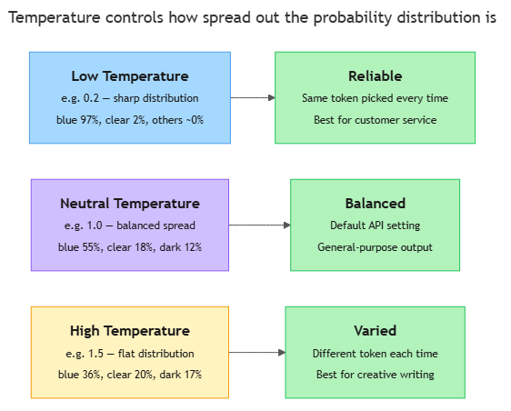

<!-- nav:top:start -->
[⬅ Previous: 7.4 — Why LLMs output a probability distribution, not a single fixed answer](../../7-4-why-llms-output-a-probability-distribution-not-a-single-fixe/artifacts/reading.md)&emsp;·&emsp;[⬆ Table of Contents](../../../../../../../README.md#curriculum-topic-index)&emsp;·&emsp;[Next: 7.6 — Mean, median, mode ➡](../../../3-measuring-ai-performance/7-6-mean-median-mode-measuring-consistency-across-ai-runs/artifacts/reading.md)
<!-- nav:top:end -->

---

# Temperature — low picks the most likely token, high introduces variation

## Overview

When an LLM (Large Language Model) generates text, it does not just pick one fixed answer. It produces a probability distribution — a list where every token in the vocabulary has a score between 0 and 1 and all scores sum to 1 — and then samples from that list. **Temperature** is the setting that controls how that sampling behaves. Turn it down and the model plays it safe, nearly always choosing its top pick. Turn it up and the model spreads its bets, sometimes choosing surprising options. Knowing how temperature works helps you predict when an AI will be consistent, when it will vary, and how much to trust what it says.

## Key Concepts

### What temperature is

**Temperature** is a number — usually between 0 and 2 — that you set before a model generates a response. It controls how spread out or concentrated the probability distribution over the vocabulary is at the moment the model samples its next token [1].

Temperature does not change what the model knows. It changes how confidently the model commits to its top choice. Think of it like a dial:

- **Dial down (low temperature):** the model becomes cautious and nearly always picks the most likely token.
- **Dial up (high temperature):** the model becomes adventurous and spreads its choices across many tokens, including less obvious ones.

The name comes from physics — in a physical system, higher temperature means more random movement. In an LLM, higher temperature means more randomness in token selection [3].

### How temperature reshapes the distribution

To understand what temperature actually does mechanically, recall from topic 7.4 that the model first computes a raw score for each token in its vocabulary — a number where higher means "more likely."

Before converting those raw scores into probabilities using softmax (the function that turns any set of numbers into a valid probability distribution), the model divides every raw score by the temperature value [1][3]. That one division changes everything:

- **Low temperature (e.g. 0.2):** dividing by a small number makes the gaps between scores *bigger*. After softmax, nearly all probability piles onto one or two tokens. The distribution is **sharp**.
- **High temperature (e.g. 1.5):** dividing by a large number makes the gaps between scores *smaller*. After softmax, probability is spread more evenly. The distribution is **flat**.

The diagram below shows this contrast across three temperature settings.

*How temperature reshapes the probability distribution: low temperature concentrates probability on the top token (Reliable); neutral temperature balances it (Balanced); high temperature spreads it across many tokens (Varied).*

### Temperature 0 — the fully deterministic case

When temperature is set to exactly 0, the model always picks the single highest-probability token. There is no sampling at all. The same prompt, run ten times, produces the exact same response every time. This turns an LLM from a **stochastic system** (one with randomness) back into a **deterministic system** (one with fixed outputs) [1].

**Temperature 0 does not mean correct — only consistent.** If the model's top token is wrong, it will be wrong the same way every time.

### Low, medium, and high — what each setting is good for

| Setting | Behaviour | Best for | Watch out for |
|---|---|---|---|
| Low (0–0.5) | Predictable, consistent | Factual Q&A, classification, code | Repetitive or generic phrasing |
| Medium (0.7–1.0) | Balanced | General conversation, summarisation | Still varies between runs |
| High (above 1.0) | Adventurous, varied | Creative writing, brainstorming | Incoherent or off-topic output |

### Temperature and how much to trust the output

Temperature also affects how easy it is to evaluate an LLM's accuracy [2]:

- **Low temperature:** run the same prompt ten times and you get nearly the same answer each time. Easy to check whether the model is right or wrong.
- **High temperature:** run the same prompt ten times and you get ten different responses. Harder to measure accuracy because the answer moves around.

Higher temperature does not make the model smarter — it only changes how spread out the choices are [1][2].

## Worked Example

Follow the temperature mechanism step by step for the prompt: *"The sky is …"*

1. **Model computes raw scores.** For every token in the vocabulary, the model produces a raw score. Tokens like "blue," "clear," "dark," and "grey" all receive scores. "blue" has the highest raw score.

2. **Divide by temperature.** Each raw score is divided by the temperature value you have set.

3. **Apply softmax.** The adjusted scores are converted into probabilities. Here is what the resulting distribution looks like at three different settings:

   | Next token | Temp 0.2 (low) | Temp 1.0 (neutral) | Temp 1.5 (high) |
   |---|---|---|---|
   | "blue" | ~0.97 | 0.55 | ~0.36 |
   | "clear" | ~0.02 | 0.18 | ~0.20 |
   | "dark" | ~0.01 | 0.12 | ~0.17 |
   | "grey" | ~0.00 | 0.08 | ~0.14 |
   | "falling" | ~0.00 | 0.04 | ~0.09 |

4. **Sample a token.** At temperature 0.2, "blue" wins almost every time (0.97 probability). At temperature 1.5, "blue" is still the most likely single choice but now "clear," "dark," and "grey" are real possibilities with meaningful probability.

5. **Repeat for every token.** Steps 1–4 run again for the next position in the output. Temperature stays constant throughout the entire generation [1][3].

The distribution does not change what the model *knows* — "blue" is always the top-scoring token. Temperature changes how much probability the model *spreads* onto its other options.

## In Practice

**Where you will see temperature set in the real world:**

- **Customer service chatbots** use low temperature (around 0.2). The same question should get the same reliable answer every time [1].
- **Creative writing assistants** use higher temperature (around 1.0–1.2). The model explores less obvious word choices, producing more varied and imaginative output [1][3].
- **APIs and developer tools** — temperature is typically the first parameter a developer configures. Factual or safety-critical tools default to 0.2; creative generators default to 1.0 or above [3].
- **Research experiments** — studies show very low temperature produces consistent results but can repeat the same mistake consistently; higher temperature makes errors vary, sometimes allowing correction by running multiple samples [2].

**Do:**
- Set temperature low (0–0.5) when accuracy and consistency matter.
- Set temperature higher (0.8–1.2) when variety and creativity are the goal.
- Run the same prompt several times at a given setting to understand how much it varies.

**Do not:**
- Assume high temperature means smarter or more accurate output — it means *more varied* output.
- Use high temperature for tasks where a harmful or incorrect answer is a real risk.
- Treat a consistent low-temperature response as automatically correct — it may be consistently wrong.

## Key Takeaways

- **Temperature** controls how spread out the probability distribution is before the model samples the next token. Low = sharp distribution. High = flat distribution.
- **Temperature 0** makes an LLM deterministic — the same prompt always produces the same response because the model always picks its top-scoring token.
- **Low temperature** favours reliability and consistency; **high temperature** favours variety and creativity. Neither is universally better.
- Changing temperature does **not** change what the model knows — only how confidently it commits to its top choice.
- Temperature is central to understanding when and how much to trust an AI's output.

## References

[1] IBM. "LLM Temperature." *IBM Think*. https://www.ibm.com/think/topics/llm-temperature

[2] Renze, M., & Guven, E. (2024). "The Effect of Sampling Temperature on Problem Solving in Large Language Models." *arXiv*. https://arxiv.org/pdf/2402.05201

[3] Joos, N. "LLM Temperature, Top-p, Top-k Explained." *Machine Learning Plus*. https://machinelearningplus.com/gen-ai/llm-temperature-top-p-top-k-explained/

---
<!-- nav:bottom:start -->
[⬅ Previous: 7.4 — Why LLMs output a probability distribution, not a single fixed answer](../../7-4-why-llms-output-a-probability-distribution-not-a-single-fixe/artifacts/reading.md)&emsp;·&emsp;[⬆ Table of Contents](../../../../../../../README.md#curriculum-topic-index)&emsp;·&emsp;[Next: 7.6 — Mean, median, mode ➡](../../../3-measuring-ai-performance/7-6-mean-median-mode-measuring-consistency-across-ai-runs/artifacts/reading.md)
<!-- nav:bottom:end -->
