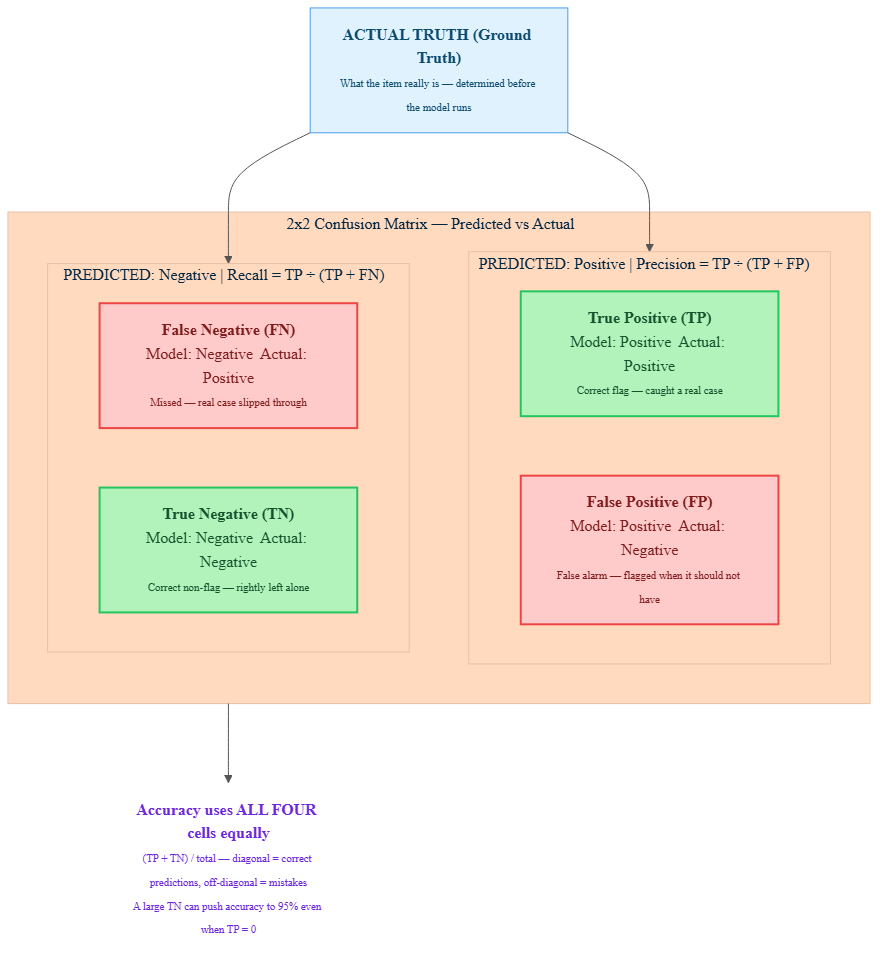

<!-- nav:top:start -->
[⬅ Previous: 7.9 — Recall](../../7-9-recall-of-all-the-things-that-were-correct-how-many-did-the/artifacts/reading.md)&emsp;·&emsp;[⬆ Table of Contents](../../../../../../../README.md#curriculum-topic-index)&emsp;·&emsp;[Next: 7.11 — Interpreting AI output variation ➡](../../7-11-interpreting-ai-output-variation-what-it-tells-you-about-rel/artifacts/reading.md)
<!-- nav:top:end -->

---

# Confusion matrix — why 95% accuracy can still mean frequent failure

## Overview

You have already met three ways to measure a classification model: accuracy (how often it is right overall), precision (how trustworthy its positive flags are), and recall (how many real positives it finds). Each answers a different question — but all three are driven by the same four underlying counts. The confusion matrix is a single 2×2 table that lays out those four counts side by side, so no failure mode can hide behind a headline number. Understanding it means you will never again be misled by a high accuracy figure.

## Key Concepts

### The four things that can happen when a model makes a prediction

Every prediction a classification model makes lands in exactly one of four buckets. The model either says "positive" or "negative," and the ground truth — the actual correct label determined before the model was run — is either positive or negative. That gives four combinations.

You already know three of them from topics 7.8 and 7.9:

- **True Positive (TP)** — the model predicted positive and the item really is positive. Correct flag. Example: a spam filter marks an email as spam, and it genuinely is spam.
- **False Positive (FP)** — the model predicted positive but the item is actually negative. A false alarm. Example: the spam filter marks a legitimate bank email as spam.
- **False Negative (FN)** — the model predicted negative but the item is actually positive. A miss. Example: a genuine phishing email slips through to your inbox.

The fourth outcome is new in this topic:

- **True Negative (TN)** — the model predicted negative and the item really is negative. Correct non-flag. Example: the spam filter looks at a legitimate newsletter and correctly leaves it alone.

The naming follows a simple pattern:
- "True" = the model's prediction matched the ground truth.
- "False" = the model's prediction did not match the ground truth.
- "Positive" / "Negative" = what the model predicted.

### The confusion matrix — all four outcomes in one table

A confusion matrix arranges these four outcomes in a consistent 2×2 layout. One axis shows what the model predicted; the other axis shows the ground truth.


*The confusion matrix: rows show what the model predicted, columns show the actual ground truth. The diagonal cells (TP, TN) are correct predictions; the off-diagonal cells (FP, FN) are errors.*

Reading the matrix once you know the layout [1]:

- **Top row** — everything the model called positive (all flags it raised).
- **Bottom row** — everything the model called negative (all items it left alone).
- **Left column** — everything that was actually positive in the real world (ground truth positives).
- **Right column** — everything that was actually negative in the real world (ground truth negatives).
- **Diagonal cells** (top-left TP, bottom-right TN) — correct predictions.
- **Off-diagonal cells** (top-right FP, bottom-left FN) — mistakes.

The model earns its name "confusion" from those off-diagonal cells: FP is where it confused a negative for a positive; FN is where it confused a positive for a negative.

### How precision, recall, and accuracy connect to the matrix

The confusion matrix is not a separate metric — it is the foundation all three existing metrics read from [1]:

| Metric | Formula | Cells used |
|---|---|---|
| Precision | TP / (TP + FP) | Top row only |
| Recall | TP / (TP + FN) | Left column only |
| Accuracy | (TP + TN) / (TP + FP + FN + TN) | All four cells |

Precision asks: of everything the model flagged (top row), how many were real? Recall asks: of everything that was truly positive (left column), how many did the model find? Accuracy asks: of all predictions, how many were right? Notice that accuracy is the only one using TN.

### True negatives and the accuracy paradox

True negative is the correct non-flag — the model predicted negative and the item genuinely was negative. In a spam filter, every legitimate email that passes through without a flag is a true negative. These are good outcomes [1].

The problem arises when there are many genuine negatives in the dataset. In that situation, TN grows large, which drives accuracy upward — even if the model is completely failing on the positive class. This is because accuracy counts TN equally with TP in its numerator.

When TN dominates, a model that does nothing but predict "negative" for every item achieves high accuracy while catching zero real positives. The confusion matrix makes this visible immediately: a large TN alongside TP = 0 is the signature of the accuracy paradox [1].

## Worked Example

A spam filter is tested on 200 emails. 40 are genuine spam (positive class); 160 are legitimate email (negative class).

**Step 1 — Identify the positive class.** Spam is what the filter is trained to detect — that is the positive class. Legitimate email is the negative class.

**Step 2 — Tally each prediction against the ground truth.**

- 30 spam emails correctly flagged → TP = 30
- 8 legitimate emails wrongly flagged → FP = 8
- 10 spam emails that slipped through → FN = 10
- 152 legitimate emails correctly cleared → TN = 152

**Step 3 — Verify the total.** 30 + 8 + 10 + 152 = 200. Every prediction accounted for.

**Step 4 — Read the matrix.**

```
                        ACTUAL: Spam        ACTUAL: Legitimate
PREDICTED: Spam         TP = 30             FP = 8
PREDICTED: Not spam     FN = 10             TN = 152
```

**Step 5 — Compute the metrics.**

- Accuracy = (30 + 152) / 200 = 182 / 200 = **91%**
- Precision = 30 / (30 + 8) = 30 / 38 ≈ **79%**
- Recall = 30 / (30 + 10) = 30 / 40 = **75%**

The 91% accuracy headline sounds good. But the matrix shows the real picture: 10 spam emails slipped through (FN = 10) and 8 legitimate emails were wrongly blocked (FP = 8). Whether those numbers are acceptable depends entirely on how much each failure type matters to your users.

Now compare with the accuracy paradox scenario — a disease screener tested on 1,000 patients, where 50 genuinely have a rare condition and 950 are healthy. A lazy model labels every single patient "healthy" [1]:

```
                        ACTUAL: Condition   ACTUAL: Healthy
PREDICTED: Condition    TP = 0              FP = 0
PREDICTED: Healthy      FN = 50             TN = 950
```

- Accuracy = (0 + 950) / 1000 = **95%**
- Recall = 0 / (0 + 50) = **0%**

The accuracy looks excellent. The confusion matrix says everything in one cell: TP = 0. The model has never correctly identified a single sick patient. Every genuinely positive patient sits in the FN cell; the large TN is doing all the work for accuracy [1].

## In Practice

Confusion matrices appear wherever classification models are evaluated. Common patterns to know [1]:

- **Medical screening.** Regulators and clinicians expect all four cells, not just accuracy. A cancer screener's TP and FN counts translate directly to detected and missed cancers — the stakes are immediate.
- **Fraud detection.** Banks use the matrix to separate false alarms (FP: legitimate transactions blocked, causing customer friction) from misses (FN: real fraud approved, causing financial loss). Different costs, visible in different cells.
- **Spam and content filtering.** Adjusting model confidence shifts counts between FP and FN. Making the model more cautious reduces FP but raises FN. The matrix makes that trade-off concrete.

Best practices when working with confusion matrices:

- **Do: report all four cells, not just accuracy.** A single headline figure is incomplete. Anyone evaluating a classification model should ask for the full matrix [1].
- **Do: check whether a large TN is inflating accuracy.** When there are many more items in the negative class than the positive class, compute recall before trusting accuracy. A large TN alongside a small TP is the accuracy paradox signature [1].
- **Do: decide which failure costs more before reading the matrix.** Ask: is a false alarm (FP) more costly, or is a miss (FN) more costly? That answer tells you which off-diagonal cell to focus on.
- **Don't: confuse FP and FN.** They are opposite errors with different costs. FP is a false alarm; FN is a miss. Mixing them up means solving the wrong problem.

## Key Takeaways

- A confusion matrix is a 2×2 table recording every prediction as one of four outcome types: true positive (TP), false positive (FP), false negative (FN), and true negative (TN) [1].
- **True negative (TN)** is the correct non-flag: the model predicted negative and the item genuinely was negative. It is a good outcome, but a large TN in an imbalanced dataset can inflate accuracy and hide poor performance on the positive class [1].
- Accuracy is computed from all four cells: (TP + TN) / total. When TN dominates — because the negative class is much larger — a model that catches nothing in the positive class can still score 95% accuracy. This is the accuracy paradox, and TP = 0 in the confusion matrix makes it immediately visible [1].
- Precision reads from the top row (TP / (TP + FP)); recall reads from the left column (TP / (TP + FN)). The confusion matrix is the common foundation both metrics derive from [1].
- The off-diagonal cells — FP and FN — are where the failures are. The confusion matrix keeps them visible so no single headline number can hide them [1].

## References

1. DataCamp, "What is a Confusion Matrix in Machine Learning?" <https://www.datacamp.com/tutorial/what-is-a-confusion-matrix-in-machine-learning>

---
<!-- nav:bottom:start -->
[⬅ Previous: 7.9 — Recall](../../7-9-recall-of-all-the-things-that-were-correct-how-many-did-the/artifacts/reading.md)&emsp;·&emsp;[⬆ Table of Contents](../../../../../../../README.md#curriculum-topic-index)&emsp;·&emsp;[Next: 7.11 — Interpreting AI output variation ➡](../../7-11-interpreting-ai-output-variation-what-it-tells-you-about-rel/artifacts/reading.md)
<!-- nav:bottom:end -->
