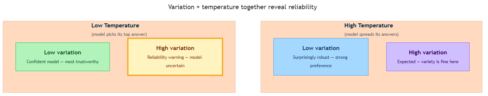

<!-- nav:top:start -->
[⬅ Previous: 7.10 — Confusion matrix](../../7-10-confusion-matrix-why-95-accuracy-can-still-mean-frequent-fai/artifacts/reading.md)&emsp;·&emsp;[⬆ Table of Contents](../../../../../../../README.md#curriculum-topic-index)&emsp;·&emsp;[Next: 8.1 — Embedding explorer ➡](../../../../week-8/1-embeddings-in-practice/8-1-embedding-explorer-comparing-domain-specific-word-clusters-i/artifacts/reading.md)
<!-- nav:top:end -->

---

# Interpreting AI output variation — what it tells you about reliability

## Overview

You run a prompt ten times and get seven different answers. Is that a problem? The honest answer is: it depends. Knowing what it depends on is the interpretive skill this topic builds. You already have the tools from earlier in this week — probability distributions, temperature, accuracy, precision, recall, and the confusion matrix. This reading shows you how to read the signals that AI output variation sends and what those signals tell you about reliability [1].

## Key Concepts

### Output variation as a signal

**Output variation** — the measurable spread across AI answers to the same prompt across multiple runs — is not random noise. It is a signal about what is happening inside the model.

You already know from topic 7.4 that an LLM (Large Language Model) picks each word by sampling from a probability distribution. You also know from topic 7.5 that temperature controls how wide or narrow that distribution is. Now connect those ideas to what you observe:

- When the model's probability distribution has strong mass on one answer, repeated sampling almost always lands in the same place. You see **low variation**.
- When the probability mass is spread across many answers, repeated sampling lands on different answers each time. You see **high variation**.

Output variation is a direct window into the model's probability distribution — which is a direct window into its confidence [1].

### Why temperature changes everything

You cannot interpret variation without knowing the temperature setting [2].

Here is the key principle:

- **Low temperature** forces the model to pick from a narrow, concentrated distribution. High variation at low temperature means the model genuinely has no strong preference — it does not know the answer with confidence. That is a reliability warning.
- **High temperature** artificially spreads the distribution wide. High variation at high temperature is expected — you asked for variety. That variation tells you very little about model confidence on its own [2].

This gives you a simple but powerful interpretive tool called **temperature-adjusted variation reading** — the practice of interpreting variation only in the context of the temperature setting used, because the same spread of outputs carries a different meaning at different temperatures [1] [2].

### The four-quadrant reliability framework

Combining variation level with temperature setting produces four distinct situations, each with a different reliability interpretation [1] [3].

*Each quadrant crosses variation level (high or low) with temperature setting (high or low) to give a distinct reliability conclusion.*

| Quadrant | Variation | Temperature | What it means |
|---|---|---|---|
| 1 | Low | Low | Strongest confidence signal — the model has a clear preference even without being forced by temperature. Most trustworthy for factual tasks. |
| 2 | High | Low | Reliability warning — the model's internal probability mass is genuinely spread, even though temperature should have narrowed it. Treat output as uncertain for factual tasks. |
| 3 | Low | High | Surprisingly robust — the model's preference is so strong that even a widened distribution keeps landing in the same place. |
| 4 | High | High | Expected for open-ended tasks — you asked for variety and got it. This is not a failure signal [2] [3]. |

### Task type determines whether variation is a problem

The four quadrants only make sense once you know what type of task you are running. There are two broad categories [3]:

**Deterministic tasks** — tasks with one correct answer. Examples: "What year was the internet invented?", yes/no classification, medical symptom checking.

- You want low variation, because only one answer is right.
- High variation signals the model is uncertain or operating at the edge of its training.
- The right measurement tool is accuracy: how many of the 10 runs were correct?

**Open-ended tasks** — tasks where many answers are equally valid. Examples: writing a poem, brainstorming product names, drafting a creative email.

- Variation is expected and often desirable — different runs give you a richer set of options.
- High variation does not signal unreliability; it means you are exploring the space of good answers [2] [3].

Misreading the task type is the most common interpretive error. Seeing high variation in a creative writing task and concluding "this AI is unreliable" is a category mistake. The variation is the point.

### Consistency does not mean correctness

A model can be **confidently wrong** — it can produce the same incorrect answer every single time, with zero variation. Low variation at low temperature tells you the model has learned a strong internal association between your prompt and its answer. Whether that association is accurate depends on the model's training data and the nature of the task.

Checking against **ground truth** — the confirmed correct answer used to evaluate model outputs — is the only way to know whether consistent output is also correct output [1] [3].

This is why the full picture always requires both variation observation and ground-truth checking:

- Variation tells you about the model's probability distribution.
- Accuracy tells you whether the distribution's most-likely output actually matches reality.

## Worked Example

Imagine you are testing an AI for medical screening. You ask it the same yes/no question ten times at temperature 0: "Does this set of symptoms indicate risk of dehydration?"

Here is what you record:

1. Run the prompt 10 times at temperature 0. Results: "Yes" 6 times, "No" 4 times.
2. The correct answer (ground truth) is "Yes."
3. Count unique outputs: 2 ("Yes" and "No") — there is variation.
4. Place in the four-quadrant framework: **high variation + low temperature = Quadrant 2 — reliability warning**.
5. Calculate accuracy: 6 out of 10 runs gave the correct answer. That is 60% accuracy.

What does this tell you? A screening tool that answers the same question ten times and gets it right only 6 times is not reliable enough for medical use. The variation at low temperature confirms the model has no strong confidence. The accuracy number confirms the model is frequently wrong. Both signals point the same way: do not deploy this tool for this task without further work [1].

## In Practice

Use this checklist whenever you observe AI output variation:

- **Always note the temperature setting.** A sentence like "the AI is inconsistent" means nothing without "at temperature 0" or "at temperature 1." Temperature is not optional context — it is half the picture [2].
- **Identify the task type first.** Deterministic or open-ended? This determines whether variation is a red flag or expected behavior.
- **For deterministic tasks:** run against ground truth. Calculate accuracy. If variation is high at low temperature, treat the output as unreliable until accuracy is confirmed.
- **For open-ended tasks:** high variation at high temperature is the intended outcome. Evaluate quality, not consistency.
- **Never assume consistency = correctness.** Always check a sample of consistent outputs against ground truth [1] [3].

| Situation | Do | Don't |
|---|---|---|
| Evaluating a factual AI tool | Test at temperature 0; treat variation as a warning | Assume consistent output is correct without checking ground truth |
| Using a creative AI tool | Accept variation as richness | Treat high variation as a failure signal |
| Observing consistent wrong answers | Flag as confidently wrong; check training data or prompt | Assume low variation means reliable |
| Reporting variation | Always state the temperature setting | Report variation without temperature context |

The week 7 lab puts this into practice directly: you will run a prompt 10 times at temperature 0 and 10 times at temperature 1, tally unique responses, compute accuracy on a yes/no task, and write a short interpretation. That exercise is exactly the skill this reading builds [1].

## Key Takeaways

- **Output variation is a reliability signal, not just noise.** It reflects whether the model's probability mass is concentrated on one answer or spread across many.
- **You cannot interpret variation without knowing the temperature.** The same spread of outputs means something different at temperature 0 versus temperature 1.
- **The four-quadrant framework captures the full picture:** low variation + low temperature = confident model; high variation + low temperature = reliability warning; low variation + high temperature = surprisingly robust; high variation + high temperature = expected for open-ended tasks.
- **Task type determines whether variation is a problem.** For deterministic tasks, high variation signals unreliability. For open-ended tasks, variation is expected and often desirable.
- **Consistency is not correctness.** Always check variation findings against ground truth using the measurement tools from this week — accuracy, precision, and recall.

## References

1. IBM Think — What is LLM Temperature? <https://www.ibm.com/think/topics/llm-temperature>
2. Cybernews — What is LLM temperature? <https://cybernews.com/ai-tools/what-is-llm-temperature/>
3. Tetrate — LLM Temperature Guide <https://tetrate.io/learn/ai/llm-temperature-guide>

---
<!-- nav:bottom:start -->
[⬅ Previous: 7.10 — Confusion matrix](../../7-10-confusion-matrix-why-95-accuracy-can-still-mean-frequent-fai/artifacts/reading.md)&emsp;·&emsp;[⬆ Table of Contents](../../../../../../../README.md#curriculum-topic-index)&emsp;·&emsp;[Next: 8.1 — Embedding explorer ➡](../../../../week-8/1-embeddings-in-practice/8-1-embedding-explorer-comparing-domain-specific-word-clusters-i/artifacts/reading.md)
<!-- nav:bottom:end -->
