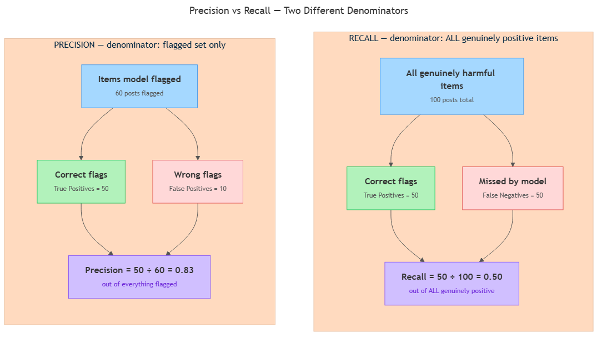

<!-- nav:top:start -->
[⬅ Previous: 7.8 — Precision](../../7-8-precision-of-the-things-the-model-flagged-how-many-were-actu/artifacts/reading.md)&emsp;·&emsp;[⬆ Table of Contents](../../../../../../../README.md#curriculum-topic-index)&emsp;·&emsp;[Next: 7.10 — Confusion matrix ➡](../../7-10-confusion-matrix-why-95-accuracy-can-still-mean-frequent-fai/artifacts/reading.md)
<!-- nav:top:end -->

---

# Recall — of all the things that were correct, how many did the model find

## Overview

In topic 7.8 you saw that precision asks about the quality of a model's flags — of all the items it chose to flag, how many were actually correct? Precision is useful, but it leaves a second question completely unanswered: of all the items that genuinely should have been flagged, how many did the model actually find? That second question is what recall measures. A model can have excellent precision and still be missing most of the real problems in a dataset, and recall is the metric that makes that visible.

## Key Concepts

### The gap precision leaves behind

Precision only looks at the items the model chose to flag. It says nothing about items the model silently left alone. But some of those unflagged items may have been genuinely positive — real spam, real fraud, real harmful content, real disease cases. The model failed to catch them.

Think of a disease-screening program that reviews 1,000 patient records and flags only 5 as potentially ill. All 5 are correct — perfect precision. But there were actually 95 patients in the dataset who truly had the disease. The program found 5 and missed 90. Perfect precision. Nearly complete failure. [1]

Recall is designed to measure exactly that gap.

### The key terms: true positive and false negative

You already know true positive from topic 7.8: a case the model flagged correctly — it said "positive" and the actual correct label in the dataset, the ground truth, agreed.

The new term here is **false negative — a case the model did not flag, even though the ground truth says it should have been flagged.**

In plain language: the model missed it. The thing it was supposed to find was there, and the model failed to raise a flag. [1] [2]

Three everyday examples:

- A spam filter that lets a phishing email into your inbox — the email was genuinely spam (positive), but the model called it safe (negative). That is a false negative.
- A disease-screening tool that marks a truly sick patient as "probably healthy" — the patient was genuinely ill, but the model failed to flag them. False negative.
- A fraud-detection system that approves a genuinely fraudulent transaction — real fraud, no flag raised. False negative. [2] [3]

The consequence of a false negative is always the same: a real problem goes undetected.

### The recall formula

**Recall = True Positives / (True Positives + False Negatives)**

In plain English: divide the number of real positives the model correctly caught by the total number of real positives in the dataset — whether the model caught them or not. [1] [2]

The denominator — true positives plus false negatives — is every item that was genuinely positive, regardless of what the model predicted. Two quick examples:

- 100 genuinely positive items, model caught 90: recall = 90/100 = 0.90 (90%)
- 100 genuinely positive items, model caught 20: recall = 20/100 = 0.20 (20%)

Recall lives on a scale of 0 to 1. Higher is better when you care about not missing real cases. [1]

### What recall does and does not see

*The diagram shows the two different denominators: precision looks inward at the flagged set; recall looks outward at all genuinely positive items, including those the model missed.*

Recall only evaluates the group of items that were truly positive. It ignores everything the model correctly left alone — items that were genuinely negative and correctly not flagged. This focus is both its strength and its limitation:

- **Strength:** recall directly answers "is the model actually finding the things it is supposed to find?" A recall of 0.95 means the model catches 95 out of every 100 real cases — very few slip through.
- **Limitation:** a model can achieve perfect recall of 1.0 simply by flagging every single item. It catches every genuine positive, but also flags everything else. Recall alone does not penalise that. A score of 1.0 on its own tells you almost nothing about whether the flags are any good. [1] [2] [3]

This is why recall is always discussed alongside precision.

### Precision and recall pull in opposite directions

Imagine a fraud-detection model with a dial controlling how cautious it is:

- **Very cautious (flags almost nothing):** flags only when extremely certain — high precision, but misses most genuine fraud — low recall.
- **Very aggressive (flags almost everything):** catches nearly every fraudulent transaction — high recall, but also flags many legitimate ones — low precision.

Moving the dial in one direction improves one metric and hurts the other. This is the precision–recall trade-off. [1] [2] [3]

The right balance depends entirely on context. When missing a real positive is catastrophic — undetected illness, undetected security breach — recall is prioritised even at the cost of more false alarms. When false alarms are expensive — customer complaints, blocked transactions, wasted review time — precision is prioritised even if some real cases slip through. Neither is universally more important; the context decides.

## Worked Example

A spam filter is tested on 200 emails. Of those 200, exactly 40 are genuinely spam — the ground truth, the actual correct label in the dataset, marks these 40 as positive. The remaining 160 are legitimate email.

The filter flags 30 emails as spam.

| Category | Count |
|---|---|
| Genuinely spam, correctly flagged (true positives) | 28 |
| Legitimate email, wrongly flagged (false positives — affects precision) | 2 |
| Genuinely spam, NOT flagged (false negatives) | 12 |
| Legitimate email, correctly left alone (true negatives) | 148 |

Applying the formula step by step:

1. Total genuinely positive items: 28 + 12 = **40** (every spam email, caught or missed)
2. True positives: **28**
3. False negatives: **12**
4. Recall = 28 / (28 + 12) = 28 / 40 = **0.70 (70%)**

The filter catches 70% of real spam. One in three genuine spam emails slips through to the inbox. [1] [2]

For comparison, precision = 28 / (28 + 2) = 28 / 30 ≈ **0.93 (93%)** — so the flags the model does raise are highly reliable, but the model is only reaching 70% of the real spam. Whether that trade-off is acceptable depends on what matters more to the user: a cleaner inbox (higher precision) or catching more spam (higher recall).

## In Practice

**Medical screening.** In cancer screening and disease detection, missing a real case can be life-threatening. Teams in these settings set minimum recall thresholds first — they accept a higher false-alarm rate (lower precision) in order to ensure most genuine cases are caught. [1] [3]

**Fraud detection.** A bank's fraud system that misses 30% of real fraud events is failing its customers even if its flags are individually reliable. In high-stakes security contexts, recall targets come before anything else. [2]

**Content moderation.** Platforms handling harmful content face a recall challenge: at the volume these platforms operate, even 70% recall still lets large numbers of harmful posts through undetected. Engineering teams tune recall and precision simultaneously, accepting that no single threshold is perfect. [2] [3]

Key do/don't rules:

- **Do** pair recall with the question: "what is the cost of a missed case?" High-cost misses push you toward needing higher recall. [1] [2]
- **Do** report recall alongside precision — a recall of 1.0 achieved by flagging everything is meaningless on its own. [1] [3]
- **Don't** optimise recall alone — a model that flags every item achieves perfect recall and zero useful information.
- **Don't** confuse false negatives with false positives: a false negative is a miss (model failed to flag something real); a false positive is a false alarm (model flagged something that was not real). They are opposite errors with different costs. [1] [2]

## Key Takeaways

- Recall answers one specific question: of all the items that were genuinely positive, what fraction did the model actually find?
- **Recall = True Positives / (True Positives + False Negatives).** The denominator is the total count of genuinely positive items — caught or missed.
- A **false negative** is a miss: the model failed to flag something that was genuinely positive.
- Recall ignores everything the model correctly left alone. It only evaluates coverage of real positives — which is both its strength and its limitation.
- Precision and recall pull in opposite directions. The right balance depends on the cost of false alarms versus the cost of missed cases in the specific context.
- High accuracy does not guarantee high recall. A model can score 98% accuracy while catching 0% of the genuinely positive cases.

## References

1. Google Developers, "Classification: Accuracy, Precision, Recall." *Machine Learning Crash Course.* <https://developers.google.com/machine-learning/crash-course/classification/accuracy-precision-recall>
2. Evidently AI, "Accuracy, Precision, Recall in Classification." <https://www.evidentlyai.com/classification-metrics/accuracy-precision-recall>
3. Coursera, "Precision vs. Recall in Machine Learning." <https://www.coursera.org/articles/precision-vs-recall-machine-learning>

---
<!-- nav:bottom:start -->
[⬅ Previous: 7.8 — Precision](../../7-8-precision-of-the-things-the-model-flagged-how-many-were-actu/artifacts/reading.md)&emsp;·&emsp;[⬆ Table of Contents](../../../../../../../README.md#curriculum-topic-index)&emsp;·&emsp;[Next: 7.10 — Confusion matrix ➡](../../7-10-confusion-matrix-why-95-accuracy-can-still-mean-frequent-fai/artifacts/reading.md)
<!-- nav:bottom:end -->
