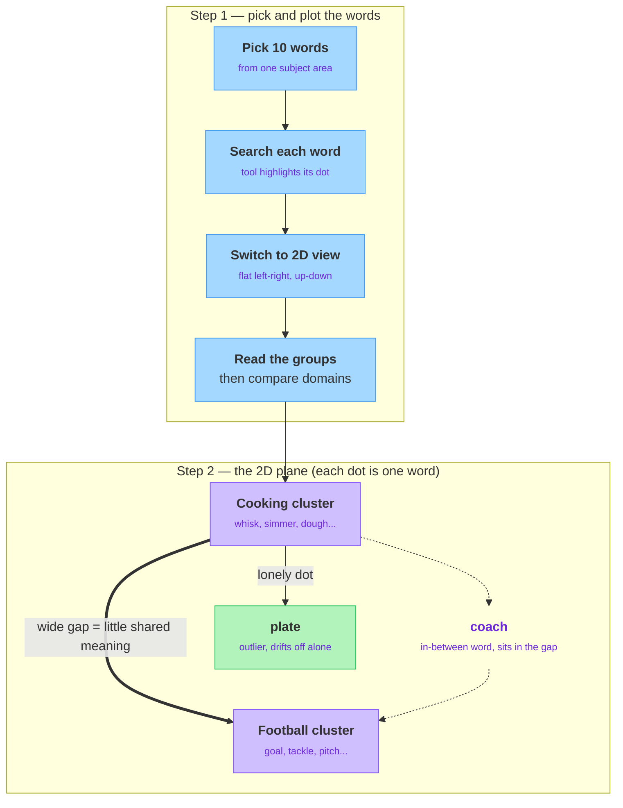

<!-- nav:top:start -->
[⬅ Previous: 7.11 — Interpreting AI output variation](../../../../week-7/3-measuring-ai-performance/7-11-interpreting-ai-output-variation-what-it-tells-you-about-rel/artifacts/reading.md)&emsp;·&emsp;[⬆ Table of Contents](../../../../../../../README.md#curriculum-topic-index)&emsp;·&emsp;[Next: 8.2 — Similarity scoring ➡](../../8-2-similarity-scoring-computing-cosine-similarity-between-sente/artifacts/reading.md)
<!-- nav:top:end -->

---

# Embedding explorer — comparing domain-specific word clusters in 2D

## Overview

Imagine tipping out a box of mixed buttons and sliding the ones that look alike into little piles. You did not measure anything — you just grouped by "these belong together." This lab trains that same instinct, except the buttons are words and the table is a computer screen.

You already know that a computer stores a word as an **embedding** — a long list of numbers that captures the word's meaning, where words with related meanings get similar number-lists. The trouble is that this list is far too long to picture. A screen has only two directions, left-right and up-down, but a word's number-list can have hundreds of entries. So how do you ever *look* at it?

In this topic you use a free tool to flatten those long number-lists into a flat picture, then read meaning straight off the screen. You will pick 10 words from one subject area, see how they group, and compare them against words from a different area.

## Key Concepts

### What "domain-specific" means

A **domain** is just a subject area — a topic that words belong to. Cooking is a domain. Football is a domain. Medicine is a domain.

- **Domain-specific words** — words that clearly belong to one subject area, like *whisk*, *simmer*, and *recipe* for cooking.
- **Why pick a focused set?** Random unrelated words give you a confusing scatter. Ten words from one domain give the tool a clean, readable shape. A focused set is the whole trick.

For the cooking domain you might pick: *recipe, oven, whisk, simmer, dough, spice, knife, plate, boil, chef*. Ten words, all clearly about one subject.

### The Embedding Projector — what the tool is

The **TensorFlow Embedding Projector** is a website that draws embeddings as dots in space so a person can look at them [1]. Google's research team released it for exactly this reason: number-lists too long to imagine are impossible to inspect by eye, and a picture makes the hidden relationships visible [3].

- Each **dot** on the screen is one word.
- The **distance** between two dots reflects how related their meanings are — close dots mean similar meanings, far dots mean different meanings.
- You can **hover or click a dot** to see which word it is. The tool can also highlight a word's **nearest neighbors** — the handful of dots sitting closest to it [2].

### What a "2D projection" is

This is the key idea of the whole lab. A word's embedding lives in many number-slots, and you cannot draw all of them on a flat screen. So the tool performs a **projection**: it flattens that many-number picture down to two directions — left-right and up-down — so it fits on screen.

- **Projection** — squashing a many-dimension picture down to fewer dimensions so a person can see it. Think of a shadow: a 3D object casts a flat 2D shadow on the wall, losing some detail but keeping the overall shape.
- **2D** means two dimensions — the flat left-right and up-down picture. The tool also offers a 3D view, but flat 2D is the easiest to read and screenshot for this lab [2].
- **What it is NOT:** the flattened picture is an approximation, not the exact truth. Two dots that look close in 2D might be a little farther apart in the full number-list. Read the *overall grouping*, not the exact pixel gaps.

The tool offers a few methods for this flattening — you will see buttons labelled PCA, t-SNE, and UMAP [1]. You only need to know they are different ways to squash the picture; pick one (PCA is the quickest), look at the shape, and try another if it is messy. How each method works is a more advanced topic you can explore later.

### Clusters and outliers — what you are looking for

Once the dots are drawn, two shapes matter:

- **Cluster** — a tight group of dots sitting close together. A cluster means those words share related meaning. Your 10 cooking words should mostly bunch into one cooking cluster.
- **Outlier** — a single dot sitting off on its own. Its meaning does not fit neatly with the others. The word *plate* might drift away from the cooking actions, because a plate is also a plain dinnerware object, not a cooking step.

| Shape | What it looks like | What it means |
|---|---|---|
| Cluster | Several dots bunched together | Those words share related meaning |
| Outlier | One dot alone, far from any group | That word's meaning does not fit the rest |

### Comparing two domains

The headline of this topic is *comparing* clusters across domains. The move is simple: load words from two subject areas at once — say cooking and football — and look at the picture.

*Reading two domains on a flat 2D map: each cluster sits apart, an outlier drifts off alone, and an in-between word lands in the gap.*

- You should see **two separate clusters** — a cooking blob and a football blob, sitting apart.
- The **gap between the two clusters** is itself information. A wide gap means the two domains share little meaning; a small gap or some overlap means they share something. A word like *coach* might sit between cooking and football, since a coach trains people in many domains.

Comparison turns a single picture into a story: same-domain words pull together, different-domain words push apart, and the in-between words tell you where domains touch.

## Worked Example

You do not write any code for this lab — the Projector is a website you click through [2]. Here is the end-to-end flow:

1. **Pick your words.** Choose 10 words from one domain (e.g. cooking). For a comparison, also pick 10 from a second domain (e.g. football). Write them down first.
2. **Open the tool.** Go to the TensorFlow Embedding Projector website [1]. It opens with a sample word dataset already loaded, so you see dots immediately.
3. **Find your words.** Use the search box to type one of your words. The tool highlights that word's dot and its nearest neighbors [2]. Repeat for each word, noting where each lands.
4. **Switch to 2D.** Choose a projection method (PCA is the simplest) and select the 2D view rather than 3D, so the picture is flat and easy to read [1][2].
5. **Read the groups.** Look for clusters (tight bunches) and outliers (lonely dots). Hover a dot to confirm which word it is.
6. **Compare.** With both domains in view, check that each domain forms its own cluster, and note the gap between them plus any word that sits in between.
7. **Capture it.** Take a screenshot of the 2D view so you can describe the clusters and outliers in your notes.

Once you have the screenshot, answer these three questions in your own words — they are the whole point of the lab:

- Which words formed a cluster?
- Which single word is the clearest outlier, and why might its meaning sit apart?
- How big is the gap between your two domain clusters, and is any word stuck in between?

## In Practice

This same "flatten it and look" move is how working teams sanity-check the meaning a model has learned [3].

- **Spotting bad data.** If a team expects two topics to separate but the dots blur into one cluster, that is a signal the model cannot tell them apart yet.
- **Catching surprises.** A clearly on-topic word sitting alone as an outlier often points to a typo, a rare word, or a labelling mistake in the data.
- **Explaining a model to non-experts.** A picture of dots grouping sensibly convinces a manager or client far better than a wall of numbers — the exact gap the Projector was built to close [3].

A few habits keep your picture honest:

- **Do** keep your word set small and focused — 10 words from one domain reads far cleaner than 30 random ones.
- **Do** read the *overall grouping*, not exact distances — a 2D picture is an approximation.
- **Don't** over-interpret a single close pair of dots; trust the big clusters and the obvious outliers.
- **Don't** mix in throwaway words "to see what happens" before you have read the clean focused picture first.

## Key Takeaways

- An embedding is a long number-list per word; the Embedding Projector flattens it into a flat 2D picture so you can actually look at it.
- A **2D projection** trades exact detail for a readable shape — read the overall grouping, not the exact pixel distances.
- A **cluster** is a tight group of related-meaning words; an **outlier** is a lonely dot whose meaning does not fit the group.
- Picking a focused set of domain-specific words is the trick that turns a confusing scatter into a clean, readable plot.
- Comparing two domains shows two separate clusters; the gap between them, and any word in between, tells you how the domains' meanings relate.

## References

1. TensorFlow. "Embedding Projector." <https://projector.tensorflow.org/>
2. TensorFlow. "Visualizing Data using the Embedding Projector in TensorBoard." <https://www.tensorflow.org/tensorboard/tensorboard_projector_plugin>
3. Google Research. "Open Sourcing the Embedding Projector: a Tool for Visualizing High Dimensional Data." <https://research.google/blog/open-sourcing-the-embedding-projector-a-tool-for-visualizing-high-dimensional-data/>

---
<!-- nav:bottom:start -->
[⬅ Previous: 7.11 — Interpreting AI output variation](../../../../week-7/3-measuring-ai-performance/7-11-interpreting-ai-output-variation-what-it-tells-you-about-rel/artifacts/reading.md)&emsp;·&emsp;[⬆ Table of Contents](../../../../../../../README.md#curriculum-topic-index)&emsp;·&emsp;[Next: 8.2 — Similarity scoring ➡](../../8-2-similarity-scoring-computing-cosine-similarity-between-sente/artifacts/reading.md)
<!-- nav:bottom:end -->
