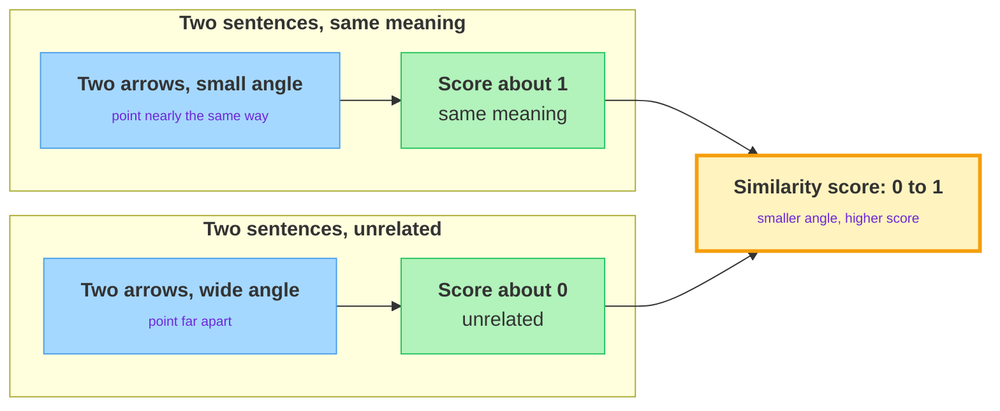

<!-- nav:top:start -->
[⬅ Previous: 8.1 — Embedding explorer](../../8-1-embedding-explorer-comparing-domain-specific-word-clusters-i/artifacts/reading.md)&emsp;·&emsp;[⬆ Table of Contents](../../../../../../../README.md#curriculum-topic-index)&emsp;·&emsp;[Next: 8.3 — Precision vs recall trade-off ➡](../../../2-evaluation-metrics-in-depth/8-3-precision-vs-recall-trade-off-when-does-recall-matter-more-t/artifacts/reading.md)
<!-- nav:top:end -->

---

# Similarity scoring — computing cosine similarity between sentence pairs

## Overview

You text a friend "Where are you?" and they reply "I'm running late." Different words, but you instantly feel the two messages are about the same thing. This topic teaches a computer to do the same — to decide whether two sentences mean the same thing, using only numbers.

The single number that answers "how close is close?" is called **cosine similarity** [1]. By the end you will be able to look at that number and say, in plain words, "these two sentences mean nearly the same thing" or "these two are unrelated." That matters because it lets a program judge meaning across thousands of sentence pairs at once — instead of you eyeballing them one by one.

## Key Concepts

In the last topic you read closeness with your eyes. You looked at words as dots on a screen and noticed which ones clustered together. That works, but "those two look near each other" is a feeling, not a measurement. To compare many sentence pairs, or to let a program do it, you need one number that says *how* similar — and that number has to be worked out the same way every time, so two pairs can be compared fairly.

### From word vectors to sentence vectors

You already know an **embedding** turns a word into a list of numbers that captures its meaning [1]. The same trick works on a whole sentence.

- **Sentence embedding** — a single list of numbers that captures the meaning of an entire sentence, not just one word. The sentence "The cat sat on the mat" becomes one number-list; "A feline rested on the rug" becomes another.
- Just like word embeddings, sentences with **similar meaning** get **similar number-lists**, even when the actual words are different [2].

Why does this matter? Because once a sentence is a list of numbers — an arrow pointing somewhere in space — you can compare two sentences the same way you compared two words. The whole problem of "do these mean the same?" turns into a problem about two arrows.

### Pre-computed vectors — handed to you ready-made

A real model produces these sentence vectors, and that step is not what this lab is about. For this exercise the vectors are pre-computed.

- **Pre-computed vectors** — the number-lists for each sentence are worked out ahead of time and given to you ready-made. You do **not** build the embeddings yourself.
- Your job is only the next step: take two ready-made vectors and score how similar they are. *How* a model turns text into those vectors was covered earlier and is not repeated here.

### Cosine similarity — the angle between two arrows

Here is the heart of the topic. Picture each sentence as an **arrow** starting from the same point and pointing off into space. Two sentences that mean nearly the same thing point in nearly the **same direction**. Two unrelated sentences point in **different directions** [1].

**Cosine similarity** — a score that measures the **angle** between two arrows. A small angle (arrows pointing the same way) gives a high score; a wide angle (arrows pointing apart) gives a low score [1].

The key insight: cosine similarity cares about **direction, not length**. A short arrow and a long arrow pointing the same way still count as a perfect match. This is why it works well for sentences of different lengths [1]. One way people describe how the score is worked out is the dot product of the two vectors divided by their lengths — but you never compute that by hand. The lab tool does it. Just hold on to the picture: smaller angle means more similar.

*The angle between two meaning-arrows sets the score: a small angle gives a high score, a wide angle gives a low one.*

### Reading the score

Cosine similarity produces a number on a fixed scale, so every pair is judged the same way [1][3]. Use this table to read it:

| Score | Angle between arrows | What it means |
|---|---|---|
| about 1 | none — same direction | Sentences mean nearly the same thing |
| about 0.5 | partway apart | Sentences are somewhat related |
| about 0 | square corner — unrelated directions | Sentences are unrelated |
| below 0 | pointing opposite ways | Sentences pull in opposite directions (rare for normal pairs) |

For sentence embeddings the score usually lands between **0 and 1**, where **1 = same meaning** and **0 = unrelated** [1]. The full scale runs from -1 to 1, but everyday sentence pairs rarely go negative, so in this lab treat **0 as "unrelated"** and **1 as "identical in meaning."**

### Same words vs same meaning

The reason similarity scoring is useful — and not just word-counting — is that it follows **meaning**, not spelling [2]. Two sentences can share almost no words and still score high, and two sentences can share most of their words and still score low:

| Sentence pair | Shared words | Score | Why |
|---|---|---|---|
| "How do I reset my password?" / "I forgot my login details" | almost none | high | They mean the same thing |
| "I love this movie" / "I love this pizza" | most | lower | They are about different things |

A high cosine similarity says *these mean the same*, even when the words differ — that is the whole point.

## Worked Example

You do not write any embedding code here — the sentence vectors are handed to you ready-made. Here is the end-to-end flow for scoring one pair, which you then repeat across five pairs:

1. **Read the pair.** Look at the two sentences and make a quick guess: same meaning, somewhat related, or unrelated?
2. **Take the two pre-computed vectors.** Each sentence already has its ready-made number-list. You do not build these.
3. **Score them.** Feed the two vectors into the cosine-similarity step the lab gives you. Out comes one number, somewhere between 0 and 1.
4. **Read the number.** Use the score table: near 1 means same meaning, near 0 means unrelated.
5. **Check it against your guess.** Did the number match your gut feeling from step 1? A low score for a pair you thought was similar is worth a second look.
6. **Repeat for all five pairs**, then line the scores up and rank the pairs from most to least similar.

## In Practice

This exact "score how similar two pieces of text are" move runs quietly inside tools you already use [2][3]:

- **Search that understands meaning.** When a search box returns a good result even though you did not type the exact words on the page, a similarity score between your query and each page is doing the work [3].
- **Grouping similar messages.** Support teams group near-duplicate tickets ("can't log in" vs "login not working") by scoring how similar their sentences are, so one answer can cover many [2].
- **Catching paraphrases.** Spotting that two sentences say the same thing in different words — for de-duplication or plagiarism checks — is a similarity-score job [3].

A few habits that keep you out of trouble:

- **Do** trust the score over the shared words — a high score on differently-worded sentences is the feature, not a bug.
- **Do** read the score as a *band* (high / medium / low), not an exact truth — 0.81 vs 0.83 is not a meaningful gap.
- **Do** sanity-check a surprising score by re-reading the two sentences; a strange score sometimes flags an odd or ambiguous sentence.
- **Don't** treat the score as a length comparison — it ignores how long the arrows are and only reads their direction.
- **Don't** expect a hard cutoff for "similar." Where you draw the line depends on the task; pick one and stay consistent.

## Key Takeaways

- A **sentence embedding** is one number-list capturing a whole sentence's meaning — the same idea as a word embedding, scaled up.
- **Cosine similarity** scores the **angle** between two meaning-arrows: same direction scores near 1, unrelated directions score near 0.
- It reads **direction, not length**, so sentences of different sizes still compare fairly.
- In this lab the vectors are **pre-computed** — you score similarity, you do not build the embeddings.
- A high score means **same meaning even with different words** — similarity follows meaning, not spelling.

## References

1. Milvus. "What is cosine similarity and how is it used with sentence transformer embeddings to measure sentence similarity?" <https://milvus.io/ai-quick-reference/what-is-cosine-similarity-and-how-is-it-used-with-sentence-transformer-embeddings-to-measure-sentence-similarity>
2. Fast Data Science. "Semantic similarity with sentence embeddings." <https://fastdatascience.com/natural-language-processing/semantic-similarity-with-sentence-embeddings/>
3. TigerData. "Understanding cosine similarity." <https://www.tigerdata.com/learn/understanding-cosine-similarity>

---
<!-- nav:bottom:start -->
[⬅ Previous: 8.1 — Embedding explorer](../../8-1-embedding-explorer-comparing-domain-specific-word-clusters-i/artifacts/reading.md)&emsp;·&emsp;[⬆ Table of Contents](../../../../../../../README.md#curriculum-topic-index)&emsp;·&emsp;[Next: 8.3 — Precision vs recall trade-off ➡](../../../2-evaluation-metrics-in-depth/8-3-precision-vs-recall-trade-off-when-does-recall-matter-more-t/artifacts/reading.md)
<!-- nav:bottom:end -->
