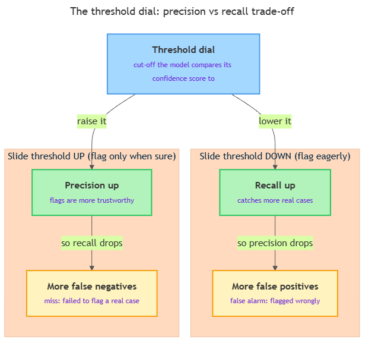

<!-- nav:top:start -->
[⬅ Previous: 8.2 — Similarity scoring](../../../1-embeddings-in-practice/8-2-similarity-scoring-computing-cosine-similarity-between-sente/artifacts/reading.md)&emsp;·&emsp;[⬆ Table of Contents](../../../../../../../README.md#curriculum-topic-index)&emsp;·&emsp;[Next: 8.4 — F1 score ➡](../../8-4-f1-score-balancing-precision-and-recall-into-one-metric/artifacts/reading.md)
<!-- nav:top:end -->

---

# Precision vs recall trade-off — when does recall matter more than precision?

## Overview

Some machines make a yes/no decision: is this email spam, yes or no? When a machine like that makes a mistake, it can miss something it should have caught, or it can raise a flag it should not have raised. Those are two different mistakes, and they hurt by different amounts.

This topic gives you two words for those mistakes — **precision** and **recall** — and shows why you usually cannot have both at full strength at once [1][2]. By the end you will be able to look at a real task and say which one should win.

## Key Concepts

### The two kinds of mistake

Whenever a machine makes a yes/no call, it can be wrong in two ways. These two mistakes are not the same, and the whole topic turns on the fact that they cost different amounts.

- **False positive (a false alarm)** — the model said "yes" when the real answer was "no." It raised a flag it should not have. Example: a spam filter marks a real email as spam [2].
- **False negative (a miss)** — the model said "no" when the real answer was "yes." It missed something it should have caught. Example: a spam filter lets a spam email reach your inbox [2].

One more term you will need: a **true positive** is when the model said "yes" and the answer really was "yes" — a correct catch.

### Precision — how trustworthy are the "yes" calls?

**Precision** answers one question: when the model flags something, how often is it right? [1]

- In words: of all the cases the model said "yes" to, what fraction were actually "yes"?
- As a ratio: **precision = true positives ÷ (true positives + false positives)** — correct catches divided by everything the model flagged.
- Plain read: high precision means **few false alarms**. When this model raises a flag, you can trust it.

Example: a model reviews 100 photos and flags 10 as "contains a cat." If 8 of those really are cats and 2 are not, its precision is 8 out of 10. Two false alarms dragged the score down.

### Recall — how many real cases did the model catch?

**Recall** answers a different question: of all the cases that truly were "yes," how many did the model catch? [1]

- In words: of every case that should have been flagged, what fraction did the model find?
- As a ratio: **recall = true positives ÷ (true positives + false negatives)** — correct catches divided by everything that should have been caught.
- Plain read: high recall means **few misses**. This model rarely lets a real case slip past.

Example: suppose there were really 20 cat photos in that set, and the model flagged 8 correctly. Its recall is 8 out of 20 — it missed 12 real cats. Those missed photos do not hurt precision at all, but they wreck recall.

### Precision and recall measure different failures

Here is the contrast, side by side.

| | Precision | Recall |
|---|---|---|
| Question it answers | Of the flags I raised, how many were right? | Of the real cases, how many did I catch? |
| Mistake it punishes | False positives (false alarms) | False negatives (misses) |
| High score means | I rarely cry wolf | I rarely miss anything |
| Goes down when | The model flags too much junk | The model misses real cases |

A model can score brilliantly on one and terribly on the other. A filter that flags **everything** catches every real case (perfect recall) but buries you in false alarms (terrible precision). A filter that flags only the one case it is surest about will likely be right about that one (high precision) while missing almost everything else (terrible recall). That tension is the trade-off.

### The trade-off — why raising one usually lowers the other

Most models do not just say yes or no outright. Under the hood they produce a **confidence score** — a number for how sure they are — and compare it to a cut-off line called a **threshold** [1].

- **Threshold** — the cut-off the model uses to turn its confidence into a yes/no answer. You can slide this line up or down.
- Slide the threshold **down** (flag eagerly, even when only a little confident): you catch more real cases, so **recall goes up** — but you flag more junk, so **precision goes down**.
- Slide the threshold **up** (flag only when very confident): your flags get more trustworthy, so **precision goes up** — but you miss borderline real cases, so **recall goes down** [1].

*Sliding the threshold one way reduces misses but adds false alarms; sliding it the other way does the reverse.*

In one sentence: turning the dial to reduce misses creates more false alarms, and turning it to reduce false alarms creates more misses. You rarely push both up at once. Choosing where to set the dial is a decision about which mistake you can least afford.

### Deciding which one wins: the cost of each error

So which do you favor? The answer is never "precision is better" or "recall is better" in the abstract. It depends on which mistake is more expensive in your situation [2]. Ask yourself two questions:

1. **How bad is a miss (false negative)?** If letting a real case slip through is dangerous or costly, you want **high recall** — even at the price of more false alarms.
2. **How bad is a false alarm (false positive)?** If chasing down wrongly-flagged cases is expensive or harmful, you want **high precision** — even if you miss a few.

Whichever mistake hurts more is the one you tune against, and that decides which metric you push up.

### When recall matters more than precision

The headline question. **Recall wins whenever a missed case is far worse than a false alarm** [2][3]. A few classic situations:

- **Cancer screening.** A test that misses a real tumor can cost a life. A false alarm just leads to a follow-up test — stressful, but recoverable. So screening is tuned for **high recall**: catch every possible case, then sort out the false alarms with careful testing later [3].
- **Disease testing in an outbreak.** Missing an infected person lets a disease spread. Wrongly flagging a healthy person means an extra test or a short, cautious quarantine. The miss is the dangerous error, so you tune for **high recall** [3].
- **Fraud and security alerts.** A fraudulent transaction or an intruder that slips through can cause major damage. A false alarm just means a human reviews something that turns out fine. Better to over-flag and review — again, **recall-first** [3].

The shared pattern: the cost of missing is catastrophic and hard to reverse, while the cost of a false alarm is annoying but manageable. When that holds, you accept more false alarms to drive misses toward zero.

The flip side, briefly: when a false alarm is the expensive mistake — say, a system that auto-locks a real customer's account on suspicion — you lean toward **precision** instead. Same trade-off, opposite choice.

## Worked Example

Take the cat-photo model from above and walk the reasoning through.

1. **Name the "yes" case.** The model is flagging "this photo contains a cat."
2. **Describe a false positive.** It flags a photo with no cat — a harmless dog photo gets tagged "cat." Cost here: low, just a wrong label.
3. **Describe a false negative.** It misses a real cat photo. Cost here: also low — you do not see that photo in your results.
4. **Compare the costs.** Out of 100 photos it flagged 10; 8 were cats (precision 8/10) and it caught 8 of the 20 real cats (recall 8/20). It is fairly trustworthy when it flags, but it misses most real cats.
5. **Pick the metric to favor.** If this powered a "find every photo of my cat" app, missing 12 of 20 is the painful failure — you would favor **recall** and accept a few wrong tags.
6. **Say the trade.** "I will accept more false alarms to reduce misses." Sliding the threshold down would catch more cats at the cost of a few extra wrong tags.

## In Practice

The precision–recall choice is a quiet design decision inside systems you already meet [2][3].

- **Search and recommendations.** A search engine leans toward precision on the first page — you want the top results to be right, not a flood of loose matches [2].
- **Content moderation.** Auto-flagging harmful posts is tuned high-recall (catch as much as possible), then sent to human reviewers who supply the precision a machine alone cannot [2].
- **Quality control on a production line.** A factory checking parts for defects favors recall — far better to pull a few good parts for re-inspection than to ship one broken one [3].

The common move: decide which error is worse *before* looking at scores, and report precision and recall **together** — one number alone hides the trade-off. Combining them into a single balanced number, called the F1 score, comes next in 8.4; working these scores out by hand from a results table comes in 8.5.

## Key Takeaways

- **Precision** asks: of the cases the model flagged, how many were right? High precision means few **false alarms** (false positives).
- **Recall** asks: of the cases it should have flagged, how many did it catch? High recall means few **misses** (false negatives).
- There is a **trade-off**: sliding the model's threshold to reduce misses creates more false alarms, and the reverse — you rarely maximize both at once.
- Which metric to favor depends on the **cost of each error**, not on which metric is "better" in the abstract.
- **Recall matters more when a miss is far worse than a false alarm** — cancer screening, disease testing, and fraud/security are classic recall-first cases.

## References

[1] APXML. "Precision-Recall Trade-off." *Basics of Model Evaluation Metrics*. https://apxml.com/courses/basics-model-evaluation-metrics/chapter-2-metrics-for-classification/precision-recall-tradeoff

[2] DataCamp. "Precision vs. Recall." https://www.datacamp.com/tutorial/precision-vs-recall

[3] Viso.ai. "Precision and Recall in Machine Learning." https://viso.ai/computer-vision/precision-recall/

---
<!-- nav:bottom:start -->
[⬅ Previous: 8.2 — Similarity scoring](../../../1-embeddings-in-practice/8-2-similarity-scoring-computing-cosine-similarity-between-sente/artifacts/reading.md)&emsp;·&emsp;[⬆ Table of Contents](../../../../../../../README.md#curriculum-topic-index)&emsp;·&emsp;[Next: 8.4 — F1 score ➡](../../8-4-f1-score-balancing-precision-and-recall-into-one-metric/artifacts/reading.md)
<!-- nav:bottom:end -->
