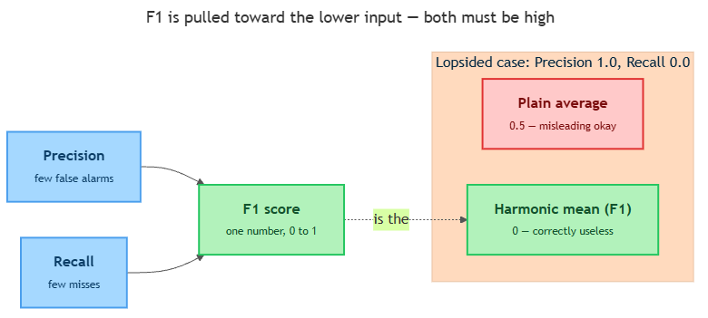

<!-- nav:top:start -->
[⬅ Previous: 8.3 — Precision vs recall trade-off](../../8-3-precision-vs-recall-trade-off-when-does-recall-matter-more-t/artifacts/reading.md)&emsp;·&emsp;[⬆ Table of Contents](../../../../../../../README.md#curriculum-topic-index)&emsp;·&emsp;[Next: 8.5 — Computing accuracy, precision, recall, and F1 by hand from a confusion matrix ➡](../../8-5-computing-accuracy-precision-recall-and-f1-by-hand-from-a-co/artifacts/reading.md)
<!-- nav:top:end -->

---

# F1 score — balancing precision and recall into one metric

## Overview

In the last topic you measured a yes/no model with two numbers: **precision** (of the cases it flagged "yes," how many were right — few false alarms) and **recall** (of the cases that were truly "yes," how many it caught — few misses). Two numbers are honest, but clumsy: a model can look great on one and quietly fail the other.

The **F1 score** fixes that by squeezing both into a single number from 0 to 1. It is built so a model only scores high when it is good at *both* halves of the job [1][2]. This topic explains what that one number means and why it is calculated in an unusual way that refuses to be fooled by a lopsided model.

## Key Concepts

### The problem: two numbers are hard to compare

Imagine two spam-catcher models and you just want to say which is better.

- Model A has precision 0.9 and recall 0.5.
- Model B has precision 0.6 and recall 0.7.

Which wins? With two scores there is no obvious answer — you are comparing apples to oranges twice over [1]. What you really want is a **single summary score** so you can say "this one scores 0.71, that one 0.65, pick the first." That single score is the F1 [1].

### What the F1 score is

**F1 score** — one number, from 0 to 1, that summarizes how well a model balances precision and recall at the same time [1][3].

- A score near **1** means both precision and recall are high — few false alarms *and* few misses.
- A score near **0** means at least one of them is poor.
- It is sometimes just called the **F1** or the **F-score** [3].

The whole point lives in one rule: **you only get a high F1 if both precision and recall are decent.** Being brilliant at one cannot rescue a model that is weak at the other. The rest of this section shows how the math quietly enforces that rule.

### Why not just average them?

The obvious way to merge two numbers is the plain average (the **arithmetic mean**) — add them and divide by two. F1 does *not* do this, and the reason is the heart of the topic.

Watch what a plain average does to a lopsided model. Take a model with precision **1.0** and recall **0.0** — it flags one thing, gets it right, and misses everything else. It is useless. Yet its plain average is (1.0 + 0.0) ÷ 2 = **0.5**, a middling-looking score for a worthless model.

The plain average lets one strong number **hide** a disastrous weak one. That is exactly the failure F1 is designed to prevent [1][3].

### The harmonic mean: pulled toward the lower number

F1 instead uses a different kind of average called the **harmonic mean**.

**Harmonic mean** — a way of averaging two numbers that sits much closer to the *smaller* of the two than a plain average does [3].

You do not need to derive it. You only need the intuition:

- A plain average sits exactly halfway between the two numbers.
- A harmonic mean leans hard toward the **lower** number — it gets dragged down by whichever score is worst.

Think of it like a team carrying a load together: the team is only as effective as its weakest member, so one strong helper cannot make up for one who is barely lifting. The harmonic mean scores a pair of numbers the same way — it keeps one eye fixed on the weaker of the two.

*Precision and recall feed into the F1 score; for a lopsided model (precision 1.0, recall 0.0) the plain average says a misleading 0.5 while the harmonic mean correctly says 0.*

Run that same lopsided model — precision 1.0, recall 0.0 — through both averages:

- Plain average: **0.5** (looks okay — misleading).
- Harmonic mean (the F1): **0** (correctly says: useless).

And when both numbers are healthy and close together — say precision 0.8 and recall 0.8 — the harmonic mean is also 0.8, almost identical to a plain average. So the harmonic mean only "punishes" you when the two numbers are far apart; when they are balanced, it behaves normally [3].

That is the single idea to keep: **the harmonic mean rewards balance and penalizes imbalance.** The moment one score drops, the harmonic mean drops with it — which is precisely why a high F1 means both precision and recall are high.

### The formula, in words

Stated once, the F1 score is:

> **F1 = 2 × (precision × recall) ÷ (precision + recall)**

In plain words: multiply the two scores, double it, divide by their sum. You will not compute this by hand here — that practice comes in 8.5. What matters now is reading what the formula *does*:

- If **either** input is **0**, the multiply at the top becomes 0, so the whole F1 is **0**. One zero kills the score — a plain average never could.
- If **both** are **1.0**, the formula gives **1.0** — a perfect balanced score.
- If the two are unequal, the result is dragged toward the smaller one [1][3].

## Worked Example

Go back to the two models from the start, and watch a plain average and F1 disagree:

| Model | Precision | Recall | Plain average | F1 (harmonic) |
|---|---|---|---|---|
| A | 0.9 | 0.5 | 0.70 | 0.64 |
| B | 0.6 | 0.7 | 0.65 | 0.65 |

By a plain average, Model A (0.70) looks clearly better than Model B (0.65). But F1 rates them almost equal, even nudging B ahead [1].

Why the flip? Model A's weaker recall (0.5) drags its F1 down, because the harmonic mean keeps an eye on that lower number. Model B is more *balanced*, so it keeps more of its score. F1 quietly rewards the model that is not lopsided — exactly the behavior the harmonic mean was chosen for.

## In Practice

F1 shows up wherever people compare models at a glance [1][2]:

- **Model leaderboards and competitions.** A single F1 column lets you sort dozens of models top to bottom; two columns would make ranking ambiguous.
- **Quick project check-ins.** "Our spam classifier is at F1 = 0.88" is a clean one-line health report — far tidier than quoting two shifting numbers.
- **Imbalanced tasks.** When "yes" cases are rare (most emails are not fraud), F1 stays honest because it watches both precision and recall — which is why teams prefer it on rare-event problems [1]. (Accuracy is another metric you will meet in 8.5.)

But F1 treats precision and recall as **equally important**. Knowing when *not* to use it is part of the skill:

| Use F1 (one number) when... | Report precision and recall separately when... |
|---|---|
| You need to **rank or compare** many models quickly | You **care more about one error type** (recall-first or precision-first, as in 8.3) |
| You want a **single headline number** for a report or leaderboard | You need to **explain** to a stakeholder *which* mistakes the model makes |
| A false alarm and a miss matter about **equally** | The cost of a miss and a false alarm are **very different** |

The key caution: if a miss is far worse than a false alarm (recall-first, like cancer screening from 8.3), a single balanced F1 can hide the very thing you care about most. Then look at precision and recall directly [1][2].

## Key Takeaways

- The **F1 score** packs precision and recall into **one** number from 0 to 1, so models can be compared at a glance.
- It uses the **harmonic mean**, which leans toward the **lower** of the two scores — so a high F1 demands that *both* are decent.
- A **plain average** would let one strong score hide a weak one (precision 1.0, recall 0.0 averages to a deceptive 0.5); the harmonic mean gives that model a 0.
- The plain form is **F1 = 2 × (precision × recall) ÷ (precision + recall)** — if either input is 0, F1 is 0.
- Report **F1** for a quick single-number verdict; report **precision and recall separately** when one error type matters more than the other.

## References

[1] APXML. "F1-Score Metric." *Basics of Model Evaluation Metrics*. https://apxml.com/courses/basics-model-evaluation-metrics/chapter-2-metrics-for-classification/f1-score-metric

[2] Google. "Accuracy, Precision, and Recall." *Machine Learning Crash Course*. https://developers.google.com/machine-learning/crash-course/classification/accuracy-precision-recall

[3] Wikipedia. "F-score." https://en.wikipedia.org/wiki/F-score

---
<!-- nav:bottom:start -->
[⬅ Previous: 8.3 — Precision vs recall trade-off](../../8-3-precision-vs-recall-trade-off-when-does-recall-matter-more-t/artifacts/reading.md)&emsp;·&emsp;[⬆ Table of Contents](../../../../../../../README.md#curriculum-topic-index)&emsp;·&emsp;[Next: 8.5 — Computing accuracy, precision, recall, and F1 by hand from a confusion matrix ➡](../../8-5-computing-accuracy-precision-recall-and-f1-by-hand-from-a-co/artifacts/reading.md)
<!-- nav:bottom:end -->
