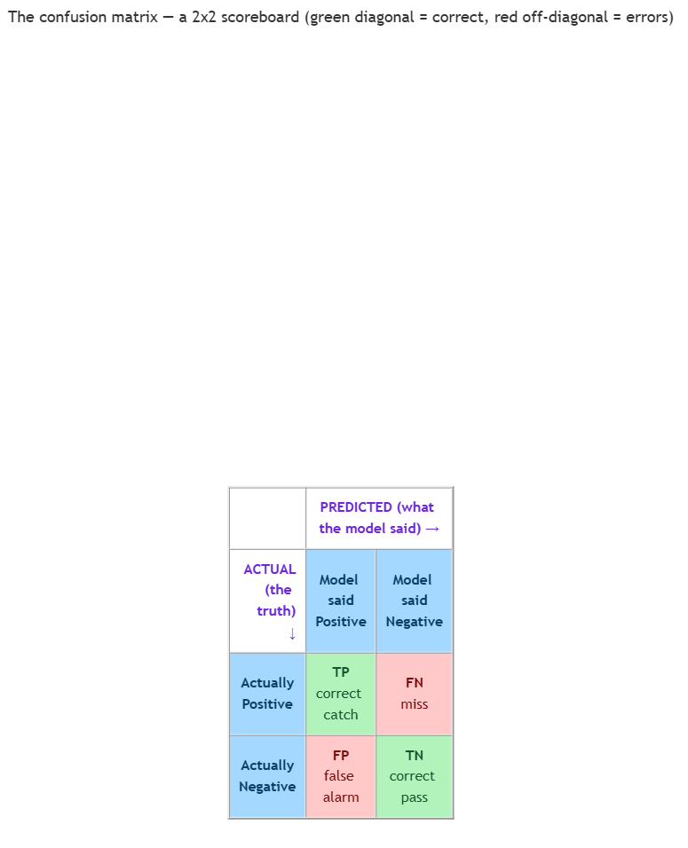

<!-- nav:top:start -->
[⬅ Previous: 8.4 — F1 score](../../8-4-f1-score-balancing-precision-and-recall-into-one-metric/artifacts/reading.md)&emsp;·&emsp;[⬆ Table of Contents](../../../../../../../README.md#curriculum-topic-index)&emsp;·&emsp;[Next: 8.6 — Calibration ➡](../../../3-model-calibration/8-6-calibration-does-the-models-stated-confidence-match-its-actu/artifacts/reading.md)
<!-- nav:top:end -->

---

# Computing accuracy, precision, recall, and F1 by hand from a confusion matrix

## Overview

Imagine you build a tiny spam filter and test it on 20 emails. For each email you wrote down two things: was it *actually* spam, and did your filter *say* it was spam? You now hold 20 little verdicts — but how do you turn that pile into a score?

In the last two topics you learned what precision, recall, and F1 *mean*. This is the hands-on one: you will see exactly where the numbers come from. By the end you can take a small grid of counts, point at each part, and compute all four metrics on paper — no tool, no code, just arithmetic.

## Key Concepts

### The four outcomes (quick refresher)

Every single prediction in a yes/no (binary) task lands in one of four buckets. You met three of these in 8.3; the fourth is new here.

- **True Positive (TP)** — the model said "yes" and the real answer was "yes." A correct catch. *(from 8.3)*
- **False Positive (FP)** — the model said "yes" but the real answer was "no." A false alarm. *(from 8.3)*
- **False Negative (FN)** — the model said "no" but the real answer was "yes." A miss. *(from 8.3)*
- **True Negative (TN)** — the model said "no" and the real answer was "no." A correct pass. **This one is new** [1].

A simple way to remember the names: the **second word** (Positive/Negative) is what the *model said*; the **first word** (True/False) tells you whether it was *right* [1].

### The confusion matrix — a 2×2 scoreboard

A **confusion matrix** is a small grid that counts how many predictions fell into each of those four buckets [1][2]. For a yes/no task it is exactly 2 rows by 2 columns — one side for what was actually true, the other for what the model predicted.

*The 2×2 confusion matrix: rows are the real answer, columns are what the model said; the diagonal (TP, TN) is correct and the off-diagonal (FP, FN) is the errors.*

|                       | Model said **Positive** | Model said **Negative** |
|-----------------------|-------------------------|-------------------------|
| **Actually Positive** | TP                      | FN                      |
| **Actually Negative** | FP                      | TN                      |

Each cell is just a count — how many cases landed there [2]. The diagonal (TP and TN) is where the model was right; the off-diagonal (FP and FN) is where it was wrong. Why "confusion"? Because the off-diagonal cells show where the model got *confused* — mixing up one class for the other.

### Accuracy — the headline number (new this topic)

You already know precision, recall, and F1. The metric you have *not* seen yet is the most obvious one of all.

**Accuracy** — out of every prediction the model made, the fraction it got right [1].

> Accuracy = (TP + TN) / (TP + TN + FP + FN)

In words: add up the two "right" cells (TP and TN), then divide by *all four* cells — every case you tested [1][2]. It is simply "right answers ÷ total answers."

**One caution, then we move on.** Accuracy can mislead when one class is rare. If only 1 email in 100 is spam, a lazy filter that says "never spam" is 99% accurate while catching zero spam. That blind spot — accuracy looking great while the model misses the rare thing — is exactly why precision, recall, and F1 exist (you saw this in 8.3 and 8.4).

### The other three formulas (refresher, now in cell terms)

You already know these from 8.3 and 8.4. Here they are written in confusion-matrix cells so you can read them straight off the grid:

- **Precision** = TP / (TP + FP) — of everything the model *called positive*, how much really was [1].
- **Recall** = TP / (TP + FN) — of everything that *really was positive*, how much the model caught [1].
- **F1** = 2 × (Precision × Recall) / (Precision + Recall) — the harmonic mean that balances the two [2]. *(from 8.4)*

Notice none of these four metrics needs anything beyond the four cell counts. Read the grid, plug in, done.

## Worked Example

Let us do the whole thing once with real numbers. Here are the results of testing the spam filter on **20 emails**, written as a confusion matrix [3]:

|                       | Model said **Spam** | Model said **Not spam** |
|-----------------------|---------------------|-------------------------|
| **Actually Spam**     | TP = 6              | FN = 2                  |
| **Actually Not spam** | FP = 3              | TN = 9                  |

First, a sanity check: the four counts must add to the total number of cases. 6 + 2 + 3 + 9 = **20**. Good — that matches the 20 emails we tested. Always do this check before computing anything.

Now read each cell in plain words:

- **TP = 6** — 6 spam emails were correctly flagged as spam.
- **FN = 2** — 2 spam emails slipped through (the model said "not spam").
- **FP = 3** — 3 normal emails were wrongly flagged as spam (false alarms).
- **TN = 9** — 9 normal emails were correctly left alone.

**Step 1 — Accuracy.** Add the two right cells, divide by all four.

> Accuracy = (TP + TN) / (TP + TN + FP + FN) = (6 + 9) / (6 + 9 + 3 + 2) = 15 / 20 = 0.75

The filter is right on **75%** of emails. That is a decent overall hit rate — but on its own it hides whether the misses are spam slipping through or normal mail getting blocked.

**Step 2 — Precision.** Of everything called spam, how much really was spam?

> Precision = TP / (TP + FP) = 6 / (6 + 3) = 6 / 9 ≈ 0.67

So **about 0.67**: when this filter shouts "spam," it is right about two times out of three. The other third are good emails wrongly sent to the junk folder.

**Step 3 — Recall.** Of all the real spam, how much did the filter catch?

> Recall = TP / (TP + FN) = 6 / (6 + 2) = 6 / 8 = 0.75

So **0.75**: the filter catches three-quarters of the actual spam, and lets one-quarter through to the inbox.

**Step 4 — F1.** Combine precision and recall with the harmonic-mean formula from 8.4. Use P = 0.67 and R = 0.75.

> F1 = 2 × (P × R) / (P + R) = 2 × (0.67 × 0.75) / (0.67 + 0.75) = 2 × 0.50 / 1.42 = 1.00 / 1.42 ≈ 0.71

So **about 0.71**. Notice F1 (0.71) sits between precision (0.67) and recall (0.75), but pulled a little toward the lower of the two — that is the harmonic mean doing its job, refusing to let a good recall hide a weaker precision.

That is the entire workflow: read the four cells, sanity-check the total, then plug into four formulas. Calibration is a different question, covered in 8.6.

## In Practice

The by-hand procedure is the same six steps every time:

1. **Lay out the matrix.** Put the four counts in the 2×2 grid: TP and FN on the "actually positive" row, FP and TN on the "actually negative" row.
2. **Sanity-check the total.** Add all four cells. They must equal the number of cases you tested. If not, stop — a count is wrong.
3. **Accuracy.** (TP + TN) ÷ (TP + TN + FP + FN). Right answers over total.
4. **Precision.** TP ÷ (TP + FP). Look only at the "model said positive" column.
5. **Recall.** TP ÷ (TP + FN). Look only at the "actually positive" row.
6. **F1.** 2 × (P × R) ÷ (P + R), using the precision and recall you just found.

A tip for reading the grid fast: **precision** is computed *down the column* the model predicted positive; **recall** is computed *across the row* that was actually positive. They share the same TP in the numerator and differ only in what error they add to the denominator.

A few habits keep your by-hand numbers honest:

- **Do** sanity-check that all four cells sum to your total before computing — a swapped FP/FN is the most common by-hand error.
- **Do** keep the label straight: second word = what the model *said*, first word = whether it was *right*. Mislabeling TN as TP wrecks every metric.
- **Do** report precision, recall, and F1 alongside accuracy — not accuracy alone — when one class is rare.
- **Don't** confuse FP and FN. FP is a false alarm (said yes, was no); FN is a miss (said no, was yes). Swapping them swaps precision and recall.
- **Don't** round too early. Carry precision and recall to two decimals before plugging into F1, or the final number drifts.

### Try it yourself

You test a different classifier — one that flags fraudulent transactions — on **25 transactions**. The results come back as this confusion matrix:

|                    | Model said **Fraud** | Model said **Legit** |
|--------------------|----------------------|----------------------|
| **Actually Fraud** | TP = 8               | FN = 4               |
| **Actually Legit** | FP = 2               | TN = 11              |

Compute, by hand and showing each substitution: (1) the total, as a sanity check; (2) accuracy; (3) precision; (4) recall; (5) F1. Then answer in one sentence: this model's accuracy looks high — which single metric reveals it is still missing a third of the real fraud, and why?

Work it the same way as the spam example: confirm the four cells add to 25, then walk steps 3 through 6 in order. The metric that exposes the missed fraud is the one whose denominator includes FN — because FN (the 4 missed frauds) is exactly the "real positives the model failed to catch."

## Key Takeaways

- A **confusion matrix** is a 2×2 grid of counts: TP, FP, FN, and TN — the diagonal is correct, the off-diagonal is the errors.
- **True Negative (TN)** is the new outcome here: the model said "no" and was right.
- **Accuracy** = (TP + TN) / (all four cells) — right answers over total — and it is the metric this topic introduces.
- All four metrics come from the same four cell counts: read the grid, then plug into accuracy, precision, recall, and F1.
- Accuracy alone can look great while a model misses a rare class — which is why precision, recall, and F1 (from 8.3 and 8.4) still matter.

## References

[1] Google. "Accuracy, precision, and recall." *Machine Learning Crash Course*. https://developers.google.com/machine-learning/crash-course/classification/accuracy-precision-recall

[2] Microsoft. "Confusion matrix." *Microsoft Learn — Dynamics 365 Finance Insights*. https://learn.microsoft.com/en-us/dynamics365/finance/finance-insights/confusion-matrix

[3] "Confusion Matrix Made Simple: Accuracy, Precision, Recall, F1-Score." *Towards Data Science*. https://towardsdatascience.com/confusion-matrix-made-simple-accuracy-precision-recall-f1-score/

---
<!-- nav:bottom:start -->
[⬅ Previous: 8.4 — F1 score](../../8-4-f1-score-balancing-precision-and-recall-into-one-metric/artifacts/reading.md)&emsp;·&emsp;[⬆ Table of Contents](../../../../../../../README.md#curriculum-topic-index)&emsp;·&emsp;[Next: 8.6 — Calibration ➡](../../../3-model-calibration/8-6-calibration-does-the-models-stated-confidence-match-its-actu/artifacts/reading.md)
<!-- nav:bottom:end -->
