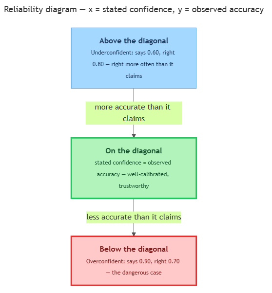

<!-- nav:top:start -->
[⬅ Previous: 8.5 — Computing accuracy, precision, recall, and F1 by hand from a confusion matrix](../../../2-evaluation-metrics-in-depth/8-5-computing-accuracy-precision-recall-and-f1-by-hand-from-a-co/artifacts/reading.md)&emsp;·&emsp;[⬆ Table of Contents](../../../../../../../README.md#curriculum-topic-index)&emsp;·&emsp;[Next: 8.7 — Designing a domain evaluation plan ➡](../../../4-planning-your-capstone-evaluation/8-7-designing-a-domain-evaluation-plan-metric-test-set-size-pass/artifacts/reading.md)
<!-- nav:top:end -->

---

# Calibration — does the model's stated confidence match its actual accuracy?

## Overview

Imagine your weather app says "70% chance of rain" every day for a month. On the days it said 70%, did it actually rain about 70% of the time? If yes, you can trust that number and decide whether to grab an umbrella. If it rained only 40% of those days, the app was too sure of itself, and its "70%" tells you nothing useful.

AI models do the same thing. When a model makes a prediction, it can also report a number for how sure it is. **Calibration** asks one question about those numbers: do they match how often the model is actually right [1]?

In topic 8.5 you learned **accuracy** — the fraction of predictions a model gets right overall. But accuracy alone does not tell you whether to trust a single prediction. Calibration is the missing piece [1].

## Key Concepts

### Confidence — the model's own bet on each prediction

When a model makes a prediction, many models also output a **confidence**: a number between 0 and 1 (or 0% to 100%) saying how sure the model is about that one prediction.

- **Confidence** — the model's stated belief that *this particular* prediction is correct. Example: "spam, confidence 0.95" means the model is betting 95% that this email is spam.
- A high confidence (0.95) is the model saying "I'm almost certain." A low confidence (0.55) is the model saying "I'm barely leaning this way."

Confidence is a claim the model makes about itself. The whole point of this topic is to check whether that claim is honest.

### Calibration — does the claim match reality?

**Calibration** — a model is **well-calibrated** when its stated confidence matches its actual accuracy over many predictions [1].

Here is the plain-words test, and it is the single most important idea in this topic:

> Gather every prediction the model made with about **70% confidence**. About **70% of them** should turn out correct. Gather all the **90% confidence** predictions, and about **90%** should be correct — and so on, at every confidence level.

Notice this is a statement about *groups* of predictions, not one prediction. You cannot check calibration from a single guess. You collect many predictions at the same confidence level and see what fraction were actually right [1][3].

A quick contrast keeps these two ideas straight:

| Question | What it measures |
|---|---|
| **Accuracy** (8.5) | Of all predictions, how many were correct? |
| **Calibration** (this topic) | When the model says "X% sure," is it right about X% of the time? |

A model can be accurate but badly calibrated, and a model can be calibrated but not very accurate. They answer different questions.

### Grouping predictions by confidence level

Why can't you just compare each confidence to a single outcome? Because one prediction is either fully right or fully wrong — never "70% right." So you **group** predictions by confidence level first.

- Sort every prediction into **buckets** by its confidence — one bucket near 0.6, one near 0.7, one near 0.8, and so on.
- For each bucket, find two numbers: the **average stated confidence** (the model's claim) and the **observed accuracy** — what fraction actually turned out correct [2][3].
- If those two numbers match in every bucket, the model is well-calibrated. If they drift apart, it is not.

That is the whole mechanism — no heavy math. You just group, then compare the model's confidence to the truth in each group.

### The reliability diagram — a picture of calibration

A **reliability diagram** is a plot that shows calibration at a glance [2]. It is the visual heart of this topic.

*A reliability diagram plots stated confidence (across) against observed accuracy (up); points on the diagonal are well-calibrated, below it overconfident, above it underconfident.*

Read it like this:

- The **x-axis (across)** is the model's **stated confidence** for each bucket.
- The **y-axis (up)** is the **observed accuracy** — how often the model was actually right in that bucket.
- Each bucket becomes one point on the plot.

A perfectly calibrated model sits exactly on the **diagonal line**, the 45-degree line from bottom-left to top-right. On the diagonal, stated confidence *equals* observed accuracy — which is what "well-calibrated" means [1][2]. Where a point sits relative to that line tells you the rest:

| Where the point sits | What it means | Plain example |
|---|---|---|
| On the diagonal | Well-calibrated | Says 0.70, right 70% of the time |
| Below the diagonal | Overconfident | Says 0.90, right only 70% of the time |
| Above the diagonal | Underconfident | Says 0.60, right 80% of the time |

Overconfidence is the more dangerous failure: the model sounds sure but is wrong more than it claims, so you trust it more than you should [1].

### Why calibration matters

A confidence score is only worth something if it is calibrated [1]. Confidence numbers exist so people or other systems can make decisions, such as "if the model is over 90% sure, accept it automatically; otherwise send it to a human."

- If the model is **well-calibrated**, that rule is safe — a 0.90 really does mean right 9 times out of 10.
- If the model is **overconfident**, the same rule quietly lets many wrong answers through, because "0.90" actually means right 7 times out of 10.

So calibration turns a confidence number from a vague vibe into something you can build a decision on. An accurate-but-overconfident model can be more dangerous than a less accurate but honest one, because it hides its mistakes behind a high number.

Beyond this topic: a single summary number called Expected Calibration Error and the techniques that fix poor calibration are covered later, not here.

## Worked Example

Suppose you ran a model many times and sorted its predictions into buckets by confidence. Look at three of those buckets:

1. **The 0.70 bucket.** The model said it was 70% sure on these predictions. You count how many were actually correct and find it was right 70% of the time. Stated confidence equals observed accuracy, so this point sits on the diagonal — well-calibrated.
2. **The 0.90 bucket.** The model said it was 90% sure here. But when you count, it was correct only 70% of the time. It claimed more than it delivered, so this point falls *below* the diagonal — overconfident.
3. **The 0.60 bucket.** The model said it was only 60% sure. Yet it was actually correct 80% of the time. It was right more often than it claimed, so this point sits *above* the diagonal — underconfident.

Same model, three different verdicts — which is exactly why you check calibration bucket by bucket, not with one number.

## In Practice

- **Decision thresholds.** Spam filters, fraud flags, and medical triage tools often "auto-act above 0.9, escalate to a human below it." That rule only holds if the model's 0.9 is calibrated [1].
- **Reliability diagrams in tooling.** Practitioners plot reliability diagrams to inspect a model's confidence behaviour before trusting its scores in production [2].
- **Do** judge a confidence score only after checking calibration — never assume "0.95" means "right 95% of the time."
- **Do** use many predictions grouped into buckets; calibration is a property of groups, not single predictions.
- **Don't** confuse accuracy with calibration — a model can be one without the other.
- **Don't** trust an automatic accept/reject threshold on an uncalibrated model; overconfidence will quietly pass wrong answers through.

## Key Takeaways

- **Calibration** asks whether a model's stated **confidence** matches its **actual accuracy** over many predictions.
- A model is **well-calibrated** when, among all its ~70%-confidence predictions, about 70% turn out correct — and likewise at every confidence level.
- On a **reliability diagram**, a perfectly calibrated model sits on the diagonal; points **below** it are **overconfident**, points **above** it are **underconfident**.
- **Accuracy** and **calibration** are different questions — a model can be accurate yet overconfident.
- A confidence score is only trustworthy for decisions when the model is calibrated.

## References

[1] *Understanding Model Calibration — A Gentle Introduction & Visual Exploration*. https://arxiv.org/pdf/2501.19047

[2] *Reliability Diagrams*. https://github.com/hollance/reliability-diagrams

[3] *Calibration in Machine Learning: Confidence, Accuracy & ECE*. https://mbrenndoerfer.com/writing/calibration-machine-learning-confidence-accuracy-ece

---
<!-- nav:bottom:start -->
[⬅ Previous: 8.5 — Computing accuracy, precision, recall, and F1 by hand from a confusion matrix](../../../2-evaluation-metrics-in-depth/8-5-computing-accuracy-precision-recall-and-f1-by-hand-from-a-co/artifacts/reading.md)&emsp;·&emsp;[⬆ Table of Contents](../../../../../../../README.md#curriculum-topic-index)&emsp;·&emsp;[Next: 8.7 — Designing a domain evaluation plan ➡](../../../4-planning-your-capstone-evaluation/8-7-designing-a-domain-evaluation-plan-metric-test-set-size-pass/artifacts/reading.md)
<!-- nav:bottom:end -->
