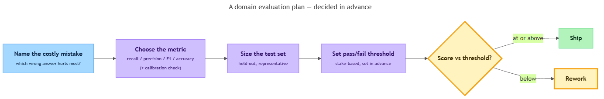

<!-- nav:top:start -->
[⬅ Previous: 8.6 — Calibration](../../../3-model-calibration/8-6-calibration-does-the-models-stated-confidence-match-its-actu/artifacts/reading.md)&emsp;·&emsp;[⬆ Table of Contents](../../../../../../../README.md#curriculum-topic-index)&emsp;·&emsp;[Next: 9.1 — System 1 thinking ➡](../../../../../m4-human-cognition-and-ai-oversight/week-9/1-how-humans-think/9-1-system-1-thinking-fast-instinctive-automatic/artifacts/reading.md)
<!-- nav:top:end -->

---

# Designing a Domain Evaluation Plan — Metric, Test Set Size, Pass/Fail Threshold

## Overview

Imagine you have built something that seems to work — a tool that sorts support tickets, a question-answering helper for one company's documents, or a filter that flags risky messages. It seems fine when you try it. But "seems to work" is not an answer you can defend to anyone.

An **evaluation plan** is how you prove your system is good enough to put in front of real users. This topic is the capstone of the week: you will not learn any new measure here. You will learn how to *choose* among the ones you already know — precision, recall, F1, accuracy, calibration — and write them into a short, defensible plan. The skill here is judgment, not arithmetic, and there is no new formula to memorize. [1]

## Key Concepts

An **evaluation plan** is a short, written description — decided *before* you judge your system — of how you will tell whether it is good enough. It names three things: the measure you will use, the test data you will use, and the bar that counts as a pass. [2]

Why write it down in advance? Because if you wait until after you see the results, it is too easy to move the goalposts — to say "70% is fine, actually" only because that is the number you happened to get. Deciding first keeps you honest. [3] A plan you can fit on one page is the goal; a plan that needs ten pages usually means the task has not been pinned down yet.

The plan rests on three decisions, taken in order — **pick the metric, size the test set, set the threshold** — and the plan hands you a ship-or-rework verdict at the end.

*The seven-step planning flow: the three decisions feed a single ship-or-rework verdict at the bottom.*

### Decision 1 — Metric choice

A **metric** is the single measure you use to score your system. The whole game is to **match the metric to what a mistake actually costs in your domain.** You already met the candidates this week, so this is a matching exercise, not new learning. Here is how to choose among them:

| If your situation is... | Reach for... | Because... |
|---|---|---|
| Missing a real case is expensive (a missed fraud, a missed disease flag) | **Recall** (from 8.3) | It punishes false negatives — the cases you let slip through. |
| A false alarm is expensive (wrongly blocking a good user) | **Precision** (from 8.3) | It punishes false positives — the wrong alarms. |
| Both kinds of mistake hurt and you want one number | **F1** (from 8.4) | It balances precision and recall, and stays low if either is bad. |
| Classes are roughly balanced and all mistakes cost about the same | **Accuracy** (from 8.5) | It is the simplest fair summary, but only when classes are even. |
| You will *show users a confidence score* and want them to trust it | Also check **calibration** (from 8.6) | A confident-but-wrong model is dangerous even if accuracy looks fine. |

Two warnings carry over from the rest of the week:

- **Accuracy can lie when classes are imbalanced.** If 99 of every 100 emails are not spam, a model that simply says "never spam" scores 99% accuracy and catches zero spam. That is exactly why you learned precision, recall, and F1 in the first place. [1]
- **Calibration is a second question, not a replacement.** A model can be accurate yet overconfident. If your system *displays* a confidence number that a person will act on, add a calibration check alongside your main metric — do not swap one for the other. [1]

The point of having choices is that **different domains care about different mistakes.** Choosing well means you can finish this one sentence: *"I will use ___ because in my domain a ___ mistake is the costly one."* If you cannot fill in those blanks, you have not chosen yet.

### Decision 2 — Test set size

A **test set** is a collection of labeled examples — inputs where you already know the right answer — that you run your system against to compute the metric. **Labeled** simply means a human has written down the correct answer for each example beforehand.

The decision here is: **how many examples do you need before the score is trustworthy?** The intuition is simple. A metric computed on 5 examples is almost meaningless, because one lucky or unlucky case swings it wildly.

For instance, test on 5 support tickets and get 4 right, and your accuracy reads 80%. Get one more right or wrong, and it jumps to 100% or 60%. That number is **noise** — it tells you almost nothing. The more examples you test on, the more one or two odd cases stop mattering, and the steadier and more trustworthy the score becomes. [2]

A practical way to size the test set without any formula: **pick enough examples that one or two individual cases cannot swing the result.** A few dozen is far better than a handful; a couple hundred is steadier still. For a beginner Capstone, roughly 30–100 carefully labeled examples is a reasonable starting point — enough to be meaningful, small enough to label by hand.

Two qualities matter just as much as the raw count:

- **Held-out** — the test examples must be ones your system was never tuned on. Testing on examples you already adjusted the system to handle is like grading your own homework with the answer key open: the score looks great and means nothing. [2]
- **Representative** — the test examples should look like the real inputs your system will face. If real users ask messy, varied questions, a test set of only tidy textbook questions will hand you a falsely rosy score. [1][2]

The deeper question of *exactly* how big a test set must be belongs to a later, more advanced treatment. For your Capstone plan, the intuition above — enough that a stray case won't swing it, held-out, and representative — is all you need. You will meet confidence intervals later, and train/validation/test split methodology later as well; you do not need either to write a sound one-page plan.

### Decision 3 — Pass/fail threshold

A **pass/fail threshold** is the score you decide *in advance* counts as "good enough to ship." Above it, the system passes; below it, it fails and goes back for more work. [3]

The key word is *in advance*. Set the bar before you see the result, so the result cannot quietly lower the bar for you. This is the same honesty guard as the whole plan, applied to the single most temptation-prone number. [3]

So how high should the bar be? **Tie it to the stakes of the task.** [3]

| Stakes of the task | Threshold attitude | Example |
|---|---|---|
| Low — a wrong answer is a minor annoyance | A modest bar can be fine | A movie-suggestion helper; 80% might ship |
| High — a wrong answer causes real harm or cost | The bar must be strict | A tool flagging unsafe content; you might demand 95%+ recall |

There is no universal "good" number. A threshold is a *decision about acceptable risk*, written as a score on the metric you chose. Sometimes you set more than one bar — for example, "recall must be at least 0.90 **and** precision at least 0.70" — when the task genuinely has two costs you cannot ignore. Setting a threshold rigorously, and validating it with K-fold cross-validation, are more advanced techniques you will meet later; for this planning topic, a threshold is a stake-based judgment call you write down and defend in one sentence.

### Putting the three together

A finished plan is just the three decisions, in order, each with a one-line reason:

1. **Metric:** I will measure with **___**, because in my domain a **___** mistake is the costly one.
2. **Test set:** I will test on about **___** labeled, held-out, representative examples, because that is enough that no single case swings the score.
3. **Threshold:** I will count **___** as a pass, because the stakes of this task are **___**.

That is the whole one page. The verdict — ship or rework — falls straight out of comparing the measured score against the threshold you set.

## Worked Example

Here is a step-by-step procedure for writing your own plan:

1. **Name the task in one sentence.** "My system sorts incoming support tickets into 'billing', 'technical', or 'other'." Be concrete about the input and the output.
2. **Name the costly mistake.** Ask: when this system is wrong, which kind of wrong hurts most — a miss (false negative), a false alarm (false positive), or both equally? This single question drives the metric.
3. **Pick the metric** from the table above that matches that costly mistake. Add a calibration check only if you will surface confidence scores to users.
4. **Size the test set.** Decide a number of labeled examples large enough that one stray case won't move the result, and confirm they are held-out and representative.
5. **Set the threshold.** Write the pass score, tied to the stakes — decided now, before you run anything.
6. **Write the one-pager.** Three "because" sentences (metric, test set, threshold). If you can defend all three reasons out loud, your plan is done.

Two quick sketches of the finished result:

- **Support-ticket classifier.** Task: route tickets to a team. Costly mistake: sending an urgent ticket to the wrong queue (a miss), so **recall on the urgent class** matters most. Test set: 60 real, labeled past tickets, held out from anything used to build the system. Threshold: recall on urgent tickets must be at least 0.90 to ship — because a missed urgent ticket means a customer waits days. [1][2]
- **Domain question-answering helper.** Task: answer staff questions from one company's handbook. The costly mistake is a confident wrong answer, so the team tracks **accuracy plus a calibration check** (from 8.6), so a confidently-wrong answer is caught. Test set: 50 real questions with known correct answers. Threshold: at least 0.85 accuracy *and* no overconfident wrong answers above the displayed-confidence bar. [1]

## In Practice

Teams that build machine-learning systems professionally write exactly this kind of plan before they trust a system in production — a written test-and-evaluation design with named metrics, a held-out test suite, and explicit pass criteria agreed in advance. [2] The same discipline scales down cleanly to a Capstone: the plan is shorter, but the three decisions are identical.

**Do:**

- **Decide the threshold before you see results.** This is the single most important habit. [3]
- **Match the metric to the cost of errors**, not to whichever number happens to look highest. [1]
- **Keep the test set held-out and representative** of real use. [2]
- **Write one defensible sentence per decision.** If you cannot say "because...", the decision is not actually made yet.

**Don't:**

- **Don't trust a metric on a tiny test set.** Five or ten examples is a vibe, not evidence.
- **Don't report accuracy alone on imbalanced classes** — it hides the failures that matter, like recall on the rare class. [1]
- **Don't move the goalposts** after seeing a disappointing score.
- **Don't show users a confidence number without a calibration check.** Confident-but-wrong erodes trust fast. [1]

## Key Takeaways

- An **evaluation plan** is three decisions written in advance: which metric, how many test examples, and what score counts as a pass.
- **Metric choice** is a matching exercise — pick the measure that punishes the mistake your domain most wants to avoid, and add a calibration check if you show confidence scores.
- **Test set size** is about trust: enough labeled, held-out, representative examples that one or two stray cases cannot swing the score.
- **The pass/fail threshold is set in advance and tied to the stakes** — strict for high-harm tasks, modest for low-stakes ones — so the result cannot quietly lower the bar.
- Every decision should come with a one-sentence "because" you can defend out loud.

## References

[1] "Evaluation metrics and statistical tests for machine learning." *Scientific Reports* (Nature). https://www.nature.com/articles/s41598-024-56706-x
[2] "Test & Evaluation Best Practices for Machine Learning-Enabled Systems." https://arxiv.org/pdf/2310.06800
[3] "How to Choose a Threshold for an Evaluation Metric." https://arxiv.org/pdf/2412.12148

---
<!-- nav:bottom:start -->
[⬅ Previous: 8.6 — Calibration](../../../3-model-calibration/8-6-calibration-does-the-models-stated-confidence-match-its-actu/artifacts/reading.md)&emsp;·&emsp;[⬆ Table of Contents](../../../../../../../README.md#curriculum-topic-index)&emsp;·&emsp;[Next: 9.1 — System 1 thinking ➡](../../../../../m4-human-cognition-and-ai-oversight/week-9/1-how-humans-think/9-1-system-1-thinking-fast-instinctive-automatic/artifacts/reading.md)
<!-- nav:bottom:end -->
