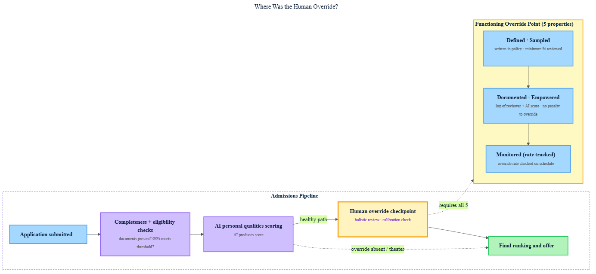

<!-- nav:top:start -->
[⬅ Previous: 9.11 — High-stakes domains where AI must not have the final word](../../../../week-9/4-defining-safe-boundaries/9-11-high-stakes-domains-where-ai-must-not-have-the-final-word-me/artifacts/reading.md)&emsp;·&emsp;[⬆ Table of Contents](../../../../../../../README.md#curriculum-topic-index)&emsp;·&emsp;[Next: 10.2 — Case study: Automated medical triage ➡](../../10-2-case-study-automated-medical-triage-what-failure-mode-was-to/artifacts/reading.md)
<!-- nav:top:end -->

---

# Case study: AI in college admissions — where was the human override point missed?

## Overview

Universities have introduced AI tools to help score college applications — including the personal essays applicants write about who they are. In documented cases, a human reviewer was present but effectively stopped checking the AI's output. This topic examines exactly where that check broke down and why. By the end, you will be able to name the missing point in the process, explain the four causes that eroded it, and describe the governance controls that would have kept it functioning.

## Key Concepts

### What AI does in an admissions pipeline

A **pipeline** is a fixed sequence of steps that every application passes through, one after another. A typical admissions pipeline looks like this:

1. Application submitted by student.
2. Completeness check — are all documents uploaded?
3. Academic eligibility check — does the GPA meet the threshold?
4. Personal qualities scoring — reading the personal statement and producing a score.
5. Final ranking and offer decision.

Each step feeds the next. The output of step 4 becomes the input for step 5.

Not all steps carry the same risk. Two categories matter here:

| Task | Risk level | Why |
|---|---|---|
| Checking documents are complete | Low — safe to automate | Pass/fail with a clear rule |
| Sorting by programme or deadline | Low — safe to automate | Narrow, verifiable |
| Scoring personal qualities | High — needs human check | Involves judgment about character, context, and potential |

**Holistic review** is the admissions practice of considering the whole person — grades, personal statement, background, and personal context — rather than a single number. When AI scoring tools were introduced, many universities intended the AI score to be *one input* into holistic review. Research documents that in practice, holistic review collapsed: the AI score became the decision [1].

### The human override point — and what "missing" means

A **human override point** is a defined checkpoint in a pipeline where a human is required to review the AI's output, may reject or change it, and must explicitly approve it before it moves forward.

Two words in that definition are essential:
- **Required** — not just allowed; the policy says it must happen.
- **May change it** — the reviewer has genuine authority, not just presence.

A checkpoint where humans are present but never change anything — because they trust the AI — is not a functioning override point. It is automation bias in institutional form.

*The admissions pipeline: applications flow from completeness checks through AI personal qualities scoring. On the healthy path, a human override checkpoint (holistic review + calibration check) sits between AI scoring and the final ranking. On the failed path, that checkpoint is bypassed or reduced to theater, and the AI score feeds directly to the final decision.*

### Four causes that eroded the override point

Peer-reviewed research on AI scoring of applicants' personal qualities documents a consistent pattern: the human check did not disappear in a single decision. It eroded through four causes working together [1].

**Cause 1 — Automation bias at the individual level**

Each reviewer experienced automation bias (a concept from earlier in this module): the AI score arrived first, looked precise (e.g., "72/100"), and carried implicit authority. Re-reading the personal statement to verify it felt redundant. Review time per application dropped as reviewers deferred to the AI's output even when they had access to the original document [1].

**Cause 2 — Workload pressure**

Admissions offices process thousands of applications in a short window. When AI reduced the time each application required, managers saw throughput increase and did not ask whether oversight had decreased alongside it. The incentive structure rewarded speed, not accuracy of review [1].

**Cause 3 — No written governance rule**

The university had not written in policy: "At step 4, a human reviewer must read a minimum of X% of applications and document any cases where the AI score was overridden." Without a written rule, the checkpoint existed only as an informal norm — and informal norms erode under pressure. Institutional analysis of AI admissions risks identifies the absence of a written override policy as the single most common governance gap across case reviews [3].

**Cause 4 — Independent verification was impractical**

This maps directly to Q2 from the Judgment Framework: *Can I verify this without the AI?* For an AI personal qualities score, the answer is: only by re-reading the personal statement yourself — which requires the same effort the AI was meant to replace. Institutions where reviewers lacked a practical verification path showed higher error persistence than those with structured re-read requirements [2].

### Applying the Judgment Framework

The three Judgment Framework questions (from earlier topics) reveal why the admissions case was high-risk from the start.

**Q1 — What is the cost of this being wrong?**

For the applicant: rejection from a university they may have deserved to attend, with downstream impact on career and finances. For the university: legal and reputational risk — an AI tool that consistently scores lower for applicants from certain demographic groups exposes the institution to anti-discrimination challenge. Several universities have faced exactly this scrutiny [3].

Q1 alone should have triggered a mandatory human override point.

**Q2 — Can I verify this without the AI?**

The reviewer can re-read the personal statement — that is independent verification. But the workflow was redesigned to eliminate that step in practice. When verification is possible but structurally prevented, the governance failure is structural. The fix is also structural: require verification for a defined sample, not just allow it in theory.

**Q3 — Who is accountable if this fails?**

In documented cases, this question had no clear answer. The AI vendor said the model performed to specification. The admissions office said they used the tool as recommended. The individual reviewer said they followed the process they were trained on. No single person owned the outcome. The Judgment Framework says: when accountability is diffused, the AI must not have the final word.

### How holistic review collapses — five stages

**Holistic review collapse** is what happens when a multi-factor review is quietly reduced to a single AI score. Research documents it in five stages [1][2]:

1. AI tool introduced as "one input."
2. Staff spend less time re-reading applications that already have an AI score.
3. Edge cases — unusual applications that the AI underscores but a human would rate highly — fall through. No one tracks how often the AI score is overridden.
4. The AI score becomes the effective decision. The human step is retained on paper but produces no real checking.
5. A complaint, an audit, or investigative journalism surfaces the pattern.

Stage 3 is where the override point is effectively lost. Stage 4 is where harm accumulates. Stage 5 is where the institution first learns that stage 3 happened. Governance controls need to be designed for stage 3, not patched in at stage 5.

### What a functioning override point looks like

| Property | What it means in the admissions context |
|---|---|
| **Defined** | Written in policy: at step 4, a human reviewer reads the personal statement before the score is used in ranking. |
| **Sampled** | Policy specifies a minimum review sample — e.g., 20% of applications, or 100% of scores below a threshold. |
| **Documented** | Each review is logged: reviewer ID, application ID, AI score, human judgment, and outcome. |
| **Empowered** | The reviewer has genuine authority to override — overrides do not require manager approval and are not penalised. |
| **Monitored** | Someone reviews the override log on a schedule. A near-zero override rate is a warning signal, not a success. |

A near-zero override rate means either the AI is extraordinarily accurate — or reviewers have stopped genuinely reviewing. An institution that celebrates 0% overrides without investigating has confused the metric for the goal.

## Worked Example

### Scenario

A university introduced an AI tool to score personal statements on four qualities — resilience, motivation, communication, and intellectual curiosity — each scored 0–25, giving a total of 0–100. Applications scoring below 60 were automatically moved to a rejection pool. Human reviewers were available for borderline cases (55–65).

In the first year, 92% of applications below 60 were rejected without any human review. The university received complaints from three applicants who had described significant adversity in their personal statements. On re-reading, two of the three would have been moved above 60 by a human reviewer.

### Applying the audit method

**Step 1 — Identify the pipeline step where the override was missing.**
The missing point was step 4: the AI produced a score below 60, and that score flowed directly to the rejection pool without a human re-reading the statement. No human checked whether the AI had correctly understood the adversity context.

**Step 2 — Identify the cause.**
The structural cause was Cause 3 (no written policy): the university had no rule requiring human review for scores below the rejection threshold of 60. Reviewers were only directed to borderline cases (55–65), leaving a large band of clear rejections unreviewed — exactly where the AI's limitations in interpreting adversity narratives had the most impact.

**Step 3 — Write the governance control.**

> "At step 4 (personal qualities scoring), a human reviewer must re-read the personal statement for 100% of applications scoring below 60 and a random 15% sample of all other applications. The reviewer must log their ID, the application ID, the AI score, and their judgment (accept AI score / override). The reviewer has authority to override without manager approval, and overriding is not flagged as an error. This log is reviewed monthly by the Admissions Quality Lead."

This control would have caught the adversity-narrative cases before rejections were issued.

## In Practice

**Do:**

- Write the override point into policy **before** deploying the AI tool — not after. Retroactive governance misses the early period when norms are set.
- Set a written minimum review sample. 20% is common in documented cases; require 100% for scores near or below any rejection threshold [3].
- Log every human review with reviewer ID, AI score, and outcome. No log means no evidence it happened.
- Monitor the override rate on a schedule (monthly minimum). A near-zero rate triggers an audit, not a celebration.
- Audit AI scores for demographic correlation before deployment and annually after — check whether scores correlate with postcode, school type, or first-generation status [3].
- Name a single human decision-maker who owns the output of the AI step. That person's name is associated with the outcome.

**Do not:**

- Treat a numeric AI score as more objective than human judgment. A score of "72/100" can be entirely wrong.
- Count the override point as functional if reviewers are almost never overriding. Investigate before concluding the AI is performing well.
- Remove the **calibration** step — the process of cross-checking that two reviewers would reach similar judgments on the same application — just because the AI produces consistent outputs. Consistency can consistently encode the same error.
- Allow the vendor to be the accountable party for the decision. The vendor is accountable for the tool meeting its specification. The institution is accountable for the decision made with it.

**The anti-pattern to recognize — override as theater**

**Override as theater** is a human checkpoint that exists on paper but functions as rubber-stamping. It looks like governance but produces no real oversight — and creates false confidence, because an audit asking "is there a human review step?" will answer yes. Detecting it requires looking at the override rate and time per review, not just the presence of the step [2].

## Key Takeaways

- AI tools were used in college admissions to score personal qualities — a high-stakes, hard-to-verify judgment. The human override point was missed when the governance process was not updated to match the risk level of the task being automated [1].
- The failure was not a single dramatic decision. The override point eroded gradually through automation bias, workload pressure, absence of a written policy, and the practical difficulty of independently verifying an AI score.
- The Judgment Framework shows why the failure was predictable: Q1 reveals the cost of being wrong is too high for the AI to have the final word; Q2 reveals verification was possible but structurally removed from the workflow; Q3 reveals accountability was diffused to the point of meaninglessness.
- A functioning override point is defined in writing, applied to a specified sample, logged, empowered, and monitored. Override-as-theater — a step that exists on paper but produces no real checking — is not a functioning override point.
- Institutions that designed override points structurally caught errors before harm occurred. The determining factor was governance design, not AI capability [2][3].

## References

[1] Cheng, Y., et al. (2023). "AI Scoring of Applicant Personal Qualities in College Admissions." *NCBI/PMC*. https://www.ncbi.nlm.nih.gov/pmc/articles/PMC10569720/

[2] Algorithmic decision-making and oversight in Danish college admissions. *arXiv preprint*, 2024. https://arxiv.org/pdf/2411.15348

[3] USC Rossier School of Education. "Balancing Potentials and Pitfalls: AI in College Admissions." https://rossier.usc.edu/news-insights/news/balancing-potentials-and-pitfalls-ai-college-admissions

---
<!-- nav:bottom:start -->
[⬅ Previous: 9.11 — High-stakes domains where AI must not have the final word](../../../../week-9/4-defining-safe-boundaries/9-11-high-stakes-domains-where-ai-must-not-have-the-final-word-me/artifacts/reading.md)&emsp;·&emsp;[⬆ Table of Contents](../../../../../../../README.md#curriculum-topic-index)&emsp;·&emsp;[Next: 10.2 — Case study: Automated medical triage ➡](../../10-2-case-study-automated-medical-triage-what-failure-mode-was-to/artifacts/reading.md)
<!-- nav:bottom:end -->
