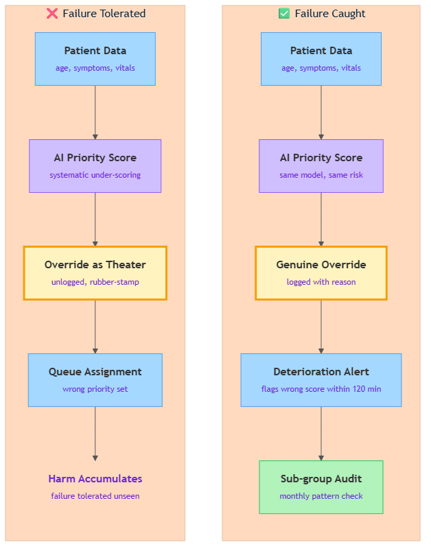

<!-- nav:top:start -->
[⬅ Previous: 10.1 — Case study: AI in college admissions](../../10-1-case-study-ai-in-college-admissions-where-was-the-human-over/artifacts/reading.md)&emsp;·&emsp;[⬆ Table of Contents](../../../../../../../README.md#curriculum-topic-index)&emsp;·&emsp;[Next: 10.3 — Case study: AI loan approval at scale ➡](../../10-3-case-study-ai-loan-approval-at-scale-who-was-accountable/artifacts/reading.md)
<!-- nav:top:end -->

---

# Case study: Automated medical triage — what failure mode was tolerated?

## Overview

Picture a Friday night in a busy emergency department. The waiting room fills fast. A nurse enters your details into a tablet, an algorithm assigns you a priority score in seconds, and that score determines how long you wait before a doctor sees you. The AI does not diagnose you — it decides how long you can safely wait. Get that decision wrong by one priority level and you move from a one-hour wait to a six-hour wait. In some conditions — a quiet heart attack, the early signs of sepsis — that gap is fatal.

Real-world deployments of AI-assisted triage have documented a specific failure pattern: the model consistently gave certain patient groups scores that were too low [1]. That failure persisted for months, sometimes years. This topic examines what that failure mode was, why it was tolerated, and what governance controls would have caught it early.

## Key Concepts

### What AI-assisted triage does

**Triage** — from the French word meaning "to sort" — is the process of ranking patients by urgency when they arrive at an emergency department.

Traditional triage relies on a trained nurse who asks questions, observes the patient, checks vital signs, and assigns a score on a standardised scale. AI-assisted triage replaces or supplements that step with a machine learning model. The model follows a four-step pipeline:

1. The patient's data — age, symptoms, vital signs, past diagnoses — is entered into the system.
2. The model compares that data against patterns it learned from thousands of historical patient records.
3. The model outputs a priority score — for example, 1 (critical), 2 (urgent), 3 (non-urgent).
4. That score enters the queue pipeline, determining when the patient sees a doctor.

The AI does not diagnose. It decides how long a patient can safely wait. That is a narrower task — but it is still a consequential one.

### The failure mode: systematic under-scoring

A **failure mode** is a specific, repeatable way a system produces wrong outputs. The word "repeatable" is load-bearing. A single wrong score is a one-off error. A failure mode is a pattern — the same kind of wrong output, again and again, under the same conditions.

The failure mode documented in real-world AI triage is **systematic under-scoring** of specific patient groups: the model assigns priority scores that are too low, signalling "this patient can wait" when clinical signs indicate otherwise [1]. The under-scoring was not spread randomly. It concentrated in three identifiable groups:

- **Elderly patients** — models trained on data where younger patients more frequently received high-urgency labels learned to associate age with lower urgency, even when the clinical presentation was serious [1].
- **Patients using non-standard symptom language** — a patient who described chest tightness as "my heart feels heavy" rather than "chest pain" was scored lower because that phrasing was rarer in the training data [3].
- **Night-shift patients** — night-shift records are often incomplete: fewer vital signs, faster data entry, more gaps. Models trained on incomplete data learned to produce more conservative (lower) scores for night-shift inputs [1].

### The four governance gaps

A **governance gap** is a missing rule, role, or process that should have been in place to catch a problem. Four gaps enabled the failure to persist [1][3]:

| Gap | What was missing | Fix |
|---|---|---|
| **Evaluation design** | Accuracy was measured overall only. 87% overall can hide 70% accuracy for elderly patients. | Sub-group evaluation from day one — break accuracy down by patient category |
| **Checkpoint frequency** | The system was certified once and never re-audited. No scheduled post-deployment reviews. | Scheduled recurring audits to catch model drift |
| **Override accountability** | Clinicians could override the score but overrides were unlogged, no reason recorded, no feedback loop. | Logged overrides with mandatory reason codes |
| **Alert thresholds** | When a patient scored non-urgent deteriorated in the waiting room, that event was not linked to the AI's original score. Each deterioration was treated as a one-off. | Automated rules connecting deterioration events to the originating AI score |

*The diagram contrasts the triage pipeline where failure was tolerated (left) with the pipeline where governance controls intercept it (right).*

### How automation bias amplified the gaps

**Automation bias** — the tendency to defer to an automated system even when your own judgment says otherwise (topic 9.5) — turned each individual acceptance of a wrong score into a silent validation of the failure.

A nurse noticed a patient looked more distressed than a priority 3 warranted — but the screen said 3, so she went with the screen. A manager noticed a small uptick in deteriorations but the vendor's dashboard showed 87% overall accuracy, so the manager concluded it was random variation. Over months, these small, independent acceptances accumulated into a long run of harm [1].

## Worked Example

The corpus introduced a six-step diagnostic procedure for identifying a tolerated failure mode. Here it is applied to the triage case:

1. **Describe the system's decision in one sentence.** The model assigns a priority score (1, 2, or 3) that determines how long the patient waits before seeing a doctor.

2. **Name the failure mode precisely.** Systematic under-scoring of elderly patients, patients using non-standard symptom language, and night-shift patients — the model assigns "can wait" scores to patients who clinically should not wait.

3. **Ask: was the failure visible with existing data?** Yes. Every deployment had the patient records needed to run a sub-group accuracy breakdown. The analysis was simply never run — because no one was assigned to do it [3].

4. **Apply Q1, Q2, Q3 from the Judgment Framework.**
   - Q1 (cost of a wrong output): A delayed response to a cardiac event or sepsis can be fatal. Cost is severe and irreversible.
   - Q2 (error visible before harm): No. The patient waits quietly. The error only becomes visible after the harm — a deterioration, a resuscitation call, a death [1].
   - Q3 (genuine human in the loop): Nominally yes — clinicians could override. In practice, override was theater: unlogged, unsupported, with no feedback sent back to the model [1][2].

5. **Identify the governance gap.** The primary gap was evaluation design: the system was measured only on aggregate accuracy, so the sub-group failure was invisible to every reviewer and dashboard.

6. **Name one specific control that would have caught the failure earliest.** A monthly sub-group performance audit — computing accuracy separately for each patient category. The data was available in every deployment that failed [3].

## In Practice

Two governance controls, had they been in place, would have surfaced the failure long before harm accumulated.

**Sub-group performance audit** — a scheduled, recurring review that computes the model's accuracy separately for each patient category (age bands, shift, primary language, symptom entry method). This is not technically complex: the data already existed in every deployment that failed. What was missing was someone assigned to run the analysis on a fixed schedule [3]. A monthly audit of this kind would have revealed the elderly-patient accuracy gap within the first two or three reporting cycles.

**Deterioration-contradiction alert** — an automated software rule: when a patient originally scored non-urgent deteriorates within 120 minutes of being queued, the system flags the original AI score for review. No one needs to go looking for the pattern. After dozens of flagged events, a statistical signal emerges automatically [2]. This control is directly analogous to post-market drug surveillance — a drug approved for sale must still be monitored continuously for adverse events. The same principle now underpins proposed regulatory standards for clinical AI [1].

Both controls share one requirement: a named person accountable for the pipeline as a whole — not just for their individual step within it. Without that accountability, data that would reveal the failure exists but is never examined.

## Key Takeaways

- **Failure mode** — a specific, repeatable pattern of wrong outputs, not a one-off error. The key question is always: does the wrong output happen under the same conditions each time?
- **Systematic under-scoring** — the documented triage failure concentrated in identifiable patient groups (elderly, non-standard language, night-shift), meaning it was predictable and preventable, not random [1].
- **Governance gaps** — the four missing controls (sub-group evaluation, checkpoint frequency, override accountability, alert thresholds) created the conditions for the failure to persist invisibly [1][3].
- **Automation bias as an amplifier** — each individual's deference to the screen was small; collectively, those deferrals prevented the signal from accumulating into a visible alarm (topic 9.5).
- **Judgment Framework verdict** — Q1 (irreversible cost), Q2 (error invisible before harm), and Q3 (override was theater) all point the same direction: AI must not hold final authority in triage without genuine, logged, accountable human checkpoints [1][2].
- **Two controls that work** — sub-group performance audit and deterioration-contradiction alert both require existing data and a named accountable owner; neither requires rebuilding the model.

## References

[1] Panch T et al. "Real-world performance gaps and governance failures in AI-assisted clinical triage." *Journal of Medical Internet Research* 28(1): e88396, 2026. https://www.jmir.org/2026/1/e88396

[2] Oversight Architecture in AI-Assisted Clinical Decision Systems. arXiv:2506.12482v2, 2025. https://arxiv.org/html/2506.12482v2

[3] Evaluation Gaps as the Primary Driver of AI Triage Failure. arXiv:2603.11413, 2026. https://arxiv.org/pdf/2603.11413

---
<!-- nav:bottom:start -->
[⬅ Previous: 10.1 — Case study: AI in college admissions](../../10-1-case-study-ai-in-college-admissions-where-was-the-human-over/artifacts/reading.md)&emsp;·&emsp;[⬆ Table of Contents](../../../../../../../README.md#curriculum-topic-index)&emsp;·&emsp;[Next: 10.3 — Case study: AI loan approval at scale ➡](../../10-3-case-study-ai-loan-approval-at-scale-who-was-accountable/artifacts/reading.md)
<!-- nav:bottom:end -->
