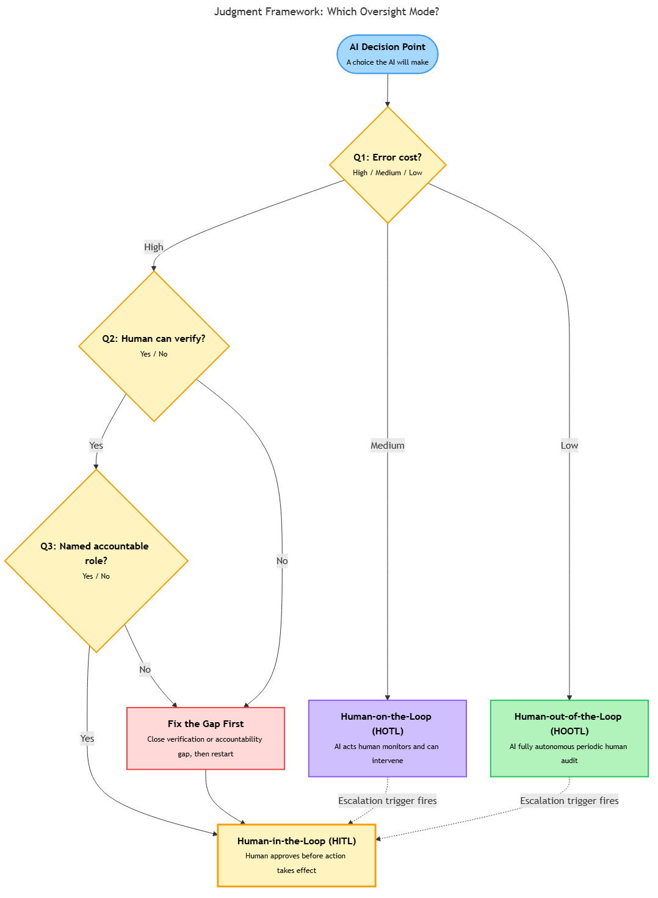

<!-- nav:top:start -->
[⬅ Previous: 10.4 — Automation complacency](../../../2-automation-complacency/10-4-automation-complacency-how-high-accuracy-makes-humans-less-v/artifacts/reading.md)&emsp;·&emsp;[⬆ Table of Contents](../../../../../../../README.md#curriculum-topic-index)&emsp;·&emsp;[Next: 10.6 — Identifying which components in your system need a mandatory human checkpoint ➡](../../10-6-identifying-which-components-in-your-system-need-a-mandatory/artifacts/reading.md)
<!-- nav:top:end -->

---

# Designing human-in-the-loop checkpoints — when to require sign-off vs allow autonomous action

## Overview

In the three case studies earlier this week, human oversight was planned but failed. The failure was not that humans were absent — they were present. The failure was in how the oversight was designed: where the checkpoint sat, what it asked of the human, and whether the human had any real choice to act differently. This topic gives you a structured tool for doing it better. For any decision an AI system makes, you will learn to determine whether a human must sign off before that decision takes effect, or whether the AI can act autonomously with humans checking in later [1].

## Key Concepts

### The three oversight modes

AI systems do not have one generic "human oversight" setting. There are three distinct modes, each with a different relationship between the human and the AI decision.

**Human-in-the-loop (HITL)** — an oversight mode in which a human must actively approve a specific decision before it takes effect. The AI proposes; the human decides [3].

- Example: a hiring tool shortlists ten candidates, but a recruiter must confirm the shortlist before any interview invitations are sent. No invitation goes out without explicit sign-off.
- Most protective mode. Also the most expensive in time and attention — not practical for every decision in a high-volume system [1].

**Human-on-the-loop (HOTL)** — an oversight mode in which the AI acts autonomously in real time, but a human monitors the stream of decisions and retains authority to intervene, override, or pause the system at any point [3].

- Example: an AI content moderation system automatically removes posts above a confidence threshold. A human moderator watches the removal queue live and can reinstate content or escalate patterns.
- The human is genuinely present and empowered, but is not signing off on each individual action. Automation complacency from topic 10.4 is the primary risk to this arrangement [1][3].

**Human-out-of-the-loop (HOOTL)** — an oversight mode in which the AI acts fully autonomously, with human review happening only after the fact — in audits, periodic reports, or exception alerts [3].

- Example: a fraud-detection system automatically blocks transactions matching known fraud patterns. Humans review a summary report each morning but do not monitor individual blocks as they happen.
- Appropriate only for low-stakes, highly reversible, well-understood decisions where acceptable error has been explicitly set and routinely measured. Not appropriate for any high-stakes domain [1][3].

*The three Judgment Framework questions (Q1/Q2/Q3) route each AI decision to the appropriate oversight mode, with escalation triggers converting a lower mode to a higher one when conditions are met.*

### Four more terms you need

**Checkpoint** — a specific, designed moment in an AI system's workflow where the oversight mode is applied [1]. A checkpoint is not the same as "having a human in the room." It is a deliberate structural decision: what decision is being made, what information the human gets, what authority they hold, and what happens if they disagree with the AI.

**Confidence routing** — a design pattern in which the AI routes only low-confidence decisions to a human, passing high-confidence decisions through autonomously [2]. It sounds sensible, but carries a documented pitfall: the AI's confidence score is not the same as its actual accuracy for every subgroup. A system can be highly confident and systematically wrong — particularly for groups underrepresented in its training data. Confidence routing is a design starting point, not a design answer [2].

**Escalation trigger** — a defined condition that automatically elevates a decision from a lower oversight mode to a higher one [2]. Example: a medical triage AI normally routes cases under HOTL, but any case where the AI's recommendation conflicts with the patient's self-reported severity is automatically held for physician sign-off. Without explicit escalation triggers, a system described as HOTL may function as HOOTL in practice — no human ever has a concrete reason to intervene.

**Checkpoint matrix** — a table listing each decision-making component of an AI system alongside its designated oversight mode, the Judgment Framework scores that justified that choice, and the escalation triggers that apply [1][2]. The checkpoint matrix is the deliverable that makes a checkpoint design legible and auditable — something a regulator, auditor, or new team member can read and critique.

## Worked Example

The Judgment Framework questions Q1, Q2, and Q3 were introduced as a diagnostic. Here they become a step-by-step decision procedure for each component of a system.

**Step 1 — Answer Q1: What is the cost of this being wrong?**

Assign a severity level: low (minor inconvenience, easily reversed), medium (significant impact, reversible with effort), or high (serious harm, difficult or impossible to reverse). In high-stakes domains — medical, legal, safety — the default answer is high. If the cost is high, the minimum oversight mode is HOTL. For irreversible high-cost decisions, the minimum is HITL.

**Step 2 — Answer Q2: Can I verify this without the AI?**

This question asks whether a human reviewer can genuinely evaluate the AI's output — not just accept or reject a number, but actually understand what the AI is claiming and whether it is correct. If the answer is no, then a HITL checkpoint at that position is override as theater, not genuine oversight. A sign-off requirement where the human cannot verify the decision is worse than no checkpoint: it creates the appearance of oversight while providing none [1].

**Step 3 — Answer Q3: Who is accountable if this fails?**

Accountability must be assigned to a named role, not a department, a system, or a vendor. The person who is accountable must also have real authority to intervene at the checkpoint. If the accountable person and the checkpoint authority are different people, the accountability chain is broken before the first decision is made.

**Step 4 — Read the result from this table:**

| Q1 cost | Q2 verifiable | Q3 accountable | Checkpoint type |
|---|---|---|---|
| High | Yes | Named, empowered | HITL — mandatory sign-off |
| High | No | Named, empowered | Fix the verification gap first; then HITL |
| High | Yes | Diffuse / unnamed | Fix the accountability chain first; then HITL |
| Medium | Yes | Named | HOTL with explicit escalation triggers |
| Medium | No | Named | HOTL with mandatory escalation for any borderline case |
| Low | Either | Either | HOOTL with periodic audit; set acceptable error thresholds |

This table is a heuristic, not a law. The goal is to make the checkpoint decision explicit and traceable so that when a failure occurs, the design rationale can be examined and improved [1][2].

## In Practice

The three case studies from earlier in week 10 can now be read through the checkpoint design lens.

**College admissions (10.1):** The pipeline had a notional HITL checkpoint — admissions officers could override the AI score. But Q2 was never honestly answered: officers received a score without access to the model's reasoning, making genuine verification impossible. The checkpoint was structurally HITL but functionally HOOTL. A checkpoint matrix built before deployment would have exposed this gap [1].

**Medical triage (10.2):** The failure mode — systematic under-scoring of a specific patient subgroup — was invisible to the oversight design because no escalation trigger was defined for subgroup performance divergence. The system operated as HOTL in name, but humans on the loop had no trigger that would surface the pattern. Adding a subgroup performance audit escalation trigger would have converted that silent failure into a flagged exception [2].

**Loan approval (10.3):** The accountability chain had no named individual who was both accountable and empowered at the decision point. Q3 was unanswered. The checkpoint matrix surfaces this directly: if you cannot write a specific name or role in the "accountable" column, the checkpoint design is incomplete [1].

**Do:**
- Write the checkpoint matrix before the system is built, not after. Retrofitting checkpoints to a deployed system is expensive and often incomplete [1].
- Define escalation triggers in explicit, testable terms. "Escalate when the AI is uncertain" is not a trigger. "Escalate when confidence score falls below 0.70 or when the recommended outcome contradicts the applicant's self-reported status" is a trigger [2].
- Assign a named, empowered individual to every HITL and HOTL checkpoint.
- Periodically audit whether the actual decision flow still matches the designed checkpoint structure — oversight modes that were HOTL in the design can slide to HOOTL in practice as team sizes change.

**Do not:**
- Treat HITL as universally better than HOTL. A HITL checkpoint where Q2 = no produces override as theater [1].
- Rely solely on confidence scores to route escalations. Calibrate escalation triggers against actual subgroup error rates.
- Place the checkpoint after the point of no return. An irreversible decision — a rejection letter sent, a transaction blocked without a recovery path — cannot be meaningfully reviewed after the fact [1].
- Confuse "human in the room" with HITL. HITL is a structural property of the checkpoint, not a description of physical presence.

## Key Takeaways

- **Checkpoint design is a structural decision, not a default.** Whether a decision requires human sign-off depends on Q1 (cost of error), Q2 (verifiability), and Q3 (accountability) — not on organisational habit or vendor recommendation.
- **The three oversight modes — HITL, HOTL, HOOTL — have different cost/protection tradeoffs.** The choice must be documented and justified for each decision point, not applied uniformly across a whole system.
- **A checkpoint where Q2 = no produces override as theater.** If the human cannot verify the AI's output, a sign-off requirement adds process overhead without adding genuine oversight.
- **Escalation triggers are what make oversight modes operational.** A system described as HOTL but with no defined escalation triggers will function as HOOTL in practice.
- **The checkpoint matrix makes the design auditable.** When a failure occurs, the matrix reveals whether the design was sound but execution failed, or whether the design itself was the gap.

## References

1. Zapier. "Human in the loop: What it is and how it works." https://zapier.com/blog/human-in-the-loop/
2. Digital Applied. "Human-in-the-loop escalation design for AI agents (2026)." https://www.digitalapplied.com/blog/human-in-the-loop-escalation-design-ai-agents-2026
3. Famulor. "Human-in-the-loop vs human-on-the-loop vs human-out-of-the-loop." https://www.famulor.io/blog/human-in-the-loop-vs-on-the-loop-vs-out-of-the-loop

---
<!-- nav:bottom:start -->
[⬅ Previous: 10.4 — Automation complacency](../../../2-automation-complacency/10-4-automation-complacency-how-high-accuracy-makes-humans-less-v/artifacts/reading.md)&emsp;·&emsp;[⬆ Table of Contents](../../../../../../../README.md#curriculum-topic-index)&emsp;·&emsp;[Next: 10.6 — Identifying which components in your system need a mandatory human checkpoint ➡](../../10-6-identifying-which-components-in-your-system-need-a-mandatory/artifacts/reading.md)
<!-- nav:bottom:end -->
