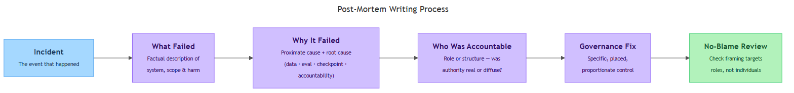

<!-- nav:top:start -->
[⬅ Previous: 10.6 — Identifying which components in your system need a mandatory human checkpoint](../../../3-designing-human-oversight/10-6-identifying-which-components-in-your-system-need-a-mandatory/artifacts/reading.md)&emsp;·&emsp;[⬆ Table of Contents](../../../../../../../README.md#curriculum-topic-index)&emsp;·&emsp;[Next: 11.1 — Python's role ➡](../../../../../m5-python-for-ai-pe-vc-and-rag/week-11/1-getting-started-with-python/11-1-pythons-role-the-orchestration-layer-connecting-your-specifi/artifacts/reading.md)
<!-- nav:top:end -->

---

# Writing a post-mortem — what failed, why, who was accountable, what governance would have prevented it

## Overview

When an AI system causes harm — unfair loan rejections, missed medical triage, denied college admissions — the immediate crisis eventually ends. What comes next determines whether the same failure happens again. A **post-mortem** is a structured written account produced after an AI incident that answers four plain-language questions: what exactly failed, why it failed, who was accountable, and what governance control would have prevented it [2]. Unlike a blame report, a post-mortem is a learning document — its goal is to improve the system, not to punish the people who ran it [2].

*Post-Mortem Writing Process*

## Key Concepts

### The four-section post-mortem framework

Every post-mortem is built from the same four sections. Each section forces a specific, concrete answer. Vague answers at any step produce a document that looks complete but teaches nothing [2].

```mermaid
---
title: "Post-Mortem Writing Process"
config:
  theme: base
  themeVariables:
    primaryColor: "#a5d8ff"
    primaryBorderColor: "#4a9eed"
    lineColor: "#555"
  flowchart:
    htmlLabels: true
    curve: basis
    nodeSpacing: 60
    rankSpacing: 80
---
flowchart LR
    A["<b>Incident</b><br/><span style='font-size:11px;color:#6d28d9'>The event that happened</span>"]
    B["<b>What Failed</b><br/><span style='font-size:11px;color:#6d28d9'>Factual description of<br/>system, scope &amp; harm</span>"]
    C["<b>Why It Failed</b><br/><span style='font-size:11px;color:#6d28d9'>Proximate cause + root cause<br/>(data · eval · checkpoint · accountability)</span>"]
    D["<b>Who Was Accountable</b><br/><span style='font-size:11px;color:#6d28d9'>Role or structure — was<br/>authority real or diffuse?</span>"]
    E["<b>Governance Fix</b><br/><span style='font-size:11px;color:#6d28d9'>Specific, placed,<br/>proportionate control</span>"]
    F["<b>No-Blame Review</b><br/><span style='font-size:11px;color:#6d28d9'>Check framing targets<br/>roles, not individuals</span>"]

    A --> B --> C --> D --> E --> F

    classDef start fill:#a5d8ff,stroke:#4a9eed,color:#1e3a5f
    classDef auto fill:#d0bfff,stroke:#8b5cf6,color:#2e1065
    classDef act fill:#a5d8ff,stroke:#4a9eed,color:#1e3a5f
    classDef done fill:#b2f2bb,stroke:#22c55e,color:#14532d
    classDef hitl fill:#fff3bf,stroke:#f59e0b,stroke-width:3px,color:#78350f

    class A start
    class B,C,D,E auto
    class F done
```

*The post-mortem writing process: each section feeds the next, ending with a no-blame framing check.*

### Section 1 — What failed

This section is factual observation only. It does not explain causes yet [2].

Include:

- **System name and function** — what the AI was supposed to do.
- **The failure event** — what it actually did instead.
- **Scope** — how many decisions, how many people, over what time period.
- **Observed harm** — the real-world consequence (a denied loan, a missed triage flag, a rejected admission).

Avoid vague language. "The system performed poorly" is not a failure description. "The system rejected applicants from lower-income zip codes at nearly three times the rate of higher-income applicants with equivalent credit histories, undetected for months" is [2].

### Section 2 — Why it failed

This section requires two distinct levels of causal explanation [1].

**Proximate cause** — the immediate trigger: the specific thing that directly produced the bad output. Think of it as "the thing that broke."

**Root cause** — the underlying structural condition that made the failure possible and allowed it to persist. Think of it as "the reason the broken thing was allowed to exist."

Why does the distinction matter? Fixing only the proximate cause leaves the root cause in place. The same failure — or one with the same underlying structure — will recur.

| Level | Question answered | Example (loan approval case) |
|---|---|---|
| Proximate cause | What directly caused the bad output? | Model trained on historical data encoding past lending discrimination |
| Root cause | What condition allowed this to exist and go undetected? | No sub-group performance audit was required before or after deployment |

For AI systems, root causes typically fall into one of four categories [1]:

1. **Training data problem** — the data encoded historical bias or did not represent the affected population.
2. **Evaluation gap** — the model was tested for average accuracy but not sub-group fairness or real-world distribution shift.
3. **Missing checkpoint** — no human-in-the-loop gate was placed at the consequential decision point.
4. **Accountability gap** — no specific role was designated to own the failure mode, so nobody was watching for it [1].

Automation complacency (from topic 10.4) is frequently a contributing root cause: because the system had high average accuracy, operators stopped scrutinising its outputs. This is the accuracy paradox — high accuracy made the failure invisible. Name it in the root cause analysis whenever a system was trusted without adequate monitoring because it "worked well most of the time."

### Section 3 — Who was accountable

This section applies the accountability vocabulary from earlier topics retrospectively, after the failure has already happened [1].

Identify four things:

1. **Who was designated as accountable** — the team or person who deployed the system, who was supposed to monitor it, and who signed off on deployment.
2. **Whether accountability was real or diffuse** — if multiple parties each assumed "someone else" was responsible, that is a diffuse accountability gap, and it is itself a root cause to name.
3. **Whether the accountable party had the means to act** — accountability without authority is not accountability. If the monitoring team lacked access, staffing, or budget to investigate alerts, the accountability structure was broken by design.
4. **Whether the accountability chain connected to the people harmed** — could affected individuals identify who was responsible and reach them?

A useful test: "If the monitoring team had discovered this failure on day one, did they have the authority and obligation to halt the system?" If the answer is unclear, the accountability structure was inadequate — regardless of what the contracts said [1].

What this section does *not* mean: naming the individual developer who wrote the model. In an AI system operating at scale, accountability is organisational. The question is whether the right *role* had clear responsibility [2].

### Section 4 — What governance would have prevented it

This is the forward-looking half of the post-mortem. It converts the analysis into a specific, actionable proposal [1][2].

The governance fix must be:

- **Specific** — name the exact mechanism: a mandatory checkpoint (topic 10.5), a triggered oversight assignment (topic 10.6), a sub-group performance audit (topic 10.2), a model documentation requirement (topic 10.3). "Better oversight" is not a governance fix.
- **Placed correctly** — use the risk-tiered component mapping framework (topic 10.6) to identify which component needed the control, and at what tier.
- **Proportionate to the root cause** — match the fix to the failure. If the root cause was an evaluation gap, the fix is a mandatory evaluation protocol. If the root cause was an accountability gap, the fix is an explicit accountability clause [1].

| Root cause type | Matching governance fix |
|---|---|
| Training data problem | Mandatory sub-group performance audit before deployment [3] |
| Evaluation gap | Triggered oversight assignment when sub-group error rate exceeds error budget [3] |
| Missing checkpoint | Human-in-the-loop checkpoint at the high-stakes decision point [1] |
| Accountability gap | Named accountability role and model documentation requirement [1] |
| Automation complacency | Periodic re-calibration and escalation trigger on accuracy drift [3] |

### The no-blame framing

The hardest part of writing a post-mortem is staying no-blame while still naming real accountability failures. These feel contradictory — they are not [2].

- **Blame** is directed at a person's intentions or character.
- **Accountability** is directed at a role, a process, or a structure.

A post-mortem can and should say "the accountability structure was inadequate." It should not say "Person X failed."

Write in role-based language:

- Not: "The data scientist should have caught this bias."
- Yes: "No sub-group fairness audit was required at the point of model sign-off. This is the gap the governance fix addresses."

If you catch yourself proposing "train engineers better" as a governance fix, stop. That is a blame-based fix disguised as a training recommendation. A governance fix changes the *system* — it adds a mandatory check, requires a specific sign-off, or creates an explicit accountability role. It does not depend on individuals being more careful [2][3].

## Worked Example

The following is a 200-word post-mortem for the automated medical triage case from topic 10.2.

---

**Post-Mortem: Automated Medical Triage System — Systematic Under-Scoring of Elderly Patients**

**What failed.** The triage AI assigned lower-priority scores to patients over 75 than clinical staff would have assigned using manual assessment, across a substantial number of cases over an extended operational period [3]. In documented cases, patients in this group experienced deterioration that a higher triage priority might have prevented.

**Why it failed.** The proximate cause was a training dataset that under-represented elderly patients with atypical symptom presentations, producing a systematic low-bias in scores for that group [1]. The root cause was an evaluation gap: no sub-group performance audit was required before or after deployment [1]. Automation complacency compounded the problem — because overall accuracy was high, clinical staff stopped scrutinising borderline scores.

**Who was accountable.** No single party held clear accountability [1]. The hospital assumed the vendor had validated sub-group performance; the vendor assumed the hospital would [3]. Override accountability was absent: no role was designated to review population-level scoring patterns after deployment.

**Governance fix.** A mandatory sub-group performance audit, run on a regular cycle by a named clinical informatics owner, would have detected the age-related scoring gap within the first audit period [3]. Pairing this with a triggered oversight assignment — escalation when elderly patient scores deviate from clinical override rates beyond a defined threshold — would have prevented the failure mode from persisting undetected [1][3].

---

This example names the system, states the harm in concrete terms, separates proximate from root cause, identifies the accountability gap, and proposes a named, placed, proportionate governance fix [2]. That is the target structure for any post-mortem you write.

## In Practice

**Where post-mortems appear.** Post-mortems are used across every sector where AI systems make consequential decisions: healthcare, financial services, criminal justice, education, and content moderation [1][3]. The four root cause categories appear repeatedly across these domains — the root causes are more consistent than the domains themselves [1].

**No-blame culture in SRE.** Site Reliability Engineering (SRE) — the discipline of maintaining large-scale software systems — has used structured post-mortems for decades [2]. The SRE community found that blame-assigning reviews caused engineers to hide failures rather than report them, producing fewer documented incidents and more undocumented ones. The no-blame post-mortem produced more honest reporting and faster improvement [2].

**The governance feedback loop.** A single post-mortem proposes one governance fix. A body of post-mortems from a system's operational history builds an empirical case for which controls are missing and which are working [3]. The post-mortem is the raw material from which governance improves over time.

**Do:**

- Use numbers and scopes. "High error rate" is not a failure description. "34% false-negative rate in the elderly cohort over 18 months" is.
- Separate proximate from root cause. If you have only one cause, you probably have not dug deep enough.
- Propose a control from the vocabulary you already have — HITL checkpoint, sub-group audit, error budget, triggered oversight assignment. Name the mechanism, not the aspiration.
- Keep it short and specific. A focused 200-word post-mortem beats 1,000 words of general reflection.

**Don't:**

- Treat "we need better AI" as a governance fix. A governance fix changes the *process around* the AI — when it can act autonomously, who must sign off, what must be audited.
- Skip the accountability section. If the accountability structure was inadequate, the governance fix must address that gap, not just the technical one.
- Conflate "no blame" with "no accountability." No-blame means no personal fault assignment. It does not mean the system is blameless.

## Key Takeaways

- A **post-mortem** is a structured written account of what went wrong in an AI incident, produced so the failure does not recur. It is a learning document, not a blame document.
- The four sections — what failed, why it failed, who was accountable, and what governance would have prevented it — force specific answers at every step. Vague answers produce a document that looks complete but teaches nothing.
- **Proximate cause** is the immediate trigger; **root cause** is the structural condition that made the failure possible. Fixing only the proximate cause leaves the root cause intact. Most AI failures have root causes in at least one of four categories: training data problem, evaluation gap, missing checkpoint, or accountability gap [1].
- **No-blame framing** does not mean no accountability. It means accountability is directed at roles, structures, and design decisions — not at individual fault. This framing produces more honest reporting and more useful governance fixes [2].
- The governance fix must be **specific, placed, and proportionate**: name the mechanism, identify which component it attaches to, and explain why it would have interrupted the causal chain [1][2].

## References

[1] Rawlinson, K., et al. "Attributing Responsibility in AI-Induced Incidents." *arXiv*, 2024. https://arxiv.org/pdf/2404.16957

[2] incident.io. "SRE Incident Post-Mortem Best Practices." https://incident.io/blog/sre-incident-postmortem-best-practices

[3] AI Career Pro. "Managing AI Incidents — Part 1." https://governance.aicareer.pro/blog/managing-ai-incidents-part-1

---
<!-- nav:bottom:start -->
[⬅ Previous: 10.6 — Identifying which components in your system need a mandatory human checkpoint](../../../3-designing-human-oversight/10-6-identifying-which-components-in-your-system-need-a-mandatory/artifacts/reading.md)&emsp;·&emsp;[⬆ Table of Contents](../../../../../../../README.md#curriculum-topic-index)&emsp;·&emsp;[Next: 11.1 — Python's role ➡](../../../../../m5-python-for-ai-pe-vc-and-rag/week-11/1-getting-started-with-python/11-1-pythons-role-the-orchestration-layer-connecting-your-specifi/artifacts/reading.md)
<!-- nav:bottom:end -->
