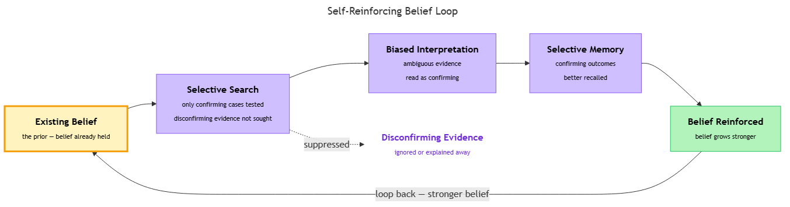

<!-- nav:top:start -->
[⬅ Previous: 9.2 — System 2 thinking](../../../1-how-humans-think/9-2-system-2-thinking-slow-deliberate-effortful/artifacts/reading.md)&emsp;·&emsp;[⬆ Table of Contents](../../../../../../../README.md#curriculum-topic-index)&emsp;·&emsp;[Next: 9.4 — Anchoring bias ➡](../../9-4-anchoring-bias-over-relying-on-the-first-piece-of-informatio/artifacts/reading.md)
<!-- nav:top:end -->

---

# Confirmation Bias — Seeking Information That Confirms Existing Beliefs

## Overview

Picture a student in a coding bootcamp who starts using an AI code assistant and quickly decides it is reliable. From that point on, they test the tool on familiar problems, read borderline outputs charitably, and remember its wins far better than its failures. That sequence — testing only comfortable ground, interpreting ambiguous results generously, recalling successes over mistakes — is **confirmation bias** in action. Confirmation bias is the systematic tendency to seek out, interpret, and remember information in a way that confirms what you already believe [1]. It is not carelessness or dishonesty; it is how the human brain is built. This reading explains what confirmation bias is, how it works through three mechanisms, and why understanding it is essential for evaluating AI systems honestly.

## Key Concepts

### What is confirmation bias?

**Confirmation bias** — the tendency to search for, interpret, and remember information in a way that supports existing beliefs rather than challenging them [1]. The word *systematic* matters: a random error sometimes makes you overconfident, sometimes underconfident. Confirmation bias is not random — it consistently pushes in one direction, toward whatever you already believe [1][2].

*The self-reinforcing loop: a prior belief shapes what information you search for, how you interpret it, and what you remember — each cycle strengthening the original belief.*

### The three mechanisms

Researchers have identified three distinct ways confirmation bias operates [1][2]:

**1. Selective search**

When testing a belief, people naturally look for *confirming* evidence rather than **disconfirming evidence** — that is, evidence that would prove the belief wrong. Instead of asking "what would show I am wrong?", the default impulse is "what supports what I already think?" [1][2].

The classic demonstration is the **Wason 2-4-6 task**, designed by psychologist Peter Wason in the 1960s [2]. Participants are told that the sequence "2, 4, 6" follows a secret rule. They must discover the rule by proposing their own sequences; the experimenter says whether each one fits or not. Most participants quickly guess "consecutive even numbers" and then test sequences like "8, 10, 12" — which all confirm their guess. The actual rule is broader: "any ascending sequence." Participants could discover this by testing sequences that *break* their hypothesis — like "1, 2, 3" or "5, 7, 100" — but the overwhelming majority never try them [1][2]. They keep gathering confirming evidence and declare confidence in a rule they have never actually tested.

**2. Biased interpretation**

Even when two people encounter the same piece of evidence, they often interpret it differently based on their prior beliefs. Ambiguous evidence gets read as confirming; challenging evidence gets scrutinised more heavily or explained away [2].

Imagine two practitioners evaluating an AI-generated summary. One believes the AI is trustworthy; the other is sceptical. When the summary contains a mildly imprecise sentence, the trusting evaluator thinks "close enough — it got the gist." The sceptical evaluator flags it as "proof the AI doesn't really understand the domain." Same sentence. Different prior beliefs [2].

**3. Selective memory**

People recall information that is consistent with their beliefs more readily than information that contradicts them [1]. This is not deliberate forgetting — it is how memory works. Experiences that fit an existing mental model are stored and retrieved more easily. Over time, this selective recall makes the original belief feel more evidence-based than it actually is.

### Why it is so automatic

You may think: "If I know about this bias, I'll just slow down and check myself." That instinct is reasonable — but not sufficient [1][2].

The root cause lies in **System 1 processing** (introduced in topic 9.1): the fast, automatic layer that scans for patterns matching existing mental models. When incoming information fits a familiar pattern, System 1 flags it as relevant and trustworthy. When information contradicts the pattern, System 1 deprioritises it. This is efficient for everyday life — but the efficiency is directionally biased [1].

There is also a driver called **cognitive economy** — the brain's tendency to minimise mental effort. Confirming an existing belief requires less cognitive work than revising it: no need to restructure your mental model, reconcile conflicting data, or tolerate uncertainty. Confirmation bias is, in part, the brain taking the path of least resistance [1].

### The limits of System 2 correction

Topic 9.2 introduced **System 2** as the deliberate, analytical mode that should catch and correct bias. In practice, there is a catch [2].

Even under deliberate thinking, a phenomenon called **motivated reasoning** can distort the outcome. **Motivated reasoning** — using analytical capacity not to find the truth but to build the strongest-possible case for what you already believe — can look rigorous on the surface while actually defending a prior conclusion [2]. Research suggests that more analytically skilled people are sometimes *better* at constructing sophisticated justifications for existing views, not less prone to the bias [1]. Awareness helps, but structured methods are needed — those are introduced later in the course.

### Confirmation bias is universal

One point worth making plainly: confirmation bias is not a flaw of low-intelligence or uneducated people — it is a feature of normal human cognition [1]. Every person, including trained scientists and experienced engineers, shows it in experimental settings. Dismissing the bias as something that only affects "other people" is itself a form of confirmation bias.

## Worked Example

**Scenario:** A junior developer evaluates a new AI code assistant before recommending it to their team. They believe, based on early demos, that the tool is strong.

1. **Selective search.** To test the tool, the developer picks problems from areas they already know well — basic string manipulation, standard API patterns, simple sorting. These are tasks where they can judge output quality quickly. They never pick problems in areas where they have less experience (database query optimisation, concurrency bugs), so the tool is only ever tested on ground where it is most likely to succeed.

2. **Biased interpretation.** One generated function returns a correct result but uses a deprecated library method. The developer notices the deprecated method but thinks: "It still works — the AI just used an older style." A neutral evaluator might flag this as evidence the tool's training data is outdated. The developer's interpretation is shaped by their prior belief that the tool is reliable.

3. **Selective memory.** At the end of the week, the developer writes up their recommendation. They vividly recall five or six examples of clean, correct code. They have a vague sense there were "a couple of rough ones" but cannot remember details. The write-up is strongly positive; failures are acknowledged in passing.

**Outcome:** The team adopts the tool based on a biased evaluation. It performs well on routine tasks (what it was tested on) but struggles with complex cases the developer never probed. The bias was invisible throughout.

## In Practice

When evaluating AI tools, confirmation bias does not disappear — in many ways the AI context makes it more dangerous. A practitioner who believes an AI system is reliable will tend to:

- Test it on familiar or easy inputs (selective search)
- Interpret borderline outputs as correct (biased interpretation)
- Remember successful outputs more vividly than failures (selective memory)

When an AI produces a plausible-sounding but wrong answer, System 1 pattern-matching and confirmation bias work together: the output *looks* right, and the prior belief fills in the rest [3]. The reverse applies equally — a practitioner who has decided a tool is unreliable will find failures everywhere and dismiss successes [3].

**Practical steps to counter confirmation bias during AI evaluation:**

- **Write down what would change your mind** before you start testing. Deciding in advance what a failure looks like stops you from redefining failure after you see the output.
- **Test on unfamiliar ground.** Deliberately choose inputs in areas where you cannot easily judge the output — those are the cases most likely to expose real weaknesses.
- **Log failures as specifically as you log successes.** A written record resists selective memory better than unaided recall.
- **Ask a sceptic to review.** A colleague who holds the opposite prior belief will notice what you explain away.

For a structured framework that builds these steps into a repeatable process, the Judgment Framework (topics 9.7–9.9) is designed to counteract exactly this kind of evaluator bias.

## Key Takeaways

- **Confirmation bias** is the systematic tendency to seek out, interpret, and remember information that confirms what you already believe — not a sign of low intelligence, but a feature of normal human cognition [1].
- It operates through three mechanisms: **selective search** (testing only for confirming evidence), **biased interpretation** (reading ambiguous evidence as supporting), and **selective memory** (recalling successes more readily than failures) [1][2].
- The Wason 2-4-6 task shows that even in purely logical, unemotional tasks, people default to confirmatory rather than falsifying search [2].
- **Cognitive economy** (the brain minimising effort) and **System 1 processing** make confirmation bias automatic and largely invisible to the person experiencing it.
- **Motivated reasoning** means that even deliberate, analytical (System 2) thinking can be hijacked to defend a prior belief rather than find the truth [2].
- Awareness of the bias is a starting point, but it does not switch off the underlying mechanism — structured evaluation techniques are more reliable than unaided self-awareness [1][3].
- In AI evaluation, confirmation bias can cause a practitioner to misjudge a system's quality in either direction — overrating a tool they trust or underrating one they distrust [3].

## References

[1] Simply Psychology — Confirmation Bias. https://www.simplypsychology.org/confirmation-bias.html

[2] Britannica — Confirmation Bias. https://www.britannica.com/science/confirmation-bias

[3] CogBias — Measuring and Mitigating Confirmation Bias in LLMs. https://arxiv.org/abs/2604.01366

---
<!-- nav:bottom:start -->
[⬅ Previous: 9.2 — System 2 thinking](../../../1-how-humans-think/9-2-system-2-thinking-slow-deliberate-effortful/artifacts/reading.md)&emsp;·&emsp;[⬆ Table of Contents](../../../../../../../README.md#curriculum-topic-index)&emsp;·&emsp;[Next: 9.4 — Anchoring bias ➡](../../9-4-anchoring-bias-over-relying-on-the-first-piece-of-informatio/artifacts/reading.md)
<!-- nav:bottom:end -->
