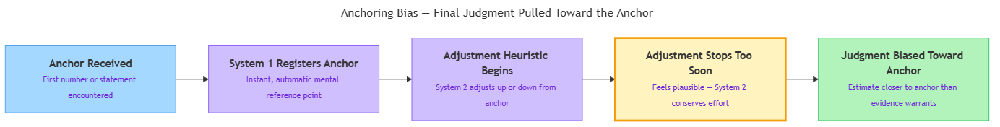

<!-- nav:top:start -->
[⬅ Previous: 9.3 — Confirmation bias](../../9-3-confirmation-bias-seeking-information-that-confirms-existing/artifacts/reading.md)&emsp;·&emsp;[⬆ Table of Contents](../../../../../../../README.md#curriculum-topic-index)&emsp;·&emsp;[Next: 9.5 — Automation bias ➡](../../9-5-automation-bias-trusting-automated-systems-over-human-judgme/artifacts/reading.md)
<!-- nav:top:end -->

---

# Anchoring Bias — Over-Relying on the First Piece of Information Received

## Overview

Anchoring bias is the tendency to give too much weight to the first piece of information you encounter and to let it pull every judgment you make afterward closer to that starting point — even when the information is wrong, random, or irrelevant [1]. It is one of the most consistently observed effects in psychology, replicated across cultures, professions, and levels of expertise. For anyone working with AI tools, it carries a direct practical risk: the first output an AI produces becomes an anchor before you have reviewed a single piece of underlying evidence.

## Key Concepts

**Anchor** — the first number, statement, or piece of information you encounter on a topic. It acts as a mental reference point that shapes all estimates and judgments made afterward.

An anchor can be a price tag, a model accuracy figure, a project timeline estimate, or the first answer an AI generates. Once set, the brain treats it as a baseline and measures everything else relative to it. High anchors push estimates up; low anchors pull them down. The key insight is that **the anchor does not have to be accurate or even relevant to have this effect** [1].

In a famous experiment, Tversky and Kahneman spun a rigged wheel-of-fortune that landed on either 10 or 65, then asked participants what percentage of African countries are members of the United Nations. The wheel result was completely unrelated to the question. Participants who saw 65 averaged around 45%; those who saw 10 averaged around 25% — a 20-percentage-point shift driven by a random number from a game wheel [1].

**Adjustment heuristic** — a mental shortcut in which the brain starts at the anchor and makes incremental adjustments up or down until an estimate "feels acceptable."

The process follows four steps:

1. An anchor is received (a number, a statement, a first answer).
2. The brain takes the anchor as its starting point.
3. The brain nudges the estimate up or down incrementally.
4. Adjustment stops when the result "feels right."

The problem is that "feels right" arrives too soon. People stop adjusting before they have moved far enough from the anchor. This pattern is called **insufficient adjustment**.

**Why adjustment stops too soon** — two reinforcing reasons explain this:

- **Reason 1 — Adjustment is System 2 work, and System 2 is effortful.** As covered in topic 9.2, System 2 thinking is cognitively expensive. It requires working memory and deliberate effort, and it fatigues over time. The moment adjustment feels plausible, System 2 stops — conserving cognitive resources [1].
- **Reason 2 — The anchor activates anchor-consistent information in memory.** Anchors do not just set a starting point; they steer memory retrieval toward facts that are consistent with the anchor [2]. That retrieved information then feels like evidence the estimate is in the right range — even though the anchor itself triggered the search. This makes the estimate feel justified when it is actually just close to the anchor.

The diagram below shows how these steps connect — from the moment an anchor arrives to the moment a biased judgment forms.

*How an anchor flows through System 1 registration, System 2 adjustment, and insufficient adjustment to produce a judgment biased toward the anchor.*

**Anchoring bias is universal.** Large-scale empirical research confirms it appears across dozens of countries and cultural contexts. It occurs with arbitrary anchors just as it does with plausible ones. People with higher education, domain expertise, or explicit warnings about anchoring still show significant anchoring effects — the warning reduces the bias but does not remove it. In typical experiments, anchors shift numerical estimates by 10–35% [3].

**How anchoring differs from confirmation bias** — both are cognitive biases you have encountered in this module, but they work differently:

| Feature | Confirmation bias | Anchoring bias |
|---|---|---|
| What distorts judgment | Existing beliefs and expectations | The first number or statement encountered |
| When it activates | When searching for or interpreting evidence | When forming an estimate from a starting value |
| Core mechanism | Selective search; biased interpretation | Anchor-and-adjust; stopping too close to anchor |
| Can a random input trigger it? | No — requires a prior belief to confirm | Yes — even a random number anchors estimates |

Both biases are driven largely by System 1, and both resist System 2 correction — but they are triggered by different inputs.

## Worked Example

**Scenario:** You ask an AI writing assistant to estimate the budget for a project.

**Step 1 — The anchor is set.**
The AI outputs: "Based on similar projects, a budget of approximately $180,000 seems appropriate." That number is now your anchor. Your brain registers it as the starting point before you have reviewed a single project detail.

**Step 2 — You review the project details.**
The project scope is actually smaller than the examples the AI compared it to. You think: "This should probably be less. Maybe $160,000."

**Step 3 — Adjustment stops too soon.**
$160,000 "feels reasonable" — it is lower than the AI's number, so it feels like you have corrected the estimate. You stop adjusting. But if you had built the estimate from scratch, independent research on similar small projects suggests a realistic range of $95,000–$110,000.

**Step 4 — The final judgment is biased toward the anchor.**
Your estimate of $160,000 is far higher than the evidence-based range — because the AI's initial output anchored you to a high starting point. You adjusted, but not nearly far enough.

The mechanism at each step:

1. AI produces a first output → anchor set automatically (System 1 registers it instantly).
2. You notice the anchor may be wrong → System 2 begins adjustment.
3. Adjustment feels sufficient at $160,000 → System 2 stops; insufficient adjustment occurs.
4. Final estimate remains biased toward $180,000 → anchoring bias has distorted the judgment.

**Takeaway:** Reviewing an AI's first output and then forming your own judgment is not the same as forming an independent judgment. The moment you see the AI's number, you have an anchor. Forming your own estimate *before* looking at the AI's output is one way to reduce this effect.

## In Practice

Anchoring bias is especially consequential in AI-assisted work because AI outputs arrive before the human has engaged with the underlying evidence. Common scenarios:

| Scenario | What anchors you | Risk |
|---|---|---|
| AI generates a cost, timeline, or score estimate | The AI's number | Your revised estimate stays too close to the AI's figure, even if evidence points elsewhere |
| AI drafts a summary or report | The AI's framing and word choices | Your edits stay structurally close to the AI's version; deeper flaws go unnoticed |
| AI states a model's accuracy as "approximately 87%" | The "87%" figure | You treat 87% as the baseline even when your test conditions differ significantly |
| AI gives a first recommendation (e.g., a risk rating) | The AI's recommendation | You fail to revise sufficiently even when contradicting evidence is found |

**The first-pass anchor** is worth naming explicitly. When an AI produces a first draft, that output becomes the anchor for every revision cycle that follows. Each pass starts from the AI's starting point, not a blank slate. Over multiple rounds, the final output may remain structurally close to the original — not because revisions were careless, but because each round was anchored to the previous version [2].

**Practical do / don't:**

- **Do** form your own estimate or outline before requesting an AI output on a high-stakes task.
- **Do** generate two independent AI outputs (different prompts or starting conditions) for important decisions and compare them before settling on a judgment.
- **Don't** assume awareness alone is sufficient protection — studies show that even people who know about anchoring, and are told an anchor is random, still show significant anchoring effects [3].
- **Don't** rely on domain expertise to eliminate the bias; experts show the same anchoring effects as novices, just slightly reduced [2].

## Key Takeaways

- **Anchoring bias** is the tendency to give too much weight to the first piece of information received — the anchor — and to let it pull later judgments toward it, even when the anchor is wrong or irrelevant.
- **The adjustment heuristic** explains the mechanism: the brain starts at the anchor and adjusts incrementally, but stops too soon — producing **insufficient adjustment**.
- **System 1 sets the anchor automatically** before System 2 can engage; System 2 then adjusts from an already-biased starting point, which is why the effect is so hard to shake.
- **The bias is universal and measurable** — it affects experts and novices alike, and shifts estimates by 10–35% in typical experiments.
- **In AI-assisted work**, the AI's first output is the anchor; forming an independent judgment before viewing that output is the most direct way to reduce the anchoring effect.

## References

1. Cherry, K. (updated). *What Is the Anchoring Bias?* Simply Psychology. https://www.simplypsychology.org/what-is-the-anchoring-bias.html
2. The Decision Lab. *Anchoring Bias.* https://thedecisionlab.com/biases/anchoring-bias
3. Mannes, A. E., & Moore, D. A. (large-scale empirical study). https://arxiv.org/abs/1911.12275

---
<!-- nav:bottom:start -->
[⬅ Previous: 9.3 — Confirmation bias](../../9-3-confirmation-bias-seeking-information-that-confirms-existing/artifacts/reading.md)&emsp;·&emsp;[⬆ Table of Contents](../../../../../../../README.md#curriculum-topic-index)&emsp;·&emsp;[Next: 9.5 — Automation bias ➡](../../9-5-automation-bias-trusting-automated-systems-over-human-judgme/artifacts/reading.md)
<!-- nav:bottom:end -->
